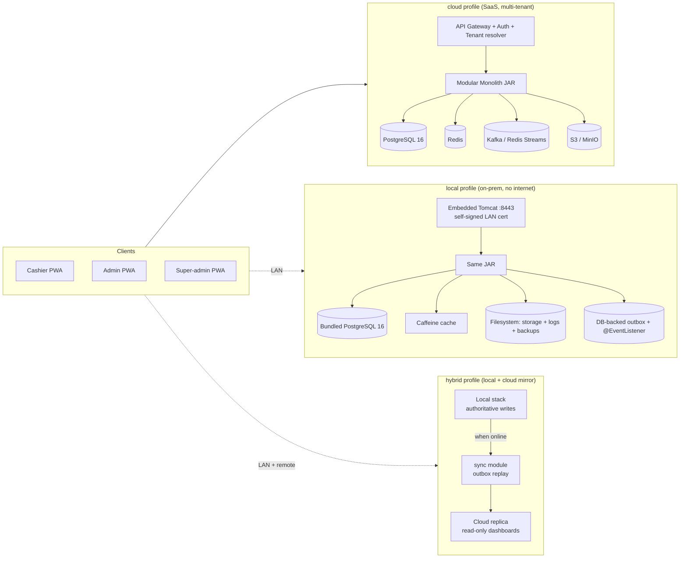
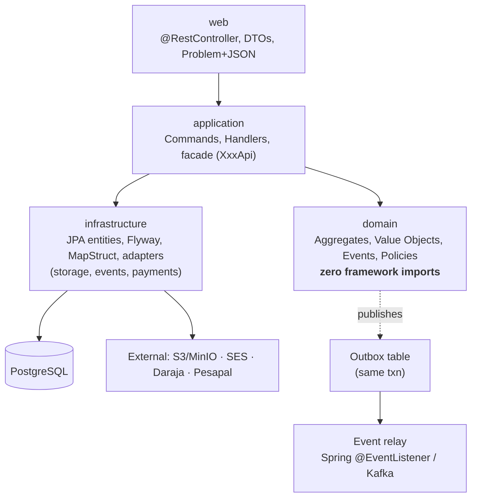
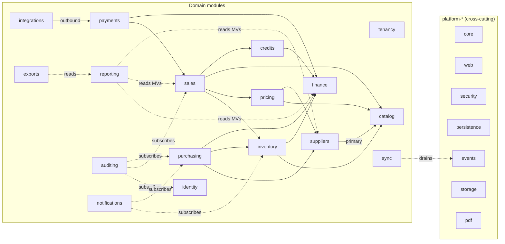
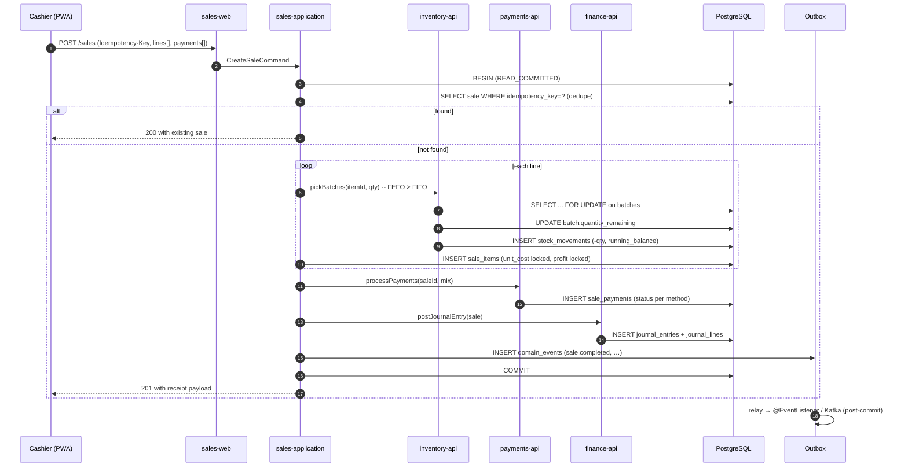
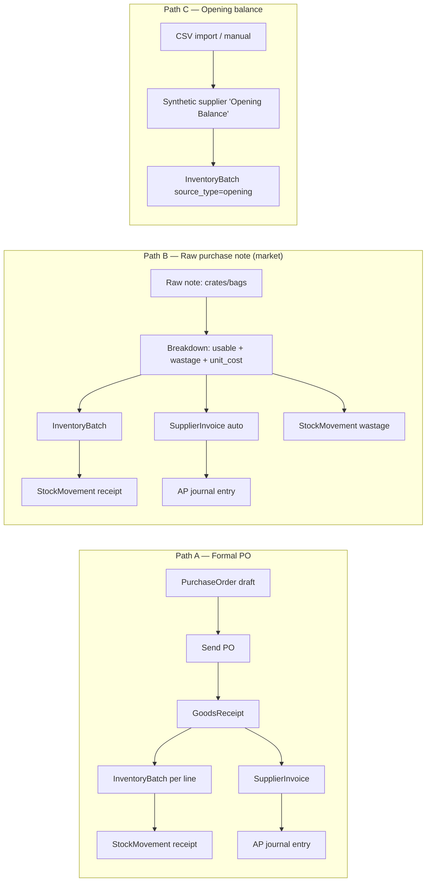
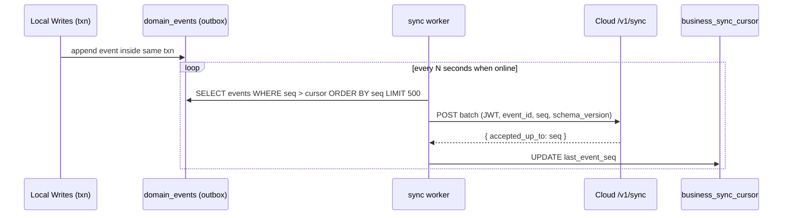

# Kiosk POS Rebuild — Architectural Review

> Reviewing `implement.md` (1,799 lines) against the empty Spring Boot skeleton in `src/`. The blueprint is unusually thorough; my job is to compress it into an onboarding-ready mental model and call out where ambition outruns execution risk.

---

## 1. Executive Summary

**What this project is.** A ground-up Java rebuild of an existing Next.js + Turso (SQLite) POS/inventory/back-office platform. The rebuild is not a port — it is an inversion. The central thesis is that **suppliers become a first-class root aggregate**, so every batch, cost price, purchase, and AP entry is traceable to a single supplier. This single design choice repairs 8 of the 15 weaknesses audited in `§2.3`.

**Shape of the target system.** A Spring Boot 3 / Java 21 **modular monolith** (16 bounded-context modules under a single Gradle root) fronting PostgreSQL 16, with pluggable adapters for cache, storage, message bus, and payments. Ships in three deployment modes — `cloud` (managed, multi-tenant), `local` (on-prem single-PC, zero internet), `hybrid` (local authoritative with cloud mirror via outbox) — from **a single Git tag and single JAR**.

**Current state.** The repo is effectively empty: one Gradle module named `ub`, `server.port=5000`, no domain code, no migrations. 28 weeks of work (per §12) are ahead for a 2-dev team. The document is the source of truth; the code is not yet in existence.

**Top-line opinion.** The architecture is **sound, possibly over-scoped, and technically risky in three places**:
1. Three deployment modes from one codebase is a force-multiplier for adapter bugs — particularly the bundled-Postgres path via `jpackage`.
2. 16 modules × 4 sub-modules = 64 Gradle projects is heavyweight for two developers; I would collapse to ~8 bounded contexts until Phase 4.
3. Hybrid-mode conflict resolution is under-specified for anything more interesting than sales (which are trivially append-only).

Those are solvable. The design of the write path (supplier-first, append-only `stock_movements`, locked COGS on `sale_items`, double-entry journal) is genuinely strong and should be preserved without compromise.

---

## 2. System Architecture Overview

### 2.1 Deployment topology (one codebase, three targets)

### 2.2 Logical layering inside the monolith

Rule enforced by ArchUnit: `web → application → {domain, api}`; `domain` has no Spring imports; cross-module calls go only through `XxxApi` facades. This layering is correct and non-negotiable.

### 2.3 Bounded contexts (16 modules)

The dependency fan points correctly *down* the chain: `catalog` and `suppliers` are foundational; `finance` is a collector; `reporting` reads projections and never aggregates.

---

## 3. Component Breakdown

Grouped by role rather than by the numbered list in §3, because onboarding engineers need a mental ranking, not an alphabetical one.

### 3.1 Foundation layer (`platform-*`)

| Module | Responsibility | Onboarding priority |
|---|---|---|
| `platform-core` | Value objects: `Money`, `Quantity`, `Percent`, `BusinessId`, `UUIDv7`. Error taxonomy. Result types. | **Build first.** Every other module depends on it. |
| `platform-persistence` | Base entity (`id`, `business_id`, `created_at/by`, `updated_at/by`, `deleted_at`), `AuditorAware`, RLS session setter. | First. RLS setter is security-critical. |
| `platform-security` | JWT issuer/verifier, `PasswordEncoder`, PIN hashing, `@PreAuthorize` evaluator, impersonation claim. | First. |
| `platform-web` | `@ControllerAdvice` Problem+JSON, OpenAPI config, CORS, rate-limit filter, Idempotency-Key filter. | First. |
| `platform-events` | Outbox table + relay + Spring `@EventListener` + Kafka/Redis adapter. | Phase 1 — drives every domain event. |
| `platform-storage` | `StorageAdapter` with S3 / MinIO / local-FS implementations; signed URLs. | Phase 1. |
| `platform-pdf` | OpenPDF wrapper + ESC/POS renderer + receipt templates. | Phase 4 (POS). |

### 3.2 Core business contexts

| Module | Aggregate roots | Writes to | Notable invariants |
|---|---|---|---|
| `identity` | `User`, `Role`, `Session`, `ApiKey` | `users`, `roles`, `role_permissions`, `user_sessions`, `api_keys` | PIN unique per business; refresh-token rotation; lockout after N failures. |
| `tenancy` | `Business`, `Branch`, `Domain`, `Subscription` | `businesses`, `branches`, `domains` | Domain → business resolution happens pre-auth. |
| `catalog` | `Item` (with variants), `Category`, `Aisle`, `ItemType` | `items`, `item_images`, `categories`, `aisles`, `item_types` | FTS index kept in sync by trigger. |
| `suppliers` | `Supplier`, `SupplierProduct` | `suppliers`, `supplier_contacts`, `supplier_products` | Exactly-one-primary-supplier-per-item trigger; deactivating last supplier deactivates sellable item. |
| `purchasing` | `PurchaseOrder`, `GoodsReceipt`, `SupplierInvoice`, `SupplierPayment` | `purchase_orders*`, `goods_receipts*`, `supplier_invoices*`, `supplier_payments*` | 3-way match (PO = GRN = Invoice) configurable off/warn/block. |
| `inventory` | `InventoryBatch`, `StockMovement` (append-only), `StockTakeSession` | `inventory_batches`, `stock_movements`, `stock_adjustments*`, `stock_transfers*` | `stock_movements` is **the** source of truth; `items.current_stock` is a trigger-maintained projection. |
| `pricing` | `SellingPrice`, `BuyingPrice`, `PriceRule`, `TaxRate` | `selling_prices`, `buying_prices`, `price_rules`, `tax_rates` | Historical: new row per change; never mutate. |
| `sales` | `Shift`, `Sale` (with `SaleItem`), `Refund` | `shifts`, `sales`, `sale_items`, `sale_payments`, `refunds*` | `sale_items.unit_cost` and `.profit` **locked at sale time**. Idempotency-Key enforced. |
| `payments` | Gateway abstractions (`Daraja`, `Pesapal`, `Stripe`, `Manual`) | `sale_payments`, external gateway state | Every method behind `PaymentGateway` interface. |
| `credits` | `Customer`, `CreditAccount`, three ledgers (debt/wallet/loyalty) | `customers`, `customer_phones`, `credit_*`, `wallet_*`, `loyalty_*` | Wallet balance ≥ 0 (CHECK). Public claims idempotent on review. |
| `finance` | `LedgerAccount`, `JournalEntry`, `JournalLine`, `Expense` | `ledger_accounts`, `journal_entries`, `journal_lines`, `expenses` | Every domain mutation posts a balanced entry (Σ debit = Σ credit). |

### 3.3 Supporting / read-side contexts

| Module | Role |
|---|---|
| `reporting` | Refreshes materialized views (`mv_sales_daily`, `mv_supplier_monthly`, `mv_inventory_snapshot`) via Quartz/`@Scheduled`. Read-only endpoints; never writes business state. |
| `auditing` | Subscribes to events, writes `activity_log`. Append-only DB role. Hash-chain for tamper-evidence. |
| `integrations` | Outbound: webhooks, API-key gateway, SES, SMS, external HTTP. |
| `notifications` | Translates events → user-visible alerts (push/email/banners). |
| `exports` | Async CSV/XLSX/PDF jobs; returns S3 URL when ready. |
| `sync` | Drains outbox → cloud (`hybrid` mode only). Owns `business_sync_cursor` and `sync_conflict`. |
| `platform-desktop` | `jpackage` configs, tray UI, service wrappers, self-updater (local/hybrid). |
| `app-bootstrap` | Single Spring Boot main; wires profile (`cloud | local | hybrid`). |

### 3.4 Opinion: the module count is too high for Week 1

A 16×4 module grid has ceremony costs (Gradle wiring, ArchUnit rules, Flyway location ordering, build-time) that bite disproportionately on a small team. I would **start with 8 folders** — the `platform-*` set plus `identity`, `tenancy`, `catalog`, `suppliers` — and split out `purchasing/inventory/pricing/sales/...` only when the class count in a package exceeds ~40 or the team grows. The blueprint's package layout inside each module is already correct; splitting those packages into Gradle sub-projects is a Phase-3 optimization, not a Phase-0 commitment.

---

## 4. Data Flow & Interactions

### 4.1 The sale — the hottest path

**Correctness guarantees this encodes:**
- Idempotency on `idempotency_key` — retries never duplicate.
- Row-level lock on batches — two cashiers can’t sell the same unit.
- Stock movement is the event; `items.current_stock` is a trigger projection.
- COGS captured on `sale_items` at sale time; reports never recompute it.
- Outbox written in the same transaction — no dual-write. Relay is post-commit.
- Journal entry balances inside the same transaction — cash position is never wrong.

### 4.2 Inbound stock — the two paths unified

All three paths converge on the same three tables (`inventory_batches`, `stock_movements`, `supplier_invoices`). No path-specific columns: good.

### 4.3 Hybrid sync (local → cloud)

Cloud endpoint is idempotent on `(business_id, event_id)`. Ordering enforced per-business by `seq`. Wall-time never used for ordering. Acceptable. See §6.3 for where this breaks.

---

## 5. Design Decisions & Principles Applied

### 5.1 What the blueprint gets right

| Principle | How it shows up | Why this choice |
|---|---|---|
| **Separation of concerns (DDD bounded contexts)** | 16 modules, `XxxApi` facades, `domain` has no framework imports. | Keeps the monolith splitable later without a rewrite. |
| **Single responsibility on the write path** | `stock_movements` is the only source of truth; everything else is projection. | Eliminates the current system's drift between `current_stock` and batch sums. |
| **Dependency inversion / pluggability** | `StorageAdapter`, `PaymentGateway`, `ReceiptRenderer`, `EventBus`, cache. Profile (`cloud | local | hybrid`) swaps implementations, not domain code. | Makes the triple-deployment story feasible. |
| **DRY via one schema, one migration set** | Flyway migrations are module-local but share one Postgres dialect across all three modes. No SQLite fork. | Avoids the classic “works-on-cloud-fails-on-offline” bug class. |
| **Open/closed via feature flags** | `multi_branch`, `expiry_tracking`, `loyalty`, … per tenant. | Lets small shops stay simple without branching the product. |
| **Fail-fast on invariants** | DB triggers + CHECK + NOT NULL for supplier presence, primary-supplier uniqueness, wallet ≥ 0. Domain assertions in aggregates as belt-and-braces. | Matches the audited weakness #1 directly. |
| **Idempotency + outbox** | `Idempotency-Key` on every mutation; events written in-txn, relayed post-commit. | Correct cure for both the current system’s retry-duplicates bug and the hybrid sync story. |
| **Light double-entry accounting** | `ledger_accounts` / `journal_entries` / `journal_lines` written for every sale, payment, expense, wastage. | Single source of truth for “cash position right now.” Massively better than the current siloed tables. |
| **Locked COGS on `sale_items`** | `unit_cost`, `cost_total`, `profit` computed once, written, never recomputed. | Kills the `buyPriceFallback` subquery pattern from the current system. |
| **Strong typing** | `Money` / `Quantity` / `Percent`, `BigDecimal` with fixed scale, no raw `double`. | Non-negotiable for financial code. |
| **Multi-tenant isolation in the DB** | PostgreSQL RLS on every tenant table, driven by `app.business_id` set from JWT. | Defense-in-depth; a missing `WHERE business_id = ?` doesn’t become a data leak. |
| **Append-only audit surface** | `activity_log` + hash-chain over `journal_entries` in local mode. DB role lacks UPDATE/DELETE on `activity_log`. | Regulatory & trust story. |
| **Testing pyramid is real** | Unit on domain, `@DataJpaTest` w/ Testcontainers on infra, RestAssured on web, ArchUnit on layering, Gatling on hot paths, PITest on domain. | Actually enforceable, not aspirational. |

### 5.2 Opinions / trade-offs worth surfacing

- **Modular monolith over microservices — correct.** Two devs; one DB; one deployment; the module boundaries are already drawn for extraction if 5x scale forces it.
- **Bundled PostgreSQL over SQLite/H2 for local — correct but expensive.** SQLite would have halved local-mode complexity but forked the dialect (RLS, partial indexes, `jsonb`, MVs, FTS, partitioning). The blueprint’s decision is the right one; be honest about the `jpackage` + portable-Postgres engineering cost.
- **FEFO before FIFO by default — correct.** The current system's FIFO-only behaviour is a real cash leak on perishables.
- **DB triggers for projections (e.g. `items.current_stock`, `supplier_products.last_cost_price`) — correct but watchable.** Triggers encode invariants, but they also hide cost from ORMs. Keep the *ledger* always authoritative and rebuildable from scratch so the trigger is an optimization, not a requirement.
- **Permissions as data — correct.** The current hardcoded role map is the kind of thing that invariably blocks growth once the first customer asks for a custom role.
- **Outbox + in-JVM relay for phase 1, Kafka/Redis Streams later — pragmatic.** Don’t introduce Kafka on day 1; the blueprint agrees.

---

## 6. Risks & Gaps

Ordered by expected blast radius. Items marked **(blocker)** must be resolved before GA.

### 6.1 Scope and team capacity — **(blocker for the stated timeline)**
- **28 weeks, 2 devs, 16 modules, 3 deployment modes, a migration tool, a pilot deployment, and an OWASP ASVS L2 audit** is approximately 1.5–2× what a 2-dev team can realistically ship. §12's estimate of "double for solo" is honest; the stated estimate is **not** doubled for realistic slippage.
- **Recommended:** cut or defer — loyalty (Phase 5), multi-branch (Phase 9), `local`/`hybrid` (Phases 10). Ship `cloud`-only v1 at Phase 8, then earn `hybrid` as a second release.

### 6.2 Deployment-mode matrix is the biggest technical risk
- Every adapter has two concrete implementations (cloud vs local). Every cross-cutting concern (cache, events, storage, payments, mail, SMS, search, observability) doubles. CI must run the full integration suite under both `cloud` and `local` profiles on every PR — §15.15 asserts this but the CI budget/time is not quantified.
- **Portable PostgreSQL on Windows** via `jpackage` is not a trivial piece of work. `initdb` on first boot, WAL ownership, service-user ACLs, firewall rule creation, mDNS, self-signed root-CA issuance, and a reliable upgrade path with rollback — each one is a small project.
- **Licensing JWT with offline grace + rescue key** (§15.8) is the kind of code that, done wrong, bricks customers. Treat it as security-critical from day 1. Specifically under-specified: **activation-key revocation** when a PC is stolen, and **hardware-fingerprint churn** when an owner replaces a disk or motherboard.

### 6.3 Hybrid conflict resolution is under-specified
- §15.6 says last-writer-wins on `updated_at` + `event_seq` for `items`, `suppliers`, `customers`, `prices`. That works for single-field edits but **silently loses merges** when two disjoint fields were edited concurrently (e.g. cloud edits `selling_price`, local edits `min_stock_level`).
- **`sync_conflict` admin-review queue is a half-sentence** in the document — no UX, no SLA, no “what if the conflict is about a deleted record.”
- **Recommended:** for master-data tables, adopt **per-field LWW using a compact CRDT or an `updated_by_field` timestamp map** rather than row-level LWW. Or explicitly reject concurrent writes by checking `updated_at` on the cloud side (optimistic concurrency) and surface the conflict immediately, not asynchronously.

### 6.4 Tenant model is inconsistent across modes
- **Cloud is multi-tenant (RLS enforced).** **Local is single-tenant by design** (§15.16). But the schema carries `business_id` everywhere and RLS policies are defined for every table. The doc does not say whether local mode **seeds a single `businesses` row and still enforces RLS** (good — keeps the schema identical), or **short-circuits RLS** (bad — adapter surface grows, and a hybrid box that later syncs back to cloud will have ambiguous `business_id`s if not done carefully).
- **Recommended:** single-tenant local still runs with RLS on, seeded to one immutable `business_id`. Document it.

### 6.5 Flyway + module-local migrations ordering
- §11.2: "Migrations live in the module that owns the table. Flyway scans all locations." Flyway migrates in filename order across all locations. With 16 modules each writing `V1__…`, `V2__…`, **filename collisions and cross-module dependency ordering will bite by Phase 3.**
- **Recommended:** use a prefixed numbering scheme per module (e.g. `V1_01_suppliers__supplier.sql`, `V1_02_catalog__items.sql`) or consolidate migrations into a single `platform-migrations` module seeded by each context. ArchUnit won't catch this; a dedicated Flyway-validation test must.

### 6.6 Reporting freshness story has a hole
- §9.6: "No report re-computes raw `sale_items` past 90 days." Good. Materialized views for daily sales, monthly supplier, daily inventory.
- **Not specified:** what happens when a **historical sale is voided/refunded after the MV snapshot is taken.** The MV will be stale until the next refresh; dashboards and P&L will disagree with the journal until then.
- **Recommended:** emit `sale.voided` / `sale.refunded` as triggers for a partial MV refresh (`REFRESH MATERIALIZED VIEW CONCURRENTLY`) or invalidate the affected day and recompute.

### 6.7 Search strategy is inconsistent
- §1.4 lists Meilisearch in cloud and drops it for local. §11 never mentions Meilisearch. §5.11 specifies `pg_trgm` + `tsvector` with a GIN index. **Pick one.** PostgreSQL FTS covers the single-shop case and 10k SKU case comfortably; I’d drop Meilisearch entirely from v1 and treat it as a post-GA optimization gated by a measurable latency SLO.

### 6.8 Gaps in cross-cutting detail

| Gap | Why it matters |
|---|---|
| **Cache invalidation strategy** | Caffeine mentioned; no TTLs, keys, or invalidation events listed. In hybrid, cache consistency between local and cloud reads is unaddressed. |
| **Error taxonomy / Problem+JSON schema** | Not defined; every module will invent its own. |
| **Outbox relay semantics** | At-least-once is implied; dedup window and poison-message handling are not specified. |
| **Rate-limit storage in local mode** | Bucket state typically lives in Redis. §1.4 says “Caffeine” replaces Redis but rate-limit coordination across multiple cashier connections on one server is not discussed. |
| **PII/DPA**: §14.11 mentions phone hashing as "future" | Kenya DPA compliance should not be future work if shipping to Kenyan shops. Scope for v1 or document the risk explicitly. |
| **Backup verification** | "Restore is a single admin action" and "integration test runs this on every release" — but no smoke test that the **local** backup (on USB drive or NAS) is restorable from a different PC. |
| **Data migration tool from Turso** | Listed as a deliverable (§deliverables #3) but absent from the Phase 0–11 roadmap. Needs its own phase or it will become a launch blocker. |
| **Observability in local mode** | A HyperLogLog-based built-in TSDB in Postgres (§15.13) is unusual. Realistically the local box will just ship log files; don’t invent a TSDB. |
| **WebSocket / real-time cashier sync** | §15.7 says "WebSocket subscriptions for real-time cashier sync work over the same LAN origin." This is **the first and only mention** of WebSockets. Unscoped. |

### 6.9 Schema-level things worth a second pass
- `stock_movements` is append-only and will grow fast. A BRIN index on `created_at` is specified; **partitioning by month** is not. At 100 sales/day × 5 lines = 500 movements/day = ~180k/year per shop. Per-tenant this is fine; platform-wide at 1,000 tenants it’s ~180M/year. Partition early.
- `activity_log` has the same growth curve, same treatment required.
- `journal_lines` is the double-entry row table and will be the largest table after `stock_movements` / `activity_log`. Same story.
- `sale_payments.gateway_txn_id` should be `UNIQUE NULLS NOT DISTINCT` to prevent duplicate STK callbacks from creating double payments. Not specified.

### 6.10 UX / operational risks
- **Cashier UI over self-signed HTTPS** with a per-install root CA. Every new Android tablet needs the cert installed once. Installer docs a one-pager — reality is that **cashier tablets rotate**, and the one-pager will go stale. Budget support cost here.
- **Clock-drift back-dating guard** (§14.13) is excellent; make sure tests cover it. This is the kind of thing only one engineer will ever understand unless it's documented as an ADR.
- **Receipt printing on 58 mm vs 80 mm** (§14.12) is two separate templates. Plan golden-file tests for both.

---

## 7. Recommended Next Steps

Concrete, ordered, and scoped to the current state (empty Spring Boot skeleton).

### Week 0 — decisions before any code

1. **Reduce scope for v1.** Confirm whether the first release is `cloud`-only, `local`-only, or all three. My recommendation: **`cloud` first**, prove the supplier-first thesis in production with 3 pilot shops, then add `local` as v1.5 and `hybrid` as v2. This is the single biggest risk-reduction move available.
2. **Collapse modules for Phase 0.** Start with: `platform-core`, `platform-persistence`, `platform-web`, `platform-security`, `platform-events`, `platform-storage`, `identity`, `tenancy`, `catalog`, `suppliers`. That’s 10 folders, not 64 Gradle sub-projects. Split further only when a package has ≥ 40 classes.
3. **Lock the error taxonomy and Problem+JSON shape** as an ADR. Every controller needs it from day 1.
4. **Lock the Flyway ordering convention** (prefixed per-module filenames) as an ADR. Cheap to get right early; expensive to retrofit.
5. **Decide search**: Postgres FTS only for v1. Delete Meilisearch from the document.
6. **Decide tenancy story for `local`**: RLS on, seeded single `business_id`. Document in an ADR.

### Week 1 — foundation PR set

1. Replace the single `ub` Gradle module with the multi-module layout (the 10 modules above).
2. Wire Flyway, Testcontainers, Spotless, ArchUnit, and a Problem+JSON `@ControllerAdvice` in `platform-web`.
3. Build the RLS session-setter filter in `platform-security` + an integration test that proves tenant A cannot read tenant B's item.
4. Ship an ADR pack: module layout, Flyway convention, error taxonomy, RLS, idempotency key.
5. CI: one matrix job for `cloud`, one for `local` later. Start with `cloud` only.

### Week 2–3 — the supplier-first thesis, proven end-to-end

Build the **thinnest possible vertical slice** that proves the central thesis before anything else:
1. `businesses`, `users`, `login`.
2. `suppliers`, `supplier_products`, exactly-one-primary trigger, deactivation cascade.
3. `items` + supplier link required.
4. `purchases/raw` (Path B) → breakdown → `inventory_batches` + `supplier_invoices` + `journal_entries`.
5. `sales` with FIFO picker + locked COGS + `stock_movements` + `journal_entries`.
6. Outbox emitting `sale.completed`, `invoice.posted`, `batch.created`.
7. Three reports: `GET /suppliers/{id}/payables`, `GET /items/{id}/cost-history`, `GET /reports/dashboard`.

If this slice ships in Week 3 with integration tests for all §14.1 concurrency cases, the project is on track. If it slips past Week 5, cut loyalty, wallet, public-claim, multi-branch, and the `local` profile — **before** starting them, not after.

### Before GA (in this order)

1. Real concurrency tests (two cashiers, last unit) with `jcstress` or a Testcontainers-driven load test.
2. The Turso → Postgres migration tool, run against a real dump from an existing shop.
3. A 30-day parallel-run at one pilot shop with reconciliation reports (as per §deliverables #8).
4. OWASP ASVS L2 checklist walkthrough, not just a line in the roadmap.
5. A documented, rehearsed disaster-recovery drill (backup → restore → reconcile).

### Things to kill from the plan

- **Meilisearch** (§1.4). Postgres FTS is enough; revisit only if a real latency number fails.
- **HyperLogLog-in-Postgres TSDB for local metrics** (§15.13). Ship log files; use Micrometer → file. A TSDB is not needed.
- **Automatic PO generation on low-stock** (§7.6). Draft, not auto-send, is fine; but for v1, require the user to click "create PO from low-stock list" — don’t build the smart auto-drafter.
- **Gammu-smsd USB GSM dongle SMS** (§1.4 / §15.4). Niche; defer to a post-GA plug-in if demand materializes.

---

### One-line verdict

The design is architecturally sound and the supplier-first inversion is genuinely worth the rebuild; the scope is ~1.7× what a 2-dev team can ship in 28 weeks, and the triple-deployment-mode surface is where time will actually be lost — so cut to `cloud`-only v1, collapse the module grid, and earn the rest.
