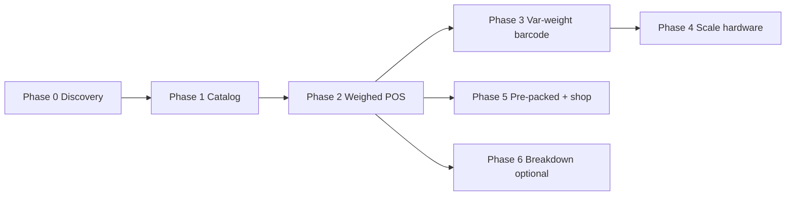

# Butchery POS — Scope Document

> **Status:** In progress — butcher chrome shipped (counter + suppliers + add stock); backend validation and hardware phases open  
> **Context:** PalMart (Kiosk POS) is built for kiosks, mini-marts, groceries, and wholesalers — discrete SKUs, scan/tap, integer-ish quantities, package variants (trays/cases). This document scopes what it takes to support butcher shops on the same platform.

---

## Table of Contents

0. [Implementation Status](#0-implementation-status)
1. [Scope Framing](#1-scope-framing)
2. [What We Keep As-Is](#2-what-we-keep-as-is)
3. [Roles & Permissions](#3-roles--permissions)
4. [Phase 0 — Discovery](#4-phase-0--discovery)
5. [Phase 1 — Butcher Catalog (Tier A/B)](#5-phase-1--butcher-catalog-tier-ab)
6. [Phase 2 — Weighed POS (Tier B)](#6-phase-2--weighed-pos-tier-b)
7. [Phase 3 — Variable-Weight Barcodes (Tier C, Part 1)](#7-phase-3--variable-weight-barcodes-tier-c-part-1)
8. [Phase 4 — Scale Integration (Tier C, Part 2)](#8-phase-4--scale-integration-tier-c-part-2)
9. [Phase 5 — Pre-Packed + Online (Tier A Polish)](#9-phase-5--pre-packed--online-tier-a-polish)
10. [Phase 6 — Production / Breakdown (Tier D)](#10-phase-6--production--breakdown-tier-d)
11. [Suggested Roadmap](#11-suggested-roadmap)
12. [Explicit Out of Scope (v1)](#12-explicit-out-of-scope-v1)
13. [Open Product Decisions](#13-open-product-decisions)
14. [Recommended v1 Scope](#14-recommended-v1-scope)
15. [Appendix — PalMart vs Butchery Gap Summary](#appendix--palmart-vs-butchery-gap-summary)

---

## 0. Implementation Status

Snapshot of what is **built in the repo** vs still scoped. See `BUTCHERY_POS_TICKETS.md` for ticket-level tracking.

### Shipped (frontend + migration)

| Area | Status | Key paths |
|------|--------|-----------|
| **`butcher_cashier` role** | ✅ Migration + permission mirror | `V125__butcher_cashier_role.sql` |
| **Branch lock for butcher cashiers** | ✅ | `BranchResolutionService`, `branch-access.ts` |
| **Post-login redirect** | ✅ → `/butcher` | `post-auth-destination.ts` (+ test) |
| **Butcher shell** | ✅ Dark chrome, tenant brand (`--pos-primary`), PWA layout | `butcher-shell.tsx`, `butcher-pos-chrome.ts` |
| **Counter POS `/butcher`** | ✅ Category pills, product grid with images, weight sheet vs tap-to-add, order panel, charge sale | `butcher-cashier-workspace.tsx`, `butcher-product-tile.tsx`, `butcher-pos.ts` |
| **Suppliers `/butcher/suppliers`** | ✅ Split-pane list + detail (mockup-aligned) | `butcher-suppliers-workspace.tsx`, `butcher-nav.tsx` |
| **Add stock modal** | ✅ Live line totals, draft vs receive, purchase-unit conversion | `butcher-add-stock-dialog.tsx`, `purchase-unit-conversion.ts` |
| **App shell / nav gates** | ✅ Role-restricted nav, bottom tabs, route allowlists | `app-shell.tsx`, `cashier-shell.tsx` (redirect butcher away from `/cashier`) |

### Partial / known gaps in shipped UI

| Gap | Notes |
|-----|-------|
| Server-side weighed sale validation | Client sends decimal kg; `SaleService` does not yet enforce weighed rules (Ticket 2) |
| Receipt unit labels | No `kg` on printed lines yet (Ticket 3) |
| Card tender | Butcher UI shows Card; posts as `cash` until card tender exists in API |
| Scale / variable-weight barcode | Not wired on `/butcher` (Phases 3–4) |
| Held orders, split pay, change due | Not on butcher workspace |
| Catalog admin weighed enforcement | Product form + API validation still open (Ticket 5) |
| `business_type = butcher` / feature flag | Nav not auto-hidden for grocery; no vertical flag (Ticket 6) |
| Draft PO list / partial receive (backend) | Backend list endpoints + Path B partial receive done; frontend resume/edit dialog remains open |
| Supplier category tags | Derived from first word of linked item names, not `item_types` |
| Margin from buy price | `cost/unit` on receive is stored on supplier invoice; no margin UI yet |

### API contracts used by shipped UI

| Surface | Endpoints / services |
|---------|---------------------|
| Counter catalog | `GET /api/v1/items` (`catalogScope=SKUS_ONLY`, `itemTypeId`, search, `branchId`) |
| Shelf price | `GET /api/v1/pricing/shelf-price` (`fetchPosShelfPrice`) |
| Complete sale | `POST /api/v1/sales` (`tryPostSaleWithRetries`) |
| Suppliers list/detail | `GET /api/v1/suppliers`, contacts, item-links, purchase history, AP aging |
| Add stock (draft) | `POST /api/v1/purchasing/path-b/sessions` + `…/lines` (session stays `SESSION_DRAFT`) |
| Add stock (receive) | `POST /api/v1/purchasing/path-b/sessions/{id}/post` → inventory batches + supplier invoice |
| List open drafts / sent POs | `GET /api/v1/purchasing/path-b/sessions?supplierId=&status=draft` (Path B drafts); `GET /api/v1/purchasing/path-a/purchase-orders?supplierId=&status=sent` (Path A sent POs) |
| Partial receive | `POST /api/v1/purchasing/path-b/sessions/{id}/post` with subset of lines; unposted lines stay `LINE_PENDING`, session stays `SESSION_DRAFT` |

---

## 1. Scope Framing

### Product goal

Let a butcher shop run daily sales and stock on PalMart without fighting the POS.

### Not the goal (yet)

Full abattoir ERP — carcass breakdown, yield analytics, multi-site production planning.

### Target butcher profiles

Pick a profile first; it drives how big the build is.

| Profile | Example | PalMart fit today | Scope tier |
|---------|---------|-------------------|------------|
| **A — Pre-packed counter** | Minced meat, sausages, portioned steaks in trays | High | **Tier 1** |
| **B — Weigh-at-counter** | Customer asks for 0.5 kg ribeye; cashier types weight | Medium | **Tier 2** |
| **C — Scale + label** | Weigh on scale → print label → scan at till | Low | **Tier 3** |
| **D — Breakdown shop** | Receive sides/carcasses, cut into retail SKUs, track trim | Very low | **Tier 4** |

Most shops are **B** or **C**. Scope in phases so you can ship **Tier 2** and only add **Tier 3+** if a customer needs it.

---

## 2. What We Keep As-Is

Do not rebuild these — they already align with butcher back-office needs (~70% of “running the business”):

| Area | PalMart today |
|------|---------------|
| Shifts, cash drawer, denomination count | ✅ |
| Payments (cash, M-Pesa, credit/tab, wallet, split) | ✅ |
| Suppliers, purchases, AP ledger | ✅ |
| Batch inventory, FEFO/FIFO on expiry | ✅ |
| Wastage write-offs (trim/spoilage maps here) | ✅ |
| Multi-branch, reporting, tenant admin | ✅ |
| Receipt printing (ESC/POS) | ✅ |
| Offline sale outbox (completed sales) | ✅ |

**Gap is at the counter:** weight-first selling, scales, variable-weight barcodes, and (optionally) carcass breakdown.

---

## 3. Roles & Permissions

PalMart already has a permission-based RBAC model (`users → roles → role_permissions → permissions`). System roles are seeded in Flyway; nav and API gates check permission keys, not hard-coded user IDs. Butchery should **extend this model**, not invent a parallel one.

Reference: `implement.md` §6, `V3__identity_seed.sql`, `V76__stock_manager_role.sql`, `V111__grocery_clerk_role.sql`, `frontend/components/app-shell.tsx`.

### 3.1 Existing system roles → butcher shop mapping

| PalMart role | Butcher shop staff | Typical duties | Surfaces today |
|--------------|-------------------|----------------|----------------|
| **owner** | Shop owner | Everything incl. billing, users, pricing | Full dashboard |
| **admin** | Owner / partner | Catalog, stock, purchasing, reports (no subscription) | Full dashboard |
| **manager** | Shop manager | Users (read), catalog write, operational oversight | Full dashboard (subset) |
| **cashier** | Grocery / general till | Open shift, ring sales at `/cashier` | `/cashier`, shifts, quick sale |
| **butcher_cashier** | Butcher counter till | Weighed + piece sales at **`/butcher`** only | `/butcher`, `/butcher/suppliers` (if granted), shifts, receive supplies |
| **stock_manager** | Cold-room / stock clerk | Stock-take, transfers, restock, supplies | Stock-take, inventory, restock |
| **grocery_clerk** | *(pattern only)* | Build cart → invoice barcode; **cannot** take payment | `/grocery` only |
| **viewer** | Accountant / auditor | Read-only | Reports (read) |

**v1 recommendation:** Assign **`butcher_cashier`** to counter staff (lands on `/butcher`). Use **`stock_manager`** in the cold room and **`admin`** for catalog/pricing. The generic **`cashier`** role stays on `/cashier` for non-butcher tenants.

### 3.2 Dedicated butcher cashier page (`/butcher`)

Butcher counter staff must **not** use the generic `/cashier` quick-sale UI. They get a purpose-built workspace — same sale pipeline (`POST /sales`), different layout and interaction model.

**Route:** `APP_ROUTES.butcher` → `/butcher`  
**Role:** `butcher_cashier` (migration `V125__butcher_cashier_role.sql` — mirrors cashier permissions)  
**Status:** ✅ Shipped (see [§0](#0-implementation-status))

**Implementation:**

| Layer | Files |
|-------|-------|
| Routes | `frontend/app/butcher/page.tsx`, `layout.tsx` |
| Shell | `butcher-shell.tsx`, `butcher-nav.tsx` |
| Workspace | `butcher-cashier-workspace.tsx`, `butcher-product-tile.tsx` |
| Helpers | `frontend/lib/butcher-pos.ts`, `frontend/lib/butcher-pos-chrome.ts` |
| Auth / nav | `post-auth-destination.ts`, `app-shell.tsx`, `shell-page-titles.ts` |
| Config | `APP_ROUTES.butcher` in `frontend/lib/config.ts` |

#### Layout (target UX)

```
┌─────────────────────────────────────────────┬──────────────────┐
│ Search cuts / scan barcode                  │ Current order    │
│ [All] [Beef] [Goat] [Chicken] [Pork] …      │                  │
├─────────────────────────────────────────────┤  (line items)    │
│  ┌──────┐ ┌──────┐ ┌──────┐ ┌──────┐        │                  │
│  │Ribeye│ │Mince │ │Wings │ │Tray  │        │  Total KES …     │
│  │/kg   │ │/kg   │ │/pc   │ │/pc   │        │  [Cash][M-Pesa]  │
│  └──────┘ └──────┘ └──────┘ └──────┘        │  [Charge order]  │
└─────────────────────────────────────────────┴──────────────────┘
```

#### Interaction rules

| Catalog `sell_by` | Tile tap behaviour |
|-------------------|-------------------|
| **kg** (`is_weighed` or `unit_type` kg/g/lb) | Open **weight sheet** — decimal kg, quick keys (0.25, 0.5, 1…), price/kg, add line |
| **piece** (default) | Add to cart immediately; +/- adjusts integer qty |

- Category pills → `item_types` filter (`itemTypeId` on `fetchItemsPage`).
- Product tiles show thumbnail (`itemListThumbnailUrl`), price with `/kg` or `/piece` suffix, cart qty badge.
- Dark, counter-first chrome (`ButcherShell`) with **dynamic brand colours** from Business → Branding (`posBrandThemeStyle` → `--pos-primary`).
- Weighed lines: weight sheet with quick keys (`BUTCHER_QUICK_WEIGHTS_KG`), line total = weight × price/kg.
- Piece lines: tap to add; +/- in order panel adjusts integer qty.
- Payments: Cash, M-Pesa (`mpesa_manual`), Card (UI only → posts as `cash` until card tender exists).
- **Not** multi-cart tabs, not grocery `GI-*` flow, not package-tray modal copy from retail POS.

#### vs `/cashier`

| | `/cashier` | `/butcher` |
|---|-----------|------------|
| Audience | General retail / kiosk | Butcher tenants |
| Catalog UI | Aisle browse, multi-cart, product modal | Category pills, cut grid, inline order panel |
| Weight | Integer qty (retail) | First-class kg entry |
| Role | `cashier` | `butcher_cashier` |
| Login redirect | `/sales/quick` or `/cashier` | `/butcher` |

#### Phased UI gaps (still in scope doc phases)

| Feature | Phase |
|---------|-------|
| Live scale weight in sheet | P4 |
| Variable-weight barcode scan | P3 |
| Held / suspended orders | P2+ |
| Split pay + change due | P2+ |
| Portrait tablet layout polish | P2 |

### 3.2b Butcher suppliers page (`/butcher/suppliers`)

Back-office supplier directory for butcher tenants — same split-pane pattern as the supplier mockup, dark chrome, dynamic brand colours.

**Route:** `APP_ROUTES.butcherSuppliers` → `/butcher/suppliers`  
**Role:** `owner` / `admin` / `manager` with `suppliers.read` (Suppliers tab hidden without permission; route allowed for `butcher_cashier` if granted)  
**Status:** ✅ Shipped (see [§0](#0-implementation-status))

**Implementation:** `frontend/app/butcher/suppliers/page.tsx`, `butcher-suppliers-workspace.tsx`, tab in `ButcherNav`

| Mockup element | Implementation |
|----------------|----------------|
| Search + Add supplier | `fetchSuppliersPage`, `createSupplier` dialog |
| List with selection | Left column; active row uses `--pos-primary` |
| Inactive badge | `supplier.status !== 'active'` |
| Avatar + contact | Initials circle; primary contact from `fetchSupplierContacts` |
| Phone / email / last order | Contact fields; `fetchSupplierPurchaseHistory` |
| Products supplied / outstanding | `fetchSupplierItemLinks` count; `openBalance` from history or AP aging |
| Category tags | First token of linked item names (e.g. Beef, Goat) |
| View products / Order history | Deep-link to dashboard `/suppliers?supplier=…` |

**Exit criteria:** Owner can search suppliers, select one, see balance and linked product count, add a new supplier without leaving butcher chrome.

#### Add stock modal (supplier detail)

**Status:** ✅ Shipped  
**Trigger:** **Add stock** button on supplier detail (requires `purchasing.path_b.write`)  
**Files:** `butcher-add-stock-dialog.tsx`, `frontend/lib/purchase-unit-conversion.ts`

| Mockup | Behaviour |
|--------|-----------|
| Supplier / delivery date / ref | Supplier pre-filled from selection; delivery date via `YmdDateInput`; ref appended to Path B session notes |
| Line grid (product, qty, unit, cost/unit) | Live **order total** = Σ(qty × cost/unit); **+ Add line** / trash remove rows |
| Product picker | Supplier-linked items (`fetchSupplierItemLinks`); loads item detail + variants for unit options |
| Cost/unit | **Buy price** — prefilled from link `lastCostPrice` / `defaultCostPrice` or item `buyingPrice`; distinct from shelf/sale price |
| Unit column | Independent of sale unit; on **Receive stock**, `resolveStockReceiptLine()` maps purchase unit → stock qty (package variant SKU, weight conversion, or fallback with toast) |
| Save as draft | `createPathBSession` + `addPathBLine` per row; session stays `SESSION_DRAFT` — **no** inventory or AP |
| Receive stock | Same session setup, then `postPathBSession` → inventory batches + supplier invoice; detail panel refreshes outstanding balance |

**Design notes (product):**

- Draft vs receive are **different actions**, not button styling — draft logs intent before delivery; receive is the inventory + AP event.
- Buy `cost/unit` should eventually feed margin visibility (not built in UI yet).
- Crate → kg (and similar) needs explicit conversion rules; package variants preferred when catalog has them.

**Deferred:** editing existing draft lines in the add-stock dialog (read/list/resume is done; full in-dialog edit remains frontend work), linking Path B receive to formal Path A PO.

### 3.3 When you need another role

Add a dedicated role only when **separation of duties** is a hard requirement, not for UI convenience.

| Scenario | Pattern to copy | Proposed role |
|----------|-----------------|---------------|
| Prep counter weighs & labels; till only scans (no price override) | `grocery_clerk` → invoice → cashier pays | **`butcher_clerk`** (optional, Phase 3+) |
| Boner breaks carcass; cannot sell or change prices | `stock_manager` + scoped write | **`butcher`** or extend `stock_manager` (Phase 6) |
| Owner wants apprentices to sell pre-packs only, not weighed fresh | `user_item_types` department filter | Reuse **`cashier`** + item-type scope |

The **`grocery_clerk`** split is the closest precedent in the codebase:

- Builds a basket, emits a **pending document with barcode** (`grocery.invoices.create`).
- **Cannot** `sales.sell` or `grocery.invoices.pay`.
- Cashier scans `GI-*` at till (`quick-sale-workspace.tsx`).

A butcher equivalent (weigh-at-prep-station → `BI-*` barcode → till pays) is **optional** and only worth building for **two-station** shops (Tier C, high volume). Single-counter shops use **`cashier`** only.

### 3.4 Butcher staff personas (operational)

| Persona | Role(s) | Must do | Must not |
|---------|---------|---------|----------|
| **Till operator** | `butcher_cashier` | Weighed + pre-pack sales at `/butcher`, shift, M-Pesa/cash | Edit catalog, `/cashier` UI |
| **Counter butcher** | `cashier` or `butcher_clerk` | Weigh, label, add to sale | Void others’ sales, change cost price |
| **Cold-room clerk** | `stock_manager` | Receive meat, FEFO checks, stock-take, record trim wastage | Sell, set sell price |
| **Head butcher / manager** | `manager` or `admin` | Catalog (cuts, price/kg), promotions, void any, wastage approve | — |
| **Owner** | `owner` | Pricing, suppliers, reports, users | — |

### 3.5 Permissions — reuse vs add

#### Reuse as-is (v1)

| Permission | Butcher use |
|------------|-------------|
| `sales.sell` | All counter sales (weighed lines included) |
| `sales.void.own` / `sales.void.any` | Wrong weight entered, customer walk-off |
| `sales.refund.create` | Returns (pre-pack; weighed returns are manager-gated in practice) |
| `shifts.open` / `shifts.close` | Till reconciliation |
| `catalog.items.read` | POS search / scan |
| `pricing.read` | Shelf price per kg on tiles |
| `pricing.sell_price.set` | Manager sets price per kg (admin/manager only) |
| `inventory.write` + wastage endpoint | Trim, spoilage, clearance |
| `purchasing.path_b.write` | Receive delivery (cashier/stock_manager today) |
| `pos.drafts.*` | Persist in-progress ring-ups |

#### New permissions (add when feature ships)

| Permission key | Phase | Who gets it by default | Purpose |
|----------------|-------|------------------------|---------|
| `pricing.sell_price.set` | P2 | `manager`, `admin`, `owner` | **Reused** for line-level price override (cashier / `butcher_cashier` denied) |
| `sales.weighed.override_weight` | P2 | `manager`, `admin`, `owner` | Sell when scale weight exceeds stock on hand (audit) |
| `butcher.labels.create` | P3 | `cashier`, `butcher_clerk` | Generate variable-weight barcode without completing sale |
| `butcher.labels.read` | P3 | `cashier`, `butcher_clerk` | Reprint / lookup prep labels |
| `butcher.breakdown.run` | P6 | `admin`, `manager`, custom `butcher` role | Carcass → cuts session |
| `butcher.breakdown.approve` | P6 | `owner`, `admin` | Close breakdown, post yield variance |

**v1 (P1+P2):** No new permission keys required. Price override is gated by existing `pricing.sell_price.set`; a future frontend manager-PIN flow can re-authenticate as a user with this permission when a cashier tries to override.

### 3.6 Branch & department scoping

Already implemented — reuse for butcher:

| Mechanism | Where | Butcher use |
|-----------|-------|-------------|
| **Branch lock** | `users.branch_id`, `BranchResolutionService` | Till and stock clerk see one shop only |
| **Item-type filter** | `user_item_types` (`V112`), enforced for `grocery_clerk` | Restrict cashier to **Poultry** counter only, or hide **Deli** from apprentice |
| **Own-row filtering** | Grocery invoice services | If `butcher_clerk` role added: only cancel own prep labels |

**Phase 0 decision:** Will any staff be scoped to meat departments (beef vs chicken vs deli)? If yes, extend `user_item_types` to **`cashier`** (optional business setting) or assign `butcher_clerk` users the same way as grocery clerks.

### 3.7 Nav & app surfaces by role (butcher tenant)

No new nav logic required for v1 — existing gates apply:

| Role | POS surface | Notes |
|------|-------------|-------|
| `butcher_cashier` | `/butcher`, optional `/butcher/suppliers` | Branch-locked; redirected away from `/cashier`; Suppliers tab if `suppliers.read` |
| `stock_manager` | Inventory, stock-take, restock, `/supplies` | Record wastage from trim |
| `owner` / `admin` / `manager` | Dashboard + `/butcher` + `/butcher/suppliers` | Catalog (weighed toggle), pricing, suppliers, add stock with `purchasing.path_b.write` |
| `grocery_clerk` | N/A for butcher | Hide grocery nav if `business_type = butcher` (optional, not implemented) |

Mobile apps (`public-mobile-config.ts`): **`cashier`** and **`stock`** apps map cleanly. A future **`butcher`** mobile app is optional (prep station only).

### 3.8 Separation-of-duties matrix (recommended defaults)

| Action | butcher_cashier | stock_manager | manager | owner |
|--------|---------|---------------|---------|-------|
| Sell weighed meat | ✅ (`butcher_cashier`) | ❌ | ✅ | ✅ |
| Override price/kg on line | ❌ | ❌ | ✅ | ✅ |
| Void own sale | ✅ | ❌ | ✅ | ✅ |
| Void any sale | ❌ | ❌ | ✅ | ✅ |
| Record trim wastage | ❌ | ✅ | ✅ | ✅ |
| Receive delivery (Path B) | ✅ | ✅ | ✅ | ✅ |
| Create/edit cuts in catalog | ❌ | ❌ | ✅ | ✅ |
| Carcass breakdown (P6) | ❌ | ❌ | ✅ | ✅ |
| Approve breakdown variance (P6) | ❌ | ❌ | ❌ | ✅ |

### 3.9 Implementation notes

| Work item | Phase | Status | Files / pattern |
|-----------|-------|--------|-----------------|
| Butcher workspace shell + counter POS | P2 | ✅ Done | `app/butcher/`, `butcher-cashier-workspace.tsx`, `butcher-product-tile.tsx` |
| Butcher suppliers + add stock | P2 | ✅ Done | `butcher-suppliers-workspace.tsx`, `butcher-add-stock-dialog.tsx`, `purchase-unit-conversion.ts` |
| `butcher_cashier` role + redirects | P2 | ✅ Done | `V125__butcher_cashier_role.sql`, `post-auth-destination.ts`, `app-shell.tsx` |
| Branch lock `butcher_cashier` | P2 | ✅ Done | `BranchResolutionService`, `branch-access.ts` |
| Weighed price override gate | P2 | ✅ Done | `SaleService` checks `pricing.sell_price.set` (Ticket 7) |
| Server-side weighed line validation | P2 | ✅ Done | `SaleService` (Ticket 2) |
| Receipt kg labels | P2 | ✅ Done | Receipt renderers (Ticket 3) |
| Weighed refund policy | P2 | ✅ Done | `SaleRefundService` writes off as wastage via `sales.weighed.refund` (Ticket 8) |
| Draft PO list / partial receive | P2+ | ✅ Done (backend) | `GET /purchasing/path-b/sessions` (draft), `GET /purchasing/path-a/purchase-orders` (sent), Path B partial receive in `PathBPurchaseService` |
| Prep-label permissions | P3 | Open | `butcher.labels.*` seed + role grants |
| Hide grocery nav for butcher tenants | P1 | ✅ Done | `app-shell.tsx` + `butcher_pos.enabled` feature flag (Ticket 6) |
| Department scope for cashiers | P2 | Open | Extend `user_item_types` filter beyond `grocery_clerk` |
| Breakdown permissions | P6 | Open | `butcher.breakdown.*` + role grants |

### 3.10 Phase 0 role decisions

Add to discovery checklist:

1. Single till or prep + till split?
2. Can cashiers override price/kg, or manager only?
3. Who records trim wastage — counter or cold room?
4. Department-scoped staff (beef vs chicken)?
5. New `butcher_clerk` prep role, or `butcher_cashier` only?

---

## 4. Phase 0 — Discovery

**Duration:** 3–5 days  
**Goal:** Lock decisions before coding.

### Decisions to make

1. **Tier target** — A only, B, or C?
2. **Units** — kg only, or kg + lb?
3. **Pricing model** — price per kg on shelf, or fixed price on pre-packed label?
4. **Hardware** — manual entry only, or which scale brand/protocol (e.g. CAS, Avery Berkel, Dibal)?
5. **Barcode format** — local EAN variable-weight prefix (often `2xxxxx`), or proprietary scale labels?
6. **Online shop** — pre-packed SKUs only, or hide `/shop` for butcher tenants?

### Deliverable

One-page butcher PRD + wireframes for weighed sale line (counter modal).

---

## 5. Phase 1 — Butcher Catalog (Tier A/B)

**Duration:** ~1–2 weeks  
**Goal:** Products behave like meat SKUs, not grocery “each” items.

### Backend

- Treat `is_weighed` + `unit_type` as first-class (fields exist on `items` today but are not enforced in sale UX).
- Validation: weighed items must have `unit_type` in `{kg, g, lb}`; shelf price = **price per unit** (per kg).
- Optional: `sell_by` enum (`each` | `weight`) on item or business setting.
- Default `has_expiry = true` for butcher item types; short default shelf-life templates.

**Touches:** `Item.java`, catalog create/patch APIs, item list/detail DTOs.

### Admin UI

**Files:** `ProductCreateDrawer.tsx`, `ProductEditDrawer.tsx`, `variant-drawer-form.tsx`

- Toggle: **Sell by weight** (sets `isWeighed`, unit dropdown).
- Price label: “Price per kg” instead of “Unit price”.
- Quick templates: Beef / Lamb / Chicken / Pork / Processed — pre-set expiry + weighed defaults.
- Stock shown in **kg** for weighed parents (display copy; DB already supports decimals).

### Exit criteria

- Owner can create “Beef mince” at KES 800/kg, receive 50 kg, see 50 kg on hand.
- Non-weighed pre-packs (500 g tray sold as **each**) still work via existing package-variant model (`PACKAGE_INVENTORY.md`).

---

## 6. Phase 2 — Weighed POS (Tier B)

**Duration:** ~2–3 weeks  
**Goal:** Counter can sell by weight without a scale — minimum viable butcher POS.

### Dedicated butcher counter (shipped)

The **primary** weighed POS for butcher tenants is **`/butcher`**, not `/cashier`. Implementation is complete for v1 counter flow (see [§3.2](#32-dedicated-butcher-cashier-page-butcher) and [§0](#0-implementation-status)).

Remaining P2 work on the counter: server validation, receipt labels, held orders, split pay, scale/barcode (P3–P4).

### Generic `/cashier` weighed UX (optional / not started)

Retail `/cashier` can still be extended for tenants that use one till for grocery + meat. **Not required** when staff use `butcher_cashier` + `/butcher`.

**Files (if pursued):** `cashier-product-modal.tsx`, `quick-sale-workspace.tsx`, `cashier-pos-layout.tsx`, `cashier-cart-drawer.tsx`

When `item.weighed` / `isWeighed`:

| Today | Butcher |
|-------|---------|
| Quantity stepper (1, 2, 5, 10) | **Weight** input (decimal, step 0.001 kg) |
| Quick keys: 1, 2, 5, 10 | Quick keys: 0.25, 0.5, 1.0 kg |
| Unit price = price per each | Unit price = **price per kg** (read-only or permissioned override) |
| Line total from integer qty | Line total = `weight × price_per_kg` |
| Cart: `2 × Beef mince` | Cart: `0.347 kg @ 800/kg = 277.60` |

Also:

- Stock cap: compare weight to `stockQty` in kg (not integer packages).
- Search/grid tiles: show **/kg** suffix on shelf price.

### Backend

**Files:** `SaleService.java`, sale line DTOs, receipt templates

- Server-side validation: weighed lines require qty > 0, max 3–4 decimals.
- Recompute `line_total` from weight × rate (do not trust client total).
- Receipt: print weight + rate.

### Barcode (simple)

- Standard product barcode → open weighed modal (weight empty; cashier enters).
- No variable-weight parsing yet.

### Exit criteria

- Cashier sells 0.347 kg ribeye at 1,200/kg; stock drops 0.347; receipt shows kg.
- Performance: 100 weighed sales/hour on 4G (match existing POS bar from `PHASE_4_PLAN.md`).

### Out of scope

Scale hardware, label printer, carcass breakdown.

---

## 7. Phase 3 — Variable-Weight Barcodes (Tier C, Part 1)

**Duration:** ~1–2 weeks  
**Goal:** Scan a scale-printed label → cart line with correct PLU + weight + price.

### New module: `VariableWeightBarcodeParser`

- Parse EAN-13 patterns (configurable per tenant):
  - PLU → item lookup (barcode prefix or dedicated `plu_code` field)
  - Embedded **weight** or embedded **price**
- Cashier scan path in `cashier-pos-layout.tsx` / search handler (same pattern as `GI-` grocery invoice intercept in `quick-sale-workspace.tsx`).

### Catalog

- Optional `plu_code` on item (6 digits).
- Business setting: barcode format (weight-embedded vs price-embedded).

### Exit criteria

- Scan label → line added with parsed weight and price; no modal unless override needed.
- Wrong PLU → clear error; no silent wrong product.

---

## 8. Phase 4 — Scale Integration (Tier C, Part 2)

**Duration:** ~2–4 weeks (hardware-dependent)  
**Goal:** Weight flows from hardware into the modal or straight to cart.

**Depends heavily on hardware.** Scope as **one integration first**, abstract the rest.

### Architecture options

| Surface | Approach |
|---------|----------|
| Web POS (`/cashier`) | Web Serial API or local bridge (Electron/helper) over USB/RS-232 |
| Mobile cashier (`mobile/apps/cashier`) | Native module for scale protocol |

### Features

- Connect scale; live weight in modal.
- **Tare** button (per session or per container SKU).
- “Stable weight” gate — accept only when scale reports stable.
- Optional: trigger label print from bridge (not from browser alone).

### Exit criteria

- Place meat on supported scale → weight fills modal → add to cart in < 2 s.
- Document supported scale list (v1: one model).

### Risk

Highest engineering risk in the butcher scope. Do not start here unless Tier B is live and a customer has named hardware.

---

## 9. Phase 5 — Pre-Packed + Online (Tier A Polish)

**Duration:** ~1 week  
**Goal:** Trays, packs, and `/shop` work for butcher without custom cuts online.

- Package variants: “Tray 500 g beef burgers” (existing `PackageVariantStockResolver` model).
- Storefront (`/shop`): integer qty only; hide weighed SKUs or show “available in store only”.
- Category nav: Meat / Poultry / Processed / Deli.

**Files:** `shop-product-grid.tsx`, `shop-add-to-cart.tsx`, `PublicStorefrontCatalogService.java`

### Exit criteria

- Customer orders pre-packed trays online; counter weighed sales unchanged.

---

## 10. Phase 6 — Production / Breakdown (Tier D)

**Duration:** ~4–8 weeks  
**Goal:** Breakdown shops only. Treat as a **separate product** from counter POS.

### Concepts

- **Bulk SKU** (side of beef, 45 kg) → **breakdown session** → output cut SKUs + trim/wastage.
- Yield % report (input kg → output kg + wastage).
- Cost allocation: bulk batch cost spread to cuts by weight or manual ratios.

### New aggregates (net-new domain)

- `BreakdownSession`, `BreakdownLine` (input batch, output items, wastage reason).
- Posts inventory movements (not a sale) + optional COGS prep.

PalMart has wastage (`InventoryLedgerService.recordStandaloneWastage`) and batch picking but **no** transform/BOM for carcass → cuts.

### Exit criteria

- Receive 45 kg side → breakdown into 8 cut SKUs + 5 kg trim wastage; stock and costs reconcile.

---

## 11. Suggested Roadmap



| Milestone | Customer promise | Rough effort |
|-----------|------------------|--------------|
| **MVP (P1 + P2)** | Sell by kg at the till; stock in kg; expiry; suppliers | 3–5 weeks |
| **Counter-ready (+ P3)** | Scan scale-printed labels | +1–2 weeks |
| **Full counter (+ P4)** | Live scale at till | +2–4 weeks |
| **Production shop (+ P6)** | Break carcass into cuts | +1–2 months |

---

## 12. Explicit Out of Scope (v1)

- Cut-to-order modifiers (“thin slice”, “no fat”) — use line notes or manual description first.
- Allergen / farm traceability on labels beyond existing batch numbers.
- HACCP temperature logs.
- Multi-scale per branch.
- Butcher-specific compliance (export certs, vet stamps) — manual fields only if needed.
- Carcass/primal breakdown (Phase 6 — separate milestone).

---

## 13. Open Product Decisions

| # | Question | Options |
|---|----------|---------|
| 1 | First customer tier? | B (type weight) vs C (scale labels) — sets whether P3/P4 is mandatory |
| 2 | Pre-packed vs fresh mix? | Drives P5 vs P2 priority |
| 3 | Vertical flag? | `business_type = butcher` vs default features for all tenants |
| 4 | Primary cashier surface? | Web `/cashier` only vs mobile `cashier` app in v1 |
| 5 | Units? | kg only vs kg + lb |
| 6 | Online shop? | Pre-packed only vs hide storefront for butcher tenants |
| 7 | Staff roles? | `cashier` only vs prep/till split (`butcher_clerk`) vs department-scoped cashiers |

---

## 14. Recommended v1 Scope

**Ship Phase 1 + 2 + 5:**

- Weighed catalog (kg, price per kg, expiry defaults)
- kg-based POS with decimal weight entry
- Pre-packed variants unchanged
- FEFO/expiry unchanged
- No scale hardware
- No carcass breakdown

**Already shipped toward v1 (see [§0](#0-implementation-status)):**

- Dedicated `/butcher` counter (weighed + piece tiles, charge sale)
- `/butcher/suppliers` + add stock (Path B draft / receive)
- `butcher_cashier` role, branch lock, auth redirects

**Still required for a complete v1 butcher rollout:**

- Phase 1 catalog admin + API validation (Ticket 5)
- Server-side weighed sale validation + receipt kg labels (Tickets 2–3)
- Optional vertical flag to hide grocery nav (Ticket 6)

**Add Phase 3** when a shop uses printed variable-weight labels.

**Add Phase 4** when a shop names scale hardware and Tier B is live.

**Add Phase 6** only for breakdown/production shops.

---

## Appendix — PalMart vs Butchery Gap Summary

| Area | PalMart today | Butchery need | Gap size |
|------|---------------|---------------|----------|
| Sale unit | Each / pack | Weight (kg) | **Large** — POS UX |
| Pricing | Fixed per SKU | Price per kg × weight | **Medium** — mostly UX + validation |
| Scale | None | USB/serial/network | **Large** — new integration |
| Barcodes | Standard EAN | Variable-weight PLU labels | **Medium** — parser + scan path |
| Stock model | SKU batches | Same + optional carcass breakdown | **Small** (counter) / **Large** (production) |
| Expiry | FEFO batches | Same (critical for meat) | **None** |
| Wastage | General write-off | Trim, spoilage, breakdown loss | **Small** (counter) / **Medium** (production) |
| Online shop | Catalog + cart | Pre-packed only | **Small** |
| Back office | Suppliers, AP, shifts, payments | Same | **None** |

### Existing schema hooks (unused in POS today)

```sql
-- items table (V8__catalog_items.sql)
unit_type    VARCHAR(16) NOT NULL DEFAULT 'each',
is_weighed   BOOLEAN NOT NULL DEFAULT FALSE,
```

Sale lines already support decimal quantity (`sale_items.quantity` DECIMAL 14,4).

### Key source files for implementation

| Area | Path |
|------|------|
| **Butcher counter (shipped)** | `frontend/app/butcher/`, `frontend/components/butcher/butcher-cashier-workspace.tsx` |
| **Butcher suppliers + stock (shipped)** | `frontend/components/butcher/butcher-suppliers-workspace.tsx`, `butcher-add-stock-dialog.tsx` |
| **Butcher helpers (shipped)** | `frontend/lib/butcher-pos.ts`, `butcher-pos-chrome.ts`, `purchase-unit-conversion.ts` |
| **Role + auth (shipped)** | `V125__butcher_cashier_role.sql`, `post-auth-destination.ts`, `app-shell.tsx` |
| **Path B receive (used by add stock)** | `backend/.../purchasing/application/PathBPurchaseService.java` |
| Retail cashier modal (optional) | `frontend/components/cashier/cashier-product-modal.tsx` |
| Sale completion (shared API) | `tryPostSaleWithRetries` / `POST /api/v1/sales` |
| Sale API (validation open) | `backend/.../sales/application/SaleService.java` |
| Item model | `backend/.../catalog/domain/Item.java` |
| Product admin | `frontend/app/(dashboard)/products/_components/` |
| Package variants | `backend/docs/PACKAGE_INVENTORY.md` |
| Batch / FEFO | `backend/.../inventory/application/BatchAllocationPlanner.java` |
| Storefront | `frontend/app/shop/page.tsx` |
