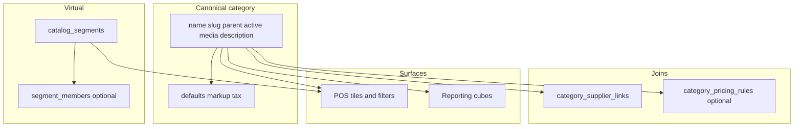

# Category system — design (beyond labels)

Categories are **canonical merchandising units**: hierarchy, media, supplier relationships, optional commercial defaults, and (later) virtual “smart” shelves. This doc breaks the target architecture into **steps** you can implement in order.

---

## Step 0 — Principles

1. **One canonical `categories` tree** for named aisles (Beverages → Soft drinks → Energy). Smart groups (“Fast movers”) live **outside** this tree unless you deliberately duplicate nodes (not recommended).
2. **Resolution order** for any default (tax, markup): define it once and document it — e.g. item override → nearest category (walk up ancestors) → business/branch default.
3. **POS and reporting** consume **stable APIs** (tree, children, thumbnails, filters); internals (closure tables, segments) stay server-side.

---

## Step 1 — Canonical category data shape

Extend the category row (beyond name/slug/parent/active/media already in motion):

| Field | Purpose |
|--------|---------|
| `name`, `slug`, `parent_id`, `position` / sort | Identity & tree |
| `active` | Hide from POS/catalog filters when false |
| `description` | Rich-enough text for kiosk tooltip / future SEO |
| `image_key` + gallery (`category_images`) | Tile hero + optional gallery |
| `default_markup_pct` | Nullable decimal; “suggested” or “default at item create” depending on policy |
| `default_tax_rate_id` | Nullable FK → existing tax rates |
| Optional `pricing_profile_id` | If you group defaults behind profiles later |

**Slug**: unique per `(business_id, slug)`.

**Hierarchy level**: either **maintained column** `level` updated when parent changes, or **computed** from path/closure on read — pick one source of truth.

---

## Step 2 — Hierarchy & APIs for multi-level UX

**Goals**

- Arbitrary depth (Beverages → Soft drinks → Energy drinks).
- POS: **tiles at current depth**; tap loads **children** or applies filter.

**Server**

- Keep **cycle checks** on parent updates.
- Define sibling ordering: `position ASC`, then `name ASC`.

**APIs (illustrative)**

- `GET /api/v1/categories/tree` — nested DTO or flat list with `parentId`, `depth`, `thumbnailUrl`, child counts optional.
- `GET /api/v1/categories/{id}/children` — lazy-load subcategories for tile drill-down.

**Optional scalability**

- **`category_closure`** table: `(ancestor_id, descendant_id, depth)` for “this category and all descendants” without recursion in SQL.

---

## Step 3 — Supplier linking (`category_supplier_links`)

You already have a join table; harden it for “organizational unit” semantics:

| Addition | Purpose |
|----------|---------|
| `priority` or `is_primary` | Pick a **default narrative** supplier for the aisle |
| Optional `effective_from` / `effective_to` | Seasonal / phased assortment |

**Rules**

- Linking does **not** automatically rewrite every SKU; optionally offer **bulk suggest** (“assign primary supplier from category”).
- Reporting must declare **one attribution rule** per metric (e.g. credit primary item supplier vs category-linked supplier).

---

## Step 4 — Pricing defaults (markup, tax, discounts)

**Category knobs**

- `default_markup_pct` — policy: **suggest only** vs **stamp onto item** at create/update.
- `default_tax_rate_id` — participates in documented resolution chain.

**Discounts / rules**

- Prefer **not** stuffing JSON into `categories`.
- Either nullable **`category_id`** on existing **`pricing_rule`** rows **or** junction `category_pricing_rules(category_id, rule_id, precedence)`.

**Transparency API**

- `GET .../items/{id}/effective-pricing-context` (name flexible): returns resolved tax, suggested markup, applicable rule IDs, and **source** (“inherited from category X”) for support and tooling.

**Offline POS note**

- **Resolve-at-sale-time** is cleaner logically; **copy-on-create** is simpler if POS must work without walking the tree.

---

## Step 5 — POS UI contract

**Tiles**

- Grid: `thumbnailUrl`, `name`, optional badge (promo, count).
- Data from tree/children endpoints.

**Filtering**

- Item list: `categoryId=` plus optional **`includeDescendants=true`** (needs closure or recursive ID expansion).

**Caching**

- Short TTL or ETag per branch; invalidate on catalog writes where feasible.

---

## Step 6 — Reporting (sales & inventory)

**Dimensions**

- Roll up sale lines → item → **category** (and optionally **ancestors** via closure).
- **Supplier** dimension: align with chosen attribution (item primary supplier vs category supplier).

**If dashboards slow**

- Nightly **`fact_daily_category`** / **`fact_daily_category_supplier`** aggregates.

---

## Step 7 — Smart / dynamic categories

These are **not** normal category rows unless you accept duplication.

**Recommended**

- Table **`catalog_segments`** (or `smart_categories`): `business_id`, `key` (`fast_moving`), `label`, `segment_type`, rule definition (structured or safe DSL).
- **Membership**: evaluate at query time for small catalogs, or **`segment_members(segment_id, item_id)`** refreshed by job for scale.

**POS**

- Same tile UX but backed by `GET /segments/{key}/items` or query params `segment=fastMoving`.
- Optionally unify tile config: `{ kind: "tree" | "segment", refId }`.

**Examples**

| Segment | Rule idea |
|---------|-----------|
| Fast moving | Velocity window from sale_lines |
| Low stock | ATP below threshold for catalog branch |
| On promotion | Active price rule / promo flag |

---

## Step 8 — Implementation roadmap (ordered)

| Order | Deliverable |
|-------|-------------|
| 1 | Migration: `description`, `default_markup_pct`, `default_tax_rate_id`; expose on DTOs + PATCH |
| 2 | Tree + children read APIs; thumbnail fields stable for POS |
| 3 | Extend supplier link with `priority` / primary semantics |
| 4 | Category ↔ pricing rule association + resolution/effective-context endpoint |
| 5 | POS integration: tiles, drill-down, filter with optional descendants |
| 6 | Reporting views/docs for category × supplier attribution |
| 7 | `catalog_segments` + membership strategy + POS tile kind |

---

## Diagram

---

## Related docs

- Phase 15 storefront plan touches **published** catalog projection; category thumbnails and tree APIs should align with whatever **public** read model you add later (`backend/docs/PHASE_15_PLAN.md`).
