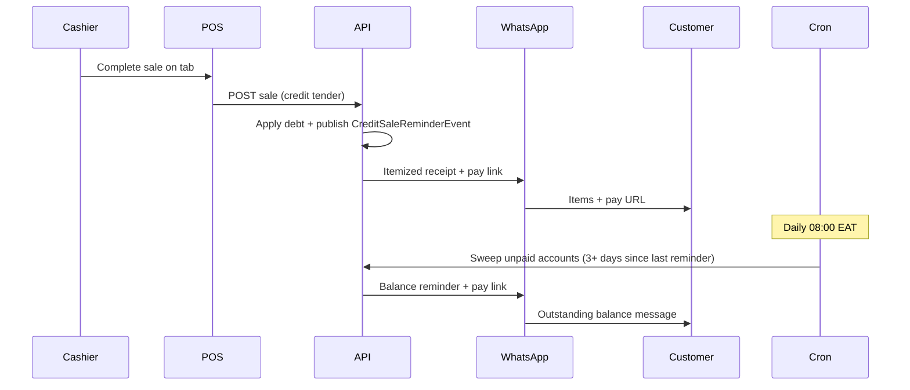

# Credit tab — WhatsApp receipts & payment reminders

Scope and implementation plan for notifying customers when they take items on credit, and reminding them to settle outstanding balances on a recurring schedule.

**Related code:** `CreditSaleReminderService`, `OverdueDebtReminderService`, `CreditsOverdueDebtReminder`  
**Related UI:** Credits → Sale reminder settings (`credit-sale-reminder-settings.tsx`)  
**Phase context:** [Phase 5 — Slice 6](./PHASE_5_PLAN.md#-slice-6--public-payment-claim--reminders), [Notifications architecture](./NOTIFICATIONS_ARCHITECTURE.md)

---

## Goals

1. **On credit sale** — Send the customer a WhatsApp message (SMS fallback) listing what they took and a link to pay.
2. **Every 3 days** — Remind customers with an outstanding tab balance to settle, until paid or capped.

---

## Current state

### Immediate message on credit sale — built

When a POS sale completes with customer credit (tab) tender, `SaleService` publishes `CreditSaleReminderEvent`. After commit, `CreditSaleReminderListener` calls `CreditSaleReminderService.dispatch()`.

| Capability | Status |
|------------|--------|
| WhatsApp via Meta Graph API | ✅ |
| SMS fallback (Africa's Talking) | ✅ |
| In-app notification (shopper account) | ✅ |
| Dispatch audit (`credit_sale_reminder_dispatches`) | ✅ |
| Customer opt-out (`credit_accounts.reminders_opt_out`) | ✅ |
| Per-tenant admin settings + test send | ✅ |

**Message today** (`CreditSaleReminderService.buildMessage`):

```
Hi {customerName},

You took on credit at {shopName}:
• {item name} — {currency amount}
• ...

This sale: {currency amount}
Total tab: {currency balance}

Pay here: {paymentUrl}
```

**Gaps vs target:**

| Today | Target |
|-------|--------|
| Generic pay URL | Link that enables payment with minimal friction (deferred) |
| Off until tenant enables | Documented enablement path |

**Trigger:** `SaleService` after `creditSaleDebtService.applyDebtForNewSale()` when `creditTenderTotal > 0`.

**Configuration:**

- Per business: `business_credit_settings.credit_sale_reminder_enabled`, payment URL, Meta WhatsApp, SMS keys.
- Platform fallback: `app.messaging.credit-sale-reminder.payment-account-url` (default `https://palmart.co.ke/shop/account`).
- Admin API: `GET/PUT /api/v1/credits/sale-reminder-settings`, `POST .../test`.

### Recurring balance reminders — implemented (MVP)

`OverdueDebtReminderService` now sends real WhatsApp/SMS reminders on a 3-day interval.

| Capability | Status |
|------------|--------|
| Daily cron (`@Scheduled`) | ✅ |
| Query eligible accounts | ✅ `findEligibleForBalanceReminder` |
| Real WhatsApp/SMS send | ✅ via `CustomerMessageDispatcher` |
| 3-day interval | ✅ `last_balance_reminder_at` + `app.credits.reminders.interval-days` |
| Max reminder count | ✅ `balance_reminder_count` + `app.credits.reminders.max-count` |
| Opt-out respected | ✅ |
| Enabled in prod | ❌ `app.credits.reminders.enabled=false` by default; flip to enable |

---

## Target experience

### 1. Sale receipt (immediate)

**When:** Credit tender on a completed POS sale.  
**Channel:** WhatsApp first; SMS if not on WhatsApp or send fails.  
**Content (example):**

```
Hi Jane,

You took on credit at Mama's Kiosk:
• Sugar 2kg — KES 240
• Milk 1L — KES 65

This sale: KES 305
Total tab: KES 1,240

Pay here: https://palmart.co.ke/shop/account
```

### 2. Balance reminder (every 3 days)

**When:** `balance_owed >= min` and customer has not opted out and interval elapsed since last reminder.  
**Content (example):**

```
Hi Jane, you still owe KES 1,240 at Mama's Kiosk.
Pay here: https://palmart.co.ke/shop/account
```

**Stop conditions:** `balance_owed = 0`, `reminders_opt_out = true`, or max reminder count reached.

---

## Pay link options

| Option | Description | Pros | Cons |
|--------|-------------|------|------|
| **A. Shop account** (current) | `/shop/account` — wallet, tab, M-Pesa STK when logged in | Already wired | Requires sign-in |
| **B. Payment claim token** | `PublicPaymentClaimService.issueClaim()` → `/public/credits/payment-claims/{token}` | No login; exists today | Customer submits amount + ref; staff approves |
| **C. Per-sale pay link** (new) | Tokenized page → M-Pesa STK for sale or full balance | One-tap from WhatsApp | New page + token issuance per sale |

**Recommendation:** Ship MVP with **A**; add **C** if most tab customers do not have shop accounts.

---

## Implementation phases

### Phase A — Enhance immediate receipt (~3–5 days)

| ID | Task |
|----|------|
| A1 | Extend `CreditSaleReminderEvent` with line items (name, qty, line total) |
| A2 | Update `buildMessage()` — cap lines (e.g. 5 + “and N more”), include `balanceOwed` |
| A3 | Load sale lines in listener/service from `saleId` |
| A4 | Document tenant enablement (Meta WhatsApp, payment URL, test send) |
| A5 | (Optional) Issue payment claim token and embed in URL instead of generic account link |

**Files to touch:**

- `CreditSaleReminderEvent.java`
- `SaleService.java` (event payload)
- `CreditSaleReminderService.java`
- Tests for message formatting and dispatch idempotency

### Phase B — 3-day balance reminders (~5–8 days)

| ID | Task |
|----|------|
| B1 | Extract shared delivery helper from `CreditSaleReminderService` (WhatsApp → SMS) |
| B2 | Implement `OverdueDebtReminderService.dispatch()` using shared helper |
| B3 | Replace weekly bucket with per-account interval (3 days) |
| B4 | Add `last_balance_reminder_at` (+ optional `balance_reminder_count`) on `credit_accounts` or extend `credit_reminders` |
| B5 | New query: unpaid accounts eligible for reminder |
| B6 | Cap reminders (e.g. max 5) |
| B7 | Separate message template for balance vs sale receipt |
| B8 | Integration tests for idempotency and opt-out |

**Files to touch:**

- `OverdueDebtReminderService.java`
- `CreditAccountRepository.java`
- `CreditsOverdueDebtReminder.java`
- Flyway migration
- `application.properties` (new keys)

### Phase C — Admin & ops (~2–3 days)

| ID | Task |
|----|------|
| C1 | Settings: reminder interval (3 / 7 / 14 days), max count, enable balance reminders |
| C2 | UI: reminder dispatch log per customer |
| C3 | Expose opt-out on customer profile |
| C4 | Link from [Notifications architecture](./NOTIFICATIONS_ARCHITECTURE.md) credit reminder section |

---

## Cron design

**Do not** schedule cron every 3 days (`*/3`). Use a **daily sweep** with per-account eligibility.

```
Daily at 08:00 (Africa/Nairobi)
  → SELECT credit_accounts
      WHERE balance_owed >= min_balance
        AND reminders_opt_out = false
        AND (last_balance_reminder_at IS NULL
             OR last_balance_reminder_at < now() - interval '3 days')
  → send reminder
  → UPDATE last_balance_reminder_at, increment count
```

**Suggested configuration:**

```properties
app.credits.reminders.enabled=true
app.credits.reminders.cron=0 0 8 * * *
app.credits.reminders.zone=Africa/Nairobi
app.credits.reminders.interval-days=3
app.credits.reminders.min-balance=1.00
app.credits.reminders.max-count=5
```

**Idempotency:** `last_balance_reminder_at` (or unique `(credit_account_id, reminder_date)`) so a double cron run does not double-send.

**Pattern reference:** Same approach as `InsightsDigestScheduler` and existing `CreditsOverdueDebtReminder`.

---

## WhatsApp / Meta compliance

Meta allows free-form text only within **24 hours** of the customer messaging your business number. Business-initiated messages (sale receipts and periodic reminders) usually require **approved message templates**.

| Message type | Template likely required |
|--------------|-------------------------|
| Sale receipt (after tab) | Safer with template; may work as session message if recent interaction |
| 3-day balance reminder | Yes |

**Template examples to register in Meta Business Manager:**

- `credit_sale_receipt` — shop name, item summary, sale amount, balance, pay link
- `credit_balance_reminder` — customer name, balance, shop name, pay link

Until templates are approved, rely on **SMS fallback** (already implemented in `deliverExternalMessage`).

---

## End-to-end flow



---

## MVP vs full build

| MVP (~1–2 weeks) | Full build (+2–3 weeks) |
|------------------|-------------------------|
| Enable existing sale reminders per tenant | Itemized line items in message |
| Configure Meta WhatsApp + payment URL | Per-sale M-Pesa pay link (no login) |
| Wire overdue reminder to real WhatsApp/SMS | Meta templates approved and used |
| 3-day interval via daily cron | Admin UI for interval + max reminders |
| Generic `/shop/account` pay link | Dispatch dashboard for staff |

---

## Open decisions

1. **Pay link** — Login required (`/shop/account`) vs one-tap M-Pesa token link?
2. **Reminder start** — From first credit sale, or only after N days unpaid?
3. **Payment confirmation** — Auto-apply M-Pesa STK vs manual claim approval?
4. **Templates** — Register Meta templates now, or SMS-only until approved?
5. **WhatsApp number** — Platform-wide Meta credentials vs per-business numbers (per-tenant settings already supported)?

---

## Enablement checklist (today)

To use **immediate** credit sale reminders without new code:

1. Deploy backend with Flyway through V95–V97 (credit sale reminder settings).
2. In admin: **Credits → Sale reminder settings**
   - Enable “Send reminders after credit (tab) sales”
   - Set payment account URL (e.g. `https://{your-domain}/shop/account`)
   - Configure Meta WhatsApp (phone number ID + access token) and/or SMS
   - Use **Send test** to verify delivery
3. Ensure customers have a **primary phone** on their profile.
4. Respect **reminders opt-out** on credit accounts when testing.

Balance reminders on a 3-day cadence require **Phase B** work above before enabling `app.credits.reminders.enabled=true`.

---

## Summary

| Piece | Status |
|-------|--------|
| WhatsApp on credit sale | Built — enable and configure per tenant |
| Item names in message | Implemented |
| Running tab balance in message | Implemented |
| Pay link | Generic URL — may require login (per-sale token deferred) |
| 3-day recurring reminders | Implemented — real WhatsApp/SMS send |
| Cron infrastructure | Spring `@Scheduled` pattern ready |
| Opt-out and audit | Implemented |

**Enablement:** Set `app.credits.reminders.enabled=true` (balance reminders) and configure per-tenant sale reminder settings in admin.
