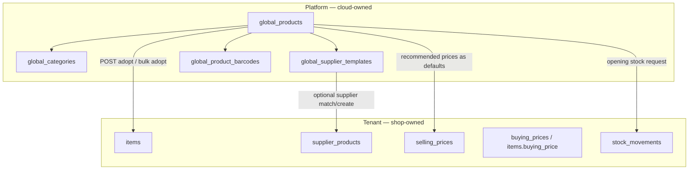

# Global Products Catalog — Feature Scoping

### Let new shops adopt a curated product library in minutes instead of typing every SKU by hand.

**Status:** Scoping  
**Depends on:** Phase 1 catalog spine (`items`, categories, item types), Phase 2 suppliers, Phase 3 inventory, Phase 8 CSV import patterns  
**Related docs:** `PHASE_1_PLAN.md`, `PHASE_8_PLAN.md`, `CATEGORY_SYSTEM_DESIGN.md`, `implement.md` §15.6 (hybrid sync: cloud-owned global catalog)

---

## Table of contents

1. [Why this feature exists](#1-why-this-feature-exists)
2. [Recommendation (architecture decision)](#2-recommendation-architecture-decision)
3. [User flows](#3-user-flows)
4. [Database design](#4-database-design)
5. [Backend APIs](#5-backend-apis)
6. [Frontend UX](#6-frontend-ux)
7. [Edge cases & conflict rules](#7-edge-cases--conflict-rules)
8. [Permissions](#8-permissions)
9. [Phased delivery (MVP → advanced)](#9-phased-delivery-mvp--advanced)
10. [Codebase-aligned implementation notes](#10-codebase-aligned-implementation-notes)
11. [Open questions](#11-open-questions)
12. [Definition of done](#12-definition-of-done)

---

## 1. Why this feature exists

Today, every new tenant starts with:

- One default item type (`Goods`) from `CatalogBootstrapService`
- Optional department names from `StoreSectionStarterKitCatalog` (item types only — **no products**)
- An onboarding questionnaire that creates branches, item types, and branding — but **zero catalog rows**

Operators must manually create items (`ProductCreateDrawer`) or use the legacy JSON import page (`/business/import`). CSV import exists on the API (`/api/v1/integrations/imports/items`) but has **no tenant UI**.

**Goal:** A shop owner should be able to pick 50–200 common products from a platform-maintained library, tweak prices/stock/suppliers, and bulk-import into their own catalog in under 10 minutes.

**Non-goals (for MVP):**

- Cross-tenant shared inventory or pricing
- Tenants editing the global catalog
- Real-time sync of global template changes into already-imported tenant items (hybrid/desktop policy is a later slice; see `implement.md` §15.6)

---

## 2. Recommendation (architecture decision)

### Keep one `items` table; add a separate global template layer

| Layer | Ownership | Mutable by tenant? |
|-------|-----------|-------------------|
| **Global catalog** (`global_products`, etc.) | Platform (cloud) | No |
| **Tenant catalog** (`items`, `selling_prices`, `supplier_products`, …) | Per `business_id` | Yes — full edit after import |

**Adopt = copy-on-import**, not a foreign-key join. Once imported, the tenant row is independent. Track provenance with `items.global_product_source_id` (same pattern as `legacy_import_source_id`).

This matches the existing multi-tenant model (`items.business_id`, unique `(business_id, sku)`) and avoids the pitfalls of shared rows across shops.



---

## 3. User flows

### 3.1 Primary flow — post-signup onboarding (happy path)

```text
Sign up → business created → onboarding questionnaire
  → departments/item types created (existing)
  → NEW: "Add products from catalog" step (skippable)
      → choose starter pack OR browse full catalog
      → filter by category / search / barcode scan
      → select rows in table (checkboxes)
      → review drawer: edit sell price, buy price, supplier, opening stock, category, reorder level
      → "Import N products" → job runs → success summary
  → land on /products with imported items visible
```

**Entry points (MVP should support at least two):**

| Entry | When | Route / trigger |
|-------|------|-----------------|
| Onboarding step | First week after signup | Questionnaire finish → `GlobalCatalogAdoptPage` |
| Products empty state | `items.length === 0` | CTA on `/products`: "Add from catalog" |
| Products header action | Any time | Button next to "Add product": "Add from catalog" |
| Post-tour nudge | After onboarding tour | Deep link `/products?action=global-catalog` |

### 3.2 Browse & select flow

1. User opens **Global Catalog Browser** (full-page or large drawer).
2. Left sidebar: global category tree + optional **starter packs** (e.g. "Mini mart essentials — Kenya", "Beverages pack").
3. Main area: searchable, filterable table:
   - Columns: image thumb, name, brand, size, category, barcode, unit, recommended sell, recommended buy, suggested supplier.
   - Row state: `not_imported` | `already_imported` (greyed, link to tenant item).
4. User checks products → **Review & import** panel opens.
5. Per-row overrides in review (inline or expandable row):
   - Selling price, buying price, supplier (picker or "create from template"), opening stock qty, opening branch, reorder level, tenant category mapping.
6. **Dry run** (optional but recommended) → shows conflicts/skips.
7. **Import** → async job for >20 rows; sync for small batches.

### 3.3 Single-product adopt (from create form)

When creating a product manually:

1. User types barcode or name in `ProductCreateDrawer`.
2. If match in **tenant catalog** → show "Already exists" (existing behavior).
3. If match in **global catalog** → banner: "Found in catalog library — pre-fill from template?"
4. Accept → form fields populated; user still saves → creates tenant `items` row + `global_product_source_id`.

### 3.4 Platform admin curation flow (internal)

1. Super-admin opens **Platform → Global Catalog** (not in tenant dashboard).
2. CRUD global products, categories, packs, supplier templates.
3. Bulk CSV upload for seed data.
4. Publish / unpublish templates (`status = draft | published`).

---

## 4. Database design

### 4.1 New platform tables

#### `global_catalogs` (regional / vertical packs — future-ready)

| Column | Type | Notes |
|--------|------|-------|
| `id` | CHAR(36) PK | |
| `code` | VARCHAR(64) UNIQUE | e.g. `ke-retail-v1`, `tz-grocery-v1` |
| `name` | VARCHAR(255) | Display name |
| `region_code` | CHAR(2) NULL | `KE`, `TZ`, … |
| `currency` | CHAR(3) | Default currency for recommended prices |
| `status` | VARCHAR(16) | `draft`, `published`, `archived` |
| `version` | INT | Bump when pack content changes |
| timestamps | | `created_at`, `updated_at` |

MVP can ship with a single row `code = 'default'`.

#### `global_categories`

Canonical taxonomy **inside** a global catalog (not tenant categories).

| Column | Type | Notes |
|--------|------|-------|
| `id` | CHAR(36) PK | |
| `catalog_id` | CHAR(36) FK | → `global_catalogs` |
| `parent_id` | CHAR(36) NULL | Tree |
| `name` | VARCHAR(255) | |
| `slug` | VARCHAR(191) | Unique per catalog |
| `position` | INT | Sibling order |
| `tenant_category_slug_hint` | VARCHAR(191) NULL | Suggested mapping slug for adopt |
| `image_url` | VARCHAR(2048) NULL | |
| `active` | BOOLEAN | |

#### `global_products`

| Column | Type | Notes |
|--------|------|-------|
| `id` | CHAR(36) PK | |
| `catalog_id` | CHAR(36) FK | |
| `global_category_id` | CHAR(36) NULL FK | |
| `sku_template` | VARCHAR(191) | Suggested SKU; tenant may override on adopt |
| `name` | VARCHAR(500) | |
| `brand` | VARCHAR(255) NULL | |
| `size` | VARCHAR(50) NULL | |
| `description` | TEXT NULL | |
| `barcode` | VARCHAR(191) NULL | Normalized (see `ItemCatalogService.normalizeBarcode`) |
| `unit_type` | VARCHAR(16) | `each`, `kg`, … |
| `is_weighed` | BOOLEAN | |
| `is_sellable` | BOOLEAN DEFAULT TRUE | |
| `is_stocked` | BOOLEAN DEFAULT TRUE | |
| `recommended_buying_price` | DECIMAL(14,2) NULL | Hint only |
| `recommended_selling_price` | DECIMAL(14,2) NULL | Hint only |
| `suggested_margin_pct` | DECIMAL(5,2) NULL | Optional; can derive sell from buy |
| `default_reorder_level` | DECIMAL(14,4) NULL | |
| `default_reorder_qty` | DECIMAL(14,4) NULL | |
| `default_min_stock_level` | DECIMAL(14,4) NULL | |
| `has_expiry` | BOOLEAN | |
| `expires_after_days` | INT NULL | |
| `image_url` | VARCHAR(2048) NULL | Canonical image |
| `item_type_key_hint` | VARCHAR(64) NULL | Maps to tenant `item_types.type_key` |
| `status` | VARCHAR(16) | `draft`, `published`, `archived` |
| `sort_order` | INT | Within category |
| timestamps + `version` | | Optimistic locking for admin edits |

**Indexes:** `(catalog_id, status)`, `(catalog_id, barcode)`, FULLTEXT `(name, brand, barcode)` for search.

#### `global_product_packs` (onboarding bundles)

| Column | Type | Notes |
|--------|------|-------|
| `id` | CHAR(36) PK | |
| `catalog_id` | CHAR(36) FK | |
| `code` | VARCHAR(64) | e.g. `mini-mart-starter` — aligns with `StoreSectionStarterKitCatalog` ids |
| `name` | VARCHAR(255) | |
| `description` | TEXT NULL | |
| `store_kit_id` | VARCHAR(64) NULL | Links to onboarding kit id when applicable |
| `status` | VARCHAR(16) | |

#### `global_product_pack_items`

| Column | Type |
|--------|------|
| `pack_id` | CHAR(36) FK |
| `global_product_id` | CHAR(36) FK |
| `sort_order` | INT |
| PRIMARY KEY (`pack_id`, `global_product_id`) |

#### `global_supplier_templates`

Supplier **hints** for auto-provision — not real tenant suppliers.

| Column | Type | Notes |
|--------|------|-------|
| `id` | CHAR(36) PK | |
| `catalog_id` | CHAR(36) FK | |
| `code` | VARCHAR(64) UNIQUE per catalog | e.g. `COCA-COLA-KE` |
| `name` | VARCHAR(255) | |
| `supplier_type` | VARCHAR(32) | `distributor`, `manufacturer`, … |
| `vat_pin` | VARCHAR(64) NULL | |
| `notes` | TEXT NULL | |

#### `global_product_supplier_links`

| Column | Type |
|--------|------|
| `global_product_id` | CHAR(36) FK |
| `global_supplier_template_id` | CHAR(36) FK |
| `is_primary` | BOOLEAN |
| `default_cost_price` | DECIMAL(14,4) NULL |
| `supplier_sku` | VARCHAR(191) NULL |

### 4.2 Tenant table changes

#### `items` — add provenance column

```sql
ALTER TABLE items
  ADD COLUMN global_product_source_id CHAR(36) NULL,
  ADD INDEX idx_items_global_source (business_id, global_product_source_id);
```

- Set on adopt; **never updated** when global template changes.
- Used to detect "already imported" and prevent duplicate adopt of same template.
- Optional unique: `(business_id, global_product_source_id)` WHERE `deleted_at IS NULL` — prevents re-importing same global product twice.

#### `global_category_mappings` (tenant-side, optional MVP+)

Maps global category slug → tenant `categories.id` per business. Caches user choices during adopt.

| Column | Type |
|--------|------|
| `business_id` | CHAR(36) |
| `global_category_id` | CHAR(36) |
| `category_id` | CHAR(36) |
| UNIQUE (`business_id`, `global_category_id`) |

#### `global_supplier_mappings` (tenant-side, optional MVP+)

Maps `global_supplier_template_id` → tenant `suppliers.id`.

### 4.3 What stays tenant-scoped (unchanged)

After import, all operational data lives in existing tables:

- `items` — name, sku, barcode, prices snapshot, reorder fields
- `selling_prices` — branch-aware sell price (use `PricingService.setSellingPrice`, same as CSV import)
- `items.buying_price` + `buying_prices` — cost
- `supplier_products` — primary supplier link
- `stock_movements` — opening balance via `InventoryLedgerService`
- `item_images` — copy/register image URL from global template

**Tenant edits never write back to global tables.**

---

## 5. Backend APIs

### 5.1 Module placement

New package: `zelisline.ub.globalcatalog/` (or `platform.catalog` if you prefer platform namespace).

Subpackages: `domain`, `repository`, `application`, `api`, `api/dto`.

### 5.2 Tenant-facing APIs (authenticated, `business_id` from session)

| Method | Route | Purpose |
|--------|-------|---------|
| `GET` | `/api/v1/global-catalog/meta` | Active catalog for tenant region, available packs, category tree summary |
| `GET` | `/api/v1/global-catalog/products` | Paginated browse; query: `q`, `categoryId`, `packId`, `barcode`, `onlyNotImported` |
| `GET` | `/api/v1/global-catalog/products/{id}` | Single template detail |
| `GET` | `/api/v1/global-catalog/packs` | Starter packs list |
| `GET` | `/api/v1/global-catalog/packs/{id}/products` | Products in a pack |
| `POST` | `/api/v1/global-catalog/adopt/preview` | Dry-run bulk adopt; returns per-row status |
| `POST` | `/api/v1/global-catalog/adopt` | Commit adopt (sync ≤25 rows) |
| `POST` | `/api/v1/global-catalog/adopt/jobs` | Async bulk adopt (>25 rows) → `import_jobs` pattern |
| `GET` | `/api/v1/global-catalog/adopt/jobs/{id}` | Job status + per-line results |
| `GET` | `/api/v1/global-catalog/lookup` | Barcode/name quick lookup for create-form pre-fill (`?barcode=` or `?q=`) |

#### `POST /api/v1/global-catalog/adopt` request body (sketch)

```json
{
  "openingBranchId": "uuid",
  "categoryMappings": [
    { "globalCategoryId": "uuid", "categoryId": "uuid-or-null-create" }
  ],
  "supplierMappings": [
    { "globalSupplierTemplateId": "uuid", "supplierId": "uuid-or-null-auto-create" }
  ],
  "lines": [
    {
      "globalProductId": "uuid",
      "sku": null,
      "sellingPrice": 120.00,
      "buyingPrice": 95.00,
      "supplierId": null,
      "categoryId": null,
      "openingQty": 10,
      "openingUnitCost": 95.00,
      "reorderLevel": 5,
      "reorderQty": 20,
      "skipIfExists": true
    }
  ],
  "dryRun": false
}
```

#### `POST .../adopt/preview` response line statuses

| Status | Meaning |
|--------|---------|
| `ready` | Will import |
| `skip_already_imported` | `global_product_source_id` already linked |
| `skip_sku_conflict` | Tenant SKU taken |
| `skip_barcode_conflict` | Tenant barcode taken |
| `warn_missing_category` | Will import uncategorized or use default |
| `warn_missing_supplier` | Will use SYS-UNASSIGNED |
| `error_invalid_price` | Row rejected |

### 5.3 Platform admin APIs (super-admin only)

| Method | Route | Purpose |
|--------|-------|---------|
| `GET/POST/PATCH/DELETE` | `/api/v1/platform/global-catalogs` | Catalog CRUD |
| `GET/POST/PATCH/DELETE` | `/api/v1/platform/global-categories` | Category tree |
| `GET/POST/PATCH/DELETE` | `/api/v1/platform/global-products` | Product templates |
| `GET/POST/PATCH/DELETE` | `/api/v1/platform/global-packs` | Packs + membership |
| `GET/POST/PATCH/DELETE` | `/api/v1/platform/global-supplier-templates` | Supplier hints |
| `POST` | `/api/v1/platform/global-products/import` | Admin CSV/JSON seed import |

### 5.4 Core service: `GlobalCatalogAdoptService`

Orchestration per line (reuse existing services — **do not duplicate item logic**):

```text
For each adopt line:
  1. Load global_product (published)
  2. Resolve tenant category (mapping → slug hint → create if policy allows)
  3. Resolve tenant item_type (item_type_key_hint → fallback default Goods type)
  4. Allocate SKU (sku_template or SkuGenerationService)
  5. Check sku/barcode/global_product_source_id conflicts
  6. ItemCatalogService.createItem() OR internal package variant path if needed later
  7. Set items.global_product_source_id
  8. PricingService.setSellingPrice() if sellingPrice provided
  9. Set items.buying_price; optional buying_prices row
  10. Resolve supplier → SupplierService.create if auto-create; ItemSupplierLinkService.add + set-primary
  11. Register item image from global image_url
  12. If openingQty > 0: InventoryLedgerService.postOpeningBalance()
  13. Emit catalog.item.created audit event
```

**Transaction boundary:** Per-line save with collected errors (like CSV import), or whole-batch transactional for small adopts — match `CsvImportApplicationService` ADR.

### 5.5 Catalog resolution for tenant

`GET /api/v1/global-catalog/meta` picks catalog by:

1. `business.country_code` → catalog with matching `region_code`
2. Fallback: `default` catalog
3. Future: `business.settings.globalCatalogCode` override

---

## 6. Frontend UX

### 6.1 New surfaces

| Surface | Type | Path / host |
|---------|------|-------------|
| **Global Catalog Browser** | Full page | `/products/catalog` or `/onboarding/add-products` |
| **Review & Import drawer** | Right drawer (wide) | Opens from browser with selection |
| **Import job progress** | Toast + modal | Reuse import job UI patterns from `/business/import` |
| **Platform admin** | Separate admin app section | `/platform/global-catalog` (super-admin) |

### 6.2 Global Catalog Browser layout

```text
┌─────────────────────────────────────────────────────────────────┐
│ Add products from catalog          [Search…] [Scan barcode]      │
├──────────────┬──────────────────────────────────────────────────┤
│ Starter packs│ ☐ Select all on page    Showing 1–50 of 412     │
│ ○ Mini mart  │ ┌────┬──────────┬──────┬─────┬──────┬──────┐    │
│ ○ Beverages  │ │ ☐  │ Product  │ Cat  │ Bar │ Rec. │ Rec. │    │
│              │ │    │          │      │ code│ sell │ buy  │    │
│ Categories   │ ├────┼──────────┼──────┼─────┼──────┼──────┤    │
│ ▼ Beverages  │ │ ☐  │ Coke 500 │ Bev  │ …   │ 120  │ 95   │    │
│   Soft drinks│ │ ☑  │ …        │      │     │      │      │    │
│ ▼ Grocery    │ └────┴──────────┴──────┴─────┴──────┴──────┘    │
│              │ [◀ 1 2 3 ▶]                                      │
├──────────────┴──────────────────────────────────────────────────┤
│ 12 selected          [Preview import]  [Import 12 products]      │
└─────────────────────────────────────────────────────────────────┘
```

### 6.3 Review & Import drawer

Columns editable before commit:

| Field | Default source | Control |
|-------|----------------|---------|
| Product name | global `name` | Read-only (or editable → becomes tenant override) |
| SKU | `sku_template` or generated | Text input |
| Selling price | `recommended_selling_price` | Money input; show margin % |
| Buying price | `recommended_buying_price` | Money input |
| Supplier | primary global supplier template | Combobox: existing tenant suppliers + "Create …" |
| Category | mapped tenant category | Category picker |
| Opening stock | 0 | Qty + branch (default first branch) |
| Reorder level | `default_reorder_level` | Number |

**Bulk actions row:** "Apply margin 25% to all", "Set opening stock 0 for all", "Map all Beverages → [tenant category]".

### 6.4 Integration with existing pages

| Existing file | Change |
|---------------|--------|
| `frontend/app/(dashboard)/products/page.tsx` | Empty state CTA; header button "Add from catalog"; handle `?action=global-catalog` |
| `ProductCreateDrawer.tsx` | Global lookup on barcode blur; pre-fill banner |
| `frontend/lib/onboarding-questionnaire-apply.ts` | After item types, optionally route to catalog step |
| Onboarding questionnaire UI | New step: "Stock your shelves" with pack picker |
| `frontend/lib/permissions.ts` | Add `CatalogGlobalAdopt` permission |

### 6.5 UX principles

- **Skippable** — never block signup if user wants empty catalog
- **Show what's already imported** — grey row + "View in your catalog" link
- **Prices are suggestions** — label clearly: "Recommended price (you can change)"
- **Fast defaults** — one-click "Import mini-mart starter (84 products)" with sensible defaults, then refine
- **Mobile** — MVP can be desktop-first; table degrades to card list on small screens

---

## 7. Edge cases & conflict rules

### 7.1 Duplicate detection on adopt

| Conflict | Detection | Default behavior | User override |
|----------|-----------|------------------|---------------|
| Same global product adopted twice | `items.global_product_source_id` | Skip row | — |
| SKU exists | `existsByBusinessIdAndSku` | Skip or auto-suffix `-2` | Preview shows choice |
| Barcode exists | `findByBusinessIdAndBarcode` | Skip row | User can adopt without barcode |
| Name-only duplicate | Same name + brand + size, different SKU | **Warn** in preview, allow import | MVP: warn only |
| Global barcode shared across tenants | N/A at adopt time | Allowed — per-tenant isolation | — |

### 7.2 Incomplete global product data

| Missing field | Fallback on adopt |
|---------------|-------------------|
| Barcode | Import with `barcode = null` |
| Image | Placeholder; item works without image |
| Recommended prices | User must enter sell price or skip row |
| Supplier template | `SupplierLinkProvisioner` → SYS-UNASSIGNED |
| Category | Uncategorized (`category_id = null`) or prompt mapping |
| `item_type_key_hint` | Default `goods` item type |
| Description | Empty |

### 7.3 Category mapping

Priority order:

1. Explicit `categoryMappings` in request
2. Cached `global_category_mappings` for business
3. Match tenant category by `slug` = `tenant_category_slug_hint`
4. Fuzzy match by name (MVP+: optional)
5. Create tenant category if `createMissingCategories: true` (advanced)
6. Else null

Align with `StoreSectionStarterKitCatalog` department names where possible (e.g. global category slug `beverages` → tenant item type / category "Beverages").

### 7.4 Supplier auto-populate

1. If `supplierMappings` provided → use tenant supplier
2. Else match tenant supplier by `code` = global template `code`
3. Else if `autoCreateSuppliers: true` → `SupplierService.create` from template
4. Else SYS-UNASSIGNED (existing provisioner)

### 7.5 Price changes after import

- Global template price updates **do not** change tenant `items` or `selling_prices`
- Future "Apply latest recommended prices" bulk action (advanced) — explicit opt-in per shop

### 7.6 Variants & package products

**MVP:** Global catalog stores flat SKUs plus optional `variant_of_global_product_id` (one parent level). Promote remaps tenant `variant_of_item_id`; adopt recreates the link via `createVariant`.

**Advanced:** richer `global_product_groups` UI / multi-level nesting if needed later.

### 7.7 Permissions & branch context

- Opening stock requires `inventory.write` and valid `openingBranchId`
- User without `pricing.sell_price.set` can adopt but prices stay at `bundle_price` only — document limitation or block adopt until price permission

### 7.8 Idempotency

Support `Idempotency-Key` on `POST .../adopt` for retry safety (reuse `idempotency_keys` table with route `/api/v1/global-catalog/adopt`).

---

## 8. Permissions

### 8.1 New permission keys

| Key | Who | Purpose |
|-----|-----|---------|
| `catalog.global.read` | Tenant users with catalog access | Browse global templates |
| `catalog.global.adopt` | Owner, manager, stock_manager | Import into tenant catalog |
| `platform.global_catalog.read` | Super-admin | View platform templates |
| `platform.global_catalog.write` | Super-admin | CRUD global catalog |

### 8.2 Role mapping (suggested)

| Role | `catalog.global.read` | `catalog.global.adopt` |
|------|----------------------|------------------------|
| `owner` | ✓ | ✓ |
| `manager` | ✓ | ✓ |
| `stock_manager` | ✓ | ✓ |
| `accountant` | ✓ | ✗ |
| `cashier` | ✗ | ✗ |
| `grocery_clerk` | ✗ | ✗ |

Platform permissions are **not** assignable to tenant roles.

### 8.3 Existing permissions still required at adopt time

| Action during adopt | Permission |
|---------------------|------------|
| Create items | `catalog.items.write` |
| Set selling price | `pricing.sell_price.set` |
| Set buying price | `pricing.cost_price.set` |
| Link supplier | `catalog.items.link_suppliers` |
| Opening stock | `inventory.write` |
| Create supplier (auto) | `suppliers.write` |
| Create category (auto) | `catalog.categories.write` |

**Recommendation:** `catalog.global.adopt` implies a **bundle check** — if user lacks sub-permissions, preview shows what will be skipped vs fail fast.

---

## 9. Phased delivery (MVP → advanced)

### Phase A — MVP (fast onboarding)

**Goal:** Shop can import ~50–200 flat products from one default catalog in <10 minutes.

| Deliverable | Notes |
|-------------|-------|
| DB: `global_catalogs`, `global_categories`, `global_products`, `items.global_product_source_id` | Single `default` catalog seeded via SQL migration or admin script |
| Seed data | ~150 Kenya retail SKUs (manual CSV → migration) |
| 2–3 starter packs | `mini-mart`, `beverages`, `grocery-basics` linked to onboarding kits |
| Tenant APIs | `meta`, `products` (list), `packs`, `adopt/preview`, `adopt` (sync, ≤50 lines) |
| `GlobalCatalogAdoptService` | Reuses `ItemCatalogService`, `PricingService`, `InventoryLedgerService` |
| Frontend | Full-page browser + review drawer; entry from `/products` empty state + onboarding step |
| Permissions | `catalog.global.read`, `catalog.global.adopt` |
| Admin | SQL/CSV seed only — no admin UI yet |

**Out of MVP:** regional catalogs, variant groups, async jobs, global supplier templates UI, margin bulk tools.

### Phase B — Operational polish

| Deliverable | Notes |
|-------------|-------|
| Async adopt jobs | Reuse `import_jobs` infrastructure from Phase 8 |
| `lookup` API + create-drawer pre-fill | Barcode-first UX |
| `global_supplier_templates` + auto-create | Supplier mapping cache |
| `global_category_mappings` | Remember category choices |
| Platform admin UI | CRUD global products |
| Import status on browse | `already_imported` badges |
| Tests | `GlobalCatalogAdoptIT` — adopt, skip conflicts, opening stock |

### Phase C — Advanced / regional

| Deliverable | Notes |
|-------------|-------|
| Regional catalogs | `country_code` resolution, `ke-retail-v1`, `tz-retail-v1` |
| Category-based onboarding packs | Deep link from `StoreSectionStarterKitCatalog` kit id |
| Suggested margin engine | `suggested_margin_pct`, bulk apply |
| Global variant groups | Parent + variants adopt |
| Barcode mapping table | Multiple barcodes → one global product |
| "Refresh from template" | Opt-in price/image update for imported items |
| Hybrid sync policy | Cloud-owned global catalog per `implement.md` §15.6 |
| Analytics | Track adopt funnel, popular templates |

---

## 10. Codebase-aligned implementation notes

### 10.1 Reuse these existing pieces

| Concern | Existing code | Use for global adopt |
|---------|---------------|---------------------|
| Item create | `ItemCatalogService.createItem()` / `newItemFromCreate()` | Core adopt path |
| SKU generation | `SkuGenerationService` | When `sku_template` blank or conflict |
| Barcode normalize | `ItemCatalogService.normalizeBarcode()` | Store + match global barcodes |
| Selling price | `PricingService.setSellingPrice()` | **Prefer over `bundle_price` only** — matches CSV import |
| Opening stock | `InventoryLedgerService.postOpeningBalance()` | Same as `useProductMutations.onCreateParent` |
| Supplier default | `SupplierLinkProvisioner` | Fallback when no supplier mapped |
| Primary supplier | `SupplierProductPrimaryService` | After link create |
| Import job pattern | `ImportJobEnqueueService`, `import_jobs` | Phase B async bulk |
| Provenance | `items.legacy_import_source_id` pattern | Add `global_product_source_id` |
| Onboarding kits | `StoreSectionStarterKitCatalog` | Pack `store_kit_id` linkage |
| Permissions | `integrations.imports.manage` pattern | New migration for global permissions |

### 10.2 Fix / align during this work

| Issue | Recommendation |
|-------|----------------|
| Parent create sets `bundle_price` but not `selling_prices` row | Global adopt should **always** call `setSellingPrice()` when branch known — establishes correct POS price path |
| CSV import has no tenant UI | Consider shared **ImportJobProgress** component for global adopt jobs |
| `item_tags` table unused | Optional: global product tags for pack filtering (`global_product_tags`) |
| Public barcode lookup is cross-tenant | Keep separate from adopt; global catalog is for **template** discovery, not storefront |

### 10.3 Seed content strategy

Start with **curated, not comprehensive**:

- Top 100–200 fast-moving SKUs for Kenyan mini-marts (beverages, snacks, staples, household)
- Real barcodes where verified; nullable otherwise
- Prices as **hints** in KES, dated — include `catalog.version` for refresh
- Images: hosted on platform CDN (Cloudinary folder `global-catalog/`)

### 10.4 Testing checklist

- Adopt 10 products → items exist with correct `business_id`
- Re-adopt same global ids → skipped
- SKU conflict → preview shows skip
- Barcode conflict → skip
- Opening stock → `stock_movements` + batch qty
- Supplier auto-create → one tenant supplier, primary link
- User edits imported item → global row unchanged
- Permission denied → 403 on adopt without `catalog.global.adopt`

---

## 11. Open questions

| # | Question | Suggested default |
|---|----------|-----------------|
| 1 | Create missing tenant categories on adopt? | MVP: no — map or leave null; Phase B: opt-in |
| 2 | Auto-suffix SKU on conflict (`COKE-500` → `COKE-500-2`)? | Preview lets user choose; default skip |
| 3 | Which branch for selling price on adopt? | First active branch or onboarding `firstBranchId` |
| 4 | Allow adopt without sell price? | No for sellable items — require price or skip |
| 5 | Single global catalog vs per-country from day one? | Single `default` in MVP |
| 6 | Who curates seed data initially? | Ops team via CSV + migration until admin UI |
| 7 | Should onboarding questionnaire **require** catalog step? | No — skippable with "I'll add products later" |
| 8 | Desktop/offline: cache global catalog locally? | Phase C — ship cloud-only first |

---

## 12. Definition of done

### MVP (Phase A)

- [ ] New shop can open Global Catalog Browser from `/products` and onboarding
- [ ] User can select products from at least one starter pack and browse by category
- [ ] User can adjust sell/buy price, opening stock, reorder level before import
- [ ] Bulk import creates tenant `items` rows with `global_product_source_id`
- [ ] Duplicate global product / SKU / barcode conflicts handled in preview
- [ ] Imported products appear in existing catalog list and POS
- [ ] Tenant edits to imported products do not affect global templates
- [ ] Permissions enforced (`catalog.global.read`, `catalog.global.adopt`)
- [ ] Integration test covers happy path + skip-already-imported
- [ ] Seed migration with ≥100 published global products

### Phase B+

- [ ] Platform admin CRUD UI
- [ ] Async jobs for large imports
- [ ] Supplier template auto-provision
- [ ] Barcode pre-fill on manual create
- [ ] Regional catalog resolution

---

## Appendix A — Example starter pack mapping

| `StoreSectionStarterKitCatalog` id | Global pack code | Example product count |
|-----------------------------------|------------------|----------------------|
| `mini-mart` | `mini-mart-starter-ke` | ~120 |
| `full-grocery` | `full-grocery-starter-ke` | ~200 |
| `produce-shop` | `produce-starter-ke` | ~60 |
| `mixed-shop` | `mixed-starter-ke` | ~80 |

## Appendix B — Suggested Flyway migration order

1. `Vxxx__global_catalog_core.sql` — platform tables
2. `Vxxx__items_global_product_source_id.sql` — tenant provenance column
3. `Vxxx__global_catalog_permissions.sql` — permission keys + role grants
4. `Vxxx__global_catalog_seed_default.sql` — default catalog + categories + products (or separate data pipeline)

---

*Document version: 1.0 — scoped against Palmart codebase (catalog, imports, onboarding, suppliers, pricing, inventory).*
