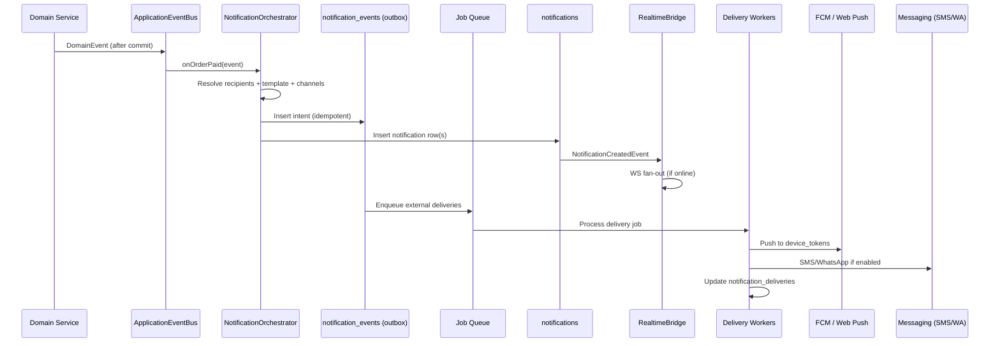

<div align="center">

# Push & in-app notification system — architecture

### Role-aware, multi-channel notifications for buyers, cashiers, and store owners — built on Palmart's existing inbox, WebSocket layer, and messaging module.

*Extends Phase 7 notifications + realtime WebSockets; does not replace them.*

[](./REALTIME_WEBSOCKET_PLAN.md)
[](./PHASE_7_PLAN.md)
[]()

</div>

---

## Table of contents

- [Executive summary](#executive-summary)
- [Current state (repo truth)](#current-state-repo-truth)
- [Product model: audiences & personas](#product-model-audiences--personas)
- [Transactional vs promotional](#transactional-vs-promotional)
- [Event catalog](#event-catalog)
- [Technical architecture](#technical-architecture)
- [Database models](#database-models)
- [Backend module layout](#backend-module-layout)
- [Delivery channels](#delivery-channels)
- [Smart rules (anti-spam)](#smart-rules-anti-spam)
- [Real-time: WebSockets vs polling vs push](#real-time-websockets-vs-polling-vs-push)
- [Frontend UX architecture](#frontend-ux-architecture)
- [Recipient resolution](#recipient-resolution)
- [Observability & analytics](#observability--analytics)
- [Phased implementation roadmap](#phased-implementation-roadmap)
- [Scope → priority matrix](#scope--priority-matrix)
- [Future expansion hooks](#future-expansion-hooks)
- [Key decisions](#key-decisions)
- [Immediate next steps](#immediate-next-steps)

---

## Executive summary

Treat notifications as **three layers**:

| Layer | Purpose | Palmart today |
|-------|---------|---------------|
| **1. Domain events** | “Something happened” (`ORDER_PAID`, `STOCK_LOW`) | Spring `@TransactionalEventListener`, POS WS events |
| **2. Notification intents** | “Who should know, via what channels, with what copy” | Partial (`NotificationService.tryInsertDedupe*`, `CreditSaleReminderService`) |
| **3. Delivery** | In-app row + WS + push + SMS/WhatsApp/email | In-app + WS ✅; external messaging ✅ for credit; push ❌ |

**Principle:** Every user-facing notification should create (or update) a **durable inbox row** first; realtime and push are **projections** of that row, not the source of truth.

---

## Current state (repo truth)

Before building new tables, align with what already ships:

| Capability | Location |
|------------|----------|
| Durable inbox | `notifications` table (`V49__phase7_slice6_notifications_exports.sql`) |
| Idempotent insert | `NotificationService.tryInsertDedupe` / `tryInsertDedupeForUser` |
| WS fan-out | `RealtimeBridge.onNotificationCreated` |
| Quiet hours | `users.settings` JSON + `NotificationPreferencesController` |
| Staff bell UI | `frontend/components/notification-bell.tsx` + `realtime-provider.tsx` |
| Shop buyer realtime | `shop-storefront-realtime.tsx` (credit reminders, price changes) |
| WS client + polling fallback | `frontend/lib/realtime.ts` |
| POS ephemeral events | `stock.depleted`, `price.changed`, `payment.confirmed`, … |
| SMS/WhatsApp credit reminders | `CreditSaleReminderService` + `credit_sale_reminder_dispatches` |
| Buyer identity | `users` with role `buyer` (`frontend/lib/buyer-role.ts`) |

See [REALTIME_WEBSOCKET_PLAN.md](./REALTIME_WEBSOCKET_PLAN.md) for transport, channels, and security.

---

## Product model: audiences & personas

Palmart has **one identity table** (`users`) with roles (`buyer`, owner, cashier, …) plus **customers** (`credits.customers`) for POS/credit. Map audiences explicitly:

```
┌─────────────────────────────────────────────────────────────────┐
│                        RecipientResolver                         │
├──────────────┬──────────────────────────────────────────────────┤
│ BUYER        │ user_id (role=buyer), linked customer_id         │
│ STAFF        │ user_id + permissions + branch_id                 │
│ BUSINESS     │ user_id IS NULL → fan-out by permission/role      │
│ CUSTOMER     │ customer_id (+ optional user_id if registered)    │
└──────────────┴──────────────────────────────────────────────────┘
```

| Persona | Primary ID | Channels (priority) |
|---------|------------|---------------------|
| **Customer / buyer** | `user_id` (shop account) + `customer_id` (orders/credit) | In-app + WS → Web Push → SMS/WhatsApp (opt-in) |
| **Cashier** | `user_id` + `branch_id` | WS ephemeral (POS) + inbox for actionable items |
| **Owner / admin** | `user_id` (permissions) | In-app + WS + digest push; business-wide rows |

---

## Transactional vs promotional

| Class | Examples | Rules |
|-------|----------|-------|
| **Transactional** | Order confirmed, payment received, credit due | Always deliver; ignore promo mute; quiet hours only for non-urgent |
| **Operational** | New web order, low stock, shift variance | Deliver to staff; respect branch + permission |
| **Promotional** | Flash sale, “we miss you”, category discount | Strict caps, opt-in, quiet hours, batching |

Encode on every template/intent: `category`, `class` (`TRANSACTIONAL` \| `OPERATIONAL` \| `PROMOTIONAL`), `priority`, `default_channels[]`.

---

## Event catalog

Use a **stable domain event name** internally; map to **notification type** strings (existing pattern: `storefront.order.placed`, `stock.low`).

### Customer / buyer events

| Domain event | Notification type | Trigger | Dedupe key pattern |
|--------------|-------------------|---------|-------------------|
| `ORDER_CREATED` | `order.received` | Web checkout committed | `order:{id}:received` |
| `ORDER_CONFIRMED` | `order.confirmed` | Staff accepts / auto-confirm | `order:{id}:confirmed` |
| `ORDER_DISPATCHED` | `order.dispatched` | Fulfillment status | `order:{id}:dispatched` |
| `ORDER_DELIVERED` | `order.delivered` | Picked up / delivered | `order:{id}:delivered` |
| `PAYMENT_RECEIVED` | `order.payment_received` | STK/webhook success | `order:{id}:paid` |
| `PRODUCT_DISCOUNTED` | `promo.price_drop` | Price rule / promo engine | `item:{id}:price:{newPrice}` |
| `FLASH_SALE_STARTED` | `promo.flash_sale` | Campaign scheduler | `campaign:{id}:start` |
| `PRODUCT_RESTOCKED` | `catalog.back_in_stock` | Stock crosses threshold | `item:{id}:restock` (per subscriber) |
| `NEW_ARRIVAL` | `catalog.new_arrival` | New item in catalog branch | `item:{id}:new` (batched weekly) |
| `CREDIT_BALANCE_DUE` | `credit.balance_due` | Scheduler (extend `credit_sale.reminder`) | `credit:{accountId}:due:{date}` |
| `CREDIT_PAYMENT_RECEIVED` | `credit.payment_received` | Payment allocation | `payment:{id}` |
| `LOYALTY_POINTS_EARNED` | `loyalty.points_earned` | Loyalty engine | `sale:{id}:loyalty` |
| `ENGAGEMENT_INACTIVE` | `engagement.win_back` | 30d no order (scheduled) | `user:{id}:winback:{week}` |

**Customer notification categories (product scope):**

- **Promotions & discounts** — price drops, flash sales, limited-time offers, category discounts, personalized offers from purchase history
- **Product availability** — new products, restocks, back-in-stock alerts, trending/new arrivals
- **Order updates** — received, confirmed, dispatched, delivered, payment received
- **Credit & payment reminders** — outstanding balance, due dates, partial payment, payment success
- **Engagement** — win-back, weekly deals, store announcements, loyalty points, reward unlocks

### Cashier events

| Domain event | Delivery mode | Notes |
|--------------|---------------|-------|
| `NEW_ONLINE_ORDER` | Inbox + WS `HIGH` | Already `storefront.order.placed` — extend payload |
| `ORDER_PAID_ONLINE` | Inbox | `storefront.order.paid` (partially wired) |
| `STOCK_DEPLETED` | WS only (ephemeral) | Already `stock.depleted` |
| `STOCK_LOW` | WS + optional inbox | `stock.low` on `stock` channel |
| `SHIFT_OPENED` / `CLOSED` | WS `pos` channel | Exists |
| `PAYMENT_CONFIRMED` | WS to cashier | Exists |
| `PENDING_ORDER_ACTION` | Inbox | Orders awaiting pickup prep |
| `TILL_BALANCE_REMINDER` | Inbox / scheduled | Shift close nudges |

**Cashier scope mapping:**

- Online order alerts (new purchase, payment completed, special instructions, urgent orders)
- Inventory alerts (low stock, out of stock, new stock)
- Shift / activity (shift started, till balance, pending orders)

### Store owner / admin events

| Domain event | Notification type | Audience rule |
|--------------|-------------------|---------------|
| `LARGE_SALE` | `sales.large_purchase` | Users with `sales.read` + threshold config |
| `DAILY_SALES_SUMMARY` | `sales.daily_digest` | Owner role; scheduled local evening |
| `REVENUE_MILESTONE` | `sales.milestone` | Business-wide dedupe per milestone |
| `PAYMENT_FAILED` | `payments.failed` | `payments.manage` |
| `LOW_STOCK` | `stock.low` | Exists — add owner fan-out |
| `OVERSTOCK` | `stock.overstock` | New scanner |
| `SUPPLIER_DELIVERY` | `purchasing.delivery` | GRN received |
| `CASHIER_SESSION` | `staff.session` | Login/logout from activity log |
| `REFUND_PROCESSED` | `sales.refund` | Manager+ |
| `SUSPICIOUS_TXN` | `risk.suspicious` | Rule engine |
| `STOCK_ADJUSTMENT` | `stock.manual_adjust` | Approval path exists |
| `ABANDONED_CART` | `insights.abandoned_cart` | Scheduled; owner digest |
| `PEAK_HOURS` | `insights.peak_hours` | Weekly digest |
| `RETURNING_CUSTOMER` | `insights.returning_customer` | Scheduled insight |
| `TOP_PRODUCTS` | `insights.top_products` | Scheduled insight |

---

## Technical architecture

### End-to-end flow



### Orchestrator responsibilities

`NotificationOrchestrator` (new, or evolved from `NotificationService`):

1. Load **template** + **preferences** for recipient.
2. Apply **smart rules** (caps, batching, quiet hours, promo gate).
3. Write **inbox** (`notifications`) — preserves `dedupe_key` contract.
4. Enqueue **async deliveries** for push/SMS/email.
5. Publish existing `NotificationCreatedEvent` for WebSocket.

Domain services must **not** call FCM/SMS directly — only publish domain events or call the orchestrator with a typed command.

### Keep vs add

**Keep:**

- `notifications` + `dedupe_key` + `tryInsertDedupeForUser`
- `RealtimeBridge` + ticket WS + REST polling fallback
- Ephemeral POS frames (`stock.depleted`, `price.changed`, …)
- `CreditSaleReminderService` pattern (in-app + external + dispatch audit)

**Add:**

| Artifact | Role |
|----------|------|
| `notification_templates` | Versioned copy per `type` + locale |
| `notification_preferences` | Per-user/category/channel matrix |
| `device_tokens` | Web Push + FCM |
| `notification_deliveries` | Per-channel status, retry, open/click |
| `notification_events` | Outbox / intent queue |
| `notification_subscriptions` | Back-in-stock, price-drop watches |
| `notification_batches` | Rolling-window batching state |

---

## Database models

### `notifications` (extend existing)

```sql
-- Migration adds columns; keep backward compatibility
ALTER TABLE notifications
  ADD COLUMN recipient_type VARCHAR(16) NOT NULL DEFAULT 'USER',
  ADD COLUMN customer_id CHAR(36) NULL,
  ADD COLUMN category VARCHAR(32) NOT NULL DEFAULT 'operational',
  ADD COLUMN priority VARCHAR(8) NOT NULL DEFAULT 'MEDIUM',
  ADD COLUMN expires_at TIMESTAMP(3) NULL,
  ADD COLUMN archived_at TIMESTAMP(3) NULL;
```

- `user_id` — staff or buyer account
- `customer_id` — credit customer without login
- `user_id IS NULL` — business-wide staff broadcast (current behavior)

Indexes:

- `(business_id, user_id, created_at DESC)`
- `(business_id, customer_id, created_at)`

### `notification_templates`

```sql
CREATE TABLE notification_templates (
  id              CHAR(36) PRIMARY KEY,
  business_id     CHAR(36) NULL,
  type            VARCHAR(64) NOT NULL,
  locale          VARCHAR(8) NOT NULL DEFAULT 'en',
  version         INT NOT NULL DEFAULT 1,
  title_template  VARCHAR(255) NOT NULL,
  body_template   TEXT NOT NULL,
  action_url_template VARCHAR(512) NULL,
  class           VARCHAR(16) NOT NULL,
  category        VARCHAR(32) NOT NULL,
  default_channels JSON NOT NULL,
  active          BOOLEAN NOT NULL DEFAULT TRUE,
  UNIQUE KEY uq_template (business_id, type, locale, version)
);
```

`class`: `TRANSACTIONAL` | `OPERATIONAL` | `PROMOTIONAL`  
`default_channels`: e.g. `["IN_APP","WEB_PUSH"]`

### `notification_preferences`

```sql
CREATE TABLE notification_preferences (
  id            CHAR(36) PRIMARY KEY,
  business_id   CHAR(36) NOT NULL,
  user_id       CHAR(36) NOT NULL,
  category      VARCHAR(32) NOT NULL,
  channel       VARCHAR(16) NOT NULL,
  enabled       BOOLEAN NOT NULL DEFAULT TRUE,
  UNIQUE KEY uq_pref (business_id, user_id, category, channel)
);

CREATE TABLE notification_quiet_hours (
  user_id       CHAR(36) PRIMARY KEY,
  business_id   CHAR(36) NOT NULL,
  enabled       BOOLEAN NOT NULL,
  timezone      VARCHAR(64) NOT NULL DEFAULT 'Africa/Nairobi',
  start_local   TIME NOT NULL,
  end_local     TIME NOT NULL,
  allow_high_priority BOOLEAN NOT NULL DEFAULT TRUE
);

CREATE TABLE notification_rate_limits (
  user_id       CHAR(36) NOT NULL,
  business_id   CHAR(36) NOT NULL,
  category      VARCHAR(32) NOT NULL,
  window_start  TIMESTAMP(3) NOT NULL,
  count         INT NOT NULL,
  PRIMARY KEY (user_id, category, window_start)
);
```

Migrate from `users.settings` JSON (quiet hours, `mutedTypes`) via backfill.

### `device_tokens`

```sql
CREATE TABLE device_tokens (
  id              CHAR(36) PRIMARY KEY,
  business_id     CHAR(36) NOT NULL,
  user_id         CHAR(36) NOT NULL,
  platform        VARCHAR(16) NOT NULL,
  token           VARCHAR(512) NOT NULL,
  endpoint        VARCHAR(1024) NULL,
  p256dh          VARCHAR(255) NULL,
  auth            VARCHAR(255) NULL,
  user_agent      VARCHAR(512) NULL,
  last_seen_at    TIMESTAMP(3) NOT NULL,
  revoked_at      TIMESTAMP(3) NULL,
  UNIQUE KEY uq_token (platform, token(191))
);
```

`platform`: `WEB` | `ANDROID` | `IOS`

API:

- `POST /api/v1/me/device-tokens`
- `DELETE /api/v1/me/device-tokens/{id}`

### `notification_deliveries`

```sql
CREATE TABLE notification_deliveries (
  id                  CHAR(36) PRIMARY KEY,
  notification_id     CHAR(36) NOT NULL,
  channel             VARCHAR(16) NOT NULL,
  status              VARCHAR(16) NOT NULL,
  provider            VARCHAR(32) NULL,
  provider_message_id VARCHAR(128) NULL,
  attempt_count       INT NOT NULL DEFAULT 0,
  next_retry_at       TIMESTAMP(3) NULL,
  last_error          VARCHAR(500) NULL,
  sent_at             TIMESTAMP(3) NULL,
  opened_at           TIMESTAMP(3) NULL,
  clicked_at          TIMESTAMP(3) NULL,
  created_at          TIMESTAMP(3) NOT NULL,
  INDEX idx_delivery_retry (status, next_retry_at),
  INDEX idx_delivery_notification (notification_id)
);
```

`status`: `PENDING` | `SENT` | `FAILED` | `SKIPPED`

### `notification_events` (outbox)

```sql
CREATE TABLE notification_events (
  id              CHAR(36) PRIMARY KEY,
  business_id     CHAR(36) NOT NULL,
  event_type      VARCHAR(64) NOT NULL,
  aggregate_type  VARCHAR(32) NOT NULL,
  aggregate_id    CHAR(36) NOT NULL,
  payload_json    JSON NOT NULL,
  dedupe_key      VARCHAR(191) NOT NULL,
  status          VARCHAR(16) NOT NULL DEFAULT 'PENDING',
  processed_at    TIMESTAMP(3) NULL,
  created_at      TIMESTAMP(3) NOT NULL,
  UNIQUE KEY uq_event (business_id, dedupe_key)
);
```

Worker: `PENDING` → orchestrator → `PROCESSED`. Same lifecycle pattern as `export_jobs` and `credit_sale_reminder_dispatches`.

### `notification_subscriptions`

```sql
CREATE TABLE notification_subscriptions (
  id            CHAR(36) PRIMARY KEY,
  business_id   CHAR(36) NOT NULL,
  user_id       CHAR(36) NULL,
  customer_id   CHAR(36) NULL,
  item_id       CHAR(36) NULL,
  category_id   CHAR(36) NULL,
  kind          VARCHAR(32) NOT NULL,
  active        BOOLEAN NOT NULL DEFAULT TRUE,
  created_at    TIMESTAMP(3) NOT NULL
);
```

`kind`: `BACK_IN_STOCK` | `PRICE_DROP` | `NEW_IN_CATEGORY`

### `notification_batches`

```sql
CREATE TABLE notification_batches (
  id            CHAR(36) PRIMARY KEY,
  business_id   CHAR(36) NOT NULL,
  batch_key     VARCHAR(191) NOT NULL,
  window_end    TIMESTAMP(3) NOT NULL,
  payload_json  JSON NOT NULL,
  flushed_at    TIMESTAMP(3) NULL,
  UNIQUE KEY uq_batch (business_id, batch_key, window_end)
);
```

---

## Backend module layout

```
zelisline.ub.notifications/
  domain/
    Notification.java                    # existing
    NotificationTemplate.java
    NotificationDelivery.java
    DeviceToken.java
  application/
    NotificationOrchestrator.java        # emit(NotificationCommand)
    RecipientResolver.java
    TemplateRenderer.java
    NotificationPolicyEngine.java
    NotificationPreferenceService.java
    DeviceTokenService.java
    ScheduledNotificationService.java
  infrastructure/
    NotificationEventProcessor.java
    WebPushDeliveryAdapter.java
    FcmDeliveryAdapter.java
    DeliveryRetryScheduler.java
  api/
    NotificationsController.java         # existing
    NotificationPreferencesController.java
    DeviceTokensController.java
    ShopperNotificationsController.java  # /api/v1/me/shopper/notifications
```

### Wiring example

```java
// Domain service after commit
eventPublisher.publishEvent(new OrderPlacedEvent(...));

@TransactionalEventListener(phase = TransactionPhase.AFTER_COMMIT)
void onOrderPlaced(OrderPlacedEvent e) {
  orchestrator.emit(NotificationCommands.orderPlaced(e));
}
```

Consolidate scattered `tryInsertDedupe` calls into the orchestrator over time.

---

## Delivery channels

### In-app + WebSocket (implemented)

| Piece | Role |
|-------|------|
| `notifications` row | Source of truth, history, unread |
| `NotificationCreatedEvent` | Triggers `RealtimeBridge` |
| `notification.created` frame | Live UI (bell, toasts) |
| REST `GET /api/v1/notifications` | Polling fallback + catch-up |

**Extensions:**

- `GET /api/v1/me/shopper/notifications` for buyers
- `GET .../notifications/unread-count` for badge without full list
- Dedicated WS channel `shopper:notifications` (buyers must not subscribe to `pos`)

### Browser push (Web Push)

1. Service worker: `push`, `notificationclick`
2. VAPID keys in server config; subscription → `device_tokens`
3. On inbox insert + preference enabled → `notification_deliveries` job
4. Payload: `{ notificationId, title, body, url }` — detail on click via API

### Android / iOS (FCM)

- One FCM project; iOS via APNs through FCM
- Same `device_tokens` table (`ANDROID` / `IOS`)
- Deep links: `palmart://shop/orders/{id}`
- Avoid topic broadcasts for promos; prefer per-user tokens

### SMS / WhatsApp / email (optional future)

Reuse `zelisline.ub.messaging`:

- `SmsMessagingClient`, `MetaWhatsAppMessagingClient`
- Generalize `credit_sale_reminder_dispatches` → `notification_deliveries`
- Business `TenantMessagingConfig` per tenant
- Email: new adapter (Resend/SES) in a later phase

### Channel matrix

| Channel | Buyers | Cashiers | Owners |
|---------|--------|----------|--------|
| In-app inbox | ✅ | ✅ | ✅ |
| WebSocket | ✅ (shop) | ✅ (POS) | ✅ |
| Web Push | Phase C | Phase C | Phase C |
| FCM native | Phase E | — | Phase E |
| SMS/WhatsApp | Opt-in transactional | — | Rare alerts |
| Email | Phase E | — | Digests |

---

## Smart rules (anti-spam)

Implement in `NotificationPolicyEngine` before inbox insert (promo) or before external send (all):

| Rule | Behavior |
|------|----------|
| **Dedupe** | `UNIQUE (business_id, dedupe_key)` — keep |
| **Frequency cap** | Max N promotional / user / 24h (tenant-configurable) |
| **Batching** | e.g. `stock.low` → one “5 items low” per 15 min / branch |
| **Priority bypass** | `TRANSACTIONAL` + `HIGH` skips promo cap; may skip quiet hours if configured |
| **Coalescing** | Multiple price drops → single category digest |
| **Subscription gate** | Back-in-stock only with `notification_subscriptions` |
| **Staff fan-out** | Permission-filtered users, not all WS sessions |

UX goal: **fast, clean, useful, non-intrusive, intelligent** — not broadcast spam.

---

## Real-time: WebSockets vs polling vs push

| Mechanism | When to use |
|-----------|-------------|
| **WebSocket** | App open — staff POS, shop tab, dashboard |
| **REST polling** | WS down; background tab (low frequency) |
| **Web Push / FCM** | App background or closed |
| **SMS/WhatsApp** | Credit/urgent; user has no smartphone habit |

**Cashiers:** WS + ephemeral POS events during shift; do not rely on polling alone.

**Scale-out:** Redis pub/sub between API instances when `SessionRegistry` is per-node (see REALTIME_WEBSOCKET_PLAN).

**Rate limits:**

- WS: existing frame rate limits (~20 fps)
- Orchestrator: per-user create cap (e.g. 100/min)
- External providers: respect FCM/SMS provider quotas with backoff in `notification_deliveries`

**Offline delivery:**

1. Inbox row always written
2. On reconnect: WS catch-up (last N from DB) + REST `?since=`
3. Push for missed HIGH transactional while offline
4. Multi-device: same `user_id`; `notification.read` syncs across tabs (existing)

---

## Frontend UX architecture

### Surfaces

| Surface | Components |
|---------|------------|
| Staff dashboard | `notification-bell.tsx`, `realtime-provider.tsx` |
| Cashier / POS | Toasts for `payment.confirmed`, `stock.depleted`; optional sound for new web orders |
| Shop / buyer | New `ShopNotificationCenter` + push prompt after first order |
| Owner PWA | Web Push for digests |

### UX principles

1. **One primary action** per notification (`actionUrl`)
2. **Priority visuals:** HIGH → toast (+ optional sound on POS); MEDIUM → bell; LOW → inbox only
3. **Grouping:** collapse same `category` within 24h in dropdown
4. **Permission timing:** Web Push after first successful order, not landing page
5. **Settings:** `/shop/account/notifications`, `/business/settings/notifications`

### Presentation layer

- Extend `frontend/lib/notification-display.ts` (`TYPE_LABELS`, payload formatters)
- Avoid duplicating title/body logic only in `RealtimeBridge.buildNotificationPayload`
- Normalize WS + REST payloads through `normalizeNotificationData`

### Unread badge

- Source: `unreadCount` from realtime provider
- Optional: `GET /notifications/unread-count` on visibility change

---

## Recipient resolution

### Examples

**ORDER_PAID (web):**

- Buyer: `user_id` from order email link → IN_APP + WEB_PUSH
- Cashiers: branch + `storefront.orders.read` → IN_APP + WS HIGH
- Owner: if total > threshold → IN_APP

**LOW_STOCK:**

- Stock clerks: branch + stock permission → WS `stock` channel
- Managers: batched inbox `stock.low`
- Buyers: never

**PROMO_FLASH_SALE:**

- Buyers with promo opt-in and under rate cap
- Never business-wide WS broadcast

### Resolver inputs

- `UserRepository` + role permissions
- `ShopperAccountService` (buyer ↔ customer)
- `CustomerRepository` (phone for SMS/WhatsApp)

---

## Observability & analytics

Track on `notification_deliveries`:

- sent / failed / retry count
- opened / clicked (push click, in-app navigate)

Structured logs: `notification_id`, `event_type`, `business_id`, `channel`.

Future dashboards: delivery rate by channel, time-to-open for `storefront.order.placed`, promo opt-out rate.

---

## Phased implementation roadmap

### Phase A — Foundation (≈2–3 weeks)

- [x] `NotificationOrchestrator` + `notification_templates` (`V98`, seeded platform templates)
- [x] Migrate preferences JSON → `notification_preferences` + quiet hours table (`NotificationPreferenceService`, `V101`)
- [x] Order lifecycle hooks → buyer `order.received` / `order.payment_received` / `order.confirmed|dispatched|delivered` + staff `storefront.order.*`
- [x] `GET /api/v1/me/shopper/notifications` + shop account UI (`ShopNotificationsPanel`)
- [x] Expand `notification-display.ts` and `RealtimeBridge` type map

### Phase B — Operational excellence (≈2 weeks)

- [x] `notification_events` outbox + worker (`V99`, `NotificationEventScheduler`)
- [x] `notification_deliveries` + retry scheduler (`NotificationDeliveryScheduler`)
- [x] Batching for `stock.low` (`notification_batches` + `StockLowBatchFlushScheduler`)
- [x] Daily sales digest job (`DailySalesDigestScheduler`, `sales.daily_digest`)
- [x] Cashier toast/sound for new web orders (`CashierOrderAlerts`)

### Phase C — Web Push (≈2 weeks)

- [x] Service worker + VAPID + `device_tokens` (`V100`, `WebPushSender`, `DeviceTokensController`)
- [x] Push for transactional buyer events + staff HIGH events (`StaffWebPushFanoutService`)
- [x] SMS/WhatsApp via `NotificationDeliveryTxnService` (user-targeted; credit reminders stay on `CreditSaleReminderService`)

### Phase D — Growth & promo (≈3+ weeks)

- [x] `notification_subscriptions` (back-in-stock, price drop) — `V101`, `CatalogNotificationListener`, product + account UI
- [x] Promo policy + rate limits — `NotificationPolicyEngine`, quiet hours via `notification_quiet_hours`
- [x] Insight digests (abandoned cart, peak hours, top products) — `InsightsDigestService` + schedulers
- [x] Win-back campaign — weekly scheduler for inactive shoppers (30d default)
- [x] Weekly deals / flash-sale promo engine (`notification_campaigns`, `V104`, promotions UI)

### Phase E — Mobile & campaigns (mostly complete)

- [x] FCM device registration (`POST /api/v1/me/device-tokens/fcm`, `FcmSender` legacy HTTP API)
- [x] Email channel (`NotificationDeliveryTxnService`, `StaffEmailFanoutService`, digest templates `V102`)
- [ ] FCM HTTP v1 / service-account (replace legacy server key when native apps ship)
- [x] Promo campaigns API + owner UI (`notifications.promotions.manage`)
- [x] Campaign scheduling (`scheduledAt`, `PromoCampaignScheduler`, promotions UI datetime)
- [x] Audience segments (`V105`): inactive 30d, branch-active 90d, branch picker
- [ ] Geo-targeting, AI copy, marketing journeys (E+)

---

## Scope → priority matrix

| Requirement | Phase | Notes |
|-------------|-------|-------|
| Order updates (customer) | A | Checkout + fulfillment status |
| New online order (cashier) | A | Extend `storefront.order.placed` |
| Low stock (cashier/owner) | A/B | WS exists; batch for owners |
| Credit reminders | ✅ | Generalize to `notification_deliveries` |
| Promotions / flash sales | D | Promo engine + caps |
| Back-in-stock | D | Subscriptions table |
| Loyalty / rewards | D | Loyalty module dependency |
| Browser push | C | |
| Android / iOS | E | |
| SMS/WhatsApp | B/D | Orchestrator → messaging module |
| Quiet hours / categories | A | Formalize prefs |
| AI / geo / journeys | E+ | Event catalog ready now |

---

## Future expansion hooks

Design templates and `notification_events` now to support later:

- **Segmentation:** `recipient_query` JSON on campaigns (“>3 orders in 90d”)
- **Geo:** `branch_id` + geofence on promo events
- **AI copy:** generated title/body stored as new template `version`
- **Marketing journeys:** `scheduled_at` + chained `notification_events`
- **Predictive restock:** `STOCK_PREDICTED_LOW` same pipeline as `STOCK_LOW`
- **Automated campaigns:** cron → outbox → orchestrator
- **Loyalty automation:** `LOYALTY_*` events from points engine

---

## Key decisions

1. **Inbox row always** for anything openable later; WS/push are projections.
2. **Buyers use `user_id`** on `notifications`; set `customer_id` when needed for credit.
3. **Do not** put promo content only in ephemeral WS frames.
4. **Transactional** notifications bypass promotional mutes.
5. **Central orchestrator** — reduce ad-hoc `tryInsertDedupe` across services.
6. **Separate shopper WS channel** from POS (security + noise).
7. **FCM for mobile**; **Web Push for PWA**.

---

## Immediate next steps (Phase E+)

1. ~~Order confirmed/dispatched when fulfillment statuses exist.~~ (`V103`, `WebOrderFulfillmentService`, staff UI)
2. ~~Weekly deals / flash-sale campaigns~~ — engine + scheduling + core segments (`V104`–`V105`).
3. Wire native Android/iOS apps to `POST /api/v1/me/device-tokens/fcm` with `FCM_SERVER_KEY` set.
4. Marketing journeys (chained events) and `recipient_query` JSON segmentation.
5. FCM HTTP v1 when mobile apps ship.

**Enable Web Push:** generate VAPID keys (`npx web-push generate-vapid-keys`), set `VAPID_PUBLIC_KEY` / `VAPID_PRIVATE_KEY` in the environment, and `app.notifications.web-push.enabled=true`.

**Enable Phase B workers in production** (`application.properties` or env):

```properties
app.notifications.worker.enabled=true
app.notifications.stock-low.flusher.enabled=true
app.notifications.daily-digest.enabled=true
app.notifications.delivery.worker.enabled=true
app.notifications.insights.enabled=true
```

Insight / win-back schedulers use `app.notifications.insights.zone` (default `Africa/Nairobi`). Abandoned carts use `app.notifications.abandoned-cart.stale-hours` (default 24). Win-back uses `app.notifications.win-back.inactive-days` (default 30).

**FCM (native):** set `FCM_SERVER_KEY` and `app.notifications.fcm.enabled=true`. Mobile apps register via `POST /api/v1/me/device-tokens/fcm` with `platform` `ANDROID` or `IOS`.

**Email:** uses existing Resend/Mailgun/SMTP stack (`identity.NotificationService`). Owner insight digests fan out to staff with `storefront.orders.read` and a verified email on file.

Set `app.notifications.outbox.enabled=false` only in tests that expect synchronous inbox writes.

---

## Related documents

- [REALTIME_WEBSOCKET_PLAN.md](./REALTIME_WEBSOCKET_PLAN.md) — transport, channels, catch-up, Redis fan-out
- [PHASE_7_PLAN.md](./PHASE_7_PLAN.md) — original notifications inbox slice
- `backend/src/main/java/zelisline/ub/notifications/` — current implementation
- `frontend/lib/realtime.ts` — client WS + polling fallback
