# 🖥️ Phase 10 — Local / On-Prem Deployment

### Ship **one JAR + one Postgres** on the shop PC: **installers**, **LAN HTTPS**, **offline-first profiles**, optional **cloud sync**, **licensing**, **backups**, and **updates** — **single-tenant** by design (`implement.md` §15).

*Phase 9 polishes the **PWA** for branches and flaky uplinks; Phase 10 **packages** the same codebase as **`local`** / **`hybrid`** so a kiosk runs **with zero internet** and optionally **mirrors** to the cloud.*

> **⚠️ Analysis (2025-05-13): Phase 10 is ~5% implemented — effectively deferred as planned. See [Implementation Status](#-implementation-status) below.**

---

> **`README.md`** defers this milestone to **v1.5** so **cloud pilot** can land first. This document is the **delivery blueprint** when the team pulls Phase 10 forward.

---

## 📑 Table of Contents

- [Why this document exists](#-why-this-document-exists)
- [What "Phase 10" means in one paragraph](#-what-phase-10-means-in-one-paragraph)
- [Prerequisites — Phase 9 must close first](#-prerequisites--phase-9-must-close-first)
- [In scope / out of scope](#-in-scope--out-of-scope)
- [The slice plan at a glance](#-the-slice-plan-at-a-glance)
- [Slice 1 — Bundled PostgreSQL + `local` profile stack](#-slice-1--bundled-postgresql--local-profile-stack)
- [Slice 2 — Installers (`jpackage`) + data directory bootstrap](#-slice-2--installers-jpackage--data-directory-bootstrap)
- [Slice 3 — LAN discovery, HTTPS, firewall](#-slice-3--lan-discovery-https-firewall)
- [Slice 4 — Licensing & activation](#-slice-4--licensing--activation)
- [Slice 5 — Hybrid sync (`sync` module + cloud `/v1/sync`)](#-slice-5--hybrid-sync-sync-module--cloud-v1sync)
- [Slice 6 — Backup, updates, observability, tray](#-slice-6--backup-updates-observability-tray)
- [Cross-cutting work](#-cross-cutting-work)
- [Handoff boundaries (Phase 10 → 11)](#-handoff-boundaries-phase-10--11)
- [Folder structure](#-folder-structure)
- [Test strategy](#-test-strategy)
- [Definition of Done](#-definition-of-done)
- [Risks, traps, and known unknowns](#-risks-traps-and-known-unknowns)
- [Open questions for the team](#-open-questions-for-the-team)

---

## 🎯 Why this document exists

`README.md` lists Phase 10 as: **bundled Postgres**, **`jpackage` installers**, **mDNS**, **licensing**, **USB-update path**, **nightly local backups** — and marks it **❄️ Deferred to v1.5**.

`implement.md` **§15** is the authoritative design: **three deployment modes** (`cloud` | `local` | `hybrid`), **single JAR**, **bundled PostgreSQL 16**, **profile-swapped adapters**, **outbox → cloud** replication, **conflict rules**, **installer wizard**, **updates** (online + USB), **backups**, **licensing**, **security**, **observability**, and explicit **out-of-scope** items (multi-tenant on one PC, inbound webhooks to the box).

This document turns §15 into **six slices** for engineering execution when the deferral lifts.

---

## 📊 Implementation Status — ~5% (Deferred to v1.5)

Phase 10 is correctly **deferred**. The codebase contains only incidental traces — no
slice has been intentionally implemented. Here's what exists and what doesn't:

### ✅ Pre-existing Infrastructure (from Phase 8, NOT Phase 10)

| Artifact | Origin | Notes |
|----------|--------|-------|
| `ExternalProcessDatabaseDumper` | Phase 8 Slice 4 | Dumps MySQL/Postgres via `mysqldump`/`pg_dump` |
| `BackupEncryptionService` | Phase 8 Slice 4 | AES-GCM encrypt/decrypt with passphrase |
| `LocalBackupArtifactStorage` | Phase 8 Slice 4 | Writes encrypted backup to local directory |
| `S3BackupArtifactStorage` | Phase 8 Slice 4 | Uploads encrypted backup to S3/MinIO |
| `DatabaseBackupOrchestrator` | Phase 8 Slice 4 | Orchestrates dump→encrypt→store pipeline |
| `BackupProperties` | Phase 8 Slice 4 | `app.integrations.backup.*` configuration |

These are **cloud backup** primitives that Phase 10 Slice 6 would **extend** (zstd
compression, AES-256 upgrade, restore flow, retention policy, NAS/USB targets).
They are NOT the Phase 10 local backup system.

### ⚠️ Phase 10 Stubs (present but incomplete)

| Artifact | What Exists | What's Missing |
|----------|------------|----------------|
| `/api/v1/sync/**` security rule | `SecurityConfig` protects this path with `SYNC_WORKER` role | No sync controller, no sync service, no `business_sync_cursor` table, no outbox relay |
| `InMemoryTicketStore` | Falls back when Redis unavailable (local/hybrid awareness) | No local Spring profile wiring, no Caffeine cache config, no filesystem storage adapter |
| `SessionRegistry` | Comments mention local/hybrid profiles | No profile-specific bean configuration |

### ❌ Not Implemented (6/6 Slices)

| Slice | Status | Missing Pieces |
|-------|--------|----------------|
| 1 — Bundled PG + `local` profile | ❌ 0% | Child process Postgres supervisor, `$DATA_DIR`, profile-swapped beans (Caffeine, filesystem, in-JVM bus, ManualGateway), `spring.profiles.active=local` wiring |
| 2 — Installers (`jpackage`) | ❌ 0% | `jpackage` config, `.msi`/`.pkg`/`.deb` build, installer wizard (8 steps), Windows service/macOS LaunchDaemon/systemd unit |
| 3 — LAN + TLS | ❌ 0% | JmDNS `_https._tcp`, self-signed root CA generation, `kiosk.local`, firewall rules, trust docs for iOS/Android |
| 4 — Licensing | ❌ 0% | Embedded vendor public key, activation JWT, hardware fingerprint, grace period, read-only overrun, rescue key flow |
| 5 — Hybrid sync | ❌ 0% | Sync worker, outbox cursor (`business_sync_cursor`), cloud `POST /v1/sync` batch ingest, back-pressure banner, compaction policy |
| 6 — Backup/updates/tray | ❌ 0% | Nightly zstd+AES-256 backup, restore flow, signed manifest updates, `.kioskpack` USB path, tray app, rolling logs, Micrometer fallback |

### 📋 Recommendation

**Do not start Phase 10 yet.** It depends on Phase 9 completing, which is at ~75%.
The stubs that exist (sync endpoint security, memory ticket store) are harmless
forward-compatibility hooks — they don't need to be removed.

When Phase 9 closes and Phase 10 is pulled forward:
1. Start with **Slice 1** (bundled PG + local profile) — it's the foundation
2. Slice 4 (licensing) can run in parallel with Slice 1
3. Slice 5 (hybrid sync) needs Slice 1's local profile
4. The Phase 8 backup primitives will accelerate Slice 6

### 🗑️ What's Unnecessary / Misleading

| Item | Issue | Action |
|------|-------|--------|
| `sync/` package (12 files) | Contains ONLY Phase 9 `SyncConflict` files — NO Phase 10 sync worker code. The package name `sync` suggests Phase 10, but it's Phase 9 conflict resolution. | Rename or leave as-is — Phase 10 will add `SyncWorker`, `SyncCursor`, `SyncRelay` to the same package. |
| `/api/v1/sync/**` security rule | Protects a non-existent endpoint. The `SYNC_WORKER` role has no corresponding user/principal. | Leave as forward-compat hook. When Phase 10 Slice 5 builds the sync controller, this rule is already in place. |
| `InMemoryTicketStore` | Comment says "for local/hybrid profiles" but no such profiles exist. | Leave — correctly designed fallback. Will be wired when `spring.profiles.active=local` is configured. |
| Phase 8 backup primitives | `ExternalProcessDatabaseDumper`, `BackupEncryptionService`, etc. are Phase 8 deliverables, NOT Phase 10. The naming and structure may confuse auditors. | Documented above. Phase 10 Slice 6 will extend (not replace) them with zstd, AES-256, and restore flow. |

---

---

## 🧭 What "Phase 10" means in one paragraph

After Phase 10 closes, an operator can install **Kiosk POS** on a **Windows / macOS / Linux** back-office PC, choose **`local`** (no cloud) or **`hybrid`** (LAN primary + **async** cloud mirror), complete a **wizard** (data dir, activation key, first owner, printer test, backup target), and reach **`https://kiosk.local:8443`** (or LAN IP) with a **generated** TLS trust chain. The service **supervises** a **child PostgreSQL** cluster under `$DATA_DIR/pgdata` (**LAN never sees** port 5432). **`spring.profiles.active=local`** swaps **Caffeine**, **filesystem storage**, **in-JVM** bus, and **ManualGateway** defaults per §15.4. **`hybrid`** runs a **sync worker** posting **outbox** events to **`/v1/sync`** with **idempotent** acceptance and **`business_sync_cursor`**. **Nightly** **encrypted** **`pg_dump`** runs **always**; **upload** to vendor/cloud is **queued** when online. **Signed** **online** or **USB** **`.kioskpack`** updates apply **Flyway** and support **rollback**. **Licensing** works **offline** with **grace** and **read-only** overrun (`implement.md` §14.13, §15.8).

---

## ✅ Prerequisites — Phase 9 must close first

| Phase 9 handoff | Why Phase 10 needs it |
|---|---|
| **PWA** same-origin assumptions | Static assets **served from JAR** — routing matches Phase 9 **build** output |
| **Offline** queue + **conflict** UX | **Hybrid** **replay** and **admin** resolution reuse the same **mental model** |
| **Bluetooth / USB** print paths | Installer **printer detection** plugs into **known** drivers |
| **`multi_branch` on local** | **Single PC** still supports **many branches**; **not** multi-tenant §15.16 |

---

## 📦 In scope / out of scope

### In scope

- **`local`** and **`hybrid`** **Spring profiles** with §15.3 adapter matrix (**no** Redis/Kafka/MinIO **required** on LAN).
- **Bundled** `postgresql-16-portable` (or equivalent) **managed** by Kiosk service: **initdb**, **start/stop**, **upgrade** coordination.
- **`platform-desktop`** (or named module): **`jpackage`** **`.msi` / `.pkg` / `.deb`** + CI **matrix**.
- **Installer wizard** §15.14 (minimum viable steps 1–8; **QR cashier onboarding** stretch).
- **mDNS** **`kiosk.local`**, **self-signed** root CA export, **firewall** punch.
- **Activation JWT** **public key** embedded; **hardware** fingerprint **optional** register on first online ping §15.8.
- **`sync` module**: **cursor**, **worker**, **cloud** **`POST /v1/sync`** **idempotency** `(business_id, event_id)`.
- **Backup**: §15.9 **zstd + AES-256**, retention policy, **restore** **integration test** per release §15.9.
- **Updates**: §15.10 **signed manifest**, **USB pack**, **rollback** **JAR** + **pg** basebackup retention.
- **Watchdog**: backup **staleness** banner; disk full **banner** §14.13.
- **Observability**: §15.13 rolling logs; **Micrometer** fallback; **tray** **uptime / backup / sync / outbox** (platform-appropriate).

### Out of scope (explicit from §15.16 + roadmap)

| Topic | Notes |
|---|---|
| **Multi-tenant** on **one** local PC | **Single-tenant** only (`implement.md` §15.16) |
| **Inbound** **Pesapal/Stripe** **callbacks** to LAN | **Disabled** / **cashier-initiated** only §15.16 |
| **Automatic horizontal scaling** of local PC | **Migrate** to **hybrid/cloud** instead §15.16 |
| **GA load / pen test / ASVS** | **Phase 11** |
| **Turso → Postgres migration tool** | **Separate** programme (`implement.md` deliverables recap \#3) |

**Stretch (ADR):** **WAL** **`pg_receivewal`** to cloud §15.9 — **not** required for **MVP** hybrid.

---

## 🗺️ The slice plan at a glance

```mermaid
gantt
    title Phase 10 — six slices (multi-week; v1.5)
    dateFormat  X
    axisFormat  Week %s

    section Core
    Slice 1 Bundled PG + local profile   :h1, 0, 2w
    Slice 2 jpackage + wizard            :h2, after h1, 2w
    section Edge
    Slice 3 mDNS + TLS + firewall        :h3, after h2, 1w
    Slice 4 Licensing                    :h4, after h1, 1w
    section Hybrid
    Slice 5 Sync worker + cloud API      :h5, after h4, 2w
    section Ops
    Slice 6 Backup + updates + tray      :h6, after h3, 2w
```

| # | Slice | Primary deliverables | Exit demo |
|---|---|---|---|
| 1 | Bundled PG + `local` | Child process Postgres; `$DATA_DIR`; profile beans | `./gradlew bootRun -Dspring.profiles.active=local` §15.15 |
| 2 | Installers | `jpackage` artifacts; wizard **MVP** | Fresh VM: install → login **&lt;10 min** §15 exit |
| 3 | LAN + TLS | JmDNS; cert bundle doc; `ufw`/Windows rule | Tablet opens **`https://kiosk.local`** after trust |
| 4 | Licensing | Key verify; grace; read-only overrun | Expired key → **sales block**, refunds allowed §14.13 |
| 5 | Hybrid sync | Outbox relay; cursor; conflict flags | Airplane sale → online → **cloud** has row |
| 6 | Backup / updates / tray | Nightly dump; signed update; tray status | Restore **IT** green; USB update **dry-run** |

---

## 🏛️ Slice 1 — Bundled PostgreSQL + `local` profile stack

**Goal.** **`implement.md` §15.3** — **bundled Postgres**, **not** SQLite; **fsync=on**; **Flyway** on startup.

### Deliverables

- **Service** API: `startPostgres()`, health check, **shutdown hook**.
- **Postgres** binds **`127.0.0.1`** only §15.12.
- **RLS**: same schema as cloud; **single** `business_id` **or** simplified session for **local tenant** — ADR **without** weakening **security** on stolen disk.
- **Dev ergonomics**: `./build/local-pgdata/` **bootstrap** §15.15.

### Tests

- **Testcontainers** **+** **local profile** **matrix** job §15.15.
- **Power kill** simulation **optional** chaos **post-MVP**.

---

## 🏛️ Slice 2 — Installers (`jpackage`) + data directory bootstrap

**Goal.** **`jpackage`** **signed** installers; **`$DATA_DIR`** **permissions** `0700` §15.12.

### Deliverables

- **Wizard** steps §15.14: **licence**, **mode** `local|hybrid`, **data dir**, **owner bootstrap**, **printer test**, **backup path**, **port**, **start**.
- **Windows** service / **macOS** **LaunchDaemon** / **`systemd`** unit — **one** pattern **documented** per OS.

### Tests

- CI **builds** **unsigned** **smoke**; **release** **signs** **notarized** **macOS** ADR.

---

## 🏛️ Slice 3 — LAN discovery, HTTPS, firewall

**Goal.** **`kiosk.local`** §15.7; **self-signed** trust doc for **iOS/Android/desktop**.

### Deliverables

- **JmDNS** **`_https._tcp`** advertisement.
- **TLS**: installer-generated **root** + **leaf**; **optional** DNS-01 **Let’s Encrypt** **LAN** ADR.
- **Firewall**: default **8443** open **private** profiles only.

### Tests

- **Manual** QA matrix **browsers**; **automated** **curl** `-k` **smoke** only.

---

## 🏛️ Slice 4 — Licensing & activation

**Goal.** **§15.8** + **§14.13** **grace-over** read-only.

### Deliverables

- **Embedded** **vendor** **public key**; **activation** file **import**.
- **Rescue** **key** flow (support-issued JWT).
- **Opportunistic** **refresh** **`offline_grace_days`** **non-blocking**.

### Tests

- Clock **skew** + **hard_expiry** fixtures §14.13.

---

## 🏛️ Slice 5 — Hybrid sync (`sync` module + cloud `/v1/sync`)

**Goal.** **`implement.md` §15.5–15.6** — **monotonic** **events**, **cursor**, **idempotent** **cloud** apply.

### Deliverables

- **Tables**: `business_sync_cursor`; reuse **`domain_events`** outbox.
- **Cloud**: **`POST /v1/sync`** batch ingest **auth** (machine **or** **tenant** JWT **ADR**).
- **Conflict** **queue** integration with Phase 9 **`sync_conflict`** / **rules** §15.6.
- **Back-pressure** banner §15.5 **7-day** **down** warning; **compaction** **policy** **non-finance** events.

### Tests

- **Replay** **idempotency** **10×** same batch.
- **cloud-owned** rows **win** §15.6 (users, licensing, optional global catalog).

---

## 🏛️ Slice 6 — Backup, updates, observability, tray

**Goal.** **`README.md`** **nightly local backups** + §15.9–15.13.

### Deliverables

- **Backup** job: **zstd**, **AES-256**, **passphrase** **not** stored §15.12; **NAS/USB/SMB** targets.
- **Restore** admin flow: **stop writes** → **pg_restore** → **resume** §15.9.
- **Updates**: **fetch** signed manifest §15.10; **`.kioskpack`** USB path; **previous JAR** retained.
- **Logs** `$DATA_DIR/logs/`; **metrics** **Postgres**-backed **fallback** §15.13.
- **Tray** (where applicable): **uptime**, **DB size**, **last backup**, **last sync**, **outbox depth**, **printer** §15.13.

### Tests

- **Restore** **IT** on **every** **release** §15.9.
- **Update** **rollback** **fixture**.

---

## 🔄 Cross-cutting work

| Concern | Rule |
|---|---|
| Flyway | **Same** migrations **all** modes — **no** dialect fork §15.3 |
| Docs | `docs/ops/local-install.md`, `trust-certs.md`, `backup-restore.md`, `hybrid-sync.md` |
| Feature flags | **`feature_flags`** in **activation** JWT §15.8 |
| Anti-tamper | **Journal** **hash-chain** §15.12 — **stretch** **post-MVP** |

---

## 🔗 Handoff boundaries (Phase 10 → 11)

| Phase 10 delivers | Phase 11 consumes |
|---|---|
| **Reproducible** **local** **install** | **UAT** at **real** shops |
| **Hybrid** **mirror** | **Gatling** **cloud** **path** **under** **sync** **load** |
| **Backup/restore** **drill** | **GA** **exit** **criterion** **README** |
| **Signed** **update** **rail** | **Security** **review** **of** **manifest** **&** **keys** |

Phase 11 **does not** **redefine** **§15** **architecture** — **validates** **SLOs** **and** **security**.

---

## 📁 Folder structure

- `modules/platform-desktop/` — **jpackage**, **tray** (optional submodule), **installer** **hooks**.
- `modules/sync/` — **relay**, **cursor**, **client** **HTTP** **to** **cloud**.
- `modules/app-bootstrap/` — **`local`/`hybrid`** `@Configuration` imports.
- `docker/` or **`packaging/`** — **Postgres** **bundle** **layout**, **version** **pins**.

---

## 🧪 Test strategy

| Layer | Focus |
|---|---|
| Integration | **local** **profile** **full** **suite** §15.15 |
| E2E | **Install** **smoke** **VM** **(weekly** **release** **train)** |
| DR | **Backup** → **wipe** → **restore** → **sale** **still** **posts** |
| Security | **Postgres** **not** **LAN** **exposed** **nmap** **fixture** |

---

## ✅ Definition of Done

- [ ] **`implement.md` §15 exit** (paraphrased): **clean PC** → **working** **POS** **`https://kiosk.local/`** **&lt;10 min** **no** **internet**; **yank** **cable** **mid-sale** → **recover** **idempotency** **safe**.
- [ ] **`local`** **single-tenant**; **`hybrid`** **sync** **proven** **E2E**.
- [ ] **Restore** **IT** **mandatory** **per** **release**.
- [ ] **Code signing** **story** **documented** **per** **OS**.
- [ ] `./gradlew check` **includes** **`local`** **profile** **job**.

---

## ⚠️ Risks, traps, and known unknowns

| # | Risk | Mitigation |
|---|---|---|
| 1 | **Postgres** **child** **process** **orphan** on **Windows** | **Job** **Object** **/** **wmic** **ADR** |
| 2 | **Sync** **fork** **bombs** **cloud** **on** **reconnect** | **Batch** **size** **+** **backoff** §15.5 |
| 3 | **Users** **trust** **self-signed** **poorly** | **One-pager** **+** **QR** **to** **docs** |
| 4 | **Disk** **full** **mid-WAL** | **Banner** **§14.13** + **early** **alert** |
| 5 | **Single** **PC** **theft** | **Encryption** **at** **rest** **(OS** **BitLocker/LUKS)** **recommended** **ops** — **out** **of** **code** **scope** |

---

## ❓ Open questions for the team

1. **`local`** **RLS** — **same** **strict** **policy** **or** **relaxed** **single-tenant** **session** **only**?
2. **Hybrid** **cloud** **`/v1/sync`** — **dedicated** **service** **or** **monolith** **route**?
3. **Tray** — **required** **v1.5** **or** **web-only** **status** **page** **first**?
4. **Bundled Postgres** minor version pin vs shop **auto-updated** minor?

---

*Phase 10 is **the same product** — **different physics**: one shop, one disk, optional cloud behind an **honest** **sync** **cursor**.*

