# 🚀 Phase 11 — Beta, Perf, GA

### Prove **scale** (Gatling), **security** (ASVS L2 + external pen test), **field** truth (**UAT** with pilot shops), and **operational** readiness — then **ship GA** with a clear **exit bar**.

*Phases 0–10 build the product; Phase 11 **validates** it under load, **attack**, and **real tills** — then **freezes** quality for **release**.*

---

> **\*Phase dependency:** GA is defined for the **cloud** path in **`README.md`**. If **Phase 10** (**local / v1.5**) is still deferred, Phase 11 **still runs** on **managed** Postgres + **cloud** deploy — **local installers** join the same **release** when Phase 10 lands.

---

## 📑 Table of Contents

- [Why this document exists](#-why-this-document-exists)
- [What "Phase 11" means in one paragraph](#-what-phase-11-means-in-one-paragraph)
- [Prerequisites](#-prerequisites)
- [In scope / out of scope](#-in-scope--out-of-scope)
- [The slice plan at a glance](#-the-slice-plan-at-a-glance)
- [Slice 1 — Load testing (Gatling)](#-slice-1--load-testing-gatling)
- [Slice 2 — Performance & SLO hardening](#-slice-2--performance--slo-hardening)
- [Slice 3 — OWASP ASVS Level 2](#-slice-3--owasp-asvs-level-2)
- [Slice 4 — External penetration test](#-slice-4--external-penetration-test)
- [Slice 5 — Beta & UAT with pilot shops](#-slice-5--beta--uat-with-pilot-shops)
- [Slice 6 — GA release gate](#-slice-6--ga-release-gate)
- [Cross-cutting work](#-cross-cutting-work)
- [Handoff after GA](#-handoff-after-ga)
- [Folder structure](#-folder-structure)
- [Definition of Done](#-definition-of-done)
- [Risks, traps, and known unknowns](#-risks-traps-and-known-unknowns)
- [Open questions for the team](#-open-questions-for-the-team)

---

## 🎯 Why this document exists

`README.md` lists Phase 11 as:

- Gatling load test: **100 shops × 1 sale/sec**
- **OWASP ASVS L2** checklist
- **External penetration test**
- **UAT** with **3 pilot shops** in **parallel with the legacy system** for **30 days**

**Exit criteria for GA:** **Zero P1 bugs** for **14 days**; **p99 &lt; 500 ms** on **hot paths**; **backup/restore drilled**; **self-onboarding under 10 minutes**.

`implement.md` §12 (Week 25–28) adds **documentation**: developer docs, **OpenAPI**, **user guides per role**, and matches the same **GA exit** (with **“100 concurrent shops × 1 sale/sec”** wording — interpret as **aggregate load target**, ADR’d).

This document turns that into **six slices** owned by **engineering + security + success**, with **evidence** suitable for **audit** and **board** review.

---

## 🧭 What "Phase 11" means in one paragraph

After Phase 11 closes, the team has **reproducible Gatling scenarios** that exercise **sale POST**, **catalog search**, and **report/MV reads** at the **declared** concurrency; **staging/prod-like** telemetry shows **p99 &lt; 500 ms** on **documented hot paths** (or **waived** paths with **signed** risk acceptance). An **ASVS L2** checklist is **scored**, **gaps remediated**, and **artifacts** stored. An **external** penetration test report shows **no open Critical/High** (or **accepted** with **expiry**). **Three** pilot shops run **30 days** **parallel** to legacy with a **runbook**, **daily health** check-ins, and **go/no-go** **criteria**. **GA** ships only when **`README.md` exit** is **green**: **P1** burn-down, **DR** drill log, **onboarding** **≤10 min** **median** on **clean** tenant **fixture**.

---

## ✅ Prerequisites

| Prerequisite | Why |
|---|---|
| **Feature-complete** for **cloud GA** scope (Phases **0–9**; Phase **10** if **local** is **in** **GA** **train**) | Load and UAT **reflect** **real** **SKU** **/ branch** **/ payment** **mix** |
| **`./gradlew check`** **stable**; **smoke** scripts **phase-1…n** | **Regression** **safety** **during** **perf** **tuning** |
| **Staging** env **≈ prod** (Postgres **size**, **RLS**, **connection** **pool**) | **Gatling** **numbers** **transferable** |
| **OpenAPI** **published** | **Pen** **testers** **and** **integrators** **need** **surface** |
| **Backup/restore** **procedure** (cloud **RDS**/**pg_dump** **+** Phase **8** **S3** **or** **Phase** **10** **local**) | **DR** **drill** **uses** **runbook** **not** **ad** **hoc** |

---

## 📦 In scope / out of scope

### In scope

- **Gatling** (or **approved** **equivalent**) **projects** in repo; **CI** **nightly** **or** **pre-release** **job** **(non-blocking** **→** **blocking** **before** **GA**).
- **SLO** **dashboards** (**p50/p95/p99**) for **`POST /sales`**, **`GET` catalog/search**, **dashboard** **aggregate**; **Micrometer** **/ Prometheus** **aligned**.
- **ASVS L2** self-assessment + tracker (spreadsheet or Linear — ADR).
- **External** **pen** **test** **scope** **letter**: **API**, **admin** **PWA**, **cashier** **PWA**, **auth**, **tenant** **isolation**.
- **UAT** **plan**: **pilot** **selection**, **data** **migration** **(if** **any)**, **parallel** **reconciliation** **rules**, **rollback**.
- **GA** **checklist**: **P1** **policy**, **release** **notes**, **support** **runbook**, **status** **page** **optional**.
- **Docs**: **`implement.md` §12** — **developer** **docs**, **OpenAPI** **hosting**, **role-based** **user** **guides** (**owner**, **manager**, **cashier**, **super-admin** **min**).

### Out of scope

| Topic | Notes |
|---|---|
| **New** **major** **features** | **SLC** **freeze** **≥** **4** **weeks** **before** **GA** **(ADR** **exceptions)** |
| **SOC** **2** **Type** **II** | **Enterprise** **follow-on** |
| **24/7** **NOC** | **Ops** **model** **outside** **engineering** **plan** |
| **Perfect** **100** **shops** **sustained** **if** **infra** **caps** **lower** | **Revise** **target** **with** **stakeholders** **—** **document** **achieved** **capacity** |

---

## 🗺️ The slice plan at a glance

```mermaid
gantt
    title Phase 11 — six slices (Week 25–28+)
    dateFormat  X
    axisFormat  Week %s

    section Perf
    Slice 1 Gatling scenarios      :i1, 0, 2w
    Slice 2 SLO + remediation      :i2, after i1, 2w
    section Security
    Slice 3 ASVS L2                :i3, 0, 2w
    Slice 4 External pen test      :i4, after i3, 2w
    section Field
    Slice 5 UAT pilots             :i5, after i2, 4w
    section Ship
    Slice 6 GA gate                :i6, after i5, 2w
```

**Slice 5** (**UAT**) **spans** **calendar** **time** **parallel** **to** **Slices** **1–4** **once** **betas** **stable** **enough**.

| # | Slice | Primary outcome |
|---|--------|-----------------|
| 1 | Gatling | **Committed** **scenarios** **+** **baseline** **report** |
| 2 | SLO | Hot paths meet p99 or waived with signed owner acceptance |
| 3 | ASVS L2 | **Score** **+** **closure** **of** **must-fix** **gaps** |
| 4 | Pen test | **Signed** **report** **+** **remediation** **tickets** **closed** |
| 5 | UAT | **3** **pilots** **×** **30** **days** **parallel** **legacy** |
| 6 | GA gate | `README.md` exit criteria green + release tag |

---

## 🏛️ Slice 1 — Load testing (Gatling)

**Goal.** `README.md` / `implement.md`: **100** **shops** **×** **~1** **sale/sec** **aggregate** **(ADR** **exact** **shape: e.g.** **100** **tenants** **isolated** **by** **RLS** **session** **or** **100** **parallel** **JWTs)**.

### Deliverables

- **Scenarios**: **sale** **completion** **(happy** **path)**, **catalog** **search** **under** **burst**, **optional** **report** **export**.
- **Data** **seeding**: **scripted** **N** **items**, **suppliers**, **batches** **per** **tenant**.
- **Infrastructure**: **runner** **separate** **from** **SUT**; **avoid** **GHz** **noise** **in** **CI** **—** **use** **dedicated** **staging** **for** **final** **number**.

### Tests

- **Regression**: **same** **commit** **±** **5%** **RPS** **at** **fixed** **workers**.

---

## 🏛️ Slice 2 — Performance & SLO hardening

**Goal.** **GA** **exit**: **p99** **&lt;** **500** **ms** **hot** **paths**.

### Deliverables

- **List** **hot** **paths** **(≤10)** **with** **current** **p99** **from** **staging**.
- **Fix** **N+1**, **missing** **indexes**, **pool** **sizing**, **MV** **refresh** **contention** **(Phase** **7)**.
- **Load** **shedding** **/** **rate** **limits** **verified** **(§14.11)**.

### Tests

- **Synthetic** **check** **every** **deploy** **to** **staging**; **block** **promote** **if** **regression** **&gt;** **X%** **(ADR)**.

---

## 🏛️ Slice 3 — OWASP ASVS Level 2

**Goal.** **`implement.md`**: **Security** **review** **OWASP** **ASVS** **L2**.

### Deliverables

- **Spreadsheet** **mapping** **ASVS** **v4** **chapters** **to** **controls** **+** **evidence** **(link** **to** **PR,** **config,** **test)**.
- **Focus**: **authn/z**, **session** **mgmt**, **tenant** **isolation** **(RLS)**, **input** **validation**, **crypto** **at** **rest** **/** **transit**, **logging** **(no** **secrets)**.
- **Remediation** **SLA**: **Critical** **≤7d**, **High** **≤14d** **before** **GA** **(ADR)**.

### Tests

- **DAST** **optional** **(OWASP** **ZAP** **baseline)** **in** **CI** **—** **warn** **then** **gate**.

---

## 🏛️ Slice 4 — External penetration test

**Goal.** **`README.md`**: **External** **penetration** **test**.

### Deliverables

- **Rules** **of** **engagement**, **scope**, **staging** **URL** **+** **test** **accounts** **(isolated** **tenant)**.
- Remediate findings; re-test as needed.
- **Store** **report** **(confidential)** **+** **executive** **summary** **for** **customers**.

### Tests

- **No** **automatic** **test** **replaces** **human** **pentest** **—** **track** **CWE** **IDs** **in** **issues**.

---

## 🏛️ Slice 5 — Beta & UAT with pilot shops

**Goal.** Meet `README.md`: three pilot shops run in parallel with the legacy system for 30 days, per `implement.md` pilot playbook.

### Deliverables

- **Beta** **channel** **or** **feature** **flag** **“pilot”** **tenant** **tier**.
- **Daily** **sync**: **issues**, **parity** **gaps**, **trainer** **notes**.
- **Exit** **per** **pilot**: **sign-off** **or** **documented** **blockers**.

### Tests

- **Reconciliation**: **sample** **days** **sales** **total** **legacy** **vs** **new** **within** **tolerance** **(ADR)**.

---

## 🏛️ Slice 6 — GA release gate

**Goal.** **Ship** **only** **when** **`README.md`** **exit** **is** **true**.

### Deliverables

- **P1** **backlog** **:** **zero** **open** **14** **days** **(time-boxed** **from** **last** **P1** **close)**.
- **DR** **drill** **log** **:** **restore** **from** **backup** **,** **verify** **sale** **path** **(cloud** **+** **local** **if** **in** **scope)**.
- **Onboarding** **:** **stopwatch** **script** **—** **new** **tenant** **≤10** **min** **median** **(3** **runs)**.
- **Release** **:** **tag**, **changelog**, **migration** **notes**, **known** **issues**.

### Tests

- Automated smoke “GA bundle”: `scripts/smoke/ga-bundle.sh` (new).

---

## 🔄 Cross-cutting work

| Concern | Rule |
|---|---|
| **Issue** **taxonomy** | **P0/P1/P2** **definitions** **published** **;** **SLA** **for** **pilots** |
| **Telemetry** | **Trace** **IDs** **on** **`POST /sales`** **for** **pilot** **support** |
| **Legal** | **DPA** **template** **+** **subprocessors** **list** **(if** **SaaS)** |
| **Support** | **Runbook** **:** **auth** **lockout**, **printer**, **sync** **lag**, **backup** |

---

## 🔗 Handoff after GA

| Outcome | Next |
|---------|------|
| GA tag stable | Minor release train; Phase 10 (local) catches up to same tag when applicable |
| Capacity report | Sales / infra pricing tiers |
| Pentest summary | Trust centre for enterprise deals |

---

## 📁 Folder structure

- **`gatling/`** **or** **`perf/gatling/`** — **scenarios**, **config**, **README**.
- **`docs/ops/`** — **DR**, **onboarding** **SOP**, **pilot** **runbook**.
- **`docs/security/`** — **ASVS** **evidence** **(internal)**, **pentest** **response** **index** **(redacted)**.
- **`docs/users/`** — **role** **guides** **(owner,** **manager,** **cashier,** **super-admin)**.

---

## ✅ Definition of Done

- [ ] **Gatling** **baseline** **executed** **and** **archived** **(environment** **+** **Git** **SHA)**.
- [ ] **p99** **&lt;** **500** **ms** **on** **agreed** **hot** **paths** **in** **staging** **or** **signed** **waivers**.
- [ ] **ASVS** **L2** **assessment** **complete** **;** **Critical/High** **gaps** **closed**.
- [ ] **External** **pentest** **complete** **;** **no** **unaccepted** **Critical/High**.
- [ ] **3** **×** **30-day** **UAT** **pilot** **complete** **per** **`README.md`**.
- [ ] `README.md` GA exit criteria all green.
- [ ] **User** **guides** **+** **OpenAPI** **+** **developer** **onboarding** **doc** **published**.

---

## ⚠️ Risks, traps, and unknowns

| # | Risk | Mitigation |
|---|------|------------|
| 1 | **Gatling** **green** **but** **pilots** **fail** **on** **real** **latency** | **Include** **pilots** **in** **Slice** **2** **before** **locking** **SLO** |
| 2 | **Pen** **test** **late** **→** **GA** **slip** | **Book** **vendor** **early** **(Slice** **3** **start)** |
| 3 | **“100** **shops”** **undefined** | **ADR** **:** **RLS** **tenant** **count** **vs** **branch** **count** |
| 4 | **DR** **drill** **theatre** **(restore** **untested** **app)** | **Mandatory** **smoke** **sale** **after** **restore** |
| 5 | **Doc** **rot** **post-GA** | **Owner** **for** **each** **guide** **in** **engineer** **handbook** |

---

## ❓ Open questions for the team

1. **GA** **includes** **Phase** **10** **local** **installers** **or** **cloud-only** **MVP** **first**?
2. **Gatling** **:** **open-model** **(arrival** **rate)** **vs** **closed-model** **(users)** **for** **“1** **sale/sec”** **per** **shop**?
3. **Single** **ASVS** **pass** **or** **continuous** **subset** **in** **CI** **after** **GA**?
4. **Pilots** **:** **paid** **pilot** **contracts** **and** **data** **use** **—** **legal** **template** **ready**?

---

*Phase 11 is where **confidence** becomes **evidence** — then the tag **ships**.*

