<div align="center">

# Phase 15 — Storefront window (shop‑aware, branch‑fed catalog)

### A **public-facing “shop window”** on the app homepage that is **tenant-specific** and **fed from a single catalog branch** (per shop), so online visitors see the right products and prices without forking inventory logic.

[](./README.md#-milestones--roadmap)
[](./README.md)
[](./PHASE_1_PLAN.md)

</div>

---

## Table of contents

- [Why this phase exists](#why-this-phase-exists)
- [Product story in one paragraph](#product-story-in-one-paragraph)
- [Key concepts](#key-concepts)
- [Prerequisites](#prerequisites)
- [In scope / out of scope](#in-scope--out-of-scope)
- [Slice plan at a glance](#slice-plan-at-a-glance)
- [Slice 1 — Storefront config (shop + catalog branch)](#slice-1--storefront-config-shop--catalog-branch)
- [Slice 2 — Publish rules & merchandising](#slice-2--publish-rules--merchandising)
- [Slice 3 — Public (or sessionless) catalog API](#slice-3--public-or-sessionless-catalog-api)
- [Slice 4 — Homepage “shop window” module](#slice-4--homepage-shop-window-module)
- [Slice 5 — Dedicated shop browse & product detail](#slice-5--dedicated-shop-browse--product-detail)
- [Slice 6 — Handoff: cart, checkout, payments (next phase)](#slice-6--handoff-cart-checkout-payments-next-phase)
- [Data model sketch](#data-model-sketch)
- [Creative UX ideas (pick what fits the brand)](#creative-ux-ideas-pick-what-fits-the-brand)
- [Permissions & security](#permissions--security)
- [Observability & operations](#observability--operations)
- [Test strategy](#test-strategy)
- [Definition of done (Phase 15)](#definition-of-done-phase-15)
- [Risks & open questions](#risks--open-questions)

---

## Why this phase exists

Retailers already maintain **SKU truth** in Palmart (catalog, branch pricing, stock). A separate e-commerce product that duplicates masters becomes a reconciliation nightmare. Phase 15 **projects** a **curated subset** of that catalog to the web, **scoped per business (shop)** and **anchored to one branch** that defines **which prices and availability signals** the window uses—typically the **HQ / main** or **central fulfillment** location.

This phase intentionally stops **before** full checkout: it makes the **discovery surface** (homepage + shop routes) credible, data‑correct, and extensible.

---

## Product story in one paragraph

Each shop chooses **one “catalog branch”** (e.g. Main branch). The **homepage** gains a **Shop window**—hero strip, featured categories, or a scroll‑snap **lookbook**—that loads **published** products resolved against that branch’s **selling prices** (and optional **in‑stock** hints). Visitors can open a **lightweight shop** area to browse and open product detail. **Cart and payment** are chartered for a follow‑on phase once fulfilment rules (pickup vs ship, branch stock) are agreed.

---

## Key concepts

| Term | Meaning |
|------|---------|
| **Shop** | Same as **business / tenant** in Palmart: one `business_id`, one public slug (or custom domain later). |
| **Catalog branch** | The single `branch_id` the storefront uses to resolve **web prices** (and later **ATP / promises**). Not necessarily where the user lives; it is the **commercial source** for the window. |
| **Fulfillment branch** | Future: may equal catalog branch or be chosen at checkout. Phase 15 only **signals**; it does not allocate. |
| **Published** | An item (or variant) is eligible to appear on the web. Unpublished items stay internal/POS-only. |
| **Shop window** | Embeddable homepage section: curated tiles, not the full PLP. |

---

## Prerequisites

| Dependency | Why |
|------------|-----|
| **Catalog** (`items`, images, variants) | Source rows for the storefront projection. |
| **Selling prices** (Phase 3) | Branch‑aware price resolution for the catalog branch. |
| **Tenant resolution** (existing `X-Tenant-Host` / slug) | Homepage and API must know **which shop** is being shown. |
| **Next.js app** homepage | Target surface for Slice 4. |

**Note:** `branches` today has no `is_main` flag. Phase 15 should introduce either **`businesses.settings` JSON keys** (fastest) or a **nullable `businesses.storefront_catalog_branch_id`** column—see [Data model sketch](#data-model-sketch).

---

## In scope / out of scope

### In scope

- Per‑business **storefront configuration**: enabled flag, **catalog branch id**, optional **theme hints** (banner text, accent).
- **Publish** toggles or rules so not every active SKU leaks to the web.
- **Read APIs** (public or low‑privilege) returning **sanitized DTOs**: name, slug/id for links, images, **display price** for catalog branch, optional **availability band** (e.g. in stock / low / out).
- **Homepage** module and **`/shop`** (or `/[tenant]/shop`) **browse + product detail** with **creative** layout patterns (see below).
- **Rate limiting** and **caching** headers on public endpoints.
- **Admin UI** (dashboard) to configure storefront + bulk publish helpers (minimal acceptable: per‑item toggle on existing product screen).

### Out of scope (Phase 16+)

| Topic | Reason |
|-------|--------|
| **Cart persistence**, **checkout**, **PSP**, tax/shipping quotes | Needs fulfilment policy and order aggregate. |
| **Customer accounts** on the web | Identity scope; can reuse later `customers` if product wants. |
| **Multi-branch pickup selection** at checkout | Depends on cart + rules engine. |
| **Real-time stock** from all branches | Phase 15 may show **catalog branch** snapshot or “contact store”. |

---

## Slice plan at a glance

```mermaid
gantt
    title Phase 15 — storefront window (~2–3 weeks, parallelizable)
    dateFormat  X
    axisFormat  Day %s

    section Config
    Slice 1 Storefront config      :a1, 0, 3d
    section Catalog rules
    Slice 2 Publish & merchandising :a2, after a1, 3d
    section API
    Slice 3 Public catalog API        :a3, after a2, 4d
    section Frontend
    Slice 4 Homepage shop window      :a4, after a3, 3d
    Slice 5 Shop PLP + PDP            :a5, after a4, 4d
    section Next phase
    Slice 6 Checkout charter          :milestone, after a5, 0d
```



| # | Slice | Primary output | Demo |
|---|--------|----------------|------|
| 1 | Config | `storefront` settings + admin form; catalog branch validated | Toggle storefront, pick branch, save |
| 2 | Publish | `web_published` (or equivalent) + optional `web_sort` / featured | Hide internal SKU; feature 3 items |
| 3 | API | `GET` storefront catalog + product by id/slug | curl / JSON contract in OpenAPI |
| 4 | Homepage | Shop window section on main page | Land on homepage → see live products |
| 5 | Shop | Browse grid, filters stub, PDP | Click through → price + gallery |
| 6 | Handoff | Phase 16 brief: cart, inventory promise, payments | Document only |

Slices **3** and **2** can overlap once the publish field exists. Slice **4** can start against mocked JSON if API contract is frozen early.

---

## Slice 1 — Storefront config (shop + catalog branch)

**Goal:** Each shop explicitly opts in and names **which branch** feeds the web catalog.

**Deliverables**

- Settings shape (proposal):

```json
{
  "storefront": {
    "enabled": true,
    "catalogBranchId": "uuid",
    "label": "Shop",
    "announcement": "Free pickup at Main — this week only.",
    "featuredItemIds": ["optional-uuids-max-12"]
  }
}
```

- **Server-side validation:** `catalogBranchId` must belong to `business_id` and be `active`.
- **Default:** if `enabled` is false, homepage module does not render; APIs return `404` or empty doc with `Storefront-Enabled: false` header (pick one convention and document).
- **Admin screen:** “Online storefront” under business settings (reuse patterns from branch list).

**Exit criteria:** Saving invalid branch id is rejected; feature flag off hides all public catalog routes.

---

## Slice 2 — Publish rules & merchandising

**Goal:** Operators control **what** appears; creative homepage needs **featured** slots.

**Deliverables**

- Minimum: `items.web_published BOOLEAN NOT NULL DEFAULT FALSE` (and migration). Variants inherit parent or have their own toggle—**decision:** recommend **variant-level** if SKUs differ on web; else **parent-only** hides all children.
- Optional: `web_sort INT NULL`, `web_teaser VARCHAR` for window cards.
- **Dashboard:** checkbox on product editor “Show on online shop”; bulk action later as stretch.
- **Featured list:** either `featuredItemIds` in settings **or** `WHERE web_sort IS NOT NULL ORDER BY web_sort`—choose one to avoid dual truth.

**Exit criteria:** Unpublished items never appear in public API responses.

---

## Slice 3 — Public (or sessionless) catalog API

**Goal:** A stable, cacheable read surface for Next.js (and future mobile).

**Endpoints (proposal)**

| Method | Path | Notes |
|--------|------|------|
| `GET` | `/api/v1/public/businesses/{slug}/storefront` | Returns config + featured summary (no secrets). |
| `GET` | `/api/v1/public/businesses/{slug}/catalog/items` | Paginated; query `q`, `categoryId`, `cursor`. |
| `GET` | `/api/v1/public/businesses/{slug}/catalog/items/{id}` | PDP payload: gallery, price, descriptors. |

**Behaviour**

- Resolve **`slug`** to `business_id`; load `catalogBranchId` from settings.
- **Price:** reuse existing effective **selling price** for **catalog branch**; if none, omit price or show “See in store” (product decision).
- **Stock:** Phase 15 **optional**: `inStock` boolean from catalog branch aggregate **or** omit to avoid oversell—document choice.
- **Auth:** no JWT; optional **API key** for BFF later; apply **rate limit** (per IP + per slug).

**OpenAPI:** add `phase-15-storefront.yaml` or section in existing bundle.

**Exit criteria:** Integration test: published item with price appears; unpublished does not.

---

## Slice 4 — Homepage “shop window” module

**Goal:** The **main landing page** gains a **shop-specific**, **on-brand** block driven by Slice 1–3.

**Ideas (implement one v1, keep hooks for others)**

- **“Shelf” strip:** horizontal scroll of cards with image, price, “View” — feels like a physical shelf.
- **Editorial hero:** one hero SKU + 3 small tiles (from `featuredItemIds`).
- **Category chips:** first N categories that have ≥1 published item — quick filters into `/shop`.
- **Motion:** subtle parallax on hero; respect `prefers-reduced-motion`.

**Engineering**

- Next.js **server component** fetch to storefront summary + featured IDs.
- **Skeleton** state while loading; **hide** section if `enabled: false`.

**Exit criteria:** Lighthouse: no layout shift from unbounded images (fixed aspect ratio / `sizes`).

---

## Slice 5 — Dedicated shop browse & product detail

**Goal:** `/shop` (or locale-prefixed) provides full **PLP** + **PDP** without dashboard chrome.

**Deliverables**

- Grid with search + category sidebar (categories from existing catalog tree, filtered to published).
- PDP: gallery (Cloudinary `secureUrl`), variant selector if variants published, price, **soft CTA** (“Visit us” / “Ask on WhatsApp” placeholder until Phase 16).
- **SEO:** basic `metadata` title/description per shop; canonical URL per slug.

**Exit criteria:** Mobile-first layout; shareable PDP URL.

---

## Slice 6 — Handoff: cart, checkout, payments (Phase 16 charter)

**Goal:** Close Phase 15 with an **agreed scope** for commerce—no cart code in Phase 15.

**Deliverables (documentation)**

- **`docs/PHASE_16_PLAN.md`** — charter for cart, checkout, payments, orders bridge, fraud/stock reservation.
- **OpenAPI:** `docs/openapi/phase-15-storefront-public.yaml` documents anonymous storefront routes.
- **Rate limits:** `GET /api/v1/public/**` throttled per client IP + path slug (`app.security.public-storefront-rate-limit-per-minute`, default 120/min).

**Phase 16 sketch (see charter)**

- Cart: guest vs logged-in; branch-aware availability.
- Checkout: pickup branch, time slots, payment provider.
- Orders: new aggregate or bridge to `sales` with `channel = web`.
- Fraud: bot protection, stock reservation TTL.

**Exit criteria:** Stakeholders accept `PHASE_16_PLAN.md`; Phase 15 DoD checklist complete.

---

## Data model sketch

**Option A — settings-only (quickest)**  
Store entire `storefront` object in `businesses.settings` JSON. No migration for branch id beyond validation.

**Option B — durable columns**  
`businesses.storefront_catalog_branch_id CHAR(36) NULL`, FK to `branches(id)`, indexed. Clearer for reporting.

**Publish flag** on `items` (recommended for clarity and indexing):

```sql
ALTER TABLE items ADD COLUMN web_published BOOLEAN NOT NULL DEFAULT FALSE AFTER active;
CREATE INDEX idx_items_business_web ON items (business_id, web_published, deleted_at);
```

---

## Creative UX ideas (pick what fits the brand)

- **“Tonight’s picks”** auto-rotates 6 published items by `updated_at` if no manual featured list.
- **Color from product art:** derive accent border from Cloudinary `predominantColorHex` where present.
- **Trust strip:** currency + “Prices from {Branch name}” under the window title.
- **Empty state illustration** when storefront enabled but zero published SKUs—prompt to publish from dashboard.

---

## Permissions & security

| Key (proposal) | Use |
|----------------|-----|
| `business.storefront.manage` | Edit storefront settings, featured lists |
| `catalog.items.publish_web` | Toggle `web_published` (or fold into `catalog.items.write` with audit) |

Public endpoints: **no PII**, **no cost**, **no supplier** fields; strip internal notes. Add **CORS** policy if frontend is on another origin.

---

## Observability & operations

- Metrics: `storefront_catalog_requests_total{slug}`, cache hit ratio, p95 latency.
- Logs: structured `businessId`, `slug`; never log full IP in jurisdictions that require minimization (policy).
- CDN: cache `GET` catalog responses with short TTL (60–120s) + ETag.

---

## Test strategy

- **Backend:** slice integration tests—publish toggle, wrong branch, disabled storefront.
- **Frontend:** Playwright smoke—homepage module visible; click through to PDP.
- **Contract:** snapshot tests for public DTOs.

---

## Definition of done (Phase 15)

- [x] Storefront can be **enabled** with a valid **catalog branch** per business.
- [x] **Published** items only in public catalog.
- [x] **Homepage** shows a **shop window** when enabled (slug env).
- [x] **`/shop`** browse + **PDP** work on mobile and desktop.
- [x] **OpenAPI** documents public routes (`docs/openapi/phase-15-storefront-public.yaml`); rate limits configured (`app.security.public-storefront-rate-limit-per-minute`).
- [x] **Phase 16** handoff section agreed — see [`PHASE_16_PLAN.md`](./PHASE_16_PLAN.md).

---

## Risks & open questions

| Risk | Mitigation |
|------|------------|
| Price mismatch vs POS | Single source: **selling_prices** for catalog branch; show “Prices may vary” if policy requires. |
| Overselling without reservations | Phase 15 either hides stock or shows conservative band; Phase 16 adds reservation. |
| Tenant slug ambiguity | Document canonical slug; custom domains later need mapping table. |

**Open questions for product**

1. Should **variants** each be publishable, or only **parents**?  
2. Is **catalog branch** always the **fulfillment** branch for v1 pickup?  
3. Do we need **multi-language** copy for storefront strings in this phase?  
4. Should public APIs live behind **edge auth** (Cloudflare) for production?

---

## Related documents

- [Docs roadmap (milestones)](./README.md#-milestones--roadmap)
- [Phase 16 — Web cart & checkout charter](./PHASE_16_PLAN.md)
- [Phase 1 — Catalog foundation](./PHASE_1_PLAN.md)
- [Phase 3 — Pricing & inventory](./PHASE_3_PLAN.md)
- [Phase 4 — POS / sales](./PHASE_4_PLAN.md)

---

*Document version: 1.1 — Phase 15 slices 1–6 + Phase 16 handoff.*
