<div align="center">

# 🧱 Phase 1 — Identity, Tenancy, Catalog

### The build plan that turns five roadmap bullets into a shippable vertical slice.

*Scoped, sliced, ordered. Each slice ends in green tests, a working endpoint, and a UI screen.*

[](./README.md#-milestones--roadmap)
[](./README.md#-milestones--roadmap)
[](./README.md#-milestones--roadmap)

</div>

---

## 📑 Table of Contents

- [Why this document exists](#-why-this-document-exists)
- [What "Phase 1" means in one paragraph](#-what-phase-1-means-in-one-paragraph)
- [Prerequisites — Phase 0 must close first](#-prerequisites--phase-0-must-close-first)
- [In scope / out of scope](#-in-scope--out-of-scope)
- [The slice plan at a glance](#-the-slice-plan-at-a-glance)
- [Slice 1 — Tenancy spine](#-slice-1--tenancy-spine-businesses-branches-domains)
- [Slice 2 — Identity primitives](#-slice-2--identity-primitives-users-roles-permissions)
- [Slice 3 — Auth flows](#-slice-3--auth-flows-login-pin-refresh-lockout-api-keys)
- [Slice 4 — Catalog spine](#-slice-4--catalog-spine-categories-aisles-item-types)
- [Slice 5 — Items, variants, barcodes, FTS](#-slice-5--items-variants-barcodes-fts)
- [Slice 6 — Admin UI scaffolding](#-slice-6--admin-ui-scaffolding)
- [Cross-cutting work that runs alongside](#-cross-cutting-work-that-runs-alongside)
- [Folder structure plan (must-follow for all next coding)](#-folder-structure-plan-must-follow-for-all-next-coding)
- [Test strategy for Phase 1](#-test-strategy-for-phase-1)
- [Definition of Done](#-definition-of-done)
- [Risks, traps, and known unknowns](#-risks-traps-and-known-unknowns)
- [Open questions for the team](#-open-questions-for-the-team)

---

## 🎯 Why this document exists

The `README.md` summarises Phase 1 as five bullets:

> - 🔲 Businesses, branches, users, roles, permissions (permissions as data)
> - 🔲 Login (email + password, PIN), refresh tokens, API keys, lockout
> - 🔲 Domain → business resolver, super-admin tenant CRUD
> - 🔲 Items (+ variants), categories, aisles, item types, barcodes, FTS
> - 🔲 Admin UI scaffolding: business settings, user CRUD, product CRUD

Five bullets is enough for a roadmap. It is **not** enough to plan two engineers' work for three weeks. This document expands those bullets into **six ordered slices**, each with a concrete schema, an API surface, an invariant list, and a test checklist. Every slice ends in something a human can demo. Nothing is left to "we'll figure it out in the PR."

The shape is borrowed from the architecture review: opinions where the code branches, schemas where SQL would otherwise drift, and explicit out-of-scope statements where Phase 1 must hand off to a later phase.

---

## 🧭 What "Phase 1" means in one paragraph

After Phase 1 closes, the platform is a **multi-tenant identity-and-catalog backbone**: a super-admin can create a tenant, an owner can create users with roles, those users can sign in (email or PIN) over JWT with refresh, the tenant resolves cleanly from a custom domain, the owner can build a category tree and a 200-item catalog, and full-text search over name + barcode + SKU returns sub-100 ms results scoped to the tenant. There is **no stock**, **no supplier**, **no sale** yet — those are Phases 2–4. The thesis being proven here is much narrower: *the schema, tenant-guard model, permissions-as-data model, and modular boundaries can carry the weight that follows.*

If this slice is wrong, every later phase pays the tax. So we build it carefully and end it with green tenant-isolation tests and an ArchUnit-clean module graph.

---

## ✅ Prerequisites — Phase 0 must close first

Phase 1 starts the day Phase 0's exit criteria flip from 🔄 to ✅. Specifically:

| Phase 0 deliverable | Why Phase 1 needs it |
|---|---|
| Multi-module Gradle layout with at least `platform-core`, `platform-persistence`, `platform-security`, `platform-web`, `platform-events`, `platform-storage` | Phase 1 modules (`identity`, `tenancy`, `catalog`) plug into these. |
| Flyway wired with module-local migrations and a prefixed-numbering convention | Slice 1 ships the first three real migrations. |
| Local MySQL 8 test database configured for `integrationTest` | Tenant-isolation and indexing tests require a real MySQL, not H2. |
| ArchUnit gates on layering and forbidden imports | Catches `domain → org.springframework.*` regressions on PR #1 of Phase 1. |
| Spotless + Checkstyle + ErrorProne in `./gradlew check` | Style debates settled before they start. |
| Tenant context filter from JWT claim + repository guard (`WHERE business_id = :tenantId`) | Phase 1's tenant-isolation tests depend on this path. |
| Problem+JSON `@ControllerAdvice` with the locked error taxonomy ADR | Every endpoint in Phase 1 emits Problem+JSON. |
| `Idempotency-Key` filter (table + 24h TTL + replay) | Slice 3 (auth flows) and Slice 5 (item create) both rely on it. |
| `GET /actuator/health` green when running `./gradlew bootRun` locally | Smoke target for every Phase 1 PR. |

If any row above is yellow, **stop**. Don't pretend Phase 1 can paper over Phase 0 gaps.

---

## 📦 In scope / out of scope

### In scope

- Tenant lifecycle: `super-admin creates business → owner provisioned → domain mapped → branch optional`.
- User lifecycle: `create user → assign role → set password / PIN → activate / deactivate / lock / unlock`.
- Auth: email + password login, PIN login (cashier), JWT access + refresh with rotation, API keys for server-to-server, lockout after N failures, password reset over email.
- Domain → business resolution at the edge of the request, **before** authentication — so a request to `kioskA.example.com/login` is already tenanted by the time it hits the auth handler.
- Permissions catalogue as **data**, not code. A `PermissionEvaluator` bean answers `hasPermission(user, "users.create")` from `role_permissions`.
- Catalog: categories (with parent), aisles, item types, items with variants, barcodes, item images, full-text search via MySQL `FULLTEXT` + indexed exact barcode/SKU lookup.
- Admin UI scaffolding: routing, layout, three CRUD screens (business settings, users, products) — enough to drive the API by hand without curl.

### Out of scope (and where it lives instead)

| Topic | Lives in |
|---|---|
| Suppliers, supplier-products, primary-supplier invariant | **Phase 2** |
| Inventory batches, stock movements, FEFO/FIFO | **Phase 3** |
| Selling-price history, tax rates, price rules | **Phase 3** |
| Shifts, sales, payments, receipts | **Phase 4** |
| Customers, credit, wallet, loyalty | **Phase 5** |
| M-Pesa / Pesapal / Stripe integration | **Phase 5 / 8** |
| Materialised views, dashboard reports | **Phase 7** |
| Outbound webhooks, external API gateway | **Phase 8** |
| Multi-branch enforcement on sale/inventory queries | **Phase 9** |
| Local / hybrid deployment | **Phase 10 (deferred to v1.5)** |

Item rows in Phase 1 carry `is_sellable` and `is_stocked` flags. They will not be enforced as invariants until Phase 2 lands suppliers — until then, an item can exist with no supplier link. Document this explicitly in `data-model.md`; do not let it leak into a developer's intuition that "items are independent."

---

## 🗺️ The slice plan at a glance

Each slice is a vertical cut: **schema → domain → application → web → tests → demo screen**. Slices ship behind a feature flag if they're not yet wired into the UI; the goal is *always-green main*, not *big-bang merge*.

```mermaid
gantt
    title Phase 1 — six slices over three weeks
    dateFormat  X
    axisFormat  Day %s

    section Tenancy
    Slice 1 Tenancy spine          :a1, 0, 3d
    section Identity
    Slice 2 Identity primitives    :a2, after a1, 3d
    Slice 3 Auth flows             :a3, after a2, 3d
    section Catalog
    Slice 4 Catalog spine          :a4, after a2, 2d
    Slice 5 Items + FTS            :a5, after a4, 4d
    section UI
    Slice 6 Admin UI scaffolding   :a6, after a3, 5d
```



Slices 4 and 6 run in parallel with Slice 3 once Slice 2 lands. Two engineers, one tracking auth, one tracking catalog. Slice 6 starts the moment Slice 3 produces a working `/auth/login`.

| # | Slice | Module(s) | Days | Demo at the end |
|---|---|---|---|---|
| 1 | Tenancy spine | `tenancy`, `platform-security` | 3 | `POST /super-admin/businesses` creates a tenant; tenant-isolation leakage test green. |
| 2 | Identity primitives | `identity`, `tenancy` | 3 | `POST /users` creates a user with a role; permissions data-driven. |
| 3 | Auth flows | `identity`, `platform-security` | 3 | Email login, PIN login, refresh rotation, lockout — all curl-able. |
| 4 | Catalog spine | `catalog` | 2 | Category tree, aisles, item-types CRUD against a seeded tenant. |
| 5 | Items, variants, barcodes, FTS | `catalog`, `platform-storage` | 4 | 200-item bulk import; `GET /items?search=` returns sub-100 ms. |
| 6 | Admin UI scaffolding | `web/admin-pwa` | 5 | Three working screens: business settings, users, products. |

---

## 🏛️ Slice 1 — Tenancy spine (`businesses`, `branches`, `domains`)

**Goal.** Stand up the schema and APIs that every other slice and every later phase will key off. This slice is **the** spot where tenant isolation goes live for real.

### 1.1 Schema (Flyway: `V1_01_tenancy__core.sql`)

```sql
CREATE TABLE businesses (
  id                       CHAR(36) PRIMARY KEY,         -- UUID string
  name                     VARCHAR(255) NOT NULL,
  slug                     VARCHAR(191) NOT NULL UNIQUE,
  currency                 CHAR(3) NOT NULL DEFAULT 'KES',
  timezone                 TEXT NOT NULL DEFAULT 'Africa/Nairobi',
  country_code             CHAR(2) NOT NULL DEFAULT 'KE',
  active                   BOOLEAN NOT NULL DEFAULT TRUE,
  subscription_tier        VARCHAR(64) NOT NULL DEFAULT 'starter',
  subscription_renews_at   TIMESTAMP NULL,
  settings                 JSON NOT NULL,
  created_at               TIMESTAMP NOT NULL DEFAULT CURRENT_TIMESTAMP,
  updated_at               TIMESTAMP NOT NULL DEFAULT CURRENT_TIMESTAMP ON UPDATE CURRENT_TIMESTAMP,
  created_by               CHAR(36),
  updated_by               CHAR(36),
  deleted_at               TIMESTAMP NULL
);

CREATE TABLE branches (
  id           CHAR(36) PRIMARY KEY,
  business_id  CHAR(36) NOT NULL,
  name         VARCHAR(255) NOT NULL,
  address      VARCHAR(500),
  active       BOOLEAN NOT NULL DEFAULT TRUE,
  -- audit columns elided for brevity; see platform-persistence base entity
  UNIQUE KEY uq_branches_business_name (business_id, name),
  CONSTRAINT fk_branches_business FOREIGN KEY (business_id) REFERENCES businesses(id)
);

CREATE TABLE domains (
  id           CHAR(36) PRIMARY KEY,
  business_id  CHAR(36) NOT NULL,
  domain       VARCHAR(255) NOT NULL UNIQUE,      -- store lowercase
  is_primary   BOOLEAN NOT NULL DEFAULT FALSE,
  active       BOOLEAN NOT NULL DEFAULT TRUE
  ,
  CONSTRAINT fk_domains_business FOREIGN KEY (business_id) REFERENCES businesses(id)
);

-- One primary domain per business (MySQL-compatible uniqueness pattern)
CREATE UNIQUE INDEX uq_domains_primary
  ON domains (business_id, is_primary);

-- NOTE: MySQL has no PostgreSQL-style RLS. Tenant isolation is enforced in:
-- 1) security context (tenant id from JWT/domain resolver),
-- 2) repository/service query constraints (`WHERE business_id = :tenantId`),
-- 3) integration tests that attempt cross-tenant access on every endpoint.
```

> 🔍 **Decision recorded:** `slug` and `domain` are stored lowercase to avoid case-sensitivity bugs at the URL layer. ADR pending.

### 1.2 Domain layer

```java
// modules/tenancy/src/main/java/.../domain/

public final class Business { ... }                  // record-style aggregate
public record BusinessId(UUID value) { ... }
public record Slug(String value) { ... }             // validated
public record Domain(String hostname) { ... }        // lower-cased, IDN-normalised

public sealed interface BusinessLifecycleEvent
  permits BusinessCreated, BusinessActivated, BusinessDeactivated { ... }
```

Domain is pure Java. ArchUnit fails the build if `org.springframework.*` shows up in this package.

### 1.3 Application + Web

| Endpoint | Auth | Purpose |
|---|---|---|
| `POST /api/v1/super-admin/businesses` | `SUPER_ADMIN` | Create tenant, bootstrap an owner user transactionally. |
| `GET /api/v1/super-admin/businesses` | `SUPER_ADMIN` | Paged list. |
| `PATCH /api/v1/super-admin/businesses/{id}` | `SUPER_ADMIN` | Update name / tier / active. |
| `GET /api/v1/businesses/me` | any user | The current user's tenant snapshot. |
| `PATCH /api/v1/businesses/me` | `business.manage_settings` | Update settings, timezone, currency. |
| `GET /api/v1/super-admin/businesses/{id}/domains` | `SUPER_ADMIN` | List domains. |
| `POST /api/v1/super-admin/businesses/{id}/domains` | `SUPER_ADMIN` | Map a custom domain. |
| `POST /api/v1/super-admin/businesses/{id}/domains/{id}/primary` | `SUPER_ADMIN` | Promote primary. |
| `GET /api/v1/branches` | authenticated | List branches in current tenant. |
| `POST /api/v1/branches` | `business.manage_settings` | Create branch. |

`POST /api/v1/super-admin/businesses` accepts an `Idempotency-Key`. The response includes the bootstrapped owner's one-time activation link.

### 1.4 The domain → business resolver

A servlet filter sitting **before** Spring Security:

```text
Host: kioskA.example.com
  ↓
DomainBusinessResolverFilter
  ↓ looks up `domains.domain → business_id`
  ↓ caches the lookup in Caffeine (5-min TTL, invalidated on domain CRUD via event)
  ↓
sets request attribute "tenant.businessId"
  ↓
JwtAuthenticationFilter (validates token; rejects if token.business_id ≠ resolved)
  ↓
TenantContextFilter
  ↓ puts `tenant.businessId` in request + security context
  ↓
Controller
```

If the host is unmapped, the filter returns `404 Problem+JSON` with `type=urn:problem:tenant-not-found`. The 404 is deliberate — a 401 leaks the tenant existence.

### 1.5 Slice 1 invariants (tested)

- `businesses.slug` is unique across the platform; insert-collision returns 409 Problem+JSON.
- One and only one `domains.is_primary` per business (partial unique index).
- A user authenticated for tenant A cannot read or modify any row of tenant B's `branches` (service + repository tenant guards enforced; integration test fails the build on leakage).
- A super-admin's session sets `app.is_super_admin = true`; only they can list across tenants.
- Soft-deleting a business does **not** cascade to deleting users — Phase 1 deactivates them; Phase 8 owns export-and-purge.

### 1.6 Slice 1 Definition of Done

- [ ] Migration `V1_01_tenancy__core.sql` applied cleanly on a fresh MySQL schema.
- [ ] All endpoints above return Problem+JSON on error, not Spring's default error page.
- [ ] One end-to-end RestAssured test that creates a tenant as super-admin, logs in as the bootstrapped owner, edits settings, and verifies a second tenant cannot see the change.
- [ ] One ArchUnit test that asserts `tenancy.domain` has zero Spring imports.
- [ ] One integration test that asserts host-based resolution returns 404 on unknown host.
- [ ] OpenAPI snapshot file checked into `docs/openapi/phase-1.yaml`.

---

## 🪪 Slice 2 — Identity primitives (`users`, `roles`, `permissions`)

### 2.1 Schema (Flyway: `V1_02_identity__core.sql`)

```sql
CREATE TABLE permissions (
  id           UUID PRIMARY KEY,
  key          TEXT NOT NULL UNIQUE,        -- 'users.create', 'sales.void.any', …
  description  TEXT NOT NULL
);

CREATE TABLE roles (
  id           UUID PRIMARY KEY,
  business_id  UUID NULL REFERENCES businesses(id),  -- NULL = system role
  key          TEXT NOT NULL,
  name         TEXT NOT NULL,
  description  TEXT,
  is_system    BOOLEAN NOT NULL DEFAULT FALSE,
  UNIQUE (business_id, key)
);

CREATE TABLE role_permissions (
  role_id        UUID NOT NULL REFERENCES roles(id) ON DELETE CASCADE,
  permission_id  UUID NOT NULL REFERENCES permissions(id),
  PRIMARY KEY (role_id, permission_id)
);

CREATE TABLE users (
  id              UUID PRIMARY KEY,
  business_id     UUID NOT NULL REFERENCES businesses(id),
  branch_id       UUID NULL REFERENCES branches(id),
  email           VARCHAR(191) NOT NULL,
  phone           TEXT,
  name            TEXT NOT NULL,
  password_hash   TEXT,                          -- bcrypt; nullable for PIN-only users
  pin_hash        TEXT,                          -- bcrypt over (business_id || pin)
  status          TEXT NOT NULL DEFAULT 'active',-- active|invited|suspended|locked
  role_id         UUID NOT NULL REFERENCES roles(id),
  last_login_at   TIMESTAMP NULL,
  failed_attempts INT NOT NULL DEFAULT 0,
  locked_until    TIMESTAMP NULL,
  -- audit columns
  UNIQUE KEY uq_users_business_email (business_id, email),
  CHECK (password_hash IS NOT NULL OR pin_hash IS NOT NULL)
);

CREATE TABLE super_admins (
  id            UUID PRIMARY KEY,
  email         VARCHAR(191) NOT NULL UNIQUE,
  name          TEXT NOT NULL,
  password_hash TEXT NOT NULL,
  mfa_secret    TEXT,
  active        BOOLEAN NOT NULL DEFAULT TRUE
);

-- MySQL path: enforce tenant isolation in application queries and service guards.
```

### 2.2 Permissions catalogue (seeded as data, not code)

A bootstrap migration `V1_02_identity__seed_permissions.sql` inserts the permission keys verbatim from `implement.md §6.2`. Phase 1 ships only the keys this phase actually checks (`auth.*`, `business.*`, `users.*`, `roles.*`, `catalog.*`). Later phases add their own keys via additive migrations.

System roles seeded once, business-scoped on bootstrap:

| Role | Permissions (Phase 1 subset) |
|---|---|
| `owner` | every `*.write` and `*.read` Phase 1 ships |
| `admin` | everything except `business.manage_subscription` |
| `manager` | `users.list`, `catalog.items.*`, `catalog.categories.write` |
| `cashier` | `auth.*`, `catalog.items.read` (others arrive in Phase 4) |
| `viewer` | every `*.read`; nothing else |
| `super_admin` | platform-only; lives in `super_admins` table, not `users` |

`PermissionEvaluator` resolves `hasPermission(authentication, "users.create")` by joining `users → roles → role_permissions → permissions`. The result is cached per-request in a `ThreadLocal`-free, request-scoped Spring bean. **No** static map of permissions in code.

### 2.3 Endpoints

| Endpoint | Permission | Notes |
|---|---|---|
| `GET /api/v1/users` | `users.list` | Paged, filter by `status`, `role`, `branchId`. |
| `POST /api/v1/users` | `users.create` | Sends invitation email if `status=invited`. |
| `GET /api/v1/users/{id}` | `users.list` | Returns `permissions[]` derived, not stored. |
| `PATCH /api/v1/users/{id}` | `users.update` | Cannot demote the last `owner`. |
| `POST /api/v1/users/{id}/deactivate` | `users.deactivate` | Soft delete; tokens revoked. |
| `POST /api/v1/users/{id}/role` | `users.assign_role` | Validates role belongs to same tenant or is system. |
| `GET /api/v1/roles` | `roles.list` | System + tenant-defined. |
| `POST /api/v1/roles` | `roles.create` | Tenant-scoped only. |
| `PATCH /api/v1/roles/{id}` | `roles.update` | Cannot edit `is_system=true`. |
| `GET /api/v1/permissions` | authenticated | Read-only catalogue, for UI. |
| `GET /api/v1/me` | authenticated | Self snapshot incl. computed permissions. |
| `PATCH /api/v1/me` | authenticated | Name, phone, avatar; never role. |

### 2.4 Slice 2 invariants (tested)

- An owner cannot demote themselves if they are the last owner of the tenant.
- A user's role must belong to the same `business_id` (or be a system role).
- A cashier cannot create users (Problem+JSON 403 with `type=urn:problem:permission-denied`).
- Permissions are read **once per request**, cached in a request-scoped bean — verified by counting JDBC roundtrips with a custom Hibernate statement listener.
- `users.email` uniqueness is per-tenant, not global. (Two tenants can both have `owner@example.com`.)
- A super-admin cannot log in via the tenant `/auth/login` endpoint; super-admins use `/super-admin/auth/login`.

### 2.5 Slice 2 Definition of Done

- [ ] Migrations applied; `permissions` seeded with exactly the Phase-1 keys.
- [ ] `@PreAuthorize("hasPermission(null, 'users.create')")` works on at least one controller.
- [ ] One integration test that proves the request-scoped permission cache fires once per request.
- [ ] One integration test that proves cross-tenant `GET /users/{id}` returns 404 (not 403, not 200).
- [ ] OpenAPI snapshot updated.

---

## 🔐 Slice 3 — Auth flows (login, PIN, refresh, lockout, API keys)

### 3.1 Schema (Flyway: `V1_03_identity__sessions.sql`)

```sql
CREATE TABLE user_sessions (
  id                  UUID PRIMARY KEY,
  user_id             UUID NOT NULL REFERENCES users(id),
  business_id         UUID NOT NULL REFERENCES businesses(id),
  access_token_jti    UUID NOT NULL UNIQUE,
  refresh_token_hash  TEXT NOT NULL,             -- SHA-256 of refresh token
  user_agent          TEXT,
  ip                  VARCHAR(45),
  issued_at           TIMESTAMP NOT NULL,
  expires_at          TIMESTAMP NOT NULL,
  refresh_expires_at  TIMESTAMP NOT NULL,
  revoked_at          TIMESTAMP NULL,
  rotated_to          CHAR(36),
  CONSTRAINT fk_user_sessions_rotated_to FOREIGN KEY (rotated_to) REFERENCES user_sessions(id)
);

CREATE INDEX user_sessions_user_active
  ON user_sessions (user_id) WHERE revoked_at IS NULL;

CREATE TABLE password_reset_tokens (
  id          UUID PRIMARY KEY,
  user_id     UUID NOT NULL REFERENCES users(id),
  token_hash  TEXT NOT NULL UNIQUE,
  expires_at  TIMESTAMP NOT NULL,
  used_at     TIMESTAMP NULL
);

CREATE TABLE api_keys (
  id            UUID PRIMARY KEY,
  business_id   UUID NOT NULL REFERENCES businesses(id),
  user_id       UUID REFERENCES users(id),
  label         TEXT NOT NULL,
  token_hash    TEXT NOT NULL UNIQUE,            -- SHA-256
  token_prefix  CHAR(8) NOT NULL,                -- first 8 chars, for display
  scopes        JSON NOT NULL,
  active        BOOLEAN NOT NULL DEFAULT TRUE,
  last_used_at  TIMESTAMP NULL,
  expires_at    TIMESTAMP NULL
);
```

### 3.2 Token model

| Token | Carrier | TTL | Storage |
|---|---|---|---|
| Access JWT | `Authorization: Bearer …` | 15 min (env: `JWT_ACCESS_TTL_MINUTES`) | Stateless. Claims: `sub`, `business_id`, `branch_id?`, `role`, `jti`. |
| Refresh token | HttpOnly secure cookie OR body for native | 30 days (env: `JWT_REFRESH_TTL_DAYS`) | `user_sessions.refresh_token_hash`. **Rotated on every use.** |
| API key | `X-API-Key: kpos_<prefix>_<random>` | Optional `expires_at` | `api_keys.token_hash`. |
| Password reset | One-shot link | 1 hour (env: `PASSWORD_RESET_TTL_HOURS`) | `password_reset_tokens`. |
| PIN | Numeric, 4–6 digits | n/a | `users.pin_hash` (bcrypt over `business_id || pin`). |

Refresh tokens use **rotation**: every `/auth/refresh` issues a new pair *and* marks the old session row revoked with `rotated_to` pointing at the new row. A reuse attempt (someone presents a refresh token whose row is `revoked_at != NULL`) **revokes the entire chain** and forces a fresh login. This is the only viable defence against stolen-refresh-token replay in a JWT system.

### 3.3 Endpoints

| Endpoint | Auth | Purpose |
|---|---|---|
| `POST /api/v1/auth/login` | none | Email + password. Returns `{accessToken, refreshToken, user}`. Idempotency-Key supported. |
| `POST /api/v1/auth/login-pin` | none + branch hint | PIN login for cashiers. Branch-scoped. |
| `POST /api/v1/auth/refresh` | refresh token | Rotates session row. |
| `POST /api/v1/auth/logout` | access token | Revokes the current session. |
| `POST /api/v1/auth/logout-all` | access token | Revokes every active session of the user. |
| `POST /api/v1/auth/password/forgot` | none | Always 204 (no enumeration). |
| `POST /api/v1/auth/password/reset` | reset token | One-shot consumption. |
| `POST /api/v1/auth/password/change` | access token | Requires current password. |
| `POST /api/v1/super-admin/auth/login` | none | Super-admin only. Always MFA-required when `mfa_secret IS NOT NULL`. |
| `GET /api/v1/api-keys` | `integrations.api_keys.manage` | Paged list. |
| `POST /api/v1/api-keys` | `integrations.api_keys.manage` | Returns the key once, never again. |
| `DELETE /api/v1/api-keys/{id}` | `integrations.api_keys.manage` | Revokes immediately. |

### 3.4 Lockout policy

- Counter `failed_attempts++` on every wrong password, every wrong PIN.
- At 5 within 10 minutes: `locked_until = now() + 15 minutes`. Email the user.
- At 10 within 1 hour: `status = 'locked'`. Owner must explicitly unlock.
- Counter resets on success.
- Failures are also rate-limited per IP (`5/min/ip` from env `RATE_LIMIT_LOGIN`) — bucket lives in in-memory cache for now (single-node local start).

### 3.5 Slice 3 invariants (tested)

- Replay of a rotated refresh token revokes every active session of that user.
- Login response never reveals whether the email exists (same Problem+JSON for "wrong password" and "no such user").
- A locked user cannot consume a still-valid access token (filter checks `users.status` on every request when token age > 60 s — costs one cached lookup).
- API keys are returned **exactly once** in the create response; later GETs return only the prefix.
- PIN login requires a branch context; the response cookie sticks the cashier to that branch for the session.
- `GET /users` after `POST /auth/logout-all` from another session returns 401 even with a non-expired access token.

### 3.6 Slice 3 Definition of Done

- [ ] One Gatling smoke run: 50 logins/sec for 60 seconds without 5xx.
- [ ] One concurrency test: same refresh token used twice in parallel — exactly one wins, both sessions revoked.
- [ ] One golden-file test for the password-reset email body.
- [ ] OpenAPI snapshot updated; `securitySchemes` lists `bearer`, `apiKey`, and `cookieRefresh`.
- [ ] An ADR `0007-token-rotation.md` documenting the reuse-detection design.

---

## 🗂️ Slice 4 — Catalog spine (`categories`, `aisles`, `item_types`)

This slice is **deliberately small** so Slice 5 has a stable substrate. Two days, no stretch goals.

### 4.1 Schema (Flyway: `V1_04_catalog__taxonomy.sql`)

```sql
CREATE TABLE categories (
  id           UUID PRIMARY KEY,
  business_id  UUID NOT NULL REFERENCES businesses(id),
  name         TEXT NOT NULL,
  slug         VARCHAR(191) NOT NULL,
  position     INT NOT NULL DEFAULT 0,
  icon         TEXT,
  parent_id    UUID REFERENCES categories(id),
  active       BOOLEAN NOT NULL DEFAULT TRUE,
  UNIQUE (business_id, slug)
);

CREATE TABLE aisles (
  id           UUID PRIMARY KEY,
  business_id  UUID NOT NULL REFERENCES businesses(id),
  name         TEXT NOT NULL,
  code         TEXT NOT NULL,
  sort_order   INT NOT NULL DEFAULT 0,
  active       BOOLEAN NOT NULL DEFAULT TRUE,
  UNIQUE (business_id, code)
);

CREATE TABLE item_types (
  id           UUID PRIMARY KEY,
  business_id  UUID NOT NULL REFERENCES businesses(id),
  key          TEXT NOT NULL,                -- 'goods' | 'service' | 'kit' | …
  label        TEXT NOT NULL,
  icon         TEXT,
  color        TEXT,
  sort_order   INT NOT NULL DEFAULT 0,
  active       BOOLEAN NOT NULL DEFAULT TRUE,
  UNIQUE (business_id, key)
);

ALTER TABLE categories ENABLE ROW LEVEL SECURITY;
ALTER TABLE aisles     ENABLE ROW LEVEL SECURITY;
ALTER TABLE item_types ENABLE ROW LEVEL SECURITY;
-- (policies same shape as branches)
```

### 4.2 Endpoints

```
GET    /api/v1/categories               (catalog.items.read)
POST   /api/v1/categories               (catalog.categories.write)
PATCH  /api/v1/categories/{id}          (catalog.categories.write)
POST   /api/v1/categories/merge         (catalog.categories.write)  ← lands in Slice 5
GET    /api/v1/aisles                   (catalog.items.read)
POST   /api/v1/aisles                   (catalog.categories.write)
GET    /api/v1/item-types               (catalog.items.read)
POST   /api/v1/item-types               (catalog.categories.write)
```

### 4.3 Slice 4 invariants

- Category cycle prevention: `parent_id` cannot transitively reach back to self. Enforced by a recursive CTE check in the application layer; DB-level constraint deferred to Phase 7 because it requires a custom function.
- Renaming a category does not change its slug retroactively (slug is set on create, editable explicitly).
- Item-type `key` is normalised to lowercase snake_case before insert.

### 4.4 Slice 4 Definition of Done

- [ ] Bootstrap migration seeds default item types per new tenant: `goods`, `service`, `kit`. (Trigger on `INSERT INTO businesses`.)
- [ ] Unit test for cycle detection.
- [ ] OpenAPI snapshot updated.

---

## 🛒 Slice 5 — Items, variants, barcodes, FTS

The thickest slice. This is where Phase 1's exit criterion lives ("search works by name and barcode").

### 5.1 Schema (Flyway: `V1_05_catalog__items.sql`)

```sql
CREATE TABLE items (
  id                   UUID PRIMARY KEY,
  business_id          UUID NOT NULL REFERENCES businesses(id),
  sku                  TEXT NOT NULL,
  barcode              TEXT,
  name                 TEXT NOT NULL,
  description          TEXT,
  variant_of_item_id   UUID REFERENCES items(id),
  variant_name         TEXT,
  category_id          UUID REFERENCES categories(id),
  aisle_id             UUID REFERENCES aisles(id),
  item_type_id         UUID NOT NULL REFERENCES item_types(id),
  unit_type            TEXT NOT NULL DEFAULT 'each',  -- 'each'|'kg'|'g'|'l'|'ml'
  is_weighed           BOOLEAN NOT NULL DEFAULT FALSE,
  is_sellable          BOOLEAN NOT NULL DEFAULT TRUE,
  is_stocked           BOOLEAN NOT NULL DEFAULT TRUE,
  packaging_unit_name  TEXT,
  packaging_unit_qty   NUMERIC(14,4),
  bundle_qty           INT,
  bundle_price         NUMERIC(14,2),
  bundle_name          TEXT,
  min_stock_level      NUMERIC(14,4),
  reorder_level        NUMERIC(14,4),
  reorder_qty          NUMERIC(14,4),
  expires_after_days   INT,
  has_expiry           BOOLEAN NOT NULL DEFAULT FALSE,
  image_key            TEXT,                          -- StorageAdapter key
  active               BOOLEAN NOT NULL DEFAULT TRUE,
  search_tsv           TSVECTOR,                      -- maintained by trigger
  -- audit columns
  UNIQUE (business_id, sku)
);

CREATE INDEX items_barcode_partial
  ON items (business_id, barcode);

CREATE FULLTEXT INDEX ft_items_search ON items (name, variant_name, sku, barcode, description);

CREATE TABLE item_images (
  id           UUID PRIMARY KEY,
  item_id      UUID NOT NULL REFERENCES items(id) ON DELETE CASCADE,
  s3_key       TEXT NOT NULL,
  width        INT,
  height       INT,
  sort_order   INT NOT NULL DEFAULT 0
);

CREATE TABLE item_tags (
  item_id  UUID NOT NULL REFERENCES items(id) ON DELETE CASCADE,
  tag      VARCHAR(191) NOT NULL,
  PRIMARY KEY (item_id, tag)
);

-- MySQL path: tenant isolation enforced by `business_id` query scoping in app layer.
```

### 5.2 The search strategy (MySQL)

```sql
-- Exact lookup (fast path)
SELECT id, name, variant_name, sku, barcode, image_key
  FROM items
 WHERE business_id = :tenantId
   AND deleted_at IS NULL
   AND active = TRUE
   AND (barcode = :q OR sku = :q)
 LIMIT 50;

-- Text lookup (fallback)
SELECT id, name, variant_name, sku, barcode, image_key,
       MATCH(name, variant_name, sku, barcode, description) AGAINST (:q IN BOOLEAN MODE) AS score
  FROM items
 WHERE business_id = :tenantId
   AND deleted_at IS NULL
   AND active = TRUE
   AND MATCH(name, variant_name, sku, barcode, description) AGAINST (:q IN BOOLEAN MODE)
 ORDER BY score DESC
 LIMIT 50;
```

Search query:

```sql
SELECT id, name, variant_name, sku, barcode, image_key
  FROM items
WHERE business_id = :tenantId
   AND deleted_at IS NULL
   AND active
   AND (
       MATCH(name, variant_name, sku, barcode, description) AGAINST (:q IN BOOLEAN MODE)
    OR name LIKE CONCAT(:q, '%')
     OR sku  = :q
     OR barcode = :q
   )
ORDER BY name ASC
 LIMIT 50;
```

Use MySQL 8 `FULLTEXT` index for text search, and normal BTREE indexes for barcode/SKU exact lookups.

### 5.3 Endpoints

| Endpoint | Permission | Notes |
|---|---|---|
| `GET /api/v1/items` | `catalog.items.read` | Filters: `search`, `barcode`, `categoryId`, `noBarcode`, `includeInactive`. |
| `POST /api/v1/items` | `catalog.items.write` | Idempotency-Key supported for bulk import. |
| `GET /api/v1/items/{id}` | `catalog.items.read` | Includes variants. |
| `PATCH /api/v1/items/{id}` | `catalog.items.write` | Cannot change `business_id`, `variant_of_item_id`. |
| `POST /api/v1/items/{id}/variants` | `catalog.items.write` | Creates a child item with `variant_of_item_id = parent.id`. |
| `POST /api/v1/items/{id}/images` | `catalog.items.write` | Returns a signed PUT URL via `StorageAdapter`. |
| `DELETE /api/v1/items/{id}` | `catalog.items.write` | Soft delete; barcode released. |
| `POST /api/v1/items/import` | `catalog.items.write` | CSV → async job; returns `jobId`. (Stretch — may slip to Phase 8.) |

### 5.4 Slice 5 invariants

- `(business_id, sku)` unique. Bulk import is rejected on first collision; partial success is not allowed.
- `(business_id, barcode)` unique among non-deleted, non-null barcodes.
- A variant cannot itself have variants (`variant_of_item_id IS NULL` when `variant_of_item_id IS NOT NULL` exists in another row's reference). Enforced by a `CHECK` + an application guard.
- Soft-deleting a parent does **not** soft-delete its variants automatically — the UI prompts; the API requires an explicit `cascadeVariants=true` query param.
- Search is tenant-scoped by application guards; an item from tenant B never appears in tenant A's results.
- Search latency: p95 < 100 ms on 10k items, p99 < 200 ms. Gatling test enforces.

### 5.5 Slice 5 Definition of Done

- [ ] One bulk-import test that loads 1,000 items in under 5 seconds.
- [ ] One concurrency test that proves two simultaneous PATCHes on the same item with different barcodes do not produce two rows with the same barcode (optimistic lock via `version` column).
- [ ] One Gatling test against `GET /items?search=` with the SLO above.
- [ ] One tenant-isolation test that asserts a search query from tenant A cannot enumerate any row of tenant B.
- [ ] OpenAPI snapshot updated.

---

## 🎨 Slice 6 — Admin UI scaffolding

The Phase-1 UI is **scaffolding**, not polish. Several working CRUD screens (business, users, products, categories), one auth shell, one nav. No charts, no dashboards, no theming work — all of that lands in Phase 7.

### 6.1 What "scaffolding" means here

| Piece | Required? | Notes |
|---|---|---|
| App shell (top bar, side nav, route guard) | ✅ | React + Vite + TanStack Router. |
| Login + PIN-login screens | ✅ | Wired to Slice 3 endpoints. |
| Refresh-token rotation in the API client | ✅ | On 401 with `code=token_expired`, auto-refresh once. |
| Tenant resolver hook (uses `Host` header echoed from `/businesses/me`) | ✅ | Stamps requests with tenant context for telemetry. |
| Business settings screen | ✅ | Single page, reads `/businesses/me`, PATCHes back. |
| User CRUD screen | ✅ | List + form + role picker. |
| Product (item) CRUD screen | ✅ | List + form + variant nested table. |
| Categories screen (`/categories`) | ✅ | Flat list + create (optional parent) + row edit. Nav: `catalog.items.read`; POST/PATCH: `catalog.categories.write`. Drag-drop tree UX is not in scope (defer to later phase). |
| Theming, dark mode, branding | ❌ | Phase 7. |
| Dashboard, charts, KPIs | ❌ | Phase 7. |
| Multi-language | ❌ | Post-GA. |

### 6.2 API client conventions

- Generated from the OpenAPI snapshot (`docs/openapi/phase-1.yaml`) on every `pnpm dev`.
- Every mutating call passes a UUIDv7 as `Idempotency-Key`.
- Every error response is parsed as Problem+JSON; the UI surfaces `title` to the user and logs `type` for debugging.

### 6.3 Slice 6 Definition of Done

- [ ] An owner can sign in, change the business name, see the change persist after a refresh.
- [ ] An owner can create a cashier with a PIN, log out, log back in as the cashier with the PIN, and be denied access to `/users`.
- [ ] An owner can create 50 items via the form in under 10 minutes (UX timing only; not an automated test).
- [ ] Lighthouse "Best Practices" ≥ 90 on the login page.

---

## 🔧 Cross-cutting work that runs alongside

These are not slices; they are obligations every PR in Phase 1 must respect.

### Migrations & Flyway

- One file per slice, prefixed `V1_NN_<module>__<slug>.sql` per the Phase 0 ADR.
- Every new tenant-scoped table includes `business_id` plus service/repository guards.
- Every migration ships a paired *down* note — not a `down.sql`, but a `-- ROLLBACK:` block describing how to reverse it, since Flyway does not run downs. ADR captures this.

### Tenant isolation verification

- A dedicated `TenantIsolationIT` integration test class. Each new tenant-scoped table adds a parametrised case: `(table, sample_insert)`. The test logs in as tenant A, inserts a row, switches to tenant B, asserts zero visibility through every CRUD endpoint that touches the table.
- The test fails the build if a new table appears in `information_schema.tables` without `business_id` and without an explicit allowlist entry.

### Idempotency

- Every `POST` and `PATCH` in the Phase-1 API surface accepts `Idempotency-Key`.
- Replays within 24 h return the original response body verbatim (replay store: `idempotency_keys (key, business_id, response_body, status_code, created_at)`).
- A test asserts that retrying a failed call does not re-trigger side effects — specifically, that two `POST /users` with the same key produce one user row.

### Observability

- Every controller method emits a span; the span tag set is `{ tenant_id, user_id, route, idempotency_key }`.
- Every login / logout / role change emits a structured log line at `INFO`. The log shape is locked in an ADR; downstream parsers depend on it.
- Phase-1 metrics: `auth.login.success`, `auth.login.failure`, `auth.lockout`, `users.created`, `items.created`, `items.search.latency`. All `Counter`/`Timer` via Micrometer.

### Auditing (light)

- Every successful mutation in Phase 1 writes an `activity_log` row (`actor_user_id`, `action`, `entity`, `entity_id`, `before_jsonb`, `after_jsonb`, `request_id`, `created_at`).
- The full hash-chain & append-only DB role land in Phase 8; in Phase 1 we only require the rows be written. **Do not** skip writes "because the chain isn't there yet" — Phase 8 will rebuild the chain from existing rows.

---

## 📁 Folder structure plan (must-follow for all next coding)

This section is the source of truth for where code belongs. If a PR adds code in a location not listed here, treat that as a review issue unless explicitly approved as temporary.

### Current state (today)

- Transitional single-module layout is active under `src/`.
- This is acceptable only while Phase 0 foundations are still closing.
- New Phase 1 feature work should not grow the transitional layout any further than necessary.

### Target structure for active development

```text
ub/
├── docs/
│   ├── README.md
│   ├── ARCHITECTURE_REVIEW.md
│   ├── PHASE_1_PLAN.md
│   ├── adr/                          # Decision records
│   └── openapi/                      # Contract snapshots (phase-1.yaml)
│
├── modules/
│   ├── platform-core/
│   ├── platform-persistence/
│   ├── platform-security/
│   ├── platform-web/
│   ├── platform-events/
│   ├── platform-storage/
│   ├── tenancy/
│   ├── identity/
│   ├── catalog/
│   └── app-bootstrap/                # Spring Boot main wiring
│
├── scripts/
│   └── smoke/                        # phase smoke scripts (e.g. phase-1.sh)
│
├── config/                           # Checkstyle/Spotless/OpenAPI lint config
├── docker/                           # Dev/prod compose and container assets
└── build.gradle / settings.gradle
```

### Internal package structure for every domain module

Every domain module (for example `modules/tenancy`, `modules/identity`, `modules/catalog`) follows the same package pattern:

```text
<module>/
└── src/main/java/.../<module>/
    ├── api/                # Facades + DTO contracts only
    ├── application/        # Use cases and orchestration
    ├── domain/             # Pure domain model (no Spring imports)
    ├── infrastructure/     # JPA entities, repositories, adapters
    └── web/                # Controllers, request/response models
```

### Placement rules for all subsequent coding

1. **No new business features in root `src/`** unless they are temporary bridge code that is moved in the same PR series.
2. **Migrations live with the owning module** under `modules/<module>/src/main/resources/db/migration`.
3. **Cross-cutting concerns go to `platform-*` modules**, not copied into feature modules.
4. **Inter-module calls happen through `api/` contracts only**, never by importing another module's `infrastructure/`.
5. **Documentation and ADRs are mandatory for structural decisions** and live under `docs/`.

### Migration steps from transitional layout

- Step 1: Introduce `modules/` + `app-bootstrap` and update `settings.gradle`.
- Step 2: Move tenancy code from `src/main/java/.../tenancy/*` into `modules/tenancy`.
- Step 3: Move security bootstrap/filter code into `modules/platform-security` and `modules/platform-web`.
- Step 4: Move `UbApplication` into `modules/app-bootstrap` as the main entry point.
- Step 5: Keep root `src/` read-only until empty, then remove it.

### Done criteria for folder-structure compliance

- [ ] `settings.gradle` declares all active modules listed above.
- [ ] New Phase 1 code lands inside `modules/*`, not root `src/`.
- [ ] ArchUnit verifies package boundaries (`domain` purity and allowed dependencies).
- [ ] Flyway locations resolve from module paths only.
- [ ] `docs/README.md` and this Phase doc stay aligned when structure changes.

---

## 🧪 Test strategy for Phase 1

| Test type | Target coverage | Where it runs |
|---|---|---|
| Unit (`./gradlew test`) | ≥ 85% line on all `domain/` packages | On every push. |
| Repository slice (`@DataJpaTest` + local MySQL test schema) | ≥ 70% on `infrastructure/` | On every push. |
| REST contract (RestAssured + `@SpringBootTest`) | Every endpoint above, happy + 1 failure mode | On every push. |
| ArchUnit | Layer rules + `domain → no Spring` + cross-module via `XxxApi` only | Hard fail on every push. |
| Tenant isolation IT | Every tenant-scoped table | Hard fail on every push. |
| Concurrency (`jcstress` or threaded local-db tests) | Refresh-token rotation, item-barcode update race | Nightly + before each Phase 1 release tag. |
| Gatling | `POST /auth/login` (50 rps) and `GET /items?search=` (p95 < 100 ms) | Nightly + before each Phase 1 release tag. |
| Mutation (PITest) | ≥ 70% on `domain/` only | Weekly. |

The CI job for Phase 1 PRs runs unit + slice + contract + ArchUnit + tenant-isolation in parallel; the long jobs (Gatling, PITest, jcstress) are nightly. PR feedback target: under 4 minutes for an incremental build.

### Concurrency cases worth singling out

| Case | Test name | Expected behaviour |
|---|---|---|
| Two concurrent `POST /users` with the same Idempotency-Key | `IdempotencyConcurrencyIT.duplicateUserCreation` | Exactly one row inserted; both responses identical. |
| Two concurrent `/auth/refresh` with the same refresh token | `RefreshTokenConcurrencyIT.replayRevokesChain` | One succeeds; the other 401s and the user's full session set is revoked. |
| Two concurrent `PATCH /items/{id}` setting the same barcode on different items | `ItemBarcodeUniquenessIT.concurrentBarcodeSwap` | One commits; the other 409 Problem+JSON. |
| Cross-tenant search on shared search indexes | `SearchTenantIsolationIT.tenantBSearchExcludesTenantARows` | Zero leakage. |

---

## ✅ Definition of Done

Phase 1 is **done** the day all of the following are simultaneously true:

- [ ] All six slices are merged behind no feature flags (or behind flags that default to `on`).
- [ ] `./gradlew check` is green on `main`.
- [ ] The tenant-isolation test covers every tenant-scoped table introduced in Phase 1.
- [ ] OpenAPI snapshot in `docs/openapi/phase-1.yaml` is the contract; the Postman collection generated from it works against a local server.
- [ ] One end-to-end smoke script (a Bash + curl file in `scripts/smoke/phase-1.sh`) exercises:
      `super-admin login → create tenant → owner activates → owner creates 3 users → cashier PIN login → owner creates 5 categories + 200 items → cashier searches "milk" and gets results in < 100 ms`.
- [ ] Three pilot demos done with internal users (PM + designer + a friendly shop owner). Feedback logged, P1s closed.
- [ ] Two ADRs merged: `0006-permissions-as-data.md`, `0007-token-rotation.md`.
- [ ] The exit criterion of the `README.md` is literally true: *"A super-admin creates a tenant. An owner creates users and items. Search works by name and barcode."*

Until all checkboxes flip, the roadmap status stays `🔄 In Progress`.

---

## ⚠️ Risks, traps, and known unknowns

| # | Risk | Likelihood | Mitigation |
|---|---|---|---|
| 1 | Missing tenant guard on a new query → tenant bleed | Medium | `TenantIsolationIT` plus repository lint checks. CI is the gate, not code review. |
| 2 | Permission checks added in code, not data → drift between `permissions` table and reality | Medium | A startup self-test logs WARN if `@PreAuthorize` keys reference unknown permission rows. ADR-0006 forbids hard-coded permission constants in `application/`. |
| 3 | Refresh-token rotation gets the reuse case wrong → silent session hijack | Low but high blast | Concurrency test in §3.5; manual penetration walkthrough before tagging the slice. |
| 4 | Domain → business resolver Caffeine cache stales after a domain rename | Low | Invalidation event published from `tenancy` on every domain mutation; subscribed by the resolver. Test asserts a rename takes effect within 1 second. |
| 5 | Search relevance drifts because MySQL FULLTEXT behavior differs from expected prefix matching | Medium | Keep exact barcode/SKU path separate; add golden search tests for common terms and prefixes. |
| 6 | UUIDv7 generation pinned to a single library; library deprecates → re-keying nightmare | Low | UUIDv7 generated only in `platform-core`; one pluggable bean. Library can swap without touching domain. |
| 7 | Two engineers ship overlapping migrations on `V1_03_*` and `V1_04_*` and Flyway misorders | Low | Filename convention + a CI step that runs `./gradlew flywayValidate` against a clean MySQL schema. |
| 8 | Admin UI ships before the backend has a stable error taxonomy → UI handles errors as strings | High if not pre-empted | ADR-0003 (error taxonomy) is a Phase-0 deliverable; if it slipped, hold Slice 6 until it lands. |
| 9 | Super-admin endpoints accidentally usable by tenant owners | Medium | Slice 1's `RlsLeakageIT` plus a dedicated `SuperAdminAccessIT` that walks the full `/super-admin/**` surface logged in as an owner. |
| 10 | Phase 1 leaks "items can exist without supplier" into developer mental models, surprising Phase 2 | Medium | A sentinel test: `Phase2HandoffIT` that fails when Phase 2 lands if any pre-existing `items` row has no `supplier_products` link, ensuring backfill happens before the constraint flips. |

---

## ❓ Open questions for the team

These need answers before Slice 1 starts. Capture as ADRs.

1. **Slug vs. domain for tenant identity** — which one is the user-visible URL? `kioskA.example.com` or `example.com/t/kiosk-a`? Architecture review implies the former. Confirm and write ADR-0008.
2. **PIN length** — 4, 5, or 6? 4 is friendlier on a numpad; 6 is materially harder to brute-force. Recommend 4 with mandatory lockout after 5 failed attempts and a 5-minute backoff.
3. **Super-admin model** — separate `super_admins` table (recommended; matches `implement.md §5.1`) or a flag on `users`? Separate table avoids the "what business_id does the super-admin live under" question entirely.
4. **`unit_type` values** — fixed enum or open string? Recommend a seeded reference table `units (key, label, kind, base_factor)` so Phase 3's weighed-item logic has somewhere to look up base conversion. Defer the table to Phase 3 if pressed; lock the enum values for Phase 1 in an ADR regardless.
5. **Bulk item import in Phase 1 or Phase 8?** Roadmap says Phase 8. Slice 5's stretch goal is a CSV importer. If Slice 5 finishes early, ship the importer as a flag-gated preview. Otherwise punt.
6. **Hashing PIN with `business_id` salt** — confirm that the bcrypt input is `business_id || ":" || pin`. Helps cross-tenant PIN-collision avoidance and also ensures one tenant's PIN dump can't be rainbow-tested against another. Lock in ADR-0009.

When in doubt, default to the more conservative answer and capture the choice as an ADR. Every undocumented decision becomes Phase 5's tech debt.

---

<div align="center">

*Phase 1 is small enough to plan completely. Plan it completely.*

</div>
