# 🏭 Phase 2 — Suppliers & Purchasing

### The build plan that proves the supplier-first thesis: link every item, receive stock with traceability, and keep AP honest.

*Scoped, sliced, ordered. Path B (kiosk reality) before Path A (formal retail). Each slice ends in green tests, a demoable flow, and journal balance.*

---

## 📑 Table of Contents

- [Why this document exists](#-why-this-document-exists)
- [What "Phase 2" means in one paragraph](#-what-phase-2-means-in-one-paragraph)
- [Prerequisites — Phase 1 must close first](#-prerequisites--phase-1-must-close-first)
- [In scope / out of scope](#-in-scope--out-of-scope)
- [The slice plan at a glance](#-the-slice-plan-at-a-glance)
- [Slice 1 — Supplier aggregate & item links](#-slice-1--supplier-aggregate--item-links)
- [Slice 2 — Path B: raw purchase note → breakdown → stock + AP](#-slice-2--path-b-raw-purchase-note--breakdown--stock--ap)
- [Slice 3 — Path A: PO → GRN → invoice (3-way match)](#-slice-3--path-a-po--grn--invoice-3-way-match)
- [Slice 4 — Supplier payments, allocation, AP aging](#-slice-4--supplier-payments-allocation-ap-aging)
- [Slice 5 — Supplier intelligence reports](#-slice-5--supplier-intelligence-reports)
- [Slice 6 — Admin UI & operator workflows](#-slice-6--admin-ui--operator-workflows)
- [Cross-cutting work that runs alongside](#-cross-cutting-work-that-runs-alongside)
- [Handoff boundaries (Phase 2 → 3 → 4)](#-handoff-boundaries-phase-2--3--4)
- [Folder structure (new modules)](#-folder-structure-new-modules)
- [Test strategy for Phase 2](#-test-strategy-for-phase-2)
- [Definition of Done](#-definition-of-done)
- [Risks, traps, and known unknowns](#-risks-traps-and-known-unknowns)
- [Open questions for the team](#-open-questions-for-the-team)

---

## 🎯 Why this document exists

`README.md` and `implement.md` §12 summarise Phase 2 in **seven bullets** (supplier aggregate, item links, Path B, Path A, invoices & payments, reports, exit criterion). That is a roadmap, not a delivery plan for **three weeks, two engineers**.

This document turns those bullets into **six ordered slices** with explicit boundaries: what is built first (Path B), which tables and invariants are introduced together, when the **double-entry** journal first balances for AP, and what remains **intentionally thin** so Phase 3 (full inventory/valuation rules) and Phase 4 (POS) are not pre-empted.

The architectural spine is `implement.md` §4 (supplier-first invariants) and §5.4–5.5 (purchasing + receipt-side inventory). The architecture review’s §4.2 inbound paths and §6.3 risk notes (3-way match, trigger visibility) inform testing and ADRs, not scope creep.

---

## 🧭 What "Phase 2" means in one paragraph

After Phase 2 closes, the platform proves the **central thesis**: a supplier is a first-class aggregate, every **sellable, stocked** item has a **primary** `SupplierProduct` link, every inbound batch names a `supplier_id`, and every recorded supplier spend ties to **supplier invoices and payments** with **balanced journal entries** and a correct **AP aging** view. An owner can run the **kiosk-dominant** flow: record a market trip, break down lines into usable quantity, wastage, and unit cost, see **receipt** `stock_movements` and **inventory_batches**, post an **AP** position, and pay suppliers **partially** with allocations. The **formal** flow (PO → GRN → invoice) also works, with 3-way match behaviour configurable (off / warn / block) as in the blueprint.

What Phase 2 does **not** yet prove: FEFO/FIFO **allocation for sales** (Phase 3), **stock-take and adjustments** (Phase 3), **POS, shifts, and customer credit** (Phases 4–5), **full P&L dashboard** (Phase 6–7). Receipt-side batches are real; the **hot sale path** is still to come.

---

## ✅ Prerequisites — Phase 1 must close first

Phase 2 starts when Phase 1’s exit criteria in `PHASE_1_PLAN.md` and `docs/README.md` are **all** satisfied: tenants, users, auth, catalog (items, categories, barcodes, search). Additionally:

| Phase 1 handoff | Why Phase 2 needs it |
|---|---|
| `items` + stable PKs; `is_sellable` / `is_stocked` flags | Supplier links and “deactivate if last supplier removed” hang off the same rows. |
| Backfill or migration for **empty** `supplier_products` for existing sellable items | Before flipping **hard** invariants, every existing `is_sellable && is_stocked` item must have ≥1 link (synthetic or real supplier + primary promotion). The Phase 1 plan’s `Phase2HandoffIT` / sentinel idea applies: **do not** enable DB-enforced “must have primary” until data is clean. |
| Permissions as data: additive keys in Flyway for `suppliers.*`, `purchasing.*`, `finance.*` (subset) | Controllers use the same `PermissionEvaluator` model as Phase 1. |
| `Idempotency-Key` on mutating routes | `POST` purchase breakdown, `POST` GRN, `POST` supplier payment must be safe under retry. |
| `activity_log` rows on success (Phase 1 baseline) | Phase 2 continues the same pattern; hash-chain still Phase 8. |
| `platform-events` outbox + relay | `supplier.created`, `goods.received`, `invoice.posted`, `supplier_payment.recorded` (exact names in OpenAPI) publish post-commit. |

If Phase 1 is “yellow” on tenant isolation, idempotency, or permissions, **stop** — purchasing will ship duplicate spend or cross-tenant leakage.

---

## 📦 In scope / out of scope

### In scope

- `Supplier` CRUD, `supplier_contacts`, payment/credit terms, status (active / inactive / blocked), tax hints as per `implement.md` §4.2.
- `SupplierProduct` M:N to `Item`, `is_primary` with **DB trigger** + domain guard: exactly one primary per item when the item is sellable+stocked; promotion/demotion rules as in `implement.md` §5.3.
- **Path B** first: raw purchase **note** (lines with text + money) → **breakdown** (usable, wastage, unit cost) → `inventory_batches` (source = breakdown/raw purchase) → `stock_movements` (`receipt` + `wastage` as needed) → `supplier_invoices` (and lines) → **minimum finance**: balanced `journal_entries` / `journal_lines` for AP and inventory/cash/GRNI per your chart map.
- `buying_prices` and `supplier_products.last_cost_price` (or equivalent) updated on posted receipt, with **history**, not silent overwrites of old rows.
- **Path A** after Path B: `purchase_orders` + lines, send PO (status transition + optional document to storage; email integration can be stub in Phase 2), `goods_receipts` + lines, link to PO, create batches/movements, `supplier_invoices` with optional 3-way match (config flag).
- `supplier_payments` + `supplier_payment_allocations`; unallocated amount = **supplier credit**; no floating cash to nowhere (`implement.md` §4.1 point 5).
- Read models / queries: **AP aging**, payables by supplier, spend over time, **90-day price competitiveness** vs last primary supplier, **single-source** risk (items with only one active supplier product).
- Admin UI: supplier CRUD, link items, record Path B, record Path A, list invoices, record payment, AP aging **screen** (can be table-first, not pretty charts).

### Out of scope (and where it lives)

| Topic | Lives in |
|---|---|
| FEFO/FIFO **picker** for **sales**; locking batch rows for concurrent sale | **Phase 3** (inventory+pricing) / **Phase 4** (POS) |
| **Full** `stock_movements` for sale, refund, transfer, **opening** (except as stub if needed) | **Phase 3–4** |
| `stock_takes`, `stock_adjustment_requests` | **Phase 3** |
| `stock_transfers` between branches | **Phase 3** |
| `selling_prices` auto-margin suggest from new cost (may **hint** in UI) | **Phase 3** |
| **Customer** AR, M-Pesa STK, wallet | **Phase 5+** |
| Materialised **dashboard** MVs, nightly refresh | **Phase 7** |
| **Turso → Postgres** migration tool | **Dedicated phase** (see architecture review §6.8) — not a Phase 2 gate for greenfield builds |

---

## 🗺️ The slice plan at a glance

**Ordering rule:** Path B proves value in days; Path A is layered on the same **receipt and invoice** primitives so we do not build two “receive stock” systems.

```mermaid
gantt
    title Phase 2 — six slices over three weeks
    dateFormat  X
    axisFormat  Day %s

    section Foundation
    Slice 1 Suppliers + links     :a1, 0, 3d
    section Kiosk path
    Slice 2 Path B + AP journal    :a2, after a1, 4d
    section Formal path
    Slice 3 Path A                 :a3, after a2, 3d
    section Cash
    Slice 4 Payments + aging       :a4, after a2, 3d
    section Read side
    Slice 5 Intel reports         :a5, after a4, 2d
    section UX
    Slice 6 Admin UI              :a6, after a1, 5d
```

`Slice 4` can start as soon as `Slice 2` produces a bookable `supplier_invoices` row; `Slice 3` in parallel with `Slice 4` after `Slice 2` if two engineers. `Slice 6` tracks backend slices and merges UI as APIs stabilize.

| # | Slice | Module(s) | Days | Demo at the end |
|---|---|---|---|---|
| 1 | Supplier spine + `SupplierProduct` + primary trigger | `suppliers`, `catalog` (read) | 3 | Create supplier, link two items, primary flips; last supplier deactivated → item behaviour per invariant. |
| 2 | Path B: raw → breakdown → batches + movements + invoice + journal | `purchasing`, `inventory` (receipt only), `finance` (min) | 4 | One breakdown posts stock, AP, balanced journal. |
| 3 | Path A: PO → GRN → invoice | `purchasing` | 3 | Partial GRN, second GRN, invoice with 3-way match mode. |
| 4 | Payments + allocations + AP aging | `purchasing`, `finance` | 3 | Partial pay two invoices; credit balance; aging buckets. |
| 5 | Intelligence reports | `suppliers` + SQL / read facades | 2 | Three report endpoints with fixture data + assertions. |
| 6 | Admin UI | `web/admin` or `frontend` | 5 | Walkthrough: supplier → link → Path B → pay → aging. |

---

## 🏛️ Slice 1 — Supplier aggregate & item links

**Goal.** Introduce the `suppliers` module and the **supplier–item graph** with the primary-supplier invariant, without yet receiving goods.

### Domain & schema (see `implement.md` §4.2–4.3, §5.3)

- Tables: `suppliers`, `supplier_contacts`, `supplier_products` (unique `(supplier_id, item_id)`).
- Trigger `exactly_one_primary_supplier_per_item` (or equivalent) consistent with the blueprint: if zero primaries → promote; if more than one → demote to one; on delete, if would orphan a sellable+stocked item, block or auto-deactivate item with logged reason.
- **Backfill** migration: for each tenant, ensure synthetic supplier “Unassigned (migrate)” or real data from owner before `NOT NULL` / trigger strict mode — align with `PHASE_1_PLAN` risk #10.

### API (illustrative; lock in OpenAPI)

- `GET/POST/PATCH/... /api/v1/suppliers`, `.../suppliers/{id}/contacts`
- `POST/DELETE /api/v1/items/{id}/suppliers` (or nested under suppliers) to create `SupplierProduct`, set primary, deactivate link

### Tests

- Tenant isolation on all new tables.
- Trigger property tests: 0, 1, 2+ primaries, delete last link on sellable item.
- Permission: `suppliers.*` keys from Flyway match `@PreAuthorize`.

---

## 🏛️ Slice 2 — Path B: raw purchase note → breakdown → stock + AP

**Goal.** Ship the **kiosk-dominant** flow: `implement.md` §7.1 Path B and the sequence in `ARCHITECTURE_REVIEW` §4.2 Path B.

### Flow (logical)

1. Create **raw purchase** session (header: `supplier_id`, `branch_id`, `received_at` or `trip_date`, optional notes).
2. Add **raw lines** (free text + amount; optional pre-link to `item_id`).
3. On **breakdown** per line: usable qty, wastage, allocated cost → **unit cost**; create `inventory_batches` with `source_type` and `source_id` pointing at breakdown line; `stock_movements` for `receipt` and, if needed, `wastage` per blueprint.
4. Create **supplier invoice** (draft → posted) with lines tied to items where possible.
5. Post **double-entry** journal: inventory asset / GRNI / AP and tax lines per your coa seed — `implement.md` §5.4 + finance model (minimal accounts for Phase 2).

### Explicit non-goals in this slice

- No sales; no FEFO batch ordering for checkout — only **inbound** batch creation.
- If `items.current_stock` is a denormalized column, one trigger path from `stock_movements` (aligned with `implement.md` §5.5); if Phase 1 omitted it, introduce it here for receipt only and document that Phase 3 owns reconciliation.

### Tests

- Single breakdown: quantities and costs match hand-calculated example.
- Wastage line moves cost correctly (inventory vs shrink account — lock chart in ADR).
- Idempotent `POST` breakdown with same `Idempotency-Key` → one batch set.
- Journal balance assertion: `Σ debit = Σ credit` for every test scenario.

---

## 🏛️ Slice 3 — Path A: PO → GRN → invoice (3-way match)

**Goal.** Formal retail flow as `implement.md` §7.1 Path A. Reuse the **same** batch/receipt/invoice pipeline as Path B; difference is *how* the receipt is created (from GRN lines tied to PO lines).

### Behaviours

- PO: draft → sent (capture `po_number`, expected date, line qty + estimated cost).
- GRN: full or **partial** receive; `qty_received` on PO line accumulates; multiple GRNs per PO if allowed by policy (default: allow partials; document).
- **Supplier invoice**: link `grn_id` optional; 3-way match: compare **PO / GRN / invoice**; policy **off** (log only) vs **warn** (allow with audit) vs **block** (reject post) — store per `business` settings JSON or feature flag.
- Reversal: if implemented in Phase 2, only **draft** reverse; if too heavy, ADR: “no GRN reversal in Phase 2 — adjustment note in Phase 3” and keep scope tight.

### Tests

- Partial receive then invoice; amounts mismatch under **block** mode.
- PO cancelled does not allow new GRN.

---

## 🏛️ Slice 4 — Supplier payments, allocation, AP aging

**Goal.** Money out must match the blueprint: payments allocate to invoice lines; excess is supplier credit; no orphan cash.

### Core

- `supplier_payments` (methods: cash, bank, mpesa, … — manual recording in Phase 2; **gateway** in Phase 5/8).
- `supplier_payment_allocations(payment_id, invoice_id, amount)`.
- Running balance per supplier: **invoices - payments = open AP**; credit when overpaid.
- `GET` aging: buckets **current / 30 / 60 / 90+** from `due_date` and open amount.

### Finance

- Journal on payment: credit cash / debit AP (or split per method).
- Reuse same ledger accounts as Slice 2; one ADR for **chart of accounts seed** (minimal).

### Tests

- Partial payment across two invoices; overpayment creates credit; second payment consumes credit.
- **Concurrency**: two idempotent payment posts with same key → one row.

---

## 🏛️ Slice 5 — Supplier intelligence reports

**Goal.** Expose the **why we did suppliers first** reports from `README.md` Phase 2.

- **Spend** by supplier, period, category (join through items).
- **90-day price competitiveness** — e.g. compare paid unit cost to primary supplier’s `last_cost_price` or rolling average (define one formula; document; avoid vanity metrics).
- **Single-source risk**: items with exactly one `active` `SupplierProduct` and `is_sellable`.

Implementation: start with **read facades** + SQL (indexed joins); no new MVs required if p95 is acceptable on dev fixture size — Phase 7 can promote hot queries to materialized views.

### Tests

- Golden dataset in `@Sql` or Testcontainers: known spend and risk flags.

---

## 🏛️ Slice 6 — Admin UI & operator workflows

**Goal.** Mirror Phase 1’s “scaffolding, not polish”: **five** working areas — suppliers list/detail, item–supplier link panel, Path B wizard (raw → breakdown), Path A (PO/GRN/invoice) minimal table UX, **AP aging** table.

- No charts theme work; no mobile POS (Phase 4).
- Error handling uses the same **Problem+JSON** shape as Phase 1.

---

## 🔄 Cross-cutting work that runs alongside

| Concern | Phase 2 rule |
|---|---|
| **Migrations** | `V1_NN_suppliers__*.sql`, `V1_NN_purchasing__*.sql`, `V1_NN_finance__*.sql` per Phase 0 Flyway ADR; CI validates order. |
| **Events** | Outbox in same transaction as `supplier_invoices` / `supplier_payments` post; see `implement.md` outbox pattern. |
| **OpenAPI** | `docs/openapi/phase-2.yaml` (or single evolving spec) is the contract; frontend generated client optional. |
| **Permissions** | Additive Flyway: `suppliers.read/write`, `purchasing.po.*`, `purchasing.grn.*`, `purchasing.invoice.*`, `purchasing.payment.*`, `finance.ap.view`, `finance.journal.view` (exact names in one ADR). |
| **Activity log** | Log supplier create, link change, PO send, GRN post, invoice post, payment record. |
| **Feature flags** | `3way_match_mode`, optional `purchasing.path_a` if you need a tenant without formal PO. |

---

## 🔗 Handoff boundaries (Phase 2 → 3 → 4)

| After Phase 2 you have | Phase 3 adds | Phase 4 adds |
|---|---|---|
| Batches and movements for **inbound** (and wastage from breakdown) | FEFO/FIFO **policy engine**, `stock_movements` for all **non-receipt** types, stock take, transfers, full valuation | **Shifts, sales**, consumption from batches, idempotent sale, receipts |
| AP and **supplier** payments | **Cost/sell** price history rules, **margin** | Customer payments, not supplier |

**Integration point:** `inventory_batches` and `stock_movements` must use **reference_type / reference_id** that Phase 3 can extend without migration rewrite — align column names to `implement.md` §5.5 from day one.

---

## 📁 Folder structure (new modules)

Under `modules/`, add (names may match your Phase 0 collapse):

- `suppliers/` — aggregate, contacts, `SupplierProduct`, supplier read models for reports
- `purchasing/` — PO, GRN, raw purchase, breakdown, invoices, payments
- `inventory/` — **receipt path only** in Phase 2: batch + movement services **called from purchasing**; no public “sell” API
- `finance/` — **minimum** `LedgerAccount` seed, `JournalEntry` service used by `purchasing` **via `FinanceApi`**

If the team prefers **fewer Gradle modules**, keep `inventory` and `finance` as subpackages inside `purchasing` until class count justifies a split; ArchUnit should still block `domain` → Spring and enforce **api** facades.

---

## 🧪 Test strategy for Phase 2

| Test type | Target |
|---|---|
| Unit | Supplier aggregate, primary promotion rules, 3-way match policy, payment allocation, journal balance |
| Integration | Full Path B and Path A flows; tenant isolation; idempotency; trigger behaviour |
| ArchUnit | New modules only depend on allowed deps; `finance` not importing `web` |
| Concurrency | Payment + invoice idempotency; optional: two GRNs same line if allowed — define expected behaviour |
| Nightly (if prior phases use Gatling) | `GET` reports p95 on fixture DB |

**Golden path smoke script** (e.g. `scripts/smoke/phase-2.sh`): create supplier → link item → Path B → assert stock + open AP → pay partial → assert aging and journal.

---

## ✅ Definition of Done

Phase 2 is **done** when all are true:

- [ ] Exit criterion from `README.md` is true verbatim: *Owner onboards a supplier, receives goods, records an invoice, pays partially, and the AP aging shows the right numbers.*
- [ ] Invariants in `implement.md` §4.1 (items 1–4 for in-scope work; item 5 for payments) are enforced in tests or DB.
- [ ] Path B and Path A both create traceable `inventory_batches` and **balanced** journal entries for their “happy” paths and one **mismatch** path per 3-way policy.
- [ ] `./gradlew check` green; tenant isolation covers every new tenant-scoped table.
- [ ] OpenAPI + smoke script updated; at least one internal pilot walkthrough on staging.
- [ ] ADRs: chart-of-accounts **minimal** for AP, 3-way match modes, and Phase 2→3 handoff for `stock_movements` references.

---

## ⚠️ Risks, traps, and known unknowns

| # | Risk | Mitigation |
|---|---|---|
| 1 | **Phase 1** items without supplier at flip time | Data migration + `Phase2HandoffIT` gate before strict triggers. |
| 2 | **Two** “receipt” implementations for Path A vs B | One application service: `PostGoodsReceipt` used by both; only command sources differ. |
| 3 | Triggers + JPA: devs don’t see trigger updates in persistence context | Clear read-after-write or `@Modifying` refresh strategy; document in module README. |
| 4 | Journal **accounts** hard-coded in services | `LedgerAccount` seed + `account_code` in ADR; no string literals in domain. |
| 5 | 3-way match **block** mode frustrates real suppliers | Default **warn** for pilot tenants; `block` for disciplined retailers only. |
| 6 | **Branch** semantics: PO/GRN for branch A, sale later from B | Phase 2 documents default (e.g. receipt branch = target stock branch); Phase 3 enforces on transfer. |
| 7 | Scope slip: “while we’re here, add stock take” | Explicit **out of scope** table above; product owner sign-off for any new row. |

---

## ❓ Open questions for the team

Lock before Slice 1 coding — capture as ADRs.

1. **Ad-hoc supplier** — if staff buy from a one-off, do we require **new Supplier row** per `implement.md` §4.1 (4) *always*, or allow a `quick_supplier` flag + merge tool in Phase 8?
2. **GRN on Path B** — is “goods receipt” only Path A, or do we also label Path B’s breakdown as a `goods_receipts` row for uniform queries?
3. **Tax** — VAT on purchase lines: per-line on invoice only, or also on batch cost? (Affects **inventory asset** and reclaim.)
4. **PO numbering** — global per tenant vs per branch; gapless or best-effort?
5. **Currency** — single business currency only until Phase 8+?

---

*Phase 2 is the thesis phase. If Path B and AP are not demonstrably correct, pause before Phase 3.*

