# 📦 Phase 3 — Inventory + Pricing

### Own the append-only ledger end-to-end: allocation policy, operational stock flows, and priced history — without the POS screen yet.

*Receipts already work from Phase 2; Phase 3 completes outbound-side movements (except the sale aggregate), transfers, counts, and margin-aware pricing.*

---

## 📑 Table of Contents

- [Why this document exists](#-why-this-document-exists)
- [What "Phase 3" means in one paragraph](#-what-phase-3-means-in-one-paragraph)
- [Prerequisites — Phase 2 must close first](#-prerequisites--phase-2-must-close-first)
- [In scope / out of scope](#-in-scope--out-of-scope)
- [The slice plan at a glance](#-the-slice-plan-at-a-glance)
- [Slice 1 — Ledger ownership & movement completion](#-slice-1--ledger-ownership--movement-completion)
- [Slice 2 — Batch picker (FEFO / FIFO / LIFO)](#-slice-2--batch-picker-fefo--fifo--lifo)
- [Slice 3 — Stock transfers (branch ↔ branch)](#-slice-3--stock-transfers-branch--branch)
- [Slice 4 — Stock-take sessions & approvals](#-slice-4--stock-take-sessions--approvals)
- [Slice 5 — Selling / buying history & margin rules](#-slice-5--selling--buying-history--margin-rules)
- [Slice 6 — Admin UI & valuation sanity](#-slice-6--admin-ui--valuation-sanity)
- [Cross-cutting work](#-cross-cutting-work)
- [Handoff boundaries (Phase 3 → 4)](#-handoff-boundaries-phase-3--4)
- [Folder structure](#-folder-structure)
- [Test strategy](#-test-strategy)
- [Definition of Done](#-definition-of-done)
- [Risks, traps, and known unknowns](#-risks-traps-and-known-unknowns)
- [Open questions for the team](#-open-questions-for-the-team)

---

## 🎯 Why this document exists

`README.md` lists Phase 3 as five bullets (`inventory_batches` + `stock_movements`, FEFO/FIFO policy, stock-take, selling/buying history + margin suggest, branch transfers) and one exit line: **valuation always equals Σ(batch_qty × unit_cost)**. `implement.md` §5.5–5.6, §7.2–7.4, and §14.5 specify behaviour edge cases (negative stock config, batch split mid-line, stock-take with no prior batches).

This document turns those into **six slices** (~two weeks in the blueprint calendar; stretch to three if transfers + approvals both go deep), with a clean **stop line** before Phase 4: inventory exposes **`InventoryApi.pickBatches(...)`** (and related locks) for sales to call, but **does not** implement `POST /sales`, shifts, or receipts.

---

## 🧭 What "Phase 3" means in one paragraph

After Phase 3 closes, **`stock_movements` is authoritative** for every operational movement type except those owned by **sales** (Phase 4): **adjustments** (including stock-take variance), **transfer_out / transfer_in**, **wastage** outside purchase breakdown (spoilage, theft, samples — reason-coded), and **opening** batches where needed (`implement.md` §7.1 Path C). **Per-item policy** selects batches for consumption using **FEFO → FIFO → optional LIFO** (`implement.md` §7.3). **Selling prices** and **buying prices** are **historical rows** (effective ranges); **price rules** can suggest a sell price from latest landed cost + margin. **Stock transfers** move quantity atomically between branches with matching movements. **Stock-take sessions** snapshot system qty, capture counts, and produce **approved** adjustments.

Phase 3 does **not** ship the **cashier POS**, **sale journal revenue lines**, **customer**, or **dashboard MVs** — those are Phases 4–7.

---

## ✅ Prerequisites — Phase 2 must close first

Phase 3 assumes Phase 2’s exit criteria and `PHASE_2_PLAN.md` artefacts: inbound **receipt** batches and receipt `stock_movements`, **supplier_invoices** / payments, balanced **AP** journals, `reference_type` / `reference_id` populated consistently.

| Phase 2 handoff | Why Phase 3 needs it |
|---|---|
| `inventory_batches` + receipt-side `stock_movements` live | Phase 3 extends movement types and owns cross-cutting rules (projection, indexes). |
| `supplier_id NOT NULL` on inbound batches | Outbound costing and shrink attribution stay supplier-traceable where required. |
| Branch scoping on receipts | Transfers and branch-scoped counts reuse the same branch keys. |
| `FinanceApi` journal posting for purchasing | Phase 3 adds inventory / shrink / in-transit accounts — extend chart seed via Flyway, not ad hoc strings. |
| Permissions for purchasing/finance | Additive keys for `inventory.*`, `pricing.*`, `stocktake.*` in Flyway. |

---

## 📦 In scope / out of scope

### In scope

- **Append-only ledger** completion for operational flows: `movement_type` ∈ `adjustment`, `transfer_out`, `transfer_in`, `opening`, `wastage` (non-GRN), matching `implement.md` §5.5 and §7.2.
- **`items.current_stock`** (or equivalent projection): maintained by trigger from `stock_movements` **or** torn-down to view-only + nightly reconcile — one ADR; invariant remains **Σ batches = projection**.
- **Batch picker** (`implement.md` §7.3): policy driven by `items.has_expiry`, batch `expiry_date`, business **cost_method** (FIFO default; LIFO rare); returns ordered allocation `(batch_id, qty)`; supports **split across batches** for one line (`implement.md` §14.5).
- **Row-level locking** on `inventory_batches` (or equivalent) for concurrent decrement — designed for Phase 4 hot path; Phase 3 proves with integration + concurrency tests.
- **Stock transfers**: `stock_transfers` + lines; statuses minimal viable (`draft` → `in_transit` → `received` **or** atomic same-moment transfer if scope demands simplicity — decide in Slice 3 ADR); **two movements** in one transaction at receive boundary (`implement.md` §7.2).
- **Stock-take**: `StockTakeSession` model (`implement.md` §7.4): scope, lines with `system_qty_snapshot` vs `counted_qty`, close → variance → `stock_adjustment_requests` / approvals → movements (`reason = counting_error` or mapped codes).
- **Pricing**: `selling_prices`, `buying_prices`, `price_rules`, `tax_rates` per `implement.md` §5.6 — **historical** inserts on change; no silent overwrite of prior effective rows.
- **Margin suggest**: given new landed cost (from `supplier_products.last_cost_price` or latest buying row), compute suggested sell from active **price_rule** (e.g. `% margin`); user confirms in UI — Phase 4 checkout may reuse.
- **Finance**: journal entries for inventory shrink, transfer valuation shifts if books require it, adjustments — extend §5.9 seed accounts (`implement.md`).
- **Opening balance** Path C (`implement.md` §7.1): synthetic supplier / `source_type = opening` batch where migration needs stock without a purchase document.

### Out of scope (and where it lives)

| Topic | Lives in |
|---|---|
| `Sale`, `sale_items`, `Shift`, `POST /sales`, receipt printing | **Phase 4** |
| **Refund** movements returning stock to batch | **Phase 4** (linked to sale/refund aggregate) |
| **Cashier** barcode UX, offline queue | **Phase 4** |
| Customer AR, credit, wallet | **Phase 5** |
| **Materialised views**, dashboard p95 SLO | **Phase 7** |
| **Expiring soon** notifications job full pipeline | **Phase 7** (Phase 3 may emit `stock.batch.expiring_soon` to outbox without UI polish) |
| **Turso migration** tool | **Dedicated phase** |

---

## 🗺️ The slice plan at a glance

```mermaid
gantt
    title Phase 3 — six slices (~2–3 weeks)
    dateFormat  X
    axisFormat  Day %s

    section Ledger
    Slice 1 Movements + finance extend :a1, 0, 3d
    section Core engine
    Slice 2 Batch picker + concurrency    :a2, after a1, 4d
    section Ops
    Slice 3 Transfers                     :a3, after a2, 3d
    Slice 4 Stock-take                    :a4, after a1, 4d
    section Commercial
    Slice 5 Pricing + rules               :a5, after a1, 3d
    section UX
    Slice 6 Admin UI + reconciliation      :a6, after a3, 3d
```

`Slice 4` and `Slice 5` can run parallel after `Slice 1`. `Slice 6` trails backend.

| # | Slice | Primary modules | Demo |
|---|---|---|---|
| 1 | Movement completion + journal | `inventory`, `finance` | Adjustment reduces qty + inventory/shrink journal balances. |
| 2 | Picker + locks | `inventory` | Given batches with expiry, allocation order matches policy; concurrent picks tested. |
| 3 | Transfers | `inventory` | Branch A → B receive; stock balances both sides. |
| 4 | Stock-take | `inventory` | Session close produces variance movement after approval. |
| 5 | Pricing | `pricing`, `catalog` read | New sell row; margin suggestion from rule + latest cost. |
| 6 | UI + valuation report | `web/admin` | Screen shows Σ valuation = sum of batch extended cost. |

---

## 🏛️ Slice 1 — Ledger ownership & movement completion

**Goal.** Make **`inventory`** the write façade for all non-sale stock mutations Phase 2 previously keyed off purchasing — refactor if Phase 2 inlined inserts so **one** application path inserts `stock_movements`.

### Deliverables

- Domain commands: `RecordAdjustment`, `RecordWastage`, `RecordOpeningBalance` (Path C), each producing batches/movements as per `implement.md` §14.5 (no-batch stock-take precursor may defer to Slice 4).
- **Negative stock**: honour **item_type** / business setting (`implement.md` §14.5); default deny.

### Tests

- After each command: `Σ quantity_remaining × unit_cost` matches finance expectation for shrink scenarios fixture.

---

## 🏛️ Slice 2 — Batch picker (FEFO / FIFO / LIFO)

**Goal.** Implement **`pickBatches(itemId, branchId, quantity, policyContext)`** returning allocations; **FEFO** when `has_expiry` and batches carry `expiry_date`; else FIFO unless business `cost_method = LIFO` (`implement.md` §7.3).

### Deliverables

- Policy resolution from **business settings + item** (expose read API or cached config).
- **Split**: requesting 10 units may allocate 6 + 4 across batches (`implement.md` §14.5 mid-sale line — same allocator).
- **SELECT … FOR UPDATE** (or equivalent) on batches participating in the allocation attempt.

### Tests

| Case | Expected |
|---|---|
| Expiry tomorrow vs next month | Tomorrow consumed first (FEFO). |
| No expiry | Oldest `received_at` first (FIFO). |
| LIFO enabled | Newest first. |
| Request qty > available | Clear validation error; never silent partial unless API variant allows. |

Concurrency IT: two threads picking last units — one succeeds; second fails or gets remainder per locking rules.

---

## 🏛️ Slice 3 — Stock transfers (branch ↔ branch)

**Goal.** **Atomic** branch moves per `implement.md` §5.5 / §7.2 — `transfer_out` from source branch, `transfer_in` at destination; optional **in_transit** state if product wants staged receipts.

### Minimum viable

- Create transfer + lines (item, qty, optional batch picks at initiate time vs receive time — **ADR**: picking at send locks batches early; picking at receive matches kiosk behaviour).

### Tests

- Rollback: failed receive leaves no orphan movement.
- Tenant + branch isolation: cannot transfer into another tenant’s branch.

---

## 🏛️ Slice 4 — Stock-take sessions & approvals

**Goal.** **StockTakeSession** lifecycle (`implement.md` §7.4): draft/in_progress/closed; scoped subset (whole branch vs category — MVP: branch-wide acceptable).

### Deliverables

- Variance drives **`stock_adjustment_requests`** with approve/reject (`implement.md` mirrors legacy approval tables).
- Approved variance creates **adjustment** movements; denial creates audit only.

### Tests

- Counted > system → inbound adjustment movement + journal if valued (opening-cost rule when no batches — `implement.md` §14.5).

---

## 🏛️ Slice 5 — Selling / buying history & margin rules

**Goal.** Complete **`pricing`** bounded context: historical **`selling_prices`** and **`buying_prices`**; **`price_rules`** JSON params for margin%; **`tax_rates`** hooked where Phase 1 left gaps.

### Deliverables

- Commands: `SetSellingPrice`, `UpsertPriceRule`, link suggest pipeline: **latest landed cost** → apply rule → output suggested **Money** (Phase 4 POS prefills).

### Tests

- Overlapping effective dates forbidden or closed-end maintained — ADR.

---

## 🏛️ Slice 6 — Admin UI & valuation sanity

**Goal.** Operator screens: transfers, stock-take wizard, pricing overrides, **valuation report** — sum of `quantity_remaining × unit_cost` by branch vs rolled-up query.

- Same bar as Phase 1/2: **functional**, not dashboard polish.

---

## 🔄 Cross-cutting work

| Concern | Rule |
|---|---|
| Flyway | `V1_NN_inventory__*.sql`, `V1_NN_pricing__*.sql` prefixes. |
| Events | `stock.adjusted`, `stock.transferred`, `stocktake.closed`, `pricing.updated` → outbox. |
| Permissions | `inventory.read/write`, `inventory.transfer`, `stocktake.*`, `pricing.*` — additive migrations. |
| OpenAPI | Contract for picker **preview** endpoint (optional `GET .../allocation-preview`) used by admin tools; Phase 4 sale uses **internal** API. |

---

## 🔗 Handoff boundaries (Phase 3 → 4)

| Phase 3 delivers | Phase 4 consumes |
|---|---|
| `InventoryApi.pickBatches` + lock protocol | `CreateSale` command per line |
| Stable `batch_id` on allocation | `sale_items.batch_id`, locked COGS (`implement.md` §5.7) |
| Adjustment / transfer / stock-take flows complete | Void/refund returns stock using refund rules (`implement.md` §14.5 refund edge) |

Phase 4 **does not** reimplement picker logic — only orchestrates idempotent sale + payments.

---

## 📁 Folder structure

- `modules/inventory/` — aggregates: batches, movements, transfers, stock-take; **`InventoryApi`** facade.
- `modules/pricing/` — selling/buying history, rules, tax; **`PricingApi`** facade.
- `modules/finance/` — extend journal poster for inventory shrink, transfers — already depended from Phase 2.

Collapse **pricing** into **inventory** package-wise only if needed for velocity; prefer separate modules once > ~40 classes.

---

## 🧪 Test strategy

| Layer | Focus |
|---|---|
| Unit | Picker ordering, policy matrix, margin calculator |
| Integration | Transfer txn integrity; stock-take approval pipeline |
| Concurrency | Last-unit race on picker (`implement.md` §14.1 spirit) |
| ArchUnit | `inventory/domain` free of Spring |
| Smoke | `scripts/smoke/phase-3.sh`: receive (Phase 2 fixture) → transfer → count → verify valuation |

---

## ✅ Definition of Done

- [ ] `README.md` exit criterion met: **Stock valuation = Σ(batch_qty × unit_cost)** across transfers, adjustments, receipts (Phase 2 path still passes).
- [ ] Picker implements §7.3 ordering; documented exceptions for **manual batch override** (flag for Phase 4 POS UI).
- [ ] Stock-take + transfer flows guarded by tenant isolation + permissions.
- [ ] `./gradlew check` green; OpenAPI / smoke script updated.
- [ ] ADRs: picker locking strategy; transfer receive semantics; effective dating for prices.

---

## ⚠️ Risks, traps, and known unknowns

| # | Risk | Mitigation |
|---|---|---|
| 1 | Phase 2 wrote movements bypassing `inventory` service | Refactor + ArchUnit rule: only `inventory.infrastructure` inserts `stock_movements`. |
| 2 | Trigger-maintained `current_stock` vs JPA stale state | Read-after-write contract; integration tests refresh EntityManager. |
| 3 | LIFO rarely needed but doubles test matrix | Feature-flag `cost_method`; default FIFO only in CI if budget tight. |
| 4 | Transfer in-transit inventory account complexity | Start with **immediate** transfer (no in-transit GL); add GRNI-style accounts only if finance requires. |
| 5 | Stock-take approval UX delays ops | MVP: owner-only approve; multi-step workflow Phase 8+. |

---

## ❓ Open questions for the team

1. **In-transit transfers** — full GL split (`inventory_in_transit`) in Phase 3 or Phase 6 finance hardening?
2. **Weighted average cost** — blueprint emphasises batches; WAC optional module — out of scope unless ADR’d?
3. **Serialised items** — Phase 3 or defer serial numbers to Phase 9?
4. **Branch default** — single-branch tenants: hide transfer UI via flag?

---

*Phase 3 finishes when the warehouse logic is trustworthy — Phase 4 only adds velocity at the till.*

