# 🧾 Phase 4 — POS Core

### Put retail velocity at the till: shifts, idempotent sales on the picker, receipts, void/refund — without rebuilding inventory math.

*Phase 3 owns batches and `pickBatches`; Phase 4 owns `Sale` / `Shift` and orchestrates stock + journal in one transactional command.*

---

## 📑 Table of Contents

- [Why this document exists](#-why-this-document-exists)
- [What "Phase 4" means in one paragraph](#-what-phase-4-means-in-one-paragraph)
- [Prerequisites — Phase 3 must close first](#-prerequisites--phase-3-must-close-first)
- [In scope / out of scope](#-in-scope--out-of-scope)
- [The slice plan at a glance](#-the-slice-plan-at-a-glance)
- [Slice 1 — Shifts & drawer maths](#-slice-1--shifts--drawer-maths)
- [Slice 2 — CreateSale + inventory + finance](#-slice-2--createsale--inventory--finance)
- [Slice 3 — Split payments (cash-first)](#-slice-3--split-payments-cash-first)
- [Slice 4 — Void & refund](#-slice-4--void--refund)
- [Slice 5 — Receipts (PDF + ESC/POS)](#-slice-5--receipts-pdf--escpos)
- [Slice 6 — Cashier PWA & offline sync](#-slice-6--cashier-pwa--offline-sync)
- [Cross-cutting work](#-cross-cutting-work)
- [Handoff boundaries (Phase 4 → 5)](#-handoff-boundaries-phase-4--5)
- [Folder structure](#-folder-structure)
- [Test strategy](#-test-strategy)
- [Definition of Done](#-definition-of-done)
- [Risks, traps, and known unknowns](#-risks-traps--and-known-unknowns)
- [Open questions for the team](#-open-questions-for-the-team)

---

## 🎯 Why this document exists

`README.md` lists Phase 4 as six bullets (shifts, PWA cart, `POST /sales` with idempotency and picker integration, receipts, void/refund, offline queue) and exit criteria: **100 sales/hour on 4G**, **10× retry without duplicate rows server-side**. `implement.md` §5.7, §8.1–8.3, §14.1, §14.5 (refund batch edge), §14.7, and §14.10 specify behaviour that must land together or the till is unsafe.

This document turns those into **six slices** (aligned with `implement.md` §12 “Week 10–12” pacing — stretch if payments + offline both go deep), with an explicit **stop line** before Phase 5: sales may carry a **nullable** `customer_id` and record **cash / M-Pesa / manual** splits, but **does not** ship full **debt / wallet / loyalty** ledgers, STK push, or credit claims.

---

## 🧭 What "Phase 4" means in one paragraph

After Phase 4 closes, a **cashier** can **open a shift**, ring up a **cart** (scan, search, quick keys), complete a **`POST /sales`** that is **idempotent**, **locks COGS** on each `sale_item` (`unit_cost`, `cost_total`, `profit` per `implement.md` §5.7), **decrements batches** via **`InventoryApi.pickBatches`** (or an approved **manual batch override** flag wired from Phase 3), appends **`stock_movements`** with `movement_type = sale`, posts a **balanced journal** (revenue, COGS, inventory, cash/M-Pesa buckets), **updates shift expected drawer**, and prints a **receipt**. **Void** (same shift, permissioned) and **refund** (later, with stock return and §14.5 depletion edge) are first-class. **Offline**: client **IndexedDB** queue replays with the **same idempotency key**; server remains authoritative on stock.

Phase 4 does **not** implement **customer AR**, **wallet**, **loyalty earn/redeem**, or **materialised dashboard MVs** — those are Phases **5** and **7**.

---

## ✅ Prerequisites — Phase 3 must close first

Phase 4 assumes Phase 3’s exit criteria and `PHASE_3_PLAN.md` artefacts: **`pickBatches`**, **row lock protocol**, **adjustment / transfer / stock-take** paths stable, **selling price history** readable for line pricing.

| Phase 3 handoff | Why Phase 4 needs it |
|---|---|
| `InventoryApi.pickBatches` + concurrency tests | Sale lines allocate batches without duplicating policy in `sales`. |
| `sale_items.batch_id` + movement linkage pattern agreed | Locked COGS and refund-to-batch mapping (`implement.md` §14.5). |
| Pricing read APIs / effective-dating rules | Line `unit_price` resolution at sale time; offline cache strategy (`implement.md` §14.10). |
| `FinanceApi` posting patterns | Extend for sales revenue + COGS + cash; no ad hoc account strings. |
| Permissions model | Additive `sales.*`, `shifts.*` keys in Flyway. |

---

## 📦 In scope / out of scope

### In scope

- **`shifts`**: open with opening cash + denominations; **expected_closing_cash** driven by cash sales and cash outflows that touch the drawer (`implement.md` §8.3, §8.5); close with count, variance, optional **balance approval** over threshold.
- **`sales`**, **`sale_items`**, **`sale_payments`**: draft → completed; **`idempotency_key`** unique per business; human **`code`**; status `completed` / `voided` / refound via **`refunds`** aggregate.
- **`POST /sales`** (and internal `CreateSale` command): per-line picker → movements; **one transaction**; **shift open** check inside txn (`implement.md` §14.1).
- **Split payments**: multiple `sale_payments` rows summing to `grand_total` — **cash**, **M-Pesa** (gateway or manual reference stub per `payments` module readiness), **manual**; align with Phase 2/3 cash vs till conventions.
- **Void**: full reversal same shift; permissions `sales.void.own` / `sales.void.any`.
- **Refund**: `refunds` + `refund_lines`; stock back to **original batch** where possible; **`refund_return` batch** when depleted (`implement.md` §14.5); reversal journal.
- **Receipts**: **PDF** + **ESC/POS** via `platform-pdf`; 58 mm / 80 mm + A6 PDF (`implement.md` §14.12).
- **Cashier PWA**: barcode scan, keyboard-first UX goals (`implement.md` §14.12); **IndexedDB outbox** + sync (`implement.md` §14.10, `README.md` offline bullet).
- **Events**: `sale.completed`, `sale.voided`, `refund.completed`, `shift.closed` → outbox.

### Out of scope (and where it lives)

| Topic | Lives in |
|---|---|
| **Credit sale** posting to `credit_accounts` / **wallet** debit / **loyalty** earn | **Phase 5** (`implement.md` §5.8, §8.1 step 4e) — Phase 4 may keep `customer_id` NULL-only or read-only link without ledger posts |
| **M-Pesa STK push** as primary tender UX | **Phase 5** (Daraja/Pesapal depth); Phase 4 uses manual reference or existing gateway stub |
| **Refund to wallet** | **Phase 5** (`implement.md` §14.7) |
| **Materialised views**, realtime dashboard p95 | **Phase 7** |
| **Bluetooth ESC/POS** polish, **branch switcher** POS UX | **Phase 9** (`README.md`) — Phase 4 targets LAN/USB or “good enough” print path per ADR |
| **Turso migration** | **Dedicated phase** |

---

## 🗺️ The slice plan at a glance

```mermaid
gantt
    title Phase 4 — six slices (~2–3 weeks)
    dateFormat  X
    axisFormat  Day %s

    section Ops
    Slice 1 Shifts + drawer       :b1, 0, 3d
    section Hot path
    Slice 2 CreateSale + GL        :b2, after b1, 5d
    Slice 3 Split payments         :b3, after b2, 3d
    section Corrections
    Slice 4 Void + refund          :b4, after b2, 4d
    section UX
    Slice 5 Receipts               :b5, after b3, 3d
    Slice 6 PWA + offline           :b6, after b2, 4d
```

`Slice 4` and `Slice 5` can overlap backend work once `CreateSale` is stable. `Slice 6` feeds on idempotency + error contracts from `Slice 2`.

| # | Slice | Primary modules | Demo |
|---|---|---|---|
| 1 | Shifts | `sales`, `tenancy`, `finance` | Open shift → one cash sale nudges expected drawer → close with variance path. |
| 2 | Sale + picker + journal | `sales`, `inventory`, `finance` | Single sale: batches reduced, COGS locked, journal balances. |
| 3 | Payments | `sales`, `payments` | Split cash + M-Pesa reference in one sale. |
| 4 | Void/refund | `sales`, `inventory`, `finance` | Refund restores stock (incl. §14.5 edge). |
| 5 | Receipts | `platform-pdf`, `sales` | Print + PDF for last sale. |
| 6 | PWA offline | `web/cashier`, API | Airplane retry: one sale persisted once. |

---

## 🏛️ Slice 1 — Shifts & drawer maths

**Goal.** **`Shift`** aggregate matches `implement.md` §5.7 / §8.3: opening and closing denominations, **expected_closing_cash** updated when **cash** affects the drawer (sales cash portion; if Phase 2/6 supplier payments from drawer already exist, consume the same hook pattern — else **stub** with ADR for “drawer-affecting events” list).

### Deliverables

- Commands: `OpenShift`, `CloseShift`, optional `ApproveShiftVariance` (or reuse generic approval table).
- Guards: cannot sell with no open shift (business setting may override in **future** ADR — default **require**).
- Journal at close for over/short to **3900 Over/Short** (or seeded equivalent per chart).

### Tests

- Concurrent **close vs sale**: sale fails or close waits — deterministic per chosen strategy (`implement.md` §14.1).
- Variance above threshold **blocks** close until approval.

---

## 🏛️ Slice 2 — CreateSale + inventory + finance

**Goal.** **One command** atomically: validate cart, **pick batches** per line, insert sale + items + movements + batch decrements, post **journal** (`implement.md` §8.1 f).

### Deliverables

- **Idempotency**: lookup by `(business_id, idempotency_key)` before work; return existing **completed** sale payload.
- **Manual batch override** flag (from Phase 3 picker ADR): validates batch belongs to item/branch and has qty.
- **Tax / discount** line math: single rounding policy (`implement.md` §14.2).
- **Outbox** + `sale.completed` with payload sufficient for reporting (not MVs yet).

### Tests

| Case | Expected |
|---|---|
| 10× retry same key | One row set. |
| Last unit race | One wins; other gets clear stock error (`implement.md` §14.1). |
| Multi-batch line split | Matches Phase 3 picker integration test parity. |

---

## 🏛️ Slice 3 — Split payments (cash-first)

**Goal.** **`sale_payments`** sum to **grand_total**; each row carries **method**, **amount**, **reference**; cash portion updates **shift** expectation.

### Deliverables

- `PaymentGateway` integration **only where already available** from Phase 2/5 groundwork; **manual M-Pesa** acceptable for Phase 4 demo.
- **No** `credit_transactions` debt posts in Phase 4 unless team explicitly folds a **minimal** “house account” spike — default **defer** to Phase 5.

### Tests

- Under/over split vs totals rejected at validation.
- Idempotent sale with two payment rows replays identically.

---

## 🏛️ Slice 4 — Void & refund

**Goal.** **Void** full reversal in allowed window; **refund** partial/full with stock and GL correctness (`implement.md` §8.2, §14.5).

### Deliverables

- `VoidSale` — reverse movements, restore batches, reverse journal, permissions.
- `CreateRefund` — `refund_lines`, movements `movement_type = refund`, **new batch** when original depleted.

### Tests

- Void twice → second no-op or forbidden.
- Refund after batch depleted creates **`refund_return`** batch at original **unit_cost**.

---

## 🏛️ Slice 5 — Receipts (PDF + ESC/POS)

**Goal.** **`platform-pdf`** renders templates from sale snapshot (items, taxes, payments, business header).

### Deliverables

- ESC/POS byte stream endpoint or print job DTO; PDF download endpoint.
- Template versioning ADR (logo, footer, tax registration stub).

### Tests

- Golden-file or snapshot tests for one fixture sale (58 mm + 80 mm widths).

---

## 🏛️ Slice 6 — Cashier PWA & offline sync

**Goal.** PWA writes **queued mutations** with **Idempotency-Key** + client seq; replay in order; handle **422** stock rejects gracefully (`implement.md` §14.10).

### Deliverables

- Read-through cache for catalog + prices (TTL + “stale” banner).
- **Sale-at** semantics: server may normalise time if skew > 1 hour (`implement.md` §14.10).

### Tests

- Integration: offline queue replay after 10 retries — **one** persisted sale.

---

## 🔄 Cross-cutting work

| Concern | Rule |
|---|---|
| Flyway | `V1_NN_sales__*.sql`, `V1_NN_shifts__*.sql` prefixes (or single `sales` module migration set). |
| OpenAPI | `POST /sales`, shift routes, receipt routes, refund routes — contract-tested. |
| Rate limits | POS sale limit per user (`implement.md` §14.11). |
| Permissions | `sales.sell`, `sales.void.own`, `sales.void.any`, `sales.refund.*`, `shifts.open`, `shifts.close` — additive. |

---

## 🔗 Handoff boundaries (Phase 4 → 5)

| Phase 4 delivers | Phase 5 consumes |
|---|---|
| `sales.customer_id` nullable + stable sale aggregate | **Debt** ledger posts on “pay later” tender |
| Receipt + sale events | **SMS** / email receipt, marketing opt-in (later) |
| M-Pesa **manual** reference capture | **STK push**, automated reconciliation |
| Cashier identity on sale rows | **Own** vs **all** report scopes for floor supervisors |

Phase 5 **does not** reimplement **picker** or **shift** — extends **payment** and **customer** side-effects only.

---

## 📁 Folder structure

- `modules/sales/` — `Shift`, `Sale`, `Refund`, **`SalesApi`** façade; `application` use cases call **`InventoryApi`**, **`FinanceApi`**, **`PaymentsApi`** (or equivalents).
- `modules/payments/` — existing gateway abstraction; Phase 4 adds **tender** orchestration from sale completion.
- `modules/platform-pdf/` — receipt templates.
- `web/cashier/` (or monorepo path TBD) — PWA shell, IndexedDB sync.

---

## 🧪 Test strategy

| Layer | Focus |
|---|---|
| Unit | Line totals, idempotency key normalisation, receipt DTO mapping |
| Integration | CreateSale + **finance** balance; refund §14.5 edge |
| Concurrency | Last-unit double sale (`implement.md` §14.1) |
| ArchUnit | `sales/domain` free of Spring; facades only cross-module |
| Smoke | `scripts/smoke/phase-4.sh`: open shift → sale → receipt → close shift |

---

## ✅ Definition of Done

- [ ] `README.md` exit criteria: **100 sales/hour** load script or Gatling scenario documented; **10× retry** integration test green.
- [ ] `implement.md` §8.1 sequence satisfied for **cash-first** tender; Phase 5 gaps explicitly documented in ADR.
- [ ] Void + refund covered with **stock + journal** assertions.
- [ ] `./gradlew check` green; OpenAPI + smoke script updated.
- [ ] ADRs: idempotency scope (per business vs global); sale **clock skew** policy; drawer events list; manual batch override rules at POS.

---

## ⚠️ Risks, traps, and known unknowns

| # | Risk | Mitigation |
|---|---|---|
| 1 | Phase 3 picker and sale txn **deadlock** ordering | Document lock order: sale → batches; integration stress test. |
| 2 | **expected_closing_cash** misses drawer events | Single **domain service** “recordDrawerImpact” used by sales + (later) expenses + supplier cash pay. |
| 3 | Offline UX promises **too much** | Ship **read-only stock badge** + server reject path; no silent oversell. |
| 4 | Bundle / weighed items (`implement.md` §14.7) scope creep | MVP: simple qty + manual price override permission; bundles **Phase 8+** unless ADR’d early. |
| 5 | Receipt encoding / printer charset | Test on real 58 mm hardware before GA (`implement.md` §14.12). |

---

## ❓ Open questions for the team

1. **House credit** — allow a minimal **“tab”** ledger in Phase 4 or strictly cash+M-Pesa?
2. **Draft sales** — persist cart server-side for multi-device, or client-only until `POST /sales`?
3. **Shift per user vs per terminal** — single **register** device id in Phase 4?
4. **Barcode collisions** — block sale until disambiguation UI complete (`implement.md` §14.7)?

---

*Phase 3 makes the stock truthful — Phase 4 makes checkout fast, idempotent, and printable.*

