# 👤 Phase 5 — Customers, Credit, Wallet, Loyalty

### Unify the shopper record and run three honest ledgers — debt, prepaid wallet, and points — with STK payments and reviewed public claims.

*Phase 4 completes cash-first POS; Phase 5 attaches **`customer_id`** to the sale path and posts **AR / wallet / loyalty** side-effects inside the same invariants as §8.1.*

---

## 📑 Table of Contents

- [Why this document exists](#-why-this-document-exists)
- [What "Phase 5" means in one paragraph](#-what-phase-5-means-in-one-paragraph)
- [Prerequisites — Phase 4 must close first](#-prerequisites--phase-4-must-close-first)
- [In scope / out of scope](#-in-scope--out-of-scope)
- [The slice plan at a glance](#-the-slice-plan-at-a-glance)
- [Slice 1 — Customers, phones, credit accounts](#-slice-1--customers-phones-credit-accounts)
- [Slice 2 — Debt (tab) ledger + sale integration](#-slice-2--debt-tab-ledger--sale-integration)
- [Slice 3 — Wallet (prepaid)](#-slice-3--wallet-prepaid)
- [Slice 4 — Loyalty points](#-slice-4--loyalty-points)
- [Slice 5 — M-Pesa STK + gateway reconciliation](#-slice-5--m-pesa-stk--gateway-reconciliation)
- [Slice 6 — Public payment claim + reminders](#-slice-6--public-payment-claim--reminders)
- [Cross-cutting work](#-cross-cutting-work)
- [Handoff boundaries (Phase 5 → 6)](#-handoff-boundaries-phase-5--6)
- [Folder structure](#-folder-structure)
- [Test strategy](#-test-strategy)
- [Definition of Done](#-definition-of-done)
- [Risks, traps, and known unknowns](#-risks-traps-and-known-unknowns)
- [Open questions for the team](#-open-questions-for-the-team)

---

## 🎯 Why this document exists

`README.md` lists Phase 5 as five bullets: **`customers` + `customer_phones`**, **three ledgers** (debt, wallet, loyalty), **M-Pesa STK** (Daraja / Pesapal), **public credit claim** with admin review, **SMS + email** overdue reminders. Exit criterion: **credit sale → customer STK self-pay → admin approves claim → journal balances**.

`implement.md` §5.8, §8.1 (credit / wallet / loyalty in the sale sequence), §6.1 (`credits.*` permissions), and §14.8 (merge, wallet non-negative, double-claim idempotency, overpayment-to-wallet) define behaviour that must not be reinterpreted per slice.

This document turns those into **six slices** (~two weeks in the blueprint calendar; stretch if **both** Daraja and Pesapal are first-class in v1), with a **stop line** before Phase 6: **no** recurring **expenses**, **drawer daily summary** productisation, or **P&L screen** — those belong to **Expenses & finance reports**.

---

## 🧭 What "Phase 5" means in one paragraph

After Phase 5 closes, every **customer** has a normalised **`customers` / `customer_phones`** model and exactly one **`credit_account`** row carrying **three independent balances**: **`balance_owed`** (debt), **`wallet_balance`** (prepaid), **`loyalty_points`**. **Completing a sale** with **`customer_id`** can **increase debt**, **debit wallet**, and **earn points** per business rules, each recorded in **append-style transaction tables** (`credit_transactions`, `wallet_transactions`, `loyalty_transactions`) and reflected in **`journal_lines`** where money or AR moves (§5.9, **`1100 AR – Customers`**). **M-Pesa STK push** creates a **pending payment** that settles into **wallet** or **debt reduction** once confirmed. A **public link** lets a customer **claim** a payment; **admin review** is mandatory before the ledger moves; **double approval is a no-op** via idempotency (`implement.md` §14.8). **Overdue debt** triggers **scheduled** SMS/email nudges (templates + opt-out later).

Phase 5 does **not** ship **materialised sales MVs**, **full collections CRM**, or **marketing automation** — reporting depth stays Phase **6–7**.

---

## ✅ Prerequisites — Phase 4 must close first

| Phase 4 handoff | Why Phase 5 needs it |
|---|---|
| **`POST /sales`** atomic, idempotent, **finance + inventory** correct | Credit/wallet/loyalty are **additional** rows + lines in the **same** completion transaction (or strictly ordered follow-ups with-outbox if ADR’d — default **same txn**). |
| **`sale_payments`** + **`gateway_txn_id`** placeholders | STK completion **maps** to payment rows without duplicate tenders. |
| **`sales.customer_id` nullable** | Becomes **required** only when tender needs a customer — validation, not schema breakage. |
| **Void/refund** reversing stock + base journal | **Debt / wallet / loyalty reversals** must mirror void/refund (`implement.md` §8.2) — Phase 5 extends those commands. |
| **`payments` module** `PaymentGateway` abstraction | STK adapters plug without forking sale use cases. |
| **`notifications` stub or Phase 7 prep** | Reminders need a minimal sender (queue + provider adapter); can stub SMS in CI. |

---

## 📦 In scope / out of scope

### In scope

- **`customers`**, **`customer_phones`**: CRUD; **primary phone** invariant; search by phone for cashier attach.
- **`credit_accounts`**: `credit_limit`, `balance_owed`, `wallet_balance`, `loyalty_points`, `last_activity_at`; **no negative wallet** (DB check + domain guard, `implement.md` §14.8).
- **`credit_transactions`** (`debt` | `payment` | `adjustment`): link to **`sale_id`** when caused by sale; **`debt_line_items_snapshot_jsonb`** on ambiguous writes where useful; **`public_claim_status`** for claim pipeline.
- **`wallet_transactions`** (`credit` | `debit` | `adjustment`): **admin top-up**, sale **debit**, STK **credit**, adjustments permissioned.
- **`loyalty_transactions`** (`earn` | `redeem` | `adjust` | `expire`): **integer** points (`implement.md` §14.8); **earn_rate** from business settings (`implement.md` §8.1 e).
- **Sale command extensions**: §8.1 d+e — **credit** tender posts debt; **wallet** tender debits wallet; **split** sums; **loyalty earn** after line totals locked.
- **Void/refund extensions**: reverse or partially reverse debt, wallet, points per ADR (full void usually full reversal; partial refund — line-accurate).
- **STK push**: initiate, poll/callback, idempotent completion, link to **`credit_account`** or **`sale_payment`**.
- **Public claim**: signed/token URL **`/c/...`**, customer submits amount + ref + optional receipt image; **admin** approves/rejects; idempotent post (`implement.md` §14.8).
- **Reminders**: job finds overdue **`balance_owed`** by policy; sends SMS/email via integration adapters; rate-limit + audit.

### Out of scope (and where it lives)

| Topic | Lives in |
|---|---|
| **Expenses**, **cash drawer daily summary**, **P&L / balance sheet** screens | **Phase 6** |
| **`mv_*` dashboards**, sub-200ms p95 reporting | **Phase 7** |
| **Full notification product** (in-app inbox polish, push) | **Phase 7** (Phase 5 ships **minimum** overdue pipeline) |
| **Stripe cards** as primary KE tender | Optional later; blueprint lists Stripe for cloud — ADR if Phase 5 |
| **Phone fingerprint / PII hashing** hardening | **Phase 8** (`implement.md` §14.11 “future”) |
| **Customer merge** without admin approval | **Forbidden** until §14.8 flow exists |

---

## 🗺️ The slice plan at a glance

```mermaid
gantt
    title Phase 5 — six slices (~2–3 weeks)
    dateFormat  X
    axisFormat  Day %s

    section CRM
    Slice 1 Customers + accounts     :c1, 0, 3d
    section Ledgers
    Slice 2 Debt + AR journal        :c2, after c1, 4d
    Slice 3 Wallet                   :c3, after c2, 3d
    Slice 4 Loyalty                  :c4, after c2, 3d
    section Payments
    Slice 5 STK + reconcile           :c5, after c3, 4d
    section Ops
    Slice 6 Public claim + reminders  :c6, after c2, 4d
```

`Slice 3` and `Slice 4` can run parallel after **`Slice 2`** stabilises the **sale ↔ account** boundary. **`Slice 6`** overlaps **`Slice 5`** once debt balances exist.

| # | Slice | Primary modules | Demo |
|---|---|---|---|
| 1 | Customers | `credits`, `catalog` read | Create customer, attach at POS search. |
| 2 | Debt | `credits`, `sales`, `finance` | Tab sale increases **AR** + **balance_owed**; statement shows rows. |
| 3 | Wallet | `credits`, `sales`, `finance` | Top-up then sale debits wallet; overpay → wallet credit (`implement.md` §14.8). |
| 4 | Loyalty | `credits`, `sales` | Earn on completed sale; redeem discount (ADR: % or fixed). |
| 5 | STK | `payments`, `credits` | Push → Mpesa confirms → debt reduced or wallet credited. |
| 6 | Claims + nudges | `credits`, `integrations` | Public link → approve → ledger; cron fires overdue SMS (stub ok in dev). |

---

## 🏛️ Slice 1 — Customers, phones, credit accounts

**Goal.** Normalise **`implement.md` §5.8** without yet wrapping every sale path.

### Deliverables

- Commands: `RegisterCustomer`, `AddCustomerPhone`, `SetPrimaryPhone`, `OpenCreditAccount` (lazy create on first attach acceptable **only** if ADR’d — default **explicit** account row at customer create).
- **Admin UI / API**: list, merge request placeholder (merge = Phase 8 **or** §14.8-approved merge only).
- Flyway: RLS on all new tables; indexes on `(business_id, phone)` for cashier lookup.

### Tests

- Duplicate **primary phone** per business rejected.
- Cross-tenant phone lookup returns **404**.

---

## 🏛️ Slice 2 — Debt (tab) ledger + sale integration

**Goal.** **`credit`** tender on **`CreateSale`** posts **`credit_transactions(debt)`** and **`journal_lines`** to **`1100 AR`** (and paired **revenue** lines consistent with Phase 4 — **no double revenue**).

### Deliverables

- Preconditions: **`credit_limit`**, **no** (or allowed) overdue policy per business setting.
- **`sale_payments`**: method `credit` or split line with **AR portion**; **`customer_id` required** when any credit tender.
- **Statements**: read model listing open debt + running balance (jOOQ or JPA — not MV).

### Tests

- Sale **grand_total** ≠ sum of split tenders → rejected.
- **Void** sale: debt row reversed; **AR** journal reversed.
- **Refund** partial: debt adjustment matches **refund_lines**.

---

## 🏛️ Slice 3 — Wallet (prepaid)

**Goal.** **`wallet_transactions`** **debit** on sale; **admin top-up** and **STK credit** (stub until Slice 5) share the same command surface.

### Deliverables

- `TopUpWallet`, `DebitWalletForSale` (internal), optional **customer self-serve top-up** link (defer if scope tight).
- **Overpayment → wallet** (`implement.md` §14.8): change due posts **`wallet_transactions(credit)`**.

### Tests

- Debit below balance → **clear error**; **no** negative balance in DB.
- Concurrency: two sales debit last **1 KES** — one wins (`SELECT … FOR UPDATE` on **`credit_accounts`** or balance version).

---

## 🏛️ Slice 4 — Loyalty points

**Goal.** **`loyalty_transactions(earn)`** on **`sale.completed`** when **customer_id** + **earn_rate**; **`redeem`** at checkout reduces **payable** via ADR (discount line vs tender type).

### Deliverables

- Business settings: **earn rate**, **max redeem %** of basket, **exclusions** (promo items) — MVP can be global rate only.
- **Void/refund**: **claw back** earned points on void; partial refund prorates per ADR.

### Tests

- Integer points only; rounding policy documented (**floor** vs **nearest**).
- Redeem + cash mix totals correctly.

---

## 🏛️ Slice 5 — M-Pesa STK + gateway reconciliation

**Goal.** **`PaymentGateway`** implements **STK push** (Daraja and/or Pesapal **per ADR**); callbacks **idempotent**; outcome updates **`wallet`** or **`credit_transactions(payment)`** and **`sale_payments`**.

### Deliverables

- **`gateway_txn_id`**, **raw callback payload** stored for support audit (PII-scrubbed).
- **Timeout / abandoned** STK: job marks stale; user can retry with **new** idempotency key on **init** endpoint.
- Manual **“enter Mpesa confirmation code”** path from Phase 4 remains for **offline**; STK is **online-first**.

### Tests

- Callback replayed **10×** → **one** ledger movement.
- STK success **after** sale debt already written: allocates as **payment** not duplicate sale.

---

## 🏛️ Slice 6 — Public payment claim + reminders

**Goal.** **`public_credit_pesapal_pending`**-class flow from legacy audit: **token link**, customer submits claim, **`public_claim_status`**, admin **`credits.public_claim.review`**.

### Deliverables

- Approve: creates **`credit_transactions(payment)`** + journal (Cr AR, Dr cash/Mpesa **per actual settlement** — ADR).
- Reject: audit only; optional notify customer.
- **Reminders**: scheduled query overdue accounts; template with **balance** + **pay link**; unsubscribe flag on **`customers`** or **`credit_accounts`**.

### Tests

- **`Public claim approved twice`** → second no-op (`implement.md` §14.8).
- Reminder job **idempotent** per `(account_id, week)` bucket.

---

## 🔄 Cross-cutting work

| Concern | Rule |
|---|---|
| Flyway | `V1_NN_credits__*.sql`, `V1_NN_customers__*.sql` if split; single module preferred. |
| Events | `customer.created`, `credit.debt.recorded`, `wallet.topped_up`, `loyalty.earned`, `mpesa.payment.confirmed`, `public_claim.approved` → outbox. |
| Permissions | `credits.*` from `implement.md` §6.1; separate **`public`** routes **unauthenticated** with **HMAC/token** only. |
| OpenAPI | Customer CRUD, attach customer to sale, STK initiate/callback (internal), public claim **minimal** contract. |
| Security | Rate-limit public claim; CAPTCHA optional (`implement.md` §14.11 spirit). |

---

## 🔗 Handoff boundaries (Phase 5 → 6)

| Phase 5 delivers | Phase 6 consumes |
|---|---|
| **AR balance** per customer accurate | **Aging** + **cash position** widgets in finance views |
| **Wallet** + **Mpesa till** journal patterns | **Expenses** paid from drawer vs bank |
| **Loyalty liability** (if ADR as liability account) | **P&L** may need points **expense** line |
| Notification adapters (SMS/email) | **Owner “did I make money today?”** digest |

Phase 6 **does not** redefine **three ledgers** — only **consumes** balances for reports and **expense** posting.

---

## 📁 Folder structure

- `modules/credits/` — **`CreditsApi`**: customer, account, transactions, claims, loyalty rules; **`domain`** pure; **`application`** orchestrates **`SalesApi`** for void/refund hooks.
- `modules/payments/` — STK adapters, webhook controllers, **idempotency** store shared with sales.
- `modules/integrations/` — SMS/email providers (or stub) for reminders.
- `web/admin/` — customer CRUD, account statement, claim queue.

---

## 🧪 Test strategy

| Layer | Focus |
|---|---|
| Unit | Points rounding, split tender validation, claim state machine |
| Integration | Sale on credit + journal balance; STK callback replay |
| Concurrency | Wallet last-balance races |
| ArchUnit | `credits/domain` free of Spring; no direct JPA in domain |
| Smoke | `scripts/smoke/phase-5.sh`: customer → tab sale → STK pay → balance zero |

---

## ✅ Definition of Done

- [ ] `README.md` exit criterion: **credit sale → STK self-pay → admin approves any pending claim if used → journals balance**.
- [ ] `implement.md` §8.1 **d–e** satisfied for **debt + wallet + loyalty**; void/refund symmetric.
- [ ] §14.8 cases covered: **wallet ≥ 0**, **double claim approve**, **overpay to wallet** (if in scope).
- [ ] `./gradlew check` green; OpenAPI + smoke script updated.
- [ ] ADRs: **earn vs redeem** interaction; **STK** provider choice; **public claim** token model; **refund** points policy.

---

## ⚠️ Risks, traps, and known unknowns

| # | Risk | Mitigation |
|---|---|---|
| 1 | **Double-counting revenue** when adding AR sale lines | Single **sale revenue** recognition in Phase 4 path; Phase 5 only adds **Dr AR / Cr nothing extra** vs paired **Cr revenue** once — spreadsheet proof per journal. |
| 2 | **Void** after customer **already paid** part | Reconcile workflow: void blocks if payments exist **or** drives refund-first ADR. |
| 3 | STK **success** arrives **before** sale txn commits | Ordering: **pending payment** row + **match** on `sale_id` / `idempotency_key`. |
| 4 | **Merge** two customers with both balances | **Admin-only** merge §14.8; single txn move transactions; snapshot old IDs in audit. |
| 5 | SMS cost / deliverability | **Opt-in** reminders; batch by **business** timezone (`implement.md` §14.9). |

---

## ❓ Open questions for the team

1. **Daraja vs Pesapal** first for KE — dual support in Phase 5 or **one + adapter stub**?
2. **Loyalty** — **liability** on balance sheet (extra GL accounts) or **marketing expense** only until Phase 6?
3. **Credit sale** without **hard** `credit_limit` in MVP — **warn** or **block**?
4. **Public claim** — require **logged-in customer** (magic link) vs **fully anonymous** with phone verify?

---

*Phase 4 rings the sale; Phase 5 remembers who owes what — and lets them pay without walking back to the shop.*

