# 📒 Phase 6 — Expenses, Cash Drawer, Finance Reports

### Record operating spend, close the drawer story for the day, and answer **“did I make money?”** from the ledger — without the Phase 7 MV machine yet.

*Phase 4–5 post every material movement to **`journal_entries`**; Phase 6 makes **expenses** first-class, freezes a **drawer-day snapshot** at shift close, and ships **readable** P&L / balance sheet from **live journal queries**.*

---

## 📑 Table of Contents

- [Why this document exists](#-why-this-document-exists)
- [What "Phase 6" means in one paragraph](#-what-phase-6-means-in-one-paragraph)
- [Prerequisites — Phase 5 must close first](#-prerequisites--phase-5-must-close-first)
- [In scope / out of scope](#-in-scope--out-of-scope)
- [The slice plan at a glance](#-the-slice-plan-at-a-glance)
- [Slice 1 — Expenses (one-off) + journal](#-slice-1--expenses-one-off--journal)
- [Slice 2 — Recurring expenses](#-slice-2--recurring-expenses)
- [Slice 3 — Drawer inclusion + daily cash summary at shift close](#-slice-3--drawer-inclusion--daily-cash-summary-at-shift-close)
- [Slice 4 — Owner pulse (“today”)](#-slice-4--owner-pulse-today)
- [Slice 5 — Simple P&L](#-slice-5--simple-pl)
- [Slice 6 — Simple balance sheet](#-slice-6--simple-balance-sheet)
- [Cross-cutting work](#-cross-cutting-work)
- [Handoff boundaries (Phase 6 → 7)](#-handoff-boundaries-phase-6--7)
- [Folder structure](#-folder-structure)
- [Test strategy](#-test-strategy)
- [Definition of Done](#-definition-of-done)
- [Risks, traps, and known unknowns](#-risks-traps-and-known-unknowns)
- [Open questions for the team](#-open-questions-for-the-team)

---

## 🎯 Why this document exists

`README.md` lists Phase 6 as three bullets: **expenses** (recurrence, payment method, **drawer-inclusion** flag), **cash drawer daily summary at shift close**, **simple P&L and balance sheet**. Exit: **owner answers “did I make money today?” in one click**.

`implement.md` §5.10 (`expenses` table), §5.9 (chart incl. **`6000 Operating Expenses`**), §8.3–8.5 (shift expected cash = sales cash − **cash expenses** − **supplier payments from drawer**), §9.1 (cash position), §9.5 (financial reports), and §12 Phase 6 line up with that scope.

This document turns them into **six slices** (~one dense week in the blueprint calendar — stretch to two if **recurrence** + **accrual** debate runs long), with a hard **stop line** before Phase 7: **no** `mv_sales_daily` / `mv_*` refresh jobs, **no** sub-200ms p95 MV dashboard contract, **no** heavy **async export queue** — those are **Reporting + Analytics**.

---

## 🧭 What "Phase 6" means in one paragraph

After Phase 6 closes, operators can **define and record expenses** (one-off and **recurring**), each posting a **balanced journal** that hits **`6000`** (or seeded category accounts under operating expense). **`include_in_cash_drawer`** controls whether an outflow **reduces expected closing cash** for the active shift (`implement.md` §8.3). When a **shift closes**, the system persists (or regenerates deterministically from) a **daily cash summary** aligning **opening**, **cash in**, **cash out** (expenses + drawer supplier payments), and **counted** cash. An **owner** opens one **pulse** view for **today** (business timezone) showing revenue, COGS, gross margin, expenses, and a sanity check against **journal** totals. **Simple P&L** and **balance sheet** endpoints run **aggregations on `journal_lines`** for a chosen period / as-of date — correct and explainable, not yet precomputed at warehouse scale.

---

## ✅ Prerequisites — Phase 5 must close first

| Phase 5 handoff | Why Phase 6 needs it |
|---|---|
| **Sales + payments + credits** posting consistently | P&L **revenue** and **AR** lines are already flowing; expenses complete the **operating** picture. |
| **Shift / drawer** hooks from Phase 4 | **Expected cash** already includes sale tenders; Phase 6 **extends** the same formula for **expenses** + validates **supplier-from-drawer** decreases (`implement.md` §8.5). |
| **`ledger_accounts` seed** per business | Map **expense categories** to real **ledger_account_id** rows — no magic strings in application code. |
| **`finance.*` permissions** (`implement.md` §6.1) | `expenses.write`, `ledger.view`, `cash_drawer.*` already named — Flyway may add narrow keys if split. |
| **Storage adapter** (`platform-storage`) | **Receipt** attachment on `expenses.receipt_s3_key` (§5.10). |

---

## 📦 In scope / out of scope

### In scope

- **`expenses`**: `name`, **`category_type`** (`fixed` \| `variable`), **`amount`**, **`frequency`** for recurrence, **`start_date` / `end_date`**, **`active`**, **`include_in_cash_drawer`**, **`payment_method`**, **`receipt_s3_key`**, **`branch_id` nullable**, audit (`created_by`).
- **Commands**: `RecordExpense`, `UpdateExpenseSchedule`, `DeactivateExpense`; idempotency on **post** if tied to external ref.
- **Journal**: each recorded expense → **Dr expense** / **Cr** cash, M-Pesa till, or bank per `payment_method` (align with Phase 2/5 account map).
- **Recurring**: scheduler generates **instances** (ADR: **cash on due date** vs **accrual monthly** — MVP favours **cash** when paid).
- **Shift close**: emit or upsert **`cash_drawer_daily_summary`** (or equivalent) with breakdown: opening, cash sales, cash refunds net, expenses (drawer), supplier cash from drawer, expected, counted, variance (`implement.md` §9.5).
- **Owner pulse**: `GET .../finance/pulse?date=` — **today** default; uses **business timezone** (`implement.md` §14.9).
- **P&L**: period → sum by **revenue**, **COGS**, **expenses**, optional **gross profit** line; CSV export **inline** for small payloads.
- **Balance sheet**: as-of date → **assets**, **liabilities**, **equity** buckets from **account type** + running balances.

### Out of scope (and where it lives)

| Topic | Lives in |
|---|---|
| **`mv_sales_daily`**, **`mv_supplier_monthly`**, **`mv_inventory_snapshot`** | **Phase 7** (`implement.md` §9.6) |
| **Sub-200ms p95** on heavy report endpoints | **Phase 7** |
| **Async job queue + email when export ready** for large reports | **Phase 7** (Phase 6 may cap date range server-side) |
| **M-Pesa statement CSV import** reconciliation UI | **Phase 7** (§9.5 mentions — optional stub only if trivial) |
| **Full tax/VAT return** artefact | Later / integrations phase |
| **Budget vs actual**, multi-year analytics | **Phase 7+** |

---

## 🗺️ The slice plan at a glance

```mermaid
gantt
    title Phase 6 — six slices (~1–2 weeks)
    dateFormat  X
    axisFormat  Day %s

    section Spend
    Slice 1 One-off expenses + GL  :d1, 0, 3d
    Slice 2 Recurrence               :d2, after d1, 3d
    section Drawer
    Slice 3 Close summary            :d3, after d1, 3d
    section Reports
    Slice 4 Owner pulse              :d4, after d3, 2d
    Slice 5 P&L                      :d5, after d4, 2d
    Slice 6 Balance sheet            :d6, after d5, 2d
```

`Slice 4`–`6` are mostly **read models**; can overlap once **`journal_lines`** coverage is trusted.

| # | Slice | Primary modules | Demo |
|---|---|---|---|
| 1 | One-off expense | `finance`, `platform-storage` | Record KES 500 petty cash → journal + optional receipt. |
| 2 | Recurrence | `finance` | Weekly rent generates due rows; post creates journal. |
| 3 | Drawer summary | `finance`, `sales` | Close shift → PDF/JSON summary matches formula. |
| 4 | Pulse | `finance`, `reporting` (read) | One screen: today revenue, margin, expenses. |
| 5 | P&L | `finance`, jOOQ | Month view ties to CoA. |
| 6 | Balance sheet | `finance` | As-of yesterday: assets = liabilities + equity. |

---

## 🏛️ Slice 1 — Expenses (one-off) + journal

**Goal.** **`implement.md` §5.10** operational: capture expense, attach file, post **double-entry**.

### Deliverables

- Chart: child accounts under **`6000`** (e.g. rent, utilities) seed per business or template Flyway.
- **Validation**: `amount > 0`; `payment_method` ∈ approved enum; branch scoping when user is branch-limited.
- **Shift interaction**: if `include_in_cash_drawer` && **cash** payment && **open shift** → **`expected_closing_cash`** -= amount (same txn as journal).

### Tests

- Journal **debits = credits**.
- **Expense without open shift** when drawer flag set → **allowed** (ADR: still posts; only shift-linked **expected** updates when shift open) **or** blocked — document choice.

---

## 🏛️ Slice 2 — Recurring expenses

**Goal.** **`frequency`** drives **due instances**; posting an instance is **idempotent** (e.g. `(expense_id, occurrence_date)` unique).

### Deliverables

- `@Scheduled` **daily** (per-tenant timezone batch) or **quartz**-style **per business** — ADR for ops simplicity.
- **End date** / **deactivate** stops future instances; **no** retroactive mutation of posted journals.

### Tests

- Duplicate **scheduler** tick does not **double-post** same period.
- **Leap year / month-end** rules for monthly rent.

---

## 🏛️ Slice 3 — Drawer inclusion + daily cash summary at shift close

**Goal.** **`implement.md` §9.5** “Daily cash summary (auto-generated at shift close)” — **auditable** artifact linked to **`shift_id`** / **business day**.

### Deliverables

- Reconcile **formula** with §8.3: opening + cash in − cash out (expenses flagged + supplier cash) = expected; compare to counted.
- Persist **snapshot** `jsonb` **or** normalized columns — ADR.
- Event **`finance.cash_drawer.closed`** (`implement.md` §17 outline) for integrations later.

### Tests

- Fixture: one shift, two cash sales, one drawer expense, one supplier payment from drawer → summary numbers match.
- **Variance** line equals **actual − expected** from Phase 4 close flow.

---

## 🏛️ Slice 4 — Owner pulse (“today”)

**Goal.** **One click** = one **read** aggregating **today** (business date): sales count, **revenue**, **COGS** (from sales journals or **`sale_items` sum for “today” only** — ADR: prefer **journal** for one source of truth), **expenses** total, **gross profit**.

### Deliverables

- **Branch** filter optional; **tenant** RLS enforced.
- **Caching**: short TTL (e.g. 60s) optional — not a Phase 7 perf contract.

### Tests

- **Timezone boundary**: sale at `23:59` local lands on correct business day.
- Empty day returns **zeros**, not nulls.

---

## 🏛️ Slice 5 — Simple P&L

**Goal.** **Period** `from` / `to` → **sections**: Revenue, COGS, Gross profit, Operating expenses, **Net operating** (simple; no tax allocation unless already in CoA).

### Deliverables

- Map **ledger account codes** (or types) to **P&L lines** via **config table** or convention (§5.9 seed).
- **CSV** response for moderate row counts; **413** or range validation if too wide (until Phase 7 async).

### Tests

- Golden fixture: known journals → expected **net**.
- **Voided sale** excluded from revenue (same rule as Phase 4 reporting hooks).

---

## 🏛️ Slice 6 — Simple balance sheet

**Goal.** **As-of `date` (end of day local)** → **trial balance** rolled into **assets / liabilities / equity**; identity **Assets = Liabilities + Equity** within rounding.

### Deliverables

- **Contra** accounts (accumulated depreciation **if** ever added) — out of MVP unless already in seed.
- **Inventory** balance from **`1200`** postings should **reconcile** with **batch valuation** report from Phase 3 **within tolerance** — **smoke** assertion, not live join every request.

### Tests

- **After Phase 5 AR**: balance sheet shows **1100** balance matches **`credit_accounts` aggregate** — integration check.

---

## 🔄 Cross-cutting work

| Concern | Rule |
|---|---|
| Flyway | `V1_NN_finance__expenses*.sql` (or grouped migrations). |
| OpenAPI | `/expenses`, `/finance/pulse`, `/finance/pl`, `/finance/balance-sheet`, shift summary attachment. |
| Permissions | `finance.expenses.write`, `reports.*` read for P&L/BS if split from `finance.*`. |
| Idempotency | **POST /expenses** and **recurrence post** safe under retry. |

---

## 🔗 Handoff boundaries (Phase 6 → 7)

| Phase 6 delivers | Phase 7 consumes |
|---|---|
| **Correct** P&L/BS from **transactional** queries | **MVs** pre-aggregate same figures for **speed** |
| **Daily drawer snapshot** rows | **Notification** “shift variance” digests |
| **Expense categories** stable in CoA | **Supplier P&L**, **tax summary** reports drill-down |
| Inline CSV caps | **Async export** + **S3** URL pattern (`implement.md` §9.6) |

Phase 7 **does not** redefine **expense posting** — **refreshes read models** and **broadens** report catalogue.

---

## 📁 Folder structure

- `modules/finance/` — **expense** aggregate, **reports** application services, **`FinanceApi`** extensions; **read side** may use **jOOQ** in `infrastructure`.
- `modules/sales/` — **shift close** callback or **domain event** consumer writing **drawer summary** (avoid cyclic dep — prefer **finance** subscribing to `ShiftClosed`).
- `web/admin/` — expense forms, pulse dashboard, P&L/BS pages.

---

## 🧪 Test strategy

| Layer | Focus |
|---|---|
| Unit | Recurrence calculator; P&L bucket mapping |
| Integration | Expense + journal; shift summary totals |
| ArchUnit | `finance/domain` expense rules without Spring |
| Smoke | `scripts/smoke/phase-6.sh`: expense → close shift → pulse non-empty |

---

## ✅ Definition of Done

- [ ] `README.md` exit: **one-click** pulse answers **money today** with numbers the owner trusts.
- [ ] `implement.md` §8.3 formula includes **Phase 6 expenses** with **`include_in_cash_drawer`**.
- [ ] P&L + balance sheet **balance** on fixtures; drawer summary **matches** shift close.
- [ ] `./gradlew check` green; OpenAPI + smoke script updated.
- [ ] ADRs: **accrual vs cash** for recurrence; **pulse** data source (journal-only vs mixed); **shift summary** storage shape.

---

## ⚠️ Risks, traps, and known unknowns

| # | Risk | Mitigation |
|---|---|---|
| 1 | **Double-count** expense (manual journal + expense row) | **Single write path**: only `RecordExpense` posts GL. |
| 2 | **Historical P&L slow** on large tenants without MV | **Cap** max range in Phase 6; Phase 7 lifts cap with MV. |
| 3 | **COGS** pulse line **drift** from `sale_items` | Prefer **`journal_lines`** **5000/1200** pair tied to **sale** `source_id`. |
| 4 | **Multi-branch** drawer | Summary **per shift** (already branch-scoped) — HQ rollup = Phase 7+. |
| 5 | **Loyalty liability** in balance sheet | If Phase 5 ADR created liability account, **verify** it appears — else document omission. |

---

## ❓ Open questions for the team

1. **Petty cash** without a shift open — still reduce **1000** or use **suspense** until next shift?
2. **Expense approval** workflow (owner must approve before posting) in Phase 6 or defer?
3. **FX / multi-currency** — still **out** (§14.2 single currency) — confirm **no** edge cases in receipts.
4. Balance sheet **inventory** line: **always GL** or **reconcile footnote** to batch valuation?

---

*Phase 6 closes the loop from **till** to **books**; Phase 7 makes the same answers **fast at scale**.*

