# 📊 Phase 7 — Reporting + Analytics

### Precompute the heavy reads (**MVs**), hit **p95** on the dashboard, ship **async exports**, and run the **notification** rails — without turning reports into a second OLTP schema.

*Phase 6 proves **P&L/BS** and **pulse** on journals; Phase 7 adds **`mv_*` rollups**, **scheduled refresh**, **export jobs**, and the **operator alert** loop from `implement.md` §9.*

---

## 📑 Table of Contents

- [Why this document exists](#-why-this-document-exists)
- [What "Phase 7" means in one paragraph](#-what-phase-7-means-in-one-paragraph)
- [Prerequisites — Phase 6 must close first](#-prerequisites--phase-6-must-close-first)
- [In scope / out of scope](#-in-scope--out-of-scope)
- [The ten canonical reports](#-the-ten-canonical-reports)
- [The slice plan at a glance](#-the-slice-plan-at-a-glance)
- [Slice 1 — MV platform & refresh grid](#-slice-1--mv-platform--refresh-grid)
- [Slice 2 — `mv_sales_daily` + sales/profit reads](#-slice-2--mv_sales_daily--salesprofit-reads)
- [Slice 3 — `mv_supplier_monthly` + supplier reads](#-slice-3--mv_supplier_monthly--supplier-reads)
- [Slice 4 — `mv_inventory_snapshot` + stock reads](#-slice-4--mv_inventory_snapshot--stock-reads)
- [Slice 5 — Dashboard SLO (p95)](#-slice-5--dashboard-slo-p95)
- [Slice 6 — Async exports + notification pipeline](#-slice-6--async-exports--notification-pipeline)
- [Cross-cutting work](#-cross-cutting-work)
- [Handoff boundaries (Phase 7 → 8)](#-handoff-boundaries-phase-7--8)
- [Folder structure](#-folder-structure)
- [Test strategy](#-test-strategy)
- [Definition of Done](#-definition-of-done)
- [Risks, traps, and known unknowns](#-risks-traps-and-known-unknowns)
- [Open questions for the team](#-open-questions-for-the-team)

---

## 🎯 Why this document exists

`README.md` lists Phase 7 as four bullets: **materialized views** (`mv_sales_daily`, `mv_supplier_monthly`, `mv_inventory_snapshot`), **dashboard queries sub-200ms p95**, **async export engine** (CSV/XLSX/PDF), **notification pipeline** (low stock, expiring, overdue, shift variance). Exit: **10 canonical reports pass acceptance**.

`implement.md` §9.1–§9.5 describe the report catalogue; §9.6 mandates **MVs** and **scheduled refresh**, **today-only live fallback**, and **async heavy exports** — but does not name the “ten” inline (the doc references them at §12 exit and §17 testing). This plan **enumerates ten** sensible acceptance reports mapped to those sections and bounds **scope** before Phase 8 (external API, webhooks, backup/DP).

---

## 🧭 What "Phase 7" means in one paragraph

After Phase 7 closes, **historical** sales, supplier, and inventory questions **do not scan raw `sale_items` past the rolling “live window”** (`implement.md` §9.6 — **90-day** rule; **“today”** stays transactional). **`mv_sales_daily`**, **`mv_supplier_monthly`**, and **`mv_inventory_snapshot`** refresh on a **reliable schedule** (plus **triggered catch-up** after late backfills). The **owner dashboard** and **canonical reports** hit **p95 < 200ms** on declared paths in CI perf baselines (or documented exceptions). **Large exports** run in a **job queue**, land in **object storage**, and **notify** the user. **Notifications** (low stock, expiring batches, overdue AP/supplier bills, overdue AR from Phase 5, shift variance) **enqueue** from **domain events** / **scheduled rollups**, dedupe, and respect **business timezone** + **quiet hours** ADR.

---

## ✅ Prerequisites — Phase 6 must close first

| Phase 6 handoff | Why Phase 7 needs it |
|---|---|
| **`journal_lines` / CoA** trusted | MV **reconciliation** jobs compare rollups to GL where needed (sanity, not double truth). |
| **Pulse + simple P&L/BS** | Phase 7 **extends** range and **speed**; behaviour must not **contradict** Phase 6 for same period (ADR on MV vs journal as source). |
| **`ShiftClosed` + drawer summary** | **Shift variance** notifications consume **persisted** summaries. |
| **Expense categorisation** | **Expense-by-category** report joins **MV + dimension** tables cleanly. |
| **Outbox / event relay** | Notification **publishers** reuse **platform-events**; no new message bus. |
| **`platform-storage`** | Export **signed URLs** (`implement.md` §9.6). |

---

## 📦 In scope / out of scope

### In scope

- **Flyway**: `CREATE MATERIALIZED VIEW` for the three **`mv_*`** above (exact column set per ADR; match §9.6 spirit).
- **Refresh strategy**: `REFRESH MATERIALIZED VIEW CONCURRENTLY` where possible **unique indexes** exist; otherwise **windowed** refresh ADR.
- **Scheduler**: Spring `@Scheduled` **or** dedicated worker pod; **per-tenant timezone** for **inventory snapshot at 00:05 local** (`implement.md` §9.6).
- **“Today” hybrid**: dashboard **today** slice from **OLTP**; **prior days** from **MV** — one **read facade** in `reporting`.
- **Async export**: Redis/Spring **`@Async` queue** MVP acceptable if **single consumer** documented — scale to worker pool ADR.
- **Formats**: `json` sync; `csv` / `xlsx` / `pdf` via export job for large; **short-lived S3 URL** (`implement.md` §9.6).
- **Notifications**: persist **`notifications`** rows (`implement.md` §5.10); optional **email/SMS** via Phase 5/integrations adapters; **in-app** inbox **always**.
- **Perf gate**: **Micrometer** timers on **10 report endpoints** + dashboard aggregate; fail CI if regression beyond budget (or **warn** tier ADR).

### Out of scope (and where it lives)

| Topic | Lives in |
|---|---|
| **External HTTP reporting API** + scoped keys | **Phase 8** |
| **Outbound webhooks** (`sale.completed` to Slack, etc.) | **Phase 8** |
| **Daily encrypted pg_dump**, GDPR export | **Phase 8** |
| **Basket analysis** (heavy pair-wise combos) at scale | **Stretch** / Phase 8+ unless MV **`mv_basket_pairs`** ADR’d |
| **ClickHouse / OLAP** fork | **Not v1** |
| **Self-serve report builder** | **Deferred** |

---

## 📋 The ten canonical reports

*Acceptance = each report returns **correct** results on a **fixture tenant** (seed + known sales/AP/stock), respects **branch** + **RLS**, and meets **latency** where marked.*

| # | Report | Spec | Primary source |
|---|--------|------|----------------|
| 1 | **Today at a glance** | §9.1 — counts, revenue, gross profit, margin, open shifts | OLTP **today** + optional MV for “yesterday” compare |
| 2 | **Sales register** | §9.2 — range, cashier, branch, payment method | `mv_sales_daily` + **today** OLTP |
| 3 | **Gross profit by item** | §9.2 profit report (item grain) | `mv_sales_daily` + catalog dims |
| 4 | **Payables ageing** | §9.3 — 0–30 / 31–60 / 61–90 / 90+ | Indexed OLTP on **`supplier_invoices`** (partial index §5.5.11) |
| 5 | **Supplier monthly spend** | §9.3 spend by supplier | **`mv_supplier_monthly`** |
| 6 | **Inventory valuation by branch** | §9.4 current stock + FIFO value | **`mv_inventory_snapshot`** + live **today** patch |
| 7 | **Stock movement history** | §9.4 ledger view (export-friendly) | **`stock_movements`** (BRIN/time filter); **cap** row count → async export |
| 8 | **Expiry pipeline** | §9.4 — 7d / 30d / 90d | Indexed **`inventory_batches`** (+ notification job shares query) |
| 9 | **P&L (period)** | §9.5 — extended window vs Phase 6 | **MV rollups** for revenue/COGS where mapped; **else** journal (ADR) |
| 10 | **Tax summary** | §9.2 — output VAT by band, input VAT, net | **OLTP** tax lines + **scheduled** aggregate optional |

> **Note:** If product trims one report, replace with **“Shrinkage %”** (§9.4) or **Supplier P&L** (§9.3) — but **keep ten** acceptance tests green with explicit spec swap in ADR.

---

## 🗺️ The slice plan at a glance

```mermaid
gantt
    title Phase 7 — six slices (~2 weeks)
    dateFormat  X
    axisFormat  Day %s

    section Platform
    Slice 1 MV + refresh grid       :e1, 0, 3d
    section MVs
    Slice 2 mv_sales_daily         :e2, after e1, 4d
    Slice 3 mv_supplier_monthly      :e3, after e1, 3d
    Slice 4 mv_inventory_snapshot    :e4, after e1, 3d
    section Product
    Slice 5 Dashboard p95            :e5, after e2, 3d
    Slice 6 Exports + notifications  :e6, after e5, 4d
```

`Slice 2`–`4` can parallelise after **`Slice 1`**. **`Slice 6`** starts once **one** MV path is **stable** (for export smoke).

---

## 🏛️ Slice 1 — MV platform & refresh grid

**Goal.** Safe **`REFRESH`**, **observability**, **failure alerts**, **backfill** after deploy.

### Deliverables

- Flyway: MVs + **unique indexes** required for **CONCURRENTLY** (or document non-concurrent lock window).
- **Job** table or **`reporting_refresh_runs`** audit: started_at, finished_at, rows_changed, error.
- **Feature flag**: disable MV reads → **fallback** to Phase 6-style query (**slower**) in **emergency**.

### Tests

- **Refresh** idempotent: second run **no drift** on static fixture.
- **RLS**: refresh job **security definer** only where explicitly allowed — *default*: refresh as **superuser migration** + app reads with tenant session (ADR).

---

## 🏛️ Slice 2 — `mv_sales_daily` + sales/profit reads

**Goal.** Implement §9.6 `mv_sales_daily(business_id, branch_id, day, item_id, qty, revenue, cost, profit)`.

### Deliverables

- **Incremental** refresh strategy ADR: **nightly full** vs **delta from `sale.completed` outbox** cursor.
- Read APIs for **Report #2** and **#3**; **today** appended from OLTP.

### Tests

- **Sum(MV) + today** = **control query** on narrow integration window.

---

## 🏛️ Slice 3 — `mv_supplier_monthly` + supplier reads

**Goal.** `mv_supplier_monthly(business_id, supplier_id, month, spend, qty, invoice_count, wastage_qty)` per §9.6.

### Deliverables

- **Wastage** from **`stock_movements`** / supplier attribution rules from Phase 2/3.

### Tests

- **Report #5** matches **manual** sum of **posted invoices** in fixture month.

---

## 🏛️ Slice 4 — `mv_inventory_snapshot` + stock reads

**Goal.** **Daily 00:05 local** snapshot per §9.6; **report #6** + **#8** expiry lists.

### Deliverables

- **Valuation** = **Σ batch** rule consistent with Phase 3 (**FIFO** extended cost).
- **Live “as of now”** optional endpoint: **snapshot + today’s movements** ADR (avoid double-count).

### Tests

- Snapshot **matches** batch-sum query for **same timestamp** boundary.

---

## 🏛️ Slice 5 — Dashboard SLO (p95)

**Goal.** **`implement.md` §9.1** composite endpoint(s) under **200ms** at **p95** on **reference** data volume (Gatling **or** JMH + **Testcontainers** seed size documented).

### Deliverables

- **Cash position** strip: drawer, M-Pesa, bank, AR, AP — mostly **account balance** queries + **today** sales (§9.1).
- **Top / bottom SKUs** from **`mv_sales_daily`** rolling window.

### Tests

- **Perf test** job in CI (**bounded** seed rows) — **soft** gate OK with **published** numbers.

---

## 🏛️ Slice 6 — Async exports + notification pipeline

**Goal.** §9.6 **heavy** path + **`README.md`** notification bullet.

### Deliverables

- **Export job**: `POST /reports/exports` → **`exports`** row (if table added) → worker → **S3** URL → optional **email**.
- **Notifications**:
  - **Low stock** — `stock.item.low_stock` (Phase 3 may have emitted — **dedupe**).
  - **Expiring** — 7/30d buckets (`implement.md` §9.4).
  - **Overdue bills** — reuse AP ageing query.
  - **Overdue AR** — Phase 5 balances.
  - **Shift variance** — Phase 6 summary over threshold.

### Tests

- **10×** export request → **one** object (idempotency key).
- Notification **fan-out** rate-limited per business.

---

## 🔄 Cross-cutting work

| Concern | Rule |
|---|---|
| Flyway | `V1_NN_reporting__mv_*.sql`, `V1_NN_exports__*.sql` |
| OpenAPI | Report query params: `branch_id`, `from`, `to`, `format`, `timezone` |
| Permissions | `reports.*` keys (`implement.md` §6.1); export **`reports.export`** if split |
| Caching | **Short** HTTP cache **discouraged** for money reports — **ETag** optional |

---

## 🔗 Handoff boundaries (Phase 7 → 8)

| Phase 7 delivers | Phase 8 consumes |
|---|---|
| **Stable MV shapes** | **External API** read models / CSV feeds |
| **`notifications`** + **events** | **Webhooks** out |
| **Export infrastructure** | **GDPR** export packaging, **backup** dumps |
| **Report catalogue** | **API keys** + rate limits per report |

Phase 8 **does not** replace **MV refresh** — **adds** egress and **compliance** surfaces.

---

## 📁 Folder structure

- `modules/reporting/` — MV **definitions** (SQL files), **refresh** application services, **read** facades, **jOOQ** mappers.
- `modules/exports/` — job processors, **storage** adapter, **format** writers (CSV/XLSX + **`platform-pdf`** for PDF).
- `modules/notifications/` — template render, **dedupe**, **delivery** adapters (in-app required; email/SMS optional).
- `modules/app-bootstrap/` — schedule wiring, **profiles** (disable heavy jobs in **test**).

---

## 🧪 Test strategy

| Layer | Focus |
|---|---|
| Unit | MV **SQL** against **fixed** CSV fixture in Testcontainers |
| Integration | Each **canonical report** assertion (10) |
| Performance | Dashboard **p95** baseline |
| Smoke | `scripts/smoke/phase-7.sh`: refresh → report → export URL 200 |

---

## ✅ Definition of Done

- [ ] All **three** MVs from §9.6 exist, **refresh** on schedule, **documented** in runbook.
- [ ] **Ten** canonical reports **green** in CI.
- [ ] **Dashboard** declared paths **p95 < 200ms** at reference volume **or** waived with **ADR + tracked** debt.
- [ ] **Async export** + **at least one** email/SMS path stubbed **e2e**.
- [ ] **Five** notification types **fire** once on fixture threshold (with dedupe).
- [ ] `./gradlew check` green.

---

## ⚠️ Risks, traps, and known unknowns

| # | Risk | Mitigation |
|---|---|---|
| 1 | **MV stale** after outage → wrong P&L | **Lag metric** + **block export** if lag > N hours |
| 2 | **CONCURRENTLY** → refresh **30m** on huge tenants | **Partition** MV by **month** (ADR) or **incremental** table |
| 3 | **Double truth** (MV vs journal) | Weekly **reconcile** job; **single** user-facing **explanation** in UI |
| 4 | **Timezone** mis-bucket | All MV keys in **UTC** + **local** display layer (`implement.md` §14.9) |
| 5 | **Export PII** leakage | **Signed URL** **TTL**; **audit** who requested |

---

## ❓ Open questions for the team

1. **90-day OLTP fallback** — strict cut-over **or** gradual **tiered** storage?
2. **Refresh** in **transaction** with **outbox** “**reporting.refresh.completed**” — needed for **multi-region**?
3. **PDF exports** for **all ten** reports **or** **subset only** in v1?
4. **Shift variance** notification — **per close** **or** **daily digest** only?

---

*Phase 6 answers **truth**; Phase 7 answers **fast** and **loud** when something drifts.*

