# 📊 Phase 7 — Reporting + Analytics

### Precompute the heavy reads (**MVs**), hit **p95** on the dashboard, ship **async exports**, and run the **notification** rails — without turning reports into a second OLTP schema.

*Phase 6 proves **P&L/BS** and **pulse** on journals; Phase 7 adds **`mv_*` rollups**, **scheduled refresh**, **export jobs**, and the **operator alert** loop from `implement.md` §9.*

---

## 📑 Table of Contents

- [Why this document exists](#-why-this-document-exists)
- [What "Phase 7" means in one paragraph](#-what-phase-7-means-in-one-paragraph)
- [Prerequisites — Phase 6 must close first](#-prerequisites--phase-6-must-close-first)
- [Locked ADRs (v1)](#-locked-adrs-v1)
- [In scope / out of scope](#-in-scope--out-of-scope)
- [Canonical reports — v1 vs Phase 7.1](#-canonical-reports--v1-vs-phase-71)
- [The slice plan at a glance](#-the-slice-plan-at-a-glance)
- [Slice 0 — Phase 6 close-out gate](#-slice-0--phase-6-close-out-gate)
- [Slice 1 — MV platform & refresh grid](#-slice-1--mv-platform--refresh-grid)
- [Slice 2 — `mv_sales_daily` + sales/profit reads](#-slice-2--mv_sales_daily--salesprofit-reads)
- [Slice 3 — `mv_supplier_monthly` + supplier reads](#-slice-3--mv_supplier_monthly--supplier-reads)
- [Slice 4 — `mv_inventory_snapshot` + stock reads](#-slice-4--mv_inventory_snapshot--stock-reads)
- [Slice 5 — Dashboard SLO (p95 baseline)](#-slice-5--dashboard-slo-p95-baseline)
- [Slice 6 — Async exports + notification pipeline](#-slice-6--async-exports--notification-pipeline)
- [Cross-cutting work](#-cross-cutting-work)
- [Handoff boundaries (Phase 7 → 8)](#-handoff-boundaries-phase-7--8)
- [Folder structure](#-folder-structure)
- [Test strategy](#-test-strategy)
- [Definition of Done](#-definition-of-done)
- [Risks, traps, and known unknowns](#-risks-traps-and-known-unknowns)
- [Open questions for the team](#-open-questions-for-the-team)

---

## 🎯 Why this document exists

`README.md` lists Phase 7 as four bullets: **materialized views** (`mv_sales_daily`, `mv_supplier_monthly`, `mv_inventory_snapshot`), **dashboard queries sub-200ms p95** (target; see Slice 5), **async export engine** (CSV/XLSX/PDF), **notification pipeline** (low stock, expiring, overdue, shift variance).

`implement.md` §12 names **10** canonical reports at exit; this plan **splits** that catalogue for **velocity**: **six** reports are **Phase 7 v1** acceptance (green in CI); **four** are **Phase 7.1** (catalogue completion) unless capacity returns them in the same release. An **ADR** records the split so `implement.md` alignment is explicit (not silent drift).

---

## 🧭 What "Phase 7" means in one paragraph

After Phase 7 closes, **historical** sales, supplier, and inventory questions **do not scan raw `sale_items` past the rolling “live window”** (`implement.md` §9.6 — **90-day** rule; **“today”** stays transactional; see [Locked ADRs](#-locked-adrs-v1)). **`mv_sales_daily`**, **`mv_supplier_monthly`**, and **`mv_inventory_snapshot`** refresh on a **reliable schedule** (v1: **full** `REFRESH MATERIALIZED VIEW CONCURRENTLY` — no outbox/incremental cursor; see Risks). The **owner dashboard** and **v1 canonical reports** are measured with **Micrometer**; **p95 targets** are **published** from a **documented** reference seed (CI **does not** fail on perf regression until Phase 11 — [roadmap](./README.md#-milestones--roadmap)). **Large exports** run in a **job queue** and land behind **short-lived signed URLs** (v1 storage: see prerequisites). **Notifications** (see Slice 6) use **scheduled jobs** and **query reuse** where possible; **in-app** `notifications` rows are the source of truth; optional **email/SMS** via existing adapters. **Dedupe**, **business timezone**, and **quiet hours** follow a single ADR.

---

## ✅ Prerequisites — Phase 6 must close first

Phase 7 **does not** implement **owner pulse**, **simple P&L**, or **simple balance sheet** — those are [Slice 0](#-slice-0--phase-6-close-out-gate) / Phase 6 Slices 4–6. Phase 7 **speeds up** and **extends range** on top of correct journal-backed reads.

| Handoff | Why Phase 7 needs it |
|---|---|
| **`journal_lines` / CoA** trusted | MV **reconciliation** jobs compare rollups to GL where needed (sanity, not double truth). |
| **Pulse + simple P&L/BS** (`GET` endpoints **live**) | Phase 7 **extends** range and **speed**; behaviour must not **contradict** Phase 6 for the same period (ADR on MV vs journal as source). |
| **`ShiftClosed` + drawer summary** | **Shift variance** notifications consume **persisted** summaries. |
| **Expense categorisation** | Reports that join **MV + dimensions** stay consistent with CoA. |
| **Object storage (v1)** | Exports need **short-lived signed URLs** (`implement.md` §9.6). **v1:** implement a **`platform-storage`**-style port with **one** adapter — **Cloudinary `raw` + authenticated delivery**, **or** **local filesystem** + app-issued **signed download token** (same TTL semantics). **S3/MinIO** is a **Phase 8** hardening target (aligns with backup/GDPR artefacts), not a Phase 7 blocker. |
| **No outbox in repo today** | **v1** notification producers are **scheduled scanners** + **query reuse**, not **Appendix B** outbox fan-out. Incremental MV refresh from **`sale.completed`** cursors is **deferred** (see Risks #6). |

---

## 🔒 Locked ADRs (v1)

| Topic | Decision |
|---|---|
| **90-day rule** | **Strict cut-over:** queries **older than 90 days** (excluding **today**) read **MVs** only; **today** + **rolling OLTP window** per §9.6. **Tiered cold storage** is out of scope (Phase 12+ discussion). |
| **MV refresh** | **Scheduled full** `REFRESH MATERIALIZED VIEW CONCURRENTLY` (with required **unique indexes**). No **delta / outbox cursor** in v1. |
| **Per-tenant local midnight snapshot** | **One** global `@Scheduled` tick (e.g. every **5 minutes**) selects tenants whose **business-local** time just crossed **00:05** and runs **idempotent** snapshot for `(business_id, business_date)` — no **N** per-tenant Quartz rows in v1. |
| **Export formats (v1)** | **CSV + XLSX** for all **six** v1 reports (Apache POI). **PDF** for a **subset:** **simple P&L** (Phase 6), **simple balance sheet** (Phase 6), **daily cash summary** — **three** PDFs. Remaining PDFs = Phase 7.1+. |
| **Catalogue split** | **Six** reports = Phase 7 **v1** acceptance; **four** = **Phase 7.1** (see table below). Document in ADR; optionally reconcile README / `implement.md` §12 in the same ADR. |

---

## 📦 In scope / out of scope

### In scope

- **Flyway**: `CREATE MATERIALIZED VIEW` for the three **`mv_*`** from §9.6 (exact column set per ADR).
- **Refresh strategy (v1):** `REFRESH MATERIALIZED VIEW CONCURRENTLY` only; **unique indexes** mandatory for CONCURRENTLY (or documented non-concurrent lock window for exceptional tenants).
- **Scheduler:** Spring `@Scheduled` in the monolith; **not** a dedicated worker pod in v1.
- **“Today” hybrid:** dashboard **today** slice from **OLTP**; **prior days** from **MV** — one **read facade** in `reporting`.
- **Async export:** Redis/Spring **`@Async`** or **single-thread queue** MVP — **document** single consumer; scale-out ADR later.
- **Formats:** `json` sync; **csv/xlsx** for v1 report set; **pdf** for the **three** locked layouts above; large payloads → **job** + **signed URL**.
- **Notifications:** Flyway **`notifications`** table per **`implement.md` §5.10** if not already present; **`GET/PATCH` inbox** per Appendix A; optional **email/SMS**.
- **Perf:** **Micrometer** on dashboard + v1 report paths; **publish** p50/p95 on **reference seed** in CI or nightly job — **no** fail-on-regression gate until Phase 11 (see Slice 5).

### Out of scope (and where it lives)

| Topic | Lives in |
|---|---|
| **External HTTP reporting API** + scoped keys | **Phase 8** |
| **Outbound webhooks** (`sale.completed` to Slack, etc.) | **Phase 8** |
| **Daily encrypted pg_dump**, GDPR export | **Phase 8** |
| **S3/MinIO** as primary export bucket | **Phase 8** (optional parallel track with backups) |
| **Outbox-driven** incremental MV refresh | **Post–v1** (needs transactional outbox table + relay) |
| **Basket analysis** (heavy pair-wise combos) at scale | **Stretch** / Phase 8+ unless MV **`mv_basket_pairs`** ADR’d |
| **ClickHouse / OLAP** fork | **Not v1** |
| **Self-serve report builder** | **Deferred** |

---

## 📋 Canonical reports — v1 vs Phase 7.1

*Acceptance = correct on a **fixture tenant** (seed + known sales/AP/stock), **branch** + **RLS**, and **latency** where marked.*

### Phase 7 v1 (six) — CI green

| # | Report | Spec | Primary source |
|---|--------|------|----------------|
| 1 | **Today at a glance** | §9.1 — counts, revenue, gross profit, margin, open shifts | OLTP **today** + optional MV for “yesterday” compare |
| 2 | **Sales register** | §9.2 — range, cashier, branch, payment method | `mv_sales_daily` + **today** OLTP |
| 4 | **Payables ageing** | §9.3 — 0–30 / 31–60 / 61–90 / 90+ | Indexed OLTP on **`supplier_invoices`** (partial index §5.5.11) |
| 5 | **Supplier monthly spend** | §9.3 spend by supplier | **`mv_supplier_monthly`** |
| 6 | **Inventory valuation by branch** | §9.4 current stock + FIFO value | **`mv_inventory_snapshot`** + live **today** patch |
| 8 | **Expiry pipeline** | §9.4 — 7d / 30d / 90d | Indexed **`inventory_batches`** (+ notification job may share query) |

### Phase 7.1 (four) — catalogue completion

| # | Report | Spec | Primary source | Note |
|---|--------|------|----------------|------|
| 3 | **Gross profit by item** | §9.2 | `mv_sales_daily` + catalog dims | Item grain |
| 7 | **Stock movement history** | §9.4 ledger | **`stock_movements`** | **Cap** → async export |
| 9 | **P&L (period)** | §9.5 extended window | MV + journal (ADR) | Extends Phase 6 simple P&L |
| 10 | **Tax summary** | §9.2 VAT bands | OLTP tax lines + optional aggregate | |

> **Product swap:** If priority changes, swap **within** the Phase 7.1 four (e.g. **Shrinkage %** §9.4) — **do not** silently drop the ADR; **keep v1 at six** until deliberately expanded.

---

## 🗺️ The slice plan at a glance

```mermaid
gantt
    title Phase 7 — seven tracks (~3 weeks)
    dateFormat  X
    axisFormat  Day %s

    section Gate
    Slice 0 Phase 6 close-out      :e0, 0, 4d
    section Platform
    Slice 1 MV + refresh grid       :e1, after e0, 3d
    section MVs
    Slice 2 mv_sales_daily         :e2, after e1, 4d
    Slice 3 mv_supplier_monthly      :e3, after e1, 3d
    Slice 4 mv_inventory_snapshot    :e4, after e1, 3d
    section Product
    Slice 5 Dashboard p95 baseline   :e5, after e2, 3d
    Slice 6 Exports + notifications  :e6, after e5, 4d
```

**Slice 0** can overlap the **tail** of Phase 6 work in the same sprint but must finish **before** Slice 5. **`Slice 2`–`4`** parallelise after **`Slice 1`**. **`Slice 6`** can start once **one** MV path is stable (export smoke).

---

## 🏛️ Slice 0 — Phase 6 close-out gate

**Goal.** Phase 6 Slices **4–6** are **done** before Phase 7 optimises reads: **owner pulse**, **simple P&L**, **simple balance sheet** from **`journal_lines`** (see [`PHASE_6_PLAN.md`](./PHASE_6_PLAN.md)).

### Deliverables

- **`GET .../finance/pulse`** — business-date **today**; revenue, COGS, margin, expenses, gross profit; timezone boundaries tested.
- **`GET .../finance/pl`** (or equivalent) — period P&L from journal aggregation.
- **`GET .../finance/balance-sheet`** — as-of from journal / trial balance roll-up.
- OpenAPI + permissions (`finance.*` / `reports.*` per existing split).

### Tests

- Pulse **timezone** boundary; P&L/BS **golden fixture** on known journals.

### Blocker

- **Phase 7 Slice 5** is **blocked** until this slice is **green**.

---

## 🏛️ Slice 1 — MV platform & refresh grid

**Goal.** Safe **`REFRESH`**, **observability**, **failure alerts**, **backfill** after deploy.

### Deliverables

- Flyway: MVs + **unique indexes** required for **CONCURRENTLY** (or document non-concurrent lock window).
- **Job** table or **`reporting_refresh_runs`** audit: started_at, finished_at, rows_changed, error.
- **Feature flag**: disable MV reads → **fallback** to Phase 6-style query (**slower**) in **emergency**.

### Tests

- **Refresh** idempotent: second run **no drift** on static fixture.
- **RLS**: refresh job **security definer** only where explicitly allowed — *default*: refresh as **superuser migration** + app reads with tenant session (ADR).

---

## 🏛️ Slice 2 — `mv_sales_daily` + sales/profit reads

**Goal.** Implement §9.6 `mv_sales_daily(business_id, branch_id, day, item_id, qty, revenue, cost, profit)`.

### Deliverables

- **v1 refresh:** **scheduled full** `REFRESH MATERIALIZED VIEW CONCURRENTLY` on a **cron** aligned to MV completeness (e.g. post–business-day batch). **Incremental / outbox cursor** explicitly **out of scope** for v1 (see Risks).
- Read APIs for **Report #2** (**Sales register**); **today** appended from OLTP. **Report #3** (gross profit by item) is **Phase 7.1** unless pulled forward.

### Tests

- **Sum(MV) + today** = **control query** on narrow integration window.

---

## 🏛️ Slice 3 — `mv_supplier_monthly` + supplier reads

**Goal.** `mv_supplier_monthly(business_id, supplier_id, month, spend, qty, invoice_count, wastage_qty)` per §9.6.

### Deliverables

- **Wastage** from **`stock_movements`** / supplier attribution rules from Phase 2/3.

### Tests

- **Report #5** matches **manual** sum of **posted invoices** in fixture month.

---

## 🏛️ Slice 4 — `mv_inventory_snapshot` + stock reads

**Goal.** **Daily 00:05 local** snapshot per §9.6; **report #6** + **#8** expiry lists.

### Deliverables

- **Valuation** = **Σ batch** rule consistent with Phase 3 (**FIFO** extended cost).
- **Live “as of now”** optional endpoint: **snapshot + today’s movements** ADR (avoid double-count).

### Tests

- Snapshot **matches** batch-sum query for **same timestamp** boundary.

---

## 🏛️ Slice 5 — Dashboard SLO (p95 baseline)

**Goal.** **`implement.md` §9.1** composite endpoint(s) targeting **&lt; 200 ms p95** on **reference** data volume — **as a published baseline**, not a hard CI gate.

### Deliverables

- **Cash position** strip: drawer, M-Pesa, bank, AR, AP — mostly **account balance** queries + **today** sales (§9.1).
- **Top / bottom SKUs** from **`mv_sales_daily`** rolling window.
- **Micrometer** timers; **document** seed row counts and hardware assumptions.

### Tests

- **Perf** job (JMH, Gatling, or scripted warm-up) emits **p50/p95** to logs or a **published artifact** — **soft** gate only. **Fail-on-regression in CI** waits for **Phase 11** perf hardening (see [Milestones & Roadmap](./README.md#-milestones--roadmap)).

---

## 🏛️ Slice 6 — Async exports + notification pipeline

**Goal.** §9.6 **heavy** export path + **`README.md`** notification bullet.

### Deliverables

- **Export job:** `POST /reports/.../export` or `POST /reports/exports` → **`exports`** row → worker → **signed URL** (v1 adapter) → optional **email**.
- **Flyway:** **`notifications`** table (`implement.md` §5.10) + **`exports`** if missing.
- **Notifications — two tiers:**
  - **v1 required (query reuse, no new emitters):** **Overdue AP bills** (AP ageing), **Overdue AR** (Phase 5 balances), **Shift variance** (Phase 6 drawer summary vs threshold).
  - **v1 stretch (new scanners / emitters):** **Low stock** (`min_stock_level` + scan), **Expiring batches** (7/30d). If not shipped, track as **Phase 7.1** in ADR — do not block MV + dashboard + export **core**.

### Tests

- **10×** export request → **one** object (idempotency key).
- Notification **fan-out** rate-limited per business.
- In-app **GET /notifications** + **mark read** (`implement.md` Appendix A).

---

## 🔄 Cross-cutting work

| Concern | Rule |
|---|---|
| Flyway | `V1_NN_reporting__mv_*.sql`, `V1_NN_exports__*.sql`, `V1_NN_notifications__inbox.sql` (§5.10) |
| OpenAPI | Report query params: `branch_id`, `from`, `to`, `format`, `timezone` |
| Permissions | `reports.*` keys (`implement.md` §6.1); export **`reports.export`** if split |
| Caching | **Short** HTTP cache **discouraged** for money reports — **ETag** optional |

---

## 🔗 Handoff boundaries (Phase 7 → 8)

| Phase 7 delivers | Phase 8 consumes |
|---|---|
| **Stable MV shapes** | **External API** read models / CSV feeds |
| **`notifications` rows** + **scheduled** producers | **Webhooks** out (same event names, different transport) |
| **Export infrastructure** + **signed URLs** | **GDPR** export packaging, **backup** dumps, **S3** if not already unified |
| **Report catalogue** (v1 + 7.1) | **API keys** + rate limits per report |

Phase 8 **does not** replace **MV refresh** — **adds** egress and **compliance** surfaces.

---

## 📁 Folder structure

- `modules/reporting/` — MV **definitions** (SQL files), **refresh** application services, **read** facades, **jOOQ** mappers.
- `modules/exports/` — job processors, **storage** port + **v1 adapter**, **CSV** (built-in), **XLSX** (Apache POI), **PDF** (OpenPDF / PDFBox — pick one in ADR; no separate **`platform-pdf`** module required until the surface grows).
- `modules/notifications/` — template render, **dedupe**, **delivery** adapters (in-app required; email/SMS optional).
- `modules/app-bootstrap/` — schedule wiring, **profiles** (disable heavy jobs in **test**).

---

## 🧪 Test strategy

| Layer | Focus |
|---|---|
| Unit | MV **SQL** against **fixed** CSV fixture in Testcontainers |
| Integration | Each **Phase 7 v1** report (**six**) + **Slice 0** pulse/P&L/BS |
| Performance | Dashboard **p95** **published** (baseline); optional nightly trend |
| Smoke | `scripts/smoke/phase-7.sh`: refresh → report → export URL 200 |

---

## ✅ Definition of Done

- [ ] [Slice 0](#-slice-0--phase-6-close-out-gate): pulse + simple P&L + simple balance sheet **green**.
- [ ] All **three** MVs from §9.6 exist, **refresh** on schedule, **documented** in runbook.
- [ ] **Six** Phase 7 **v1** canonical reports **green** in CI; **four** Phase **7.1** reports tracked (ship in same release **or** Phase 7.1 milestone per ADR).
- [ ] **Dashboard** declared paths: **p95 baseline published** at reference volume **or** **ADR + debt** with **no** false “CI green = perf contract”.
- [ ] **Async export** + **at least one** email/SMS path stubbed **e2e** (optional channel).
- [ ] **Three** notification types (**AP overdue**, **AR overdue**, **shift variance**) **fire** once on fixture threshold (with dedupe). **Low stock** + **expiring** = stretch or **Phase 7.1** per ADR.
- [ ] `./gradlew check` green.

---

## ⚠️ Risks, traps, and known unknowns

| # | Risk | Mitigation |
|---|---|---|
| 1 | **MV stale** after outage → wrong numbers | **Lag metric** + **block export** if lag > N hours |
| 2 | **CONCURRENTLY** → refresh **long** on huge tenants | **Partition** MV by **month** (ADR) or **smaller** refresh windows; **not** incremental table in v1 |
| 3 | **Double truth** (MV vs journal) | Weekly **reconcile** job; **single** user-facing **explanation** in UI |
| 4 | **Timezone** mis-bucket | MV keys in **UTC**; **local** display layer (`implement.md` §14.9) |
| 5 | **Export PII** leakage | **Signed URL** **TTL**; **audit** who requested |
| 6 | **Outbox / events not in repo** | **v1** = schedulers + SQL; **incremental MV** and **event-driven** notifications **after** outbox ships |

---

## ❓ Open questions for the team

1. **Refresh completion event** — Is **`reporting.refresh.completed`** (for ops / multi-region) needed in v1, or **metrics only**?
2. **Shift variance** — **Per close** notification **vs** **daily digest** only? (Affects dedupe keys.)
3. **Phase 7.1 timing** — Ship **four** remaining reports in **immediate** next milestone **or** batch with Phase 8 external API?

---

*Phase 6 answers **truth**; Phase 7 answers **fast** and **loud** when something drifts.*

