# 🔌 Phase 8 — Integrations & Hardening

### Open a **safe** HTTP surface (**API keys**, **scopes**, **rate limits**), push **webhooks** to external systems, **import** opening data, run **encrypted backups**, and meet **DPA / GDPR** expectations — without forking the modular monolith.

*Phase 7 **exports** reports for humans; Phase 8 **connects** the platform to automation (ERP, analytics, alerts) and **hardens** operations for production.*

---

## 📑 Table of Contents

- [Why this document exists](#-why-this-document-exists)
- [What "Phase 8" means in one paragraph](#-what-phase-8-means-in-one-paragraph)
- [Prerequisites — Phase 7 must close first](#-prerequisites--phase-7-must-close-first)
- [In scope / out of scope](#-in-scope--out-of-scope)
- [The slice plan at a glance](#-the-slice-plan-at-a-glance)
- [Slice 1 — External HTTP API + API keys](#-slice-1--external-http-api--api-keys)
- [Slice 2 — Outbound webhooks](#-slice-2--outbound-webhooks)
- [Slice 3 — Data import (CSV)](#-slice-3--data-import-csv)
- [Slice 4 — Daily encrypted backup](#-slice-4--daily-encrypted-backup)
- [Slice 5 — GDPR / Kenya DPA export & deletion](#-slice-5--gdpr--kenya-dpa-export--deletion)
- [Slice 6 — Hardening pass](#-slice-6--hardening-pass)
- [Cross-cutting work](#-cross-cutting-work)
- [Handoff boundaries (Phase 8 → 9)](#-handoff-boundaries-phase-8--9)
- [Folder structure](#-folder-structure)
- [Test strategy](#-test-strategy)
- [Definition of Done](#-definition-of-done)
- [Risks, traps, and known unknowns](#-risks-traps-and-known-unknowns)
- [Open questions for the team](#-open-questions-for-the-team)

---

## 🎯 Why this document exists

`README.md` lists Phase 8 as five bullets:

1. **External API + scoped API keys + rate limits**
2. **Outbound webhooks**
3. **Data import** (items, suppliers, opening stock)
4. **Daily encrypted S3 backup**
5. **GDPR / Kenya DPA** export & deletion per tenant

`implement.md` §12 matches (Week 18–19). Appendix A sketches **`/api-keys`**, **`POST /webhooks`** (super-admin surface — tenant webhook **subscriptions** need an ADR). Appendix B lists **canonical domain events** for webhook **fan-out**. §14.11 covers **rate limits**; §1172 states **GDPR / Kenya DPA** export and **anonymisation** while keeping **financial records**.

This document turns those into **six slices** (the sixth is an explicit **hardening** slice so security work is not lost between integrations).

---

## 🧭 What "Phase 8" means in one paragraph

After Phase 8 closes, **tenant admins** (and **super-admin** where required) can **mint API keys** with **least-privilege scopes**, call a **stable subset** of **`/api/v1/...`** for automation, and stay within **per-key rate limits**. **Webhook subscriptions** register **HTTPS** endpoints; the platform **signs** deliveries (**HMAC**), **retries** with backoff, and records **dead-letter** outcomes. **CSV import** supports **dry-run**, **items**, **suppliers**, and **opening stock** (Path C–aligned with Phase 3 inventory rules). A **scheduled job** produces an **encrypted** database dump to **S3** (cloud profile) with **restore** runbook. **Data subject** requests produce a **bundle** (export) and support **anonymisation** of **customer PII** while **retaining auditable** monetary history. A short **hardening** checklist ties **headers**, **key rotation**, **audit logs**, and **CI** security gates.

---

## ✅ Prerequisites — Phase 7 must close first

| Phase 7 handoff | Why Phase 8 needs it |
|---|---|
| **Stable read/report** endpoints | External API often **wraps** the same facades with **narrower** DTOs |
| **Outbox + event catalogue** | Webhook dispatcher **subscribes** to **known** event types (`implement.md` Appendix B) |
| **`platform-storage` (S3)** | Backup artefacts + GDPR export **zip** delivery |
| **Async export pipeline** | GDPR **large** exports reuse **job + URL** patterns |
| **`integrations.*` permissions** (`implement.md` §6.1) | `api_keys.manage`, `webhooks.manage` |

---

## 📦 In scope / out of scope

### In scope

- **API keys**: store **hash** only; show **secret once** at creation; optional **prefix** for identification.
- **Scopes**: e.g. `items:read`, `sales:read`, `webhooks:write` — **deny-by-default**; map to Spring **Security** expressions.
- **Rate limits**: per key, per IP, per route class (`implement.md` §14.11 spirit — tune numbers in ADR).
- **Webhooks**: register **URL**, **secret**, **event filter**; deliver **JSON** payload (reference-heavy per Appendix B); **retry** 3xx/5xx/network; **disable** after N failures.
- **Import**: `POST /imports/...` with **`dryRun=true`** returns **row-level errors** CSV; commit is **idempotent** batch job **or** single txn per file — ADR.
- **Backup**: **`pg_dump`** (custom format or plain + compress) **encrypted** (AES-256 per implement.md §14.11 / §15 local backup spirit); **retention** policy (e.g. 30 days); **alert** on failure.
- **GDPR / DPA**: **export** JSON/CSV bundle of **user + customer** PII linked to tenant; **delete/anonymise** customer **PII** with **immutable** **journal / sale** lines **preserved** (`implement.md` §1172, §14.9 soft-delete rules).

### Out of scope (and where it lives)

| Topic | Lives in |
|---|---|
| **Multi-branch POS polish**, **offline conflict** UX | **Phase 9** |
| **`jpackage` / local** nightly backup **wizard** | **Phase 10** (`implement.md` §15) — Phase 8 targets **cloud S3**; local uses **same encryption** lib later |
| **Turso → Postgres migration tool** | **Dedicated** initiative (`implement.md` deliverable \#3) — **not** gate for Phase 8 **green** unless product dictates |
| **Full OAuth2 provider** for third-party apps | **Future** — Phase 8 uses **API keys** only |
| **Inbound** partner webhooks **signature** validation (M-Pesa) | Already **`payments`**; Phase 8 is **outbound** consumer webhooks |
| **GA-grade pen test / OWASP ASVS** full certification | **Phase 11** — Phase 8 does **internal** hardening + **prep** |

---

## 🗺️ The slice plan at a glance

```mermaid
gantt
    title Phase 8 — six slices (~2 weeks)
    dateFormat  X
    axisFormat  Day %s

    section API
    Slice 1 API keys + gateway      :f1, 0, 4d
    Slice 2 Webhooks out             :f2, after f1, 4d
    section Data
    Slice 3 CSV import               :f3, after f1, 4d
    Slice 4 Encrypted backup         :f4, after f1, 3d
    section Compliance
    Slice 5 GDPR / DPA               :f5, after f3, 4d
    section Sec
    Slice 6 Hardening                :f6, after f2, 3d
```

`Slice 3` and `Slice 4` can run parallel to **`Slice 2`** after **`Slice 1`** defines auth context for **jobs**.

| # | Slice | Primary modules | Demo |
|---|---|---|---|
| 1 | API keys | `integrations`, `identity`, `platform-security` | Script `curl`s reports with scoped key only. |
| 2 | Webhooks | `integrations`, `platform-events` | RequestBin receives signed `sale.completed`. |
| 3 | Import | `integrations`, `catalog`, `suppliers`, `inventory` | Dry-run CSV → error report; commit → rows live. |
| 4 | Backup | `integrations` / ops job | S3 object + restore doc drill. |
| 5 | GDPR | `integrations`, `credits`, `identity` | Export zip; anonymise customer → PII gone, sales remain. |
| 6 | Hardening | `platform-web`, CI | Zap baseline + headers + audit review. |

---

## 🏛️ Slice 1 — External HTTP API + API keys

**Goal.** Stable **machine-facing** surface: same **OpenAPI** root or **`/api/v1/external/...`** — ADR; **no** browser **cookies** for keys; **Bearer** or **`X-Api-Key`**.

### Deliverables

- **Key lifecycle**: create, list, rotate, revoke; **audit** `activity_log`.
- **RLS**: key resolves to **`business_id`** and **sets session** identically to JWT path.
- **Scopes**: document matrix in OpenAPI **securitySchemes**.

### Tests

- Key **without** scope → **403**.
- Cross-tenant ID in URL → **404/403** per existing rule (`implement.md` §14.3).

---

## 🏛️ Slice 2 — Outbound webhooks

**Goal.** **`implement.md` §12**: *sale.completed*, *invoice.overdue*, *stock.low_stock* — minimum **MVP** set; **extensible** to Appendix B.

### Deliverables

- **Subscription** entity: `url`, `secret`, `events[]`, `active`, `failure_count`.
- **Delivery** worker: async; **signature** header (`X-Kiosk-Signature` + timestamp); **idempotency-Key** per delivery attempt optional.
- **DLQ** table or **dead** status + admin replay.

### Tests

- **Invalid** signature on subscriber **mock** → retries then pause.
- **Event** fan-out does **not** block **OLTP** (outbox consumer).

---

## 🏛️ Slice 3 — Data import (CSV)

**Goal.** **`implement.md` §12** + §7.1 Path C spirit: **items**, **suppliers**, **opening stock** (batches + movements **or** Path C synthetic batches).

### Deliverables

- **Templates**: downloadable **headers** per entity.
- **Dry-run**: parse → validate FKs, duplicates, barcodes — **no** writes.
- **Commit**: **transaction** boundaries per **supplier** or **whole file** — ADR; **progress** job for large files.

### Tests

- **Bad** row mid-file → **all-or-nothing** **or** **partial with report** per ADR; fixture stable.

---

## 🏛️ Slice 4 — Daily encrypted backup

**Goal.** **`README.md`**: **daily encrypted S3 backup**; align with **`implement.md` §14.11** “Backups: daily encrypted pg_dump to S3”.

### Deliverables

- **Job**: off-peak; **least-privilege** IAM; **SSE-KMS** or **client-side** AES per policy.
- **Metadata**: `tenant_id` optional (single DB multi-tenant → **full** dump); document **PII inside dump**.
- **Runbook**: restore to **staging** + **`ANALYZE`**.

### Tests

- **Integrity**: decrypt + `pg_restore --list` in CI **smoke** (small DB).

---

## 🏛️ Slice 5 — GDPR / Kenya DPA export & deletion

**Goal.** **`implement.md` §1172**: export **user/customer** data; **anonymise** customer while **keeping financial records**.

### Deliverables

- **Export**: structured **folders** (profile, sales_refs, messages) — exact manifest ADR.
- **Erasure**: **anonymise** `customers.name`, phones, email; **retain** `sale_id`, amounts, **hashed** reference if needed **legal**.
- **Controller** UI: request, approve (two-person **optional** ADR), **download** link TTL.

### Tests

- After anonymise: **PII** query returns **empty**; **trial balance** **unchanged** for closed periods fixture.

---

## 🏛️ Slice 6 — Hardening pass

**Goal.** Integration **work** does not **widen** the blast radius.

### Deliverables

- **Security headers** (CSP baseline for admin), **CORS** review for **external** routes.
- **API key** **brute-force** throttling; **webhook** URL **SSRF** guard (block **RFC1918** **or** allowlist ADR).
- **Dependency** scan in CI; **secrets** never in repo; **rotation** playbook.
- **Documentation**: `docs/ops/backup-restore.md`, `docs/ops/api-keys.md`, `docs/ops/webhooks.md`.

### Tests

- **SSRF** probe against **`169.254.169.254`** rejected for webhook URL.
- **ZAP** **baseline** or **OWASP** checklist **ticket** for Phase 11.

---

## 🔄 Cross-cutting work

| Concern | Rule |
|---|---|
| Flyway | `V1_NN_integrations__api_keys.sql`, `webhook_subscriptions`, `import_jobs`, `backup_runs` |
| OpenAPI | **Separate** tag **External**; examples use **Bearer API key** |
| Observability | Metrics: `webhook_delivery_total`, `backup_last_success_timestamp`, `import_rows_committed` |
| Super-admin | **`POST /webhooks`** platform defaults vs tenant **`POST /integrations/webhooks`** — single model ADR |

---

## 🔗 Handoff boundaries (Phase 8 → 9)

| Phase 8 delivers | Phase 9 consumes |
|---|---|
| **Stable** read API + **webhooks** | **Branch-scoped** payloads and **filters** |
| **Import** for **opening** data | **Multi-branch** stock layout in CSV **v2** |
| **Backup** in cloud | **Hybrid** upload queue (`implement.md` §15) reuses **encryption** pattern |
| **GDPR** tooling | **Customer merge** across branches with **audit** |

Phase 9 **does not** replace **API keys** — adds **branch** dimensions and **PWA** polish.

---

## 📁 Folder structure

- `modules/integrations/` — **ApiKey** registry, **Webhook** dispatcher, **Import** orchestration, **Backup** job, **Dpa** export service.
- `modules/platform-security/` — filters for **API key** authentication beans.
- `modules/platform-events/` — **WebhookRelay** consumer from **outbox**.

---

## 🧪 Test strategy

| Layer | Focus |
|---|---|
| Unit | Scope parser, HMAC signature builder, CSV row mapper |
| Integration | Key auth + one read endpoint; one webhook round-trip |
| Contract | Pact **optional** for **big** partners — defer if not needed |
| Smoke | `scripts/smoke/phase-8.sh`: create key → GET report 200 → trigger event → delivery 200 |

---

## ✅ Definition of Done

- [ ] **Scoped API keys** + rate limits on **declared** routes; docs published.
- [ ] **≥3** event types delivered to **test** endpoint with **signature** verification instructions.
- [ ] **CSV import** dry-run + commit for **items**, **suppliers**, **opening stock** (happy path + failure path).
- [ ] **Daily backup** to S3 with **encryption** + **documented restore**; **alert** on failure.
- [ ] **Data export** + **anonymisation** story **legally reviewed** (internal checklist minimum).
- [ ] **Hardening** slice complete; **no** open **Critical** ZAP items without ADR.
- [ ] `./gradlew check` green.

---

## ⚠️ Risks, traps, and known unknowns

| # | Risk | Mitigation |
|---|---|---|
| 1 | **API keys** become **bearer** sessions without rotation | **Expiry** optional + **owner** reminder UI |
| 2 | **Webhook** retries **storm** partner | **Exponential** backoff + **circuit** open |
| 3 | **Import** corrupts **inventory** truth | **Dry-run** mandatory; **owner** confirmation for **opening** qty |
| 4 | **Backup** contains **all tenants** | **Legal** review; per-tenant export is **GDPR** path **not** full dump |
| 5 | **GDPR** vs **tax** **retention** laws | **Legal** ADR: anonymise vs delete **ledger** facts |

---

## ❓ Open questions for the team

1. **Public API** version **`/api/v1/external`** vs **same** paths with **key auth**?
2. **Webhook** payload: **wrap** envelope `{event, data, sentAt}` **vs** raw domain DTO?
3. **Import**: **synchronous** **&lt;5k** rows **vs** **always** async job?
4. **Backup**: **RDS snapshot** **instead of/in addition to** `pg_dump` for cloud?
5. **Super-admin** **vs** **tenant** webhook UI — who can **add** endpoints?

---

*Phase 7 makes data **readable**; Phase 8 makes it **portable**, **connected**, and **defensible**.*

