# 🌿 Phase 9 — Multi-branch + Offline + PWA Polish

### Make **branch** a first-class lens everywhere, add **in-transit** transfers, harden **offline** sync with clear **conflict** rules, and polish the **PWA** (install, camera scan, Bluetooth print).

*Phase 4 ships **IndexedDB** + idempotency; Phase 9 adds **branch switcher**, **scoped** reads, **transfer** staging, **reconciliation** UX when server state diverges, and **peripheral** quality — **without** replacing Phase 10’s **local installer** and **bundled Postgres**.*

---

## 📑 Table of Contents

- [Why this document exists](#-why-this-document-exists)
- [What "Phase 9" means in one paragraph](#-what-phase-9-means-in-one-paragraph)
- [Prerequisites — Phase 8 must close first](#-prerequisites--phase-8-must-close-first)
- [In scope / out of scope](#-in-scope--out-of-scope)
- [The slice plan at a glance](#-the-slice-plan-at-a-glance)
- [Slice 1 — Branch context & switcher](#-slice-1--branch-context--switcher)
- [Slice 2 — Branch-scoped reads & reports](#-slice-2--branch-scoped-reads--reports)
- [Slice 3 — In-transit stock transfers](#-slice-3--in-transit-stock-transfers)
- [Slice 4 — Offline sync & conflict resolution](#-slice-4--offline-sync--conflict-resolution)
- [Slice 5 — PWA install + camera scanner](#-slice-5--pwa-install--camera-scanner)
- [Slice 6 — Bluetooth ESC/POS](#-slice-6--bluetooth-escpos)
- [Cross-cutting work](#-cross-cutting-work)
- [Handoff boundaries (Phase 9 → 10)](#-handoff-boundaries-phase-9--10)
- [Folder structure](#-folder-structure)
- [Test strategy](#-test-strategy)
- [Definition of Done](#-definition-of-done)
- [Risks, traps, and known unknowns](#-risks-traps-and-known-unknowns)
- [Open questions for the team](#-open-questions-for-the-team)

---

## 🎯 Why this document exists

`README.md` lists Phase 9 as four bullets:

1. **Branch switcher**, **scoped reports**
2. **Stock transfers** with **in-transit** state
3. **Offline PWA** with **conflict resolution**
4. **Install-as-app**, **camera scanner**, **Bluetooth ESC/POS**

`implement.md` §12 (Week 20–22) matches. §14.10 (offline edges), §14.12 (PWA UX), and §15.6 (conflict rules in **hybrid** mode) inform behaviour — Phase 9 **implements** the **product** outcomes in **cloud** (and **prepares** patterns reused in **Phase 10 local/hybrid**).

`PHASE_3_PLAN.md` intentionally allowed **immediate** transfers (no in-transit GL) to ship Phase 3; **in-transit** is explicitly in **README Phase 9**.

---

## 🧭 What "Phase 9" means in one paragraph

After Phase 9 closes, every **cashier** and **admin** session carries an explicit **`branch_id`** (with **defaults** for single-branch tenants and **feature flag** `multi_branch`). **Lists** (stock, sales history, reports) **filter** by that branch unless the user has **HQ** scope. **Stock transfers** support **`in_transit`**: goods leave **A**, are **not** salable at **B** until **receive** confirms; **movements** and optional **GL** follow the Phase 3 ADR upgrade path. The **PWA** queues mutations offline; on sync, **conflicts** (catalog/prices/edits while offline) surface in a **`sync_conflict`** (or equivalent) **inbox** with **server-wins** for money/movement facts and **review** for mutable master data per **`implement.md` §15.6** spirit. The app is **installable** (A2HS), scans **barcodes** via **camera** where supported, and prints to **Bluetooth** thermal printers per **ADR** (Web Bluetooth vs native shell).

---

## ✅ Prerequisites — Phase 8 must close first

| Phase 8 handoff | Why Phase 9 needs it |
|---|---|
| **Stable external/read** patterns | Branch-scoped **API keys** and **webhooks** may include **`branch_id`** filter |
| **Import CSV** | Multi-branch **opening stock** may need **`branch_id`** column **v2** |
| **GDPR / merge** flows | **Customer** merge across branches uses same **audit** pattern |
| **`multi_branch` feature flag** (`implement.md` §10.3) | Off = hide switcher; on = enforce **branch** on writes |

---

## 📦 In scope / out of scope

### In scope

- **Branch switcher** (PWA + admin); **persist** last branch per device/user.
- **Authorization**: reuse **branch-scoped** users (`implement.md` §6.3); **deny** cross-branch IDs on mutations.
- **Reports**: default filter **active branch**; **rollup** “all branches” for **owner** only (ADR).
- **`stock_transfers`**: extend Phase 3 model with **`in_transit`** (or equivalent) status; **receive** posts **transfer_in** at **B**; **optional** `inventory_in_transit` GL from Phase 3 open question.
- **Offline**: extend Phase 4 queue with **version** / **`updated_at`** checks on replay; **422** → **conflict** UI.
- **PWA**: **Web App Manifest**, **display standalone**, **service worker** update strategy, **iOS** quirks doc.
- **Camera**: `BarcodeDetector` **or** **ZXing**/Quagga — **fallback** manual entry.
- **Bluetooth print**: **Web Bluetooth** where supported; **else** “use LAN/USB” from Phase 4 **or** **Phase 10** tray helper.

### Out of scope (and where it lives)

| Topic | Lives in |
|---|---|
| **`jpackage`**, **bundled Postgres**, **mDNS `kiosk.local`**, **licensing** | **Phase 10** (`implement.md` §15) |
| **`sync` module** full **outbox replay** cloud↔LAN | **Phase 10 hybrid** |
| **WAL streaming**, **PITR** to cloud | **Phase 10** §15.9 |
| **Serialised items / IMEI tracking** | **Stretch** (listed as open question end of **`PHASE_3_PLAN`**) |
| **GA perf** (100 shops × 1 sale/sec) | **Phase 11** |

---

## 🗺️ The slice plan at a glance

```mermaid
gantt
    title Phase 9 — six slices (~3 weeks)
    dateFormat  X
    axisFormat  Day %s

    section Tenancy
    Slice 1 Branch context + switcher    :g1, 0, 4d
    Slice 2 Scoped reads + reports       :g2, after g1, 4d
    section Inventory
    Slice 3 In-transit transfers         :g3, after g1, 5d
    section Client
    Slice 4 Offline conflicts            :g4, after g1, 5d
    Slice 5 PWA + camera                 :g5, after g4, 4d
    Slice 6 Bluetooth print              :g6, after g5, 3d
```

`Slice 2` + `Slice 3` can parallel after **`Slice 1`**. **`Slice 5`** benefits from stable **`Slice 4`** contracts.

| # | Slice | Primary modules | Demo |
|---|---|---|---|
| 1 | Branch context | `tenancy`, `platform-security`, PWA | Switch branch → API sends `X-Branch-Id` / claim. |
| 2 | Scoped reads | `reporting`, `inventory`, `sales` | Report **defaults** to branch; HQ sees all. |
| 3 | In-transit | `inventory`, `finance` (optional) | Send A→B → B receive → stock correct both sides. |
| 4 | Offline conflicts | `web/cashier`, `integrations` or `sync` stub | Airplane edit item → server newer → **inbox**. |
| 5 | PWA + camera | `web/cashier` | A2HS + scan SKU from camera. |
| 6 | BT ESC/POS | `web/cashier`, `platform-pdf` | Receipt to BT printer on **supported** Android. |

---

## 🏛️ Slice 1 — Branch context & switcher

**Goal.** Resolve **`branch_id`** on **every** authenticated request consistently (header, claim, or **implicit** default).

### Deliverables

- **JWT** optional **`branch_id`** claim + **server-side** validation against user’s allowed branches.
- **Single-branch** tenants: **no** switcher UI; **default** branch from **`business.default_branch_id`**.
- **Mutations**: **`POST /sales`**, transfers, adjustments — **reject** body **`branch_id`** ≠ **session** branch unless **HQ** role (ADR).

### Tests

- User limited to **branch A** → request for **branch B** → **403**.
- Switcher changes branch → subsequent **GET** inventory **scoped**.

---

## 🏛️ Slice 2 — Branch-scoped reads & reports

**Goal.** **`README.md`**: **scoped reports**; align **MV** reads (`mv_sales_daily` already **branch-aware** in §9.6) + **OLTP** lists.

### Deliverables

- **Dashboard** pulse: branch toggle; **compare** branches **optional** chart (stretch).
- **Exports** (Phase 7): **`branch_id`** param **required** or defaulted.
- **Search** performance: indexes **`(business_id, branch_id, …)`** where missing.

### Tests

- **Report** totals **match** sum of branches **or** single branch filter.

---

## 🏛️ Slice 3 — In-transit stock transfers

**Goal.** **`README.md`** + **`PHASE_3_PLAN`** upgrade: **`draft` → `in_transit` → `received`** (cancel path **optional** MVP).

### Deliverables

- **Send**: **transfer_out** at **A**, batches/qty locked or **picked at receive** — **ADR** from Phase 3 **revisited**.
- **While in transit**: **not** included in **B** sellable qty; **A** reduced (or **in_transit bucket** — ADR).
- **Finance**: **no GL split** MVP vs **`inventory_in_transit`** — team picks in **ADR** (Phase 3 risk table).

### Tests

- Cannot **sell** at **B** **unreceived** qty.
- **Receive** idempotent; rollback on failure leaves **no orphan** movement.

---

## 🏛️ Slice 4 — Offline sync & conflict resolution

**Goal.** **`implement.md` Phase 9**: **last-write loses if server has newer**; align mutable entities with **`updated_at` / `event_seq`** (`implement.md` §15.6 subset for **cloud**).

### Deliverables

- **Replay** path: compare **client** **baseVersion** on **items / selling_prices** mutations; **409** → **conflict** payload.
- **`sync_conflict`** inbox: admin **pick local vs server** for **items** (no auto merge for **money** aggregates).
- **Sales** queue: still **idempotent** (`implement.md` §14.10); **reject** only on **stock** truth.

### Tests

- Two devices offline edit **same item** — server picks **newer** `updated_at`; loser gets **refresh** instruction.
- **Sale** replay after price change → **allowed** with **audit** note (§14.10 pricing drift).

---

## 🏛️ Slice 5 — PWA install + camera scanner

**Goal.** **`README.md`**: **install-as-app**, **camera scanner**.

### Deliverables

- **Manifest**: icons, **`theme_color`**, **`display: standalone`**, **`start_url`** with **branch** query if needed.
- **SW**: cache **shell** + **network-first** API; **background sync** where available for **queue** replay.
- **Scanner**: **permission** UX; **torch** toggle; **continuous** scan mode for **Pos** (keyboard-wedge **still** primary per §14.12).

### Tests

- **Lighthouse** PWA **checklist** **manual** gate; automated **smoke** optional.
- **iOS** Safari: document **Add to Home Screen** **limitations**.

---

## 🏛️ Slice 6 — Bluetooth ESC/POS

**Goal.** **`README.md`**: **Bluetooth ESC/POS**; **`implement.md` §141** already assumes **LAN/USB/Bluetooth**.

### Deliverables

- **Web Bluetooth** profile for **supported** printers (GE **vendor** block — document model numbers).
- **Fallback matrix**: USB **LAN** printing from Phase 4; **“not supported”** banner on **desktop Safari**.
- **Chunking** large receipts; **re-print** queue (`implement.md` §14.13 USB unplug).

### Tests

- **Mock** GATT write buffer; one **real device** **manual** QA before GA (**Phase 11**).

---

## 🔄 Cross-cutting work

| Concern | Rule |
|---|---|
| Flyway | `V1_NN_tenancy__branch_default.sql`, `V1_NN_inventory__transfer_in_transit.sql`, `V1_NN_sync__conflict.sql` |
| OpenAPI | **`X-Branch-Id`** **or** query param — **one** pattern **documented** |
| Permissions | Additive **`branch.manage`**, **`reports.branch.all`** if needed |
| Feature flags | **`multi_branch`**, **`offline_pos_enhanced`** (`implement.md` §10.3) |

---

## 🔗 Handoff boundaries (Phase 9 → 10)

| Phase 9 delivers | Phase 10 consumes |
|---|---|
| **Branch** semantics in **API + PWA** | **Local** tenant still **multi-branch** on one box |
| **Conflict** **inbox** + **rules** | **Hybrid** **full** **`sync` module** replay |
| **Bluetooth** + **camera** **PWA** | **Tray** app **same** origin or **deep link** |
| **In-transit** **inventory** model | **Offline** receive in **hybrid** with **event ordering** §15.6 |

Phase 10 **does not** redo **branch** model — **ships** **runtime** packaging and **LAN** **infra**.

---

## 📁 Folder structure

- `modules/tenancy/` — branch **defaults**, user↔branch **allowlist** expansion.
- `modules/inventory/` — **transfer** state machine **upgrade**.
- `modules/sync/` — **optional** new package for **conflict** persistence (or `integrations` until Phase 10 split).
- `web/cashier/` — switcher, **SW**, **scanner**, **BT** print adapter.
- `web/admin/` — **conflict** resolution UI, **HQ** report toggles.

---

## 🧪 Test strategy

| Layer | Focus |
|---|---|
| Unit | Transfer state transitions; conflict decision **pure** functions |
| Integration | Branch-scoped **sale** + **inventory**; receive **transfer** |
| E2E | Playwright: switch branch → cart **sees** correct stock |
| Smoke | `scripts/smoke/phase-9.sh`: in-transit **happy path** + conflict **fixture** |

---

## ✅ Definition of Done

- [ ] **`multi_branch` on**: switcher + **scoped** **reports** + **writes** guarded.
- [ ] **In-transit** transfer **E2E** **documented** with **ADR** for **GL**.
- [ ] **Offline** edit → **server wins** **or** **inbox** per ADR; **sale** replay **still** safe.
- [ ] **PWA** installable on **Chrome Android** + documented **iOS** path.
- [ ] **Camera** scan **works** on **≥1** target device; **BT** print **works** on **≥1** target **or** **explicit** defer with **issue** link.
- [ ] `./gradlew check` green.

---

## ⚠️ Risks, traps, and known unknowns

| # | Risk | Mitigation |
|---|---|---|
| 1 | **HQ “see all”** leaks **PII** across branches | **Permission** gate + **audit** on **rollup** |
| 2 | **In-transit** **double** receive | **Unique** constraint **`(transfer_id, received_at)`** **or** status **guard** |
| 3 | **Web Bluetooth** **fragmentation** | **Supported browsers** page; **fallback** always documented |
| 4 | **Branch** header **forgotten** on **curl** scripts | **Server** default **only** for **single-branch**; **400** if ambiguous |
| 5 | **Conflict** **inbox** **spam** | **Batch** same entity; **snooze** duplicate |

---

## ❓ Open questions for the team

1. **In-transit** **valuation** on **balance sheet** (Phase 6) — new **asset** line **yes/no**?
2. **Receive** at **B**: **force** **batch** choice **vs** **auto** from **send** snapshot?
3. **Offline** **catalog** **edit** on **cashier** **allowed** **or** **admin-only**?
4. **Web Bluetooth** **required** for **GA** **or** **LAN print** sufficient for **v1**?

---

*Phase 8 connects the platform **outward**; Phase 9 makes it **fit** real shops with many counters — **and flaky uplinks**.*

