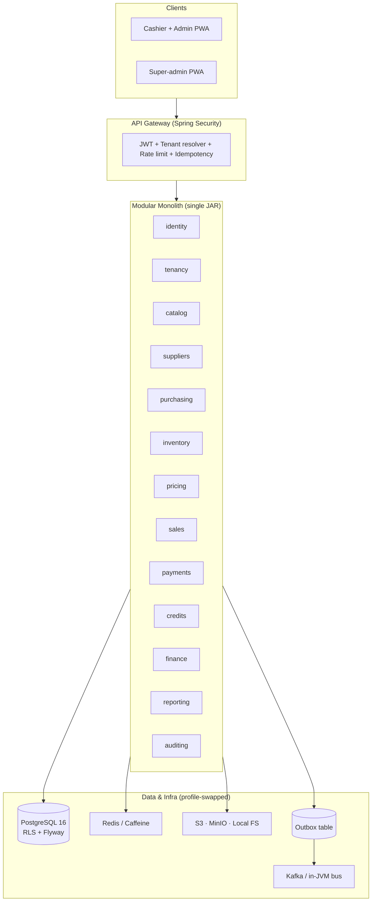
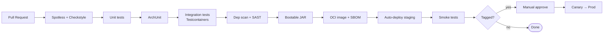

<div align="center">

# 🛒 Kiosk POS

### A supplier-first point-of-sale, inventory, and back-office platform for real shops — built on Java 21 + Spring Boot 3 + PostgreSQL 16.

*Works offline. Balances the books. Treats the supplier like a root aggregate, not a free-text afterthought.*

[](https://openjdk.org/projects/jdk/21/)
[](https://spring.io/projects/spring-boot)
[](https://www.postgresql.org/)
[](#milestones--roadmap)
[](#license--credits)

</div>

---

## 📑 Table of Contents

- [Overview](#-overview)
- [Architecture Overview](#-architecture-overview)
- [Tech Stack](#-tech-stack)
- [Project Structure](#-project-structure)
- [Getting Started](#-getting-started)
- [Milestones & Roadmap](#-milestones--roadmap)
- [Contributing Guide](#-contributing-guide)
- [Environment Variables](#-environment-variables)
- [Testing](#-testing)
- [Deployment](#-deployment)
- [License & Credits](#-license--credits)

---

## 🎯 Overview

**The problem.** A lot of POS software is written for clean, wired, well-capitalized shops. Real kiosks, mini-marts, groceries, and wholesalers — especially in markets like Kenya — don't live that way. They lose internet for hours. They buy tomatoes in crates and need to break them into kilos at the back of the shop. They extend credit on scraps of paper. They pay suppliers in cash from the drawer. When the software pretends these things don't happen, the owner pretends to use the software.

**What Kiosk POS is.** A rebuild of an existing Next.js + Turso system into a modular Java platform where the **supplier is a first-class root aggregate**. Every stock unit knows who supplied it. Every cost price is attributed. Every shilling that leaves the drawer for goods posts against a supplier account. The AP ledger is built-in, not bolted on. The cashier can ring up a sale with no internet and the numbers still reconcile at close-of-day.

**Who it's for.**

- 🏪 **Shop owners** who want to know, at 3 PM on a Tuesday, exactly what they owe, what they have, and what margin they're making — without Excel.
- 💰 **Cashiers** who need a POS that doesn't freeze when the ISP does.
- 🧮 **Accountants** who want a real ledger, not a collection of siloed tables.
- 🏢 **Wholesalers** who need multi-branch, stock transfers, and supplier price comparisons that actually work.
- 🛠️ **Platform operators** running this as a SaaS for dozens or hundreds of tenants.

**What's different this time.** Suppliers are mandatory everywhere. Stock lives in an append-only ledger. Every sale posts a double-entry journal. Idempotency keys stop retries from duplicating. Row-level security stops tenant bleed. FEFO before FIFO on perishables. The same JAR runs in the cloud, on a single back-office PC with no internet, or in a hybrid of both.

---

## 🏗️ Architecture Overview

Kiosk POS is a **Spring Boot modular monolith** with clearly-drawn bounded contexts. Each context ships as a Gradle sub-project. Cross-module calls go through facade interfaces, never through another module's DAO. When a context needs to grow up and leave home, it's already wearing a jacket.



### The decisions that matter

- **Modular monolith, not microservices.** Two-developer team, one database, one deploy. Bounded contexts are drawn correctly so extraction to services later is a refactor, not a rewrite.
- **Supplier as root aggregate.** Trigger-enforced: every item has ≥ 1 supplier, exactly one marked primary. Every batch, cost price, and purchase carries a supplier. No more orphan stock.
- **Append-only `stock_movements` ledger is the single source of truth.** `items.current_stock` is a cached projection, reconcilable from the ledger at any time. The current system's drift bug is gone by construction.
- **Locked COGS on `sale_items`.** `unit_cost`, `cost_total`, and `profit` are written once at sale time. Reports never recompute them. Profit reports in the current system that join back to `buying_prices` with fallback cascades are deleted with prejudice.
- **Light double-entry ledger** (`ledger_accounts` / `journal_entries` / `journal_lines`) glues sales, expenses, supplier payments, wastage, and loyalty into one financial story. "What's my cash position?" becomes a single query.
- **Idempotency + outbox.** Every mutating endpoint takes `Idempotency-Key`. Events are written inside the same transaction as the business change, relayed post-commit. No dual-write. Offline cashiers retry safely.
- **Row-Level Security in PostgreSQL.** Tenant isolation is enforced in the database, not trusted to the application. A missing `WHERE business_id = ?` is no longer a data leak.
- **Three deployment modes, one codebase.** `cloud`, `local`, `hybrid` — profiles swap adapters (cache, bus, storage, payments), not domain code. Same schema, same migrations, no dialect fork.

For the full architectural deep-dive, the deployment-mode matrix, and the supplier-first thesis, see [`../implement.md`](../implement.md) and [`ARCHITECTURE_REVIEW.md`](./ARCHITECTURE_REVIEW.md).

---

## 🧰 Tech Stack

| Layer              | Choice                                               | Why                                                                                              |
|--------------------|------------------------------------------------------|--------------------------------------------------------------------------------------------------|
| **Language**       | Java 21                                              | Records, sealed types, pattern matching, virtual threads — DDD without the ceremony.             |
| **Framework**      | Spring Boot 3.3.x                                    | Boring in the best way. Ubiquitous skills, first-class Testcontainers, solid security story.     |
| **Build**          | Gradle 8 (Kotlin DSL) multi-module                   | Composite builds, `buildSrc` for shared conventions, faster than Maven on big trees.             |
| **Database**       | PostgreSQL 16                                        | RLS, `jsonb`, partial indexes, `pg_trgm`, partitioning, MVs — every feature we lean on.          |
| **Migrations**     | Flyway                                               | One schema, one migration set across all three deployment modes. No dialect fork.                |
| **Persistence**    | Spring Data JPA (Hibernate) + jOOQ for reports       | JPA for write-side aggregates; jOOQ for typed, fast read-side queries.                           |
| **Security**       | Spring Security + JWT access/refresh                 | Stateless, standard, well-understood.                                                            |
| **Cache**          | Redis 7 (cloud) / Caffeine (local)                   | Same `CacheManager` abstraction; profile swaps the implementation.                               |
| **Event bus**      | Kafka / Redis Streams (cloud) / in-JVM + outbox (local) | Outbox pattern is the contract; the relay is pluggable.                                       |
| **Object storage** | S3 / MinIO (cloud) / filesystem (local)              | `StorageAdapter` interface; signed URLs in cloud, direct serving in local.                       |
| **Search**         | PostgreSQL FTS (`pg_trgm` + `tsvector`)              | FTS handles the single-shop and 10k-SKU case. No separate search infra for v1.                   |
| **Validation**     | Jakarta Validation + domain assertions               | Edge validates shape; aggregates validate invariants.                                            |
| **Mapping**        | MapStruct                                            | Compile-time, no reflection, tests catch breakages.                                              |
| **PDF & print**    | OpenPDF + ESC/POS                                    | Works offline, supports 58mm and 80mm thermal printers, no cloud round-trip.                     |
| **Observability**  | Micrometer + OpenTelemetry                           | Ships to Loki/Tempo/Grafana in cloud, rolling JSON files in local.                               |
| **Testing**        | JUnit 5 + Testcontainers + RestAssured + ArchUnit + PITest + Gatling | Pyramid is real and CI-enforced, not aspirational.                                     |
| **CI**             | GitHub Actions                                       | Matrix build for cloud + local profiles; signed installer artifacts on tag.                      |
| **Packaging**      | Docker (cloud) / `jpackage` → `.msi`/`.pkg`/`.deb` (local) | Same JAR, different wrappers.                                                                |
| **Payments**       | M-Pesa Daraja · Pesapal · Stripe · Manual            | All behind a `PaymentGateway` interface. Manual is the offline-first fallback.                   |

**Notably absent:** Meilisearch (Postgres FTS wins on ops cost), SQLite/H2 (dialect fork not worth it), Lombok (records + Java 21 cover it), and any ORM annotations in `domain/` packages.

---

## 📁 Project Structure

```text
kiosk/
├── build.gradle                     # Root Gradle config (Kotlin DSL planned; Groovy today)
├── settings.gradle                  # Lists every Gradle sub-project
├── gradlew / gradlew.bat            # Gradle wrapper — don't commit changes to these casually
├── implement.md                     # The blueprint. Single source of truth for the rebuild.
├── HELP.md                          # Spring Initializr leftover (to be replaced by docs/)
│
├── buildSrc/                        # 🚧 Shared build conventions (Spotless, Checkstyle, ErrorProne)
├── config/                          # 🚧 Linters, code style, OpenAPI linting rules
├── docker/                          # 🚧 Dev compose, Dockerfile, local Postgres seed
├── docs/                            # 🚧 ADRs, diagrams, OpenAPI snapshots, user guides
│
├── modules/                         # 🚧 All bounded contexts live here (Phase 0 collapses to ~10)
│   ├── platform-bom/                #    Dependency versions catalog
│   ├── platform-core/               #    Money, Quantity, Percent, Result, BusinessId, errors
│   ├── platform-web/                #    @ControllerAdvice, Problem+JSON, CORS, rate limits
│   ├── platform-security/           #    JWT, PasswordEncoder, AuditorAware, RLS session setter
│   ├── platform-persistence/        #    Base entities, UUIDv7, soft-delete, auditing
│   ├── platform-events/             #    Outbox pattern, Kafka/in-JVM adapters
│   ├── platform-storage/            #    S3/MinIO/filesystem adapters + signed URLs
│   ├── platform-pdf/                #    OpenPDF + ESC/POS receipt templates
│   │
│   ├── identity/                    #    Users, roles, permissions, sessions, API keys
│   ├── tenancy/                     #    Businesses, branches, domains, subscriptions
│   ├── catalog/                     #    Items, categories, aisles, item types, FTS
│   ├── suppliers/                   #    THE central thesis. Suppliers + supplier_products.
│   ├── purchasing/                  #    PO → GRN → Invoice → Payment, 3-way match
│   ├── inventory/                   #    Append-only stock_movements ledger, FEFO/FIFO picker
│   ├── pricing/                     #    Selling/buying price history, tax rates, rules
│   ├── sales/                       #    Shifts, POS cart, sales, voids, refunds, receipts
│   ├── payments/                    #    PaymentGateway interface + Daraja/Pesapal/Stripe/Manual
│   ├── credits/                     #    Customers + three ledgers: debt, wallet, loyalty
│   ├── finance/                     #    Ledger accounts, journal entries, expenses
│   ├── reporting/                   #    Materialized views + scheduled refreshers
│   ├── auditing/                    #    Activity log, append-only role, hash-chain
│   ├── integrations/                #    Webhooks, API keys, SES, SMS, external HTTP
│   ├── notifications/               #    Low-stock, expiring, overdue, shift variance
│   ├── exports/                     #    CSV/XLSX/PDF, async jobs
│   ├── sync/                        #    Local → cloud outbox replay (hybrid mode only)
│   ├── platform-desktop/            #    jpackage, tray UI, self-updater (local mode)
│   └── app-bootstrap/               #    Spring Boot main + profile wiring
│
└── src/                             # ⚠️  TEMPORARY — Phase 0 skeleton before module split
    ├── main/java/...                #     A single package today; moves into modules/ in Phase 0.
    └── main/resources/
        └── application.properties   #     server.port=5000
```

> 🚧 = planned  ⚠️ = transitional

### Package layout inside each module

```text
ke.kiosk.<module>/
├── api/          # Facades (XxxApi.java) + DTOs + domain events. The public surface.
├── application/  # Commands, Handlers, use-case services. Implements api/.
├── domain/       # Aggregates, value objects, policies. ZERO Spring imports.
├── infrastructure/ # JPA entities, repositories, adapters, MapStruct, Flyway SQL.
└── web/          # @RestController, request/response DTOs, controller-level mappers.
```

**Enforced by ArchUnit tests:** `web → application`; `application → {domain, api}`; `domain` has no `org.springframework.*` imports; inter-module calls go only through `api/`.

---

## 🚀 Getting Started

### Prerequisites

| Tool           | Version        | Check                   |
|----------------|----------------|-------------------------|
| Java (JDK)     | 21+            | `java -version`         |
| Docker         | 24+            | `docker --version`      |
| Docker Compose | v2             | `docker compose version`|
| Git            | any modern     | `git --version`         |

> No local Postgres install required — a Testcontainers-driven one is used in dev and test.
>
> If Java is missing on macOS, run `./scripts/setup-java.sh` to install Temurin 21 via Homebrew.

### Run it in under 5 minutes

```bash
# 1. Clone
git clone <this-repo>.git kiosk && cd kiosk

# 2. Bring up infra (Postgres + Redis + MinIO)
docker compose -f docker/dev-compose.yml up -d    # 🚧 compose file lands in Phase 0

# 3. Boot the app (dev profile, hot reload via Spring DevTools)
./gradlew bootRun --args='--spring.profiles.active=dev'

# 4. Visit
open http://localhost:5000/actuator/health
open http://localhost:5000/swagger-ui.html        # 🚧 arrives in Phase 1
```

Today's `./gradlew bootRun` starts the Phase-0 skeleton on port `5000`. That's it. Everything else on this list is arriving in Phase 0–1.

### Local profile (on-prem, no internet)

```bash
./gradlew :app-bootstrap:bootRun -Dspring.profiles.active=local
# Starts against a fresh bundled Postgres in ./build/local-pgdata/
# Admin UI at https://kiosk.local:8443 (self-signed cert)
```

### Build a signed installer

```bash
./gradlew :platform-desktop:jpackage       # Produces .msi / .pkg / .deb for the host OS
```

---

## 🗺️ Milestones & Roadmap

Status legend: ✅ Done · 🔄 In Progress · 🔲 Planned · ❄️ Deferred

### Phase 0 — Foundations `🔄 In Progress`

The skeleton and the rails. Nothing ships to users; everything after this stands on it.

- 🔄 Gradle multi-module skeleton (collapsing from 16 → 10 folders for Phase 0 sanity)
- 🔲 `platform-core`, `platform-web`, `platform-security`, `platform-persistence`, `platform-events`, `platform-storage`
- 🔲 Flyway + Testcontainers + Spotless + ArchUnit gates in CI
- 🔲 JWT auth + tenant resolver + RLS session setter
- 🔲 `GET /actuator/health` green in Docker compose

**Exit criteria:** `./gradlew check` passes. A fresh clone is running in a container in under 10 minutes. ArchUnit and Flyway ordering gates are failing builds on bad PRs.

### Phase 1 — Identity, Tenancy, Catalog `🔲 Planned`

- 🔲 Businesses, branches, users, roles, permissions (permissions as data)
- 🔲 Login (email + password, PIN), refresh tokens, API keys, lockout
- 🔲 Domain → business resolver, super-admin tenant CRUD
- 🔲 Items (+ variants), categories, aisles, item types, barcodes, FTS
- 🔲 Admin UI scaffolding: business settings, user CRUD, product CRUD

**Exit criteria:** A super-admin creates a tenant. An owner creates users and items. Search works by name and barcode.

### Phase 2 — Suppliers & Purchasing `🔲 Planned`

*This is the phase that proves the central thesis. If it slips, cut everything after.*

- 🔲 Supplier aggregate, contacts, payment profile, credit terms
- 🔲 Supplier ↔ item links with primary-supplier invariant (DB trigger + domain guard)
- 🔲 Path B: raw purchase note → breakdown → batches + AP invoice
- 🔲 Path A: PO → GRN → supplier invoice → payment allocation
- 🔲 Supplier reports: spend, 90-day price competitiveness, single-source risk

**Exit criteria:** Owner onboards a supplier, receives goods, records an invoice, pays partially, and the AP aging shows the right numbers.

### Phase 3 — Inventory + Pricing `🔲 Planned`

- 🔲 `inventory_batches` + append-only `stock_movements`
- 🔲 FEFO/FIFO picker with per-item policy
- 🔲 Stock-take sessions with approvals
- 🔲 Selling and cost price history, margin-rule auto-suggest
- 🔲 Branch-to-branch transfers (atomic, both sides in one txn)

**Exit criteria:** Stock valuation = Σ(batch_qty × unit_cost) across every flow, always.

### Phase 4 — POS Core `🔲 Planned`

- 🔲 Shifts (open/close with denomination counts, balance approvals)
- 🔲 PWA cart, barcode scan, quick-keys
- 🔲 `POST /sales` with idempotency, FEFO/FIFO integration, split payments
- 🔲 Receipts (PDF + ESC/POS)
- 🔲 Void / refund with permission gating
- 🔲 Offline IndexedDB queue + sync

**Exit criteria:** 100 sales/hour sustained on a 4G connection. 10× retry test proves no duplicates server-side.

### Phase 5 — Customers, Credit, Wallet, Loyalty `🔲 Planned`

- 🔲 Unified `customers` + `customer_phones`
- 🔲 Three separate ledgers: debt, wallet, loyalty
- 🔲 M-Pesa STK push (Daraja / Pesapal)
- 🔲 Public credit claim link with admin review
- 🔲 SMS + email reminders for overdue credit

**Exit criteria:** Customer buys on credit → self-pays via STK → admin approves claim → journal balances.

### Phase 6 — Expenses, Cash Drawer, Finance Reports `🔲 Planned`

- 🔲 Expenses with recurrence, payment method, drawer-inclusion flag
- 🔲 Cash drawer daily summary at shift close
- 🔲 Simple P&L and balance sheet views

**Exit criteria:** Owner answers "did I make money today?" in one click.

### Phase 7 — Reporting + Analytics `🔲 Planned`

- 🔲 Materialized views (`mv_sales_daily`, `mv_supplier_monthly`, `mv_inventory_snapshot`)
- 🔲 Dashboard query p95 baseline published (sub-200ms target; CI fail-on-regression deferred to Phase 11)
- 🔲 Async export engine (CSV/XLSX/PDF)
- 🔲 Notification pipeline (low stock, expiring, overdue, shift variance)

**Exit criteria:** [Phase 6 close-out](PHASE_7_PLAN.md#-slice-0--phase-6-close-out-gate) (pulse + simple P&L/BS) **plus** **six** [v1 canonical reports](PHASE_7_PLAN.md#-canonical-reports--v1-vs-phase-71) pass acceptance; **four** [Phase 7.1](PHASE_7_PLAN.md#-canonical-reports--v1-vs-phase-71) reports follow in the same release or a stated follow-on milestone (see `PHASE_7_PLAN.md` ADR).

### Phase 8 — Integrations & Hardening `🔲 Planned`

- 🔲 External API + scoped API keys + rate limits
- 🔲 Outbound webhooks
- 🔲 Data import (items, suppliers, opening stock)
- 🔲 Daily encrypted S3 backup
- 🔲 GDPR / Kenya DPA export & deletion per tenant

### Phase 9 — Multi-branch + Offline + PWA Polish `🔲 Planned`

- 🔲 Branch switcher, scoped reports
- 🔲 Stock transfers with in-transit state
- 🔲 Offline PWA with conflict resolution
- 🔲 Install-as-app, camera scanner, Bluetooth ESC/POS

### Phase 10 — Local / On-Prem Deployment `❄️ Deferred to v1.5`

Bundled Postgres, `jpackage` installers, mDNS, licensing, USB-update path, nightly local backups. Moving out of v1 to give the cloud pilot room to breathe.

### Phase 11 — Beta, Perf, GA `🔲 Planned`

- 🔲 Gatling load test: 100 shops × 1 sale/sec
- 🔲 OWASP ASVS L2 checklist
- 🔲 External penetration test
- 🔲 UAT with 3 pilot shops in parallel with legacy system for 30 days

**Exit criteria for GA:** Zero P1 bugs open for 14 days. p99 < 500 ms on hot paths. Backup/restore drilled. Self-onboarding under 10 minutes.

### Horizon (proposed) — Phases 12–15

These are **not** in `implement.md` §12 today; they are planning charters in `docs/`:

- [Phase 12 — Post-GA: migration, enterprise & platform](./PHASE_12_PLAN.md) — Turso migration tool, scale, sustainment
- [Phase 13 — International & ecosystem](./PHASE_13_README.md)
- [Phase 14 — Electron desktop](./PHASE_14_README.md) — optional shell vs [Phase 10](./PHASE_10_PLAN.md) `jpackage`
- [Phase 15 — Storefront window](./PHASE_15_PLAN.md) — tenant homepage shop module, catalog branch–fed public catalog (browse + PDP; checkout in a follow-on phase)

---

## 🤝 Contributing Guide

This project prefers small, reviewable PRs over heroic ones.

### Branch strategy

```
main                     ← protected, always deployable
├─ feat/<ticket>-<slug>  ← short-lived feature branches
├─ fix/<ticket>-<slug>   ← bug fixes
├─ chore/<slug>          ← tooling, deps, housekeeping
└─ docs/<slug>           ← docs only
```

Rebase onto `main` before opening a PR. Don't merge commits into feature branches; squash on merge.

### Commit messages (Conventional Commits)

```
<type>(<scope>): <subject>

<body — optional, wrap at 72>

<footer — refs #123, BREAKING CHANGE: …>
```

Types: `feat`, `fix`, `refactor`, `perf`, `test`, `docs`, `chore`, `build`, `ci`.
Scopes mirror modules: `suppliers`, `inventory`, `sales`, `platform-core`, etc.

Good:

```
feat(suppliers): enforce primary-supplier-per-item invariant via trigger

Adds migration V3__exactly_one_primary.sql and domain assertion in
SupplierProduct.promoteToPrimary. Closes #42.
```

### Pull request checklist

- [ ] Tests added or updated (unit + integration where the change touches both)
- [ ] ArchUnit layer tests still green
- [ ] Flyway migrations follow the `V<module>_<seq>__<slug>.sql` convention
- [ ] No `org.springframework.*` imports in any `domain/` package
- [ ] `./gradlew check` passes locally
- [ ] Public API changes reflected in OpenAPI
- [ ] ADR added to `docs/adr/` for any non-trivial design choice
- [ ] Description explains **why**, not just **what**

### Code review expectations

- One approving review from a CODEOWNER is required.
- Reviewers reply within 1 business day or explicitly pass.
- "nit:" prefix for non-blocking comments. Everything else blocks.
- Discussion resolved on the PR; decisions captured in ADRs, not in Slack.
- Style is enforced by Spotless — don't argue about formatting in review.

### Local dev hygiene

```bash
./gradlew spotlessApply        # Format everything
./gradlew check                # Lint + test + arch
./gradlew :identity:test       # Scope to one module while iterating
```

---

## 🔐 Environment Variables

All configuration is via environment variables. `.env` files are for dev only; production uses AWS Secrets Manager / SSM (cloud) or an OS-protected config file (local).

### Core

| Key                               | Required | Example                                      | Description                                               |
|-----------------------------------|----------|----------------------------------------------|-----------------------------------------------------------|
| `SPRING_PROFILES_ACTIVE`          | ✅       | `dev` / `prod,cloud` / `prod,local`          | Environment × mode. Pick one of each.                     |
| `SERVER_PORT`                     | ✅       | `5000` (cloud) / `8443` (local HTTPS)        | HTTP/HTTPS port.                                          |
| `APP_BASE_URL`                    | ✅       | `https://api.kiosk.example.com`              | Public base URL for signed links, emails, webhooks.       |
| `TZ`                              | ⚪       | `UTC`                                         | JVM & server timezone. DB stores UTC; UI renders per-biz. |

### Database

| Key                       | Required | Example                                                       | Description                                      |
|---------------------------|----------|---------------------------------------------------------------|--------------------------------------------------|
| `DB_URL`                  | ✅       | `jdbc:postgresql://localhost:5432/kiosk`                      | JDBC URL.                                        |
| `DB_USERNAME`             | ✅       | `kiosk_app`                                                   | App DB user — has USAGE on RLS, no superuser.    |
| `DB_PASSWORD`             | ✅       | `change-me`                                                   | Pull from a secret manager in prod.              |
| `DB_POOL_MAX`             | ⚪       | `20`                                                          | HikariCP max pool size.                          |
| `FLYWAY_ENABLED`          | ⚪       | `true`                                                        | Off only for read-replica processes.             |

### Security

| Key                         | Required | Example                                         | Description                                          |
|-----------------------------|----------|-------------------------------------------------|------------------------------------------------------|
| `JWT_ACCESS_SECRET`         | ✅       | `<64-byte base64>`                              | HMAC secret for access tokens. Rotate quarterly.     |
| `JWT_ACCESS_TTL_MINUTES`    | ⚪       | `15`                                            | Access token lifetime.                               |
| `JWT_REFRESH_TTL_DAYS`      | ⚪       | `30`                                            | Refresh token lifetime (rotated on every use).       |
| `PASSWORD_RESET_TTL_HOURS`  | ⚪       | `1`                                             | Reset-token lifetime.                                |
| `RATE_LIMIT_LOGIN`          | ⚪       | `5/min/ip`                                      | Login rate limit.                                    |
| `CORS_ALLOWED_ORIGINS`      | ✅       | `https://admin.kiosk.ke,https://app.kiosk.ke`   | Comma-separated. No wildcards in prod.               |

### Cache, Bus, Storage

| Key                       | Required          | Example                              | Description                                              |
|---------------------------|-------------------|--------------------------------------|----------------------------------------------------------|
| `REDIS_URL`               | cloud only        | `redis://redis:6379`                 | Cache + rate-limit buckets. Ignored under `local`.       |
| `KAFKA_BOOTSTRAP_SERVERS` | cloud only        | `kafka:9092`                         | Event bus. Ignored under `local` (in-JVM relay).         |
| `STORAGE_ENDPOINT`        | cloud only        | `https://s3.amazonaws.com`           | S3 / MinIO endpoint.                                     |
| `STORAGE_BUCKET`          | cloud only        | `kiosk-prod-assets`                  | Bucket name.                                             |
| `STORAGE_ACCESS_KEY`      | cloud only        | `AKIA…`                              | IAM access key.                                          |
| `STORAGE_SECRET_KEY`      | cloud only        | `…`                                  | IAM secret key.                                          |
| `DATA_DIR`                | local/hybrid      | `/var/lib/kiosk` or `C:\ProgramData\Kiosk` | Root for `pgdata/`, `storage/`, `backups/`, `logs/`. |

### Integrations

| Key                          | Required       | Example                                   | Description                                          |
|------------------------------|----------------|-------------------------------------------|------------------------------------------------------|
| `MPESA_CONSUMER_KEY`         | optional       | `…`                                       | Daraja consumer key. STK push queues when absent.    |
| `MPESA_CONSUMER_SECRET`      | optional       | `…`                                       | Daraja consumer secret.                              |
| `MPESA_SHORTCODE`            | optional       | `174379`                                  | Till / paybill shortcode.                            |
| `MPESA_CALLBACK_URL`         | optional       | `${APP_BASE_URL}/webhooks/mpesa`          | Must be publicly reachable in cloud/hybrid.          |
| `PESAPAL_CONSUMER_KEY`       | optional       | `…`                                       | Pesapal consumer key.                                |
| `PESAPAL_CONSUMER_SECRET`    | optional       | `…`                                       | Pesapal consumer secret.                             |
| `SES_REGION`                 | optional       | `eu-west-1`                               | AWS region for SES.                                  |
| `SES_FROM_ADDRESS`           | optional       | `receipts@kiosk.ke`                       | Verified SES sender.                                 |
| `SMS_PROVIDER`               | optional       | `africas_talking` / `twilio` / `gammu`    | Queued in outbox when `none`.                        |
| `SMS_API_KEY`                | optional       | `…`                                       | Provider API key.                                    |

### Observability

| Key                       | Required   | Example                          | Description                                          |
|---------------------------|------------|----------------------------------|------------------------------------------------------|
| `OTEL_EXPORTER_OTLP_ENDPOINT` | optional | `http://tempo:4317`             | OpenTelemetry collector.                             |
| `LOG_LEVEL_ROOT`          | ⚪         | `INFO`                           | Root log level.                                      |
| `LOG_FORMAT`              | ⚪         | `json`                           | `json` in prod; `pretty` in dev.                     |

### Licensing (local / hybrid only)

| Key                       | Required     | Example                          | Description                                             |
|---------------------------|--------------|----------------------------------|---------------------------------------------------------|
| `LICENSE_KEY`             | local/hybrid | `<signed JWT>`                   | Activation key issued by vendor.                        |
| `LICENSE_PUBLIC_KEY_PATH` | local/hybrid | `/etc/kiosk/license.pub`         | Bundled public key; verifies the activation key offline.|

A full `.env.example` ships with Phase 0. Never commit real secrets.

---

## 🧪 Testing

### Philosophy

- **Pyramid, not pillars.** Lots of fast unit tests on `domain/`. Fewer, focused slice tests on `infrastructure/`. A small set of end-to-end tests on the money paths.
- **Invariants are tested, not hoped for.** Every rule in §4.1 of the blueprint (supplier presence, primary-supplier uniqueness, wallet ≥ 0, journal balances) has a dedicated test that fails loudly on regression.
- **Testcontainers over mocks** when a real Postgres catches the bug and a mock doesn't. RLS, partial indexes, and triggers are not Hibernate features; we test against the real thing.
- **ArchUnit is a teammate.** Layer violations and forbidden imports fail the build like a failing unit test.
- **Mutation testing on `domain/` only.** Target ≥ 70% mutation score. We don't mutate infrastructure — the cost-to-signal is wrong.
- **Load tests on the hot paths.** `POST /sales` and `GET /items?search=` have Gatling budgets (p95 < 200 ms) and break the build when they regress.

### Running tests

```bash
./gradlew test                          # Fast unit tests across all modules
./gradlew integrationTest               # @SpringBootTest + Testcontainers Postgres
./gradlew archTest                      # ArchUnit layer + import rules
./gradlew :domain:pitest                # Mutation tests on pure domain code
./gradlew :sales:gatlingRun             # Hot-path load tests
./gradlew check                         # Everything above + Spotless + Checkstyle
```

### What's covered

| Surface                   | Approach                                        | Gate           |
|---------------------------|-------------------------------------------------|----------------|
| Pure domain logic         | JUnit 5, property-based tests (jqwik) for money/quantity math | Line ≥ 85%, mutation ≥ 70% |
| JPA repositories          | `@DataJpaTest` with Testcontainers              | Line ≥ 70%     |
| REST controllers          | `@SpringBootTest` + RestAssured                 | Contract tests on every endpoint |
| External adapters (Daraja, Pesapal, SES) | WireMock stubs replay real fixtures  | One happy-path + two failure modes minimum |
| Layering + package rules  | ArchUnit                                        | Breaking = red build |
| Concurrency (last-unit-sold) | `jcstress` or Testcontainers-driven threaded test | Hard fail on any lost update |
| Tenant isolation          | Login as tenant A, request tenant B's ID — expect 404 | Breaking = red build |
| Reports                   | Golden-file tests for **Phase 7 v1** (six) + optional **7.1** (four) | 1:1 expected output |

### What's explicitly not tested by us

- Third-party service uptime. We test our *adapter*, not Daraja.
- Browser rendering. That's the PWA repo's job.
- PostgreSQL itself. We trust it.

---

## 🚢 Deployment

**Step-by-step (MySQL + Spring Boot + Next.js on a VPS, no Docker):** see the monorepo [Deployment guide](../../DEPLOYMENT.md).

---

The sections below describe the **target** cloud pipeline from the architecture README (`docker compose`, OCI images, K8s/ECS). They may run ahead of current repo scaffolding.

Three environments, three profiles, one JAR.

### Dev

```bash
docker compose -f docker/dev-compose.yml up -d   # Postgres, Redis, MinIO
./gradlew bootRun --args='--spring.profiles.active=dev,cloud'
```

Hot reload via Spring DevTools. Flyway runs on boot. A seeded tenant called `Dev Kiosk` is created on first run.

### Staging (cloud)

- Build on push to `main`: `./gradlew check && ./gradlew bootBuildImage`.
- Image pushed to GHCR with tag `main-<short-sha>`.
- GitHub Actions triggers a `kubectl set image` (or ECS update-service) against `staging`.
- Flyway runs at startup; failing migrations fail the readiness probe and the rollout aborts automatically.
- Smoke test: RestAssured hits `/actuator/health` + one seeded sale round-trip.

### Production (cloud)

- Tagged release only: `v1.2.3` triggers the prod workflow.
- Manual approval gate in GitHub Actions.
- Blue/green: new tasks register with the load balancer only after `/actuator/ready` returns 200 (DB reachable + migrations applied).
- Canary on one ECS task / one K8s pod for 15 minutes; automatic rollback on error-rate regression.
- Post-deploy: Gatling smoke run + alert silence for 10 min while metrics warm.

### Production (local / on-prem) — arriving in v1.5

```bash
./gradlew :platform-desktop:jpackage
# Produces signed Kiosk-Setup-<version>.msi / .pkg / .deb
```

Installer wizard: accept licence → enter activation key → pick data dir → bootstrap owner account → detect printers → configure backup destination → open LAN firewall → start service. Upgrades happen in place with a 7-day rollback window.

### CI/CD pipeline



Every job is cached aggressively. A clean-cache run is under 12 minutes; an incremental PR build is under 4.

---

## 📜 License & Credits

**License.** TBD — target is Apache-2.0 for the platform with a commercial-licensed `platform-desktop` installer for paying tenants. See `LICENSE` once Phase 0 lands.

**Built on the shoulders of:** Spring Boot, PostgreSQL, Hibernate, jOOQ, MapStruct, Testcontainers, OpenPDF, JmDNS, Flyway, and the open-source community that made all of it possible.

**Inspired by** every shop owner who has ever balanced a cash drawer on a paper ledger at 10 PM and deserved better tooling.

**Status.** This README describes a system actively under construction. Sections marked 🔄 / 🔲 / ❄️ reflect real roadmap state, not aspiration polish. Pull requests welcome — [start with the contributing guide](#-contributing-guide).

---

<div align="center">

*Built with opinions, tested with evidence, shipped with care.*

</div>
