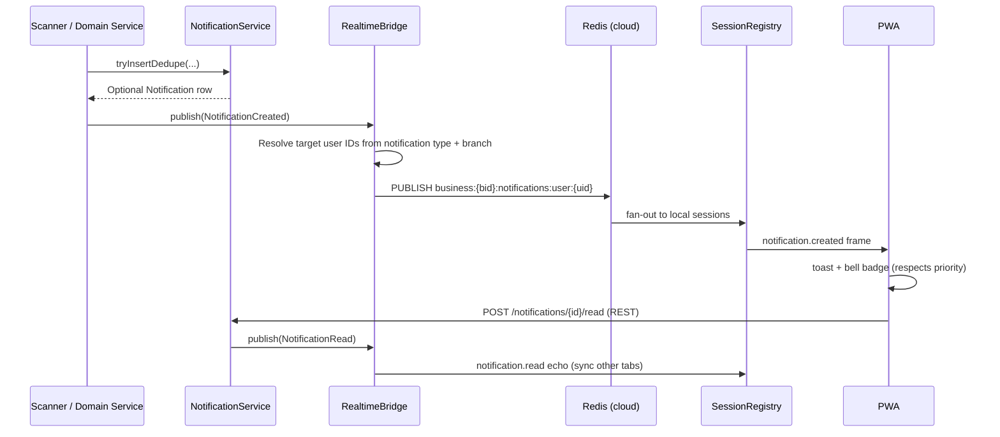

<div align="center">

# Real-time layer — WebSockets for notifications & POS events

### Turn Palmart's **durable inbox** into a **tenant-safe, branch-aware** live surface — without forking the modular monolith, breaking the Next.js proxy, or pretending every tablet has perfect Wi‑Fi.

*Today the API is **request/response**; notifications are **rows + schedulers**. This document scopes how to add **live fan-out** for notifications and **POS-critical events** (stock depletion during sales, price changes, payment confirmations, approval round-trips) in a way that fits **cloud SaaS**, **Coolify deploys**, and the **local/hybrid** story in `implement.md` §15.*

[](./README.md#-milestones--roadmap)
[](./PHASE_7_PLAN.md)
[](./PHASE_8_PLAN.md)

</div>

---

## Table of contents

- [Why this document exists](#why-this-document-exists)
- [What "real-time" means for Palmart in one paragraph](#what-real-time-means-for-palmart-in-one-paragraph)
- [Current state (repo truth)](#current-state-repo-truth)
- [What gets pushed — notifications + POS events](#what-gets-pushed--notifications--pos-events)
- [What is deliberately excluded from v1](#what-is-deliberately-excluded-from-v1)
- [Transport choice — WebSocket with REST polling fallback](#transport-choice--websocket-with-rest-polling-fallback)
- [Recommended architecture](#recommended-architecture)
- [Authentication & tenancy on a long-lived socket](#authentication--tenancy-on-a-long-lived-socket)
- [Channel & topic model](#channel--topic-model)
- [Notifications over the wire](#notifications-over-the-wire)
- [POS-critical events over the wire](#pos-critical-events-over-the-wire)
- [Backend module layout & event wiring](#backend-module-layout--event-wiring)
- [Frontend integration (Next.js + PWA)](#frontend-integration-nextjs--pwa)
- [Reconnection & backpressure strategy](#reconnection--backpressure-strategy)
- [Deployment & operations (Coolify, Redis, sticky sessions)](#deployment--operations-coolify-redis-sticky-sessions)
- [Local / hybrid profile behaviour](#local--hybrid-profile-behaviour)
- [Security, abuse, and compliance](#security-abuse-and-compliance)
- [Phased delivery plan](#phased-delivery-plan)
- [Wire protocol specification](#wire-protocol-specification)
- [Test strategy](#test-strategy)
- [Observability & SLOs](#observability--slos)
- [Definition of Done](#definition-of-done)
- [Risks, traps, and known unknowns](#risks-traps-and-known-unknowns)
- [Open questions for the team](#open-questions-for-the-team)

---

## Why this document exists

`implement.md` mentions **WebSocket subscriptions for real-time cashier sync** exactly once (§15.7). `ARCHITECTURE_REVIEW.md` flags that line as **the first and only mention** of WebSockets — **unscoped**.

Meanwhile the product already has:

- A **notifications** table and REST API (`GET /api/v1/notifications`, `POST /api/v1/notifications/{id}/read`) backed by **deduped rows** and **scheduled scanners** (Phase 7 Slice 6).
- **Outbound webhooks** (Phase 8) that enqueue from the same business moments (`sale.completed`, `invoice.overdue`, `stock.low_stock`).
- A **Next.js** admin/PWA that **proxies** `/api/v1/**` but has **no** notification bell UI.
- A **multi-terminal POS** where cashiers on different tills can unknowingly sell the same depleted item, work with stale prices, or wait blindly for M-Pesa confirmations.

This document turns "we should WebSocket" into a **Palmart-specific** design: **what** to push, **who** may subscribe, **how** it survives **multi-tenant RLS**, **15-minute JWTs**, **branch context**, and **Vercel/Coolify** networking — and **when not** to use WebSockets at all.

---

## What "real-time" means for Palmart in one paragraph

After this initiative closes (v1 scope below), an **authenticated staff member** on `acme.palmart.co.ke` sees **in-app notifications** appear within **seconds** of the underlying business fact (overdue bill, low stock, web order, approval request) without polling the inbox every minute. **Cashiers on active tills** see **stock depletions**, **price changes**, and **payment confirmations** pushed to their POS screen in real time so they never sell a zero-stock item at a stale price or wait unnecessarily for an M-Pesa callback. **Managers** receive **approval requests** instantly and cashiers get **approval resolutions** pushed back without polling. **Read status syncs across tabs and devices** so a notification marked read on a phone is read on the desktop. The **database remains authoritative**: sockets are an **ephemeral fan-out** layer; offline clients **catch up** via REST cursoring. **External partners** still use **webhooks**; sockets are **human UX**, not integration transport.

---

## Current state (repo truth)

| Area | Today | Implication for real-time |
|------|--------|---------------------------|
| **Notifications** | `notifications` rows; `NotificationService.tryInsertDedupe`; `Phase7ApNotificationService` + cron; `NotificationsController` | Fan-out target already exists; **no push** to clients |
| **Webhooks** | `WebhookEnqueueService` in OLTP txn; async HTTP delivery | Reuse **same predicates / payloads** for in-app realtime envelope |
| **Domain events** | Appendix B catalogue documented; **no** general transactional outbox fan-out to UI yet | Prefer **post-commit** `ApplicationEvent` → realtime bridge in v1; align names with Appendix B |
| **Auth** | Stateless JWT (`sub`, `business_id`, `role`, optional `branch_id`, 15m TTL) | WS cannot rely on a single long-lived access token without refresh choreography |
| **Tenancy** | Host → `business_id` (`DomainBusinessResolverFilter`); `X-Tenant-Id` on apex | WS handshake must carry **same** tenant resolution rules |
| **Frontend** | `frontend/lib/api.ts` REST client + `lib/realtime.ts` WS client; `notification-bell.tsx` in header; `realtime-provider.tsx` context | Browser WS connects direct to API host via `NEXT_PUBLIC_API_BROWSER_DIRECT=true` + `NEXT_PUBLIC_API_BASE_URL` |
| **Redis** | `spring-boot-starter-data-redis` on classpath; cloud profile expectation | Use for **pub/sub** fan-out when horizontally scaled |
| **Cashier sync** | IndexedDB + idempotency (Phase 4/9); WS mentioned only for LAN | **Do not** conflate **offline sale queue** with notification/event push in v1 |
| **Chat** | **Not in schema** | Explicitly **excluded from v1** — see [What is deliberately excluded](#what-is-deliberately-excluded-from-v1) |

---

## What gets pushed — notifications + POS events

### Notifications (v1 — staff-first, Phase 7-driven)

These originate from scheduled scanners and domain service hooks. Every notification row is **eligible** for a realtime envelope, but **not every row** must be pushed (dedupe + user preferences).

| Event type | Source | Audience | Branch filter | Priority |
|---|---|---|---|---|
| `payable.overdue` | Phase 7 AP ageing scanner | Owner, accountant, manager | Business-wide | MEDIUM |
| `receivable.overdue` | Phase 7 AR / credits balances | Same | Business-wide | MEDIUM |
| `shift.variance_detected` | Phase 6 drawer summary | Manager, owner | Per `branch_id` | HIGH |
| `stock.low` | Inventory scan / `stock.low` | Stock clerk, manager | Per branch | HIGH |
| `batch.expiring` | Expiry window scanner (7d / 30d) | Stock clerk | Per branch | MEDIUM |
| `storefront.order.placed` | Storefront checkout | Staff with `storefront.orders.read` | Catalog branch | HIGH |
| `approval.requested` | Stock adjustments, voids, claims | Users with `.approve` permissions | Per branch | HIGH |
| `approval.resolved` | Approval / rejection | Requesting user (return path) | N/A (user-scoped) | HIGH |
| `export.completed` | Export job completion | Requesting user | N/A (user-scoped) | LOW |

### POS-critical events (v1 — new, no notification row required)

These are ephemeral real-time pushes that do **not** necessarily create a `notifications` row. They are transient operational signals that lose value if delayed.

| Event type | Trigger | Audience | Branch filter | Priority |
|---|---|---|---|---|
| `stock.depleted` | `inventory_batches.quantity_remaining` hits 0 after sale commit | All active cashiers on branch | Per branch | HIGH |
| `price.changed` | `selling_prices` row inserted/updated | All active cashiers on branch | Per branch | HIGH |
| `payment.confirmed` | M-Pesa callback / manual payment gateway confirmation | Originating cashier | Per branch | HIGH |
| `transfer.initiated` | Inter-branch stock transfer created | Receiving branch stock clerks | Destination branch | MEDIUM |
| `transfer.received` | Transfer marked received | Sending branch confirmation | Originating branch | MEDIUM |

### Future event types (Phase 3+ — out of current scope)

| Event type | Rationale for deferral |
|---|---|
| `customer.credit_limit_warning` | Cashier alert when credit sale nears limit; depends on Phase 5 credit maturity |

---

## What is deliberately excluded from v1

These decisions are **locked** for v1. Revisit no earlier than Phase 10 unless paying customers demand them.

### Chat (entity-anchored or otherwise)

**Why excluded:** Kenyan mini-marts and supermarkets already use WhatsApp for internal communication. It is free, ubiquitous, works offline, and requires zero training. Building an in-app chat duplicates a solved problem and adds 6-8 weeks of work (threads, members, messages, permissions, moderation, retention, attachments, search, real-time delivery, offline queue). The operational ROI is negative in v1.

**What to do instead:** If a note must be attached to a domain entity (web order, shift, transfer), add a single `notes TEXT` column to that entity's table. Re-evaluate chat in Phase 10+ only if 5+ paying tenants explicitly request it.

### Presence ("who's online")

**Why excluded:** The shift system already tracks who is clocked in. Knowing whether someone is actively looking at their screen delivers no operational value in a retail environment. Adds pub/sub overhead, privacy concerns, and frontend complexity.

### SSE fallback transport

**Why excluded:** Building and maintaining two real-time transports doubles the surface area for marginal benefit. Kenyan mini-marts are not behind corporate firewalls that block WebSocket upgrades. If WebSocket is unavailable, the client falls back to REST polling at 30-second intervals — the same mechanism that exists today.

### Typing indicators, read receipts, reactions

**Why excluded:** All require chat, which is excluded.

### Role-based notification channels

**Why excluded:** Server-side role fan-out adds subscription management complexity. Instead, the server resolves which individual users should receive a notification and publishes to each user's personal channel. This is simpler and avoids role-channel lifecycle issues.

---

## Transport choice — WebSocket with REST polling fallback

```mermaid
flowchart LR
  subgraph Client
    UI[Admin / Cashier PWA]
  end

  subgraph Edge
    NX[Next.js HTTP proxy]
    API[Spring Boot API]
  end

  UI -->|REST mutations + history + fallback poll| NX
  NX --> API
  UI -->|WebSocket upgrade (direct)| API
```

| Transport | Use on Palmart | Rationale |
|-----------|----------------|-----------|
| **WebSocket** (JSON frames) | **Primary** for notifications + POS events | Bidirectional: subscribe, ack read, heartbeat |
| **REST polling** | **Fallback** when WS unavailable | `GET /api/v1/notifications?since=` at 30s interval; already works today |
| **Push (FCM/APNs)** | Phase 2+ mobile | PWA background notifications still weak on iOS — do not block v1 on it |

**Disciplined default:** one **multiplexed** WebSocket per browser tab (`/api/v1/realtime`) carrying **typed frames** (`notification.created`, `stock.depleted`, `price.changed`, `payment.confirmed`, `approval.requested`, `approval.resolved`, `ping`). Avoid STOMP in v1 — **raw JSON + version field** matches the existing OpenAPI / Problem+JSON culture.

---

## Recommended architecture

```mermaid
flowchart TB
  subgraph OLTP["Modular monolith (single JAR)"]
    SVC[Domain services<br/>SaleService, InventoryService, PaymentService]
    NS[NotificationService<br/>tryInsertDedupe + scanner hooks]
    BR[RealtimeBridge<br/>@TransactionalEventListener AFTER_COMMIT]
    REG[SessionRegistry<br/>per-instance WS session map]
    SVC --> NS
    SVC --> BR
    NS --> BR
    BR --> REG
  end

  subgraph Data
    PG[(PostgreSQL 16 + RLS)]
    RD[(Redis pub/sub<br/>cloud profile only)]
  end

  NS --> PG
  REG --> RD
  BR --> RD

  subgraph Clients
    C1[Browser tab A<br/>POS terminal 1]
    C2[Browser tab B<br/>POS terminal 2]
    C3[Manager tablet]
  end

  C1 <-->|WS| REG
  C2 <-->|WS| REG
  C3 <-->|WS| REG
```

**Invariants (non-negotiable):**

1. **Write path stays HTTP** — sales, stock adjustments, approvals, price changes all commit via REST with `Idempotency-Key`. WS is **read-only fan-out**, never the durability path.
2. **Tenant isolation** — channel keys are always prefixed `business:{businessId}:...`; server **constructs** all channel keys server-side and **never** trusts client-supplied `business_id` without JWT + resolver cross-check.
3. **At-least-once delivery** — clients dedupe by `eventId`; server may drop **ephemeral** frames under backpressure (see [Reconnection & backpressure](#reconnection--backpressure-strategy)) but **must not** lose committed notification rows.
4. **Same permission model** — `@PreAuthorize` / `PermissionEvaluator` on HTTP; WS **subscribe** checks mirror read permissions on the target entity or notification type.

---

## Authentication & tenancy on a long-lived socket

HTTP security today: stateless JWT, no server session (`SecurityConfig`). WebSockets need a **deliberate parallel**:

### Handshake

1. Client holds normal **access** + **refresh** tokens (existing `frontend/lib/auth`).
2. Client calls `POST /api/v1/realtime/tickets` (authenticated REST) with body `{ "channels": ["notifications", "pos"] }`.
3. Server returns `{ "ticket": "<opaque>", "expiresAt": "<epoch-ms>", "wsUrl": "/api/v1/realtime" }` — ticket is **single-use**, **60s TTL**, bound to `user_id`, `business_id`, optional `branch_id`, and **allowed channel set**.
4. Client opens `wss://<api-host>/api/v1/realtime?ticket=<opaque>` — the ticket travels as a **query parameter**, which is universally supported across browsers. Do **not** use `Sec-WebSocket-Protocol` — browser support is inconsistent.
5. Server validates ticket on connect, extracts authenticated principal, upgrades to WS, and marks ticket as consumed (single-use).
6. On **access token nearing expiry** (client checks `exp` claim), client refreshes via REST, obtains a **new ticket**, and sends a `{ "op": "reauth", "ticket": "<new-ticket>" }` frame on the **existing** open socket. If the server rejects reauth (ticket expired, socket too old), the client reconnects with exponential backoff.

### Tenancy

- **Admin host** (`acme.palmart.co.ke`): resolve tenant from **Host** exactly like REST (`MULTI_TENANT_RESOLUTION.md`).
- **Platform apex** login: require `X-Tenant-Id` on ticket minting (already supported for REST).
- **Tenant context is embedded in the ticket**, not in every frame. The server maps each active WS session to a `(business_id, user_id, branch_id?)` tuple at connect time.

### Super-admin

Isolate `principal_kind=SUPER_ADMIN` to **platform** topics only (`tenant.health` for a future monitoring dashboard) — **no** subscription to tenant business channels without explicit impersonation claim. Super-admin real-time monitoring is **Phase 3**.

---

## Channel & topic model

Server-side **logical channels**. The server constructs channel keys; the client requests channels by **logical name**, not raw key pattern.

| Logical channel | Key pattern | Subscribers | Payload types |
|---|---|---|---|
| `notifications` | `business:{bid}:notifications:user:{uid}` | One staff user | `notification.created`, `notification.read` |
| `pos` | `business:{bid}:branch:{branchId}:pos` | Active cashiers on branch | `stock.depleted`, `price.changed`, `payment.confirmed` |
| `stock` | `business:{bid}:branch:{branchId}:stock` | Stock clerks, managers with inventory read | `stock.low`, `batch.expiring`, `stock.adjusted` |
| `approvals` | `business:{bid}:branch:{branchId}:approvals` | Users with `.approve` permissions | `approval.requested`, `approval.resolved` |
| `transfers` | `business:{bid}:branch:{branchId}:transfers` | Stock clerks on receiving/sending branch | `transfer.initiated`, `transfer.received` |

**Subscribe frame** (client → server): `{ "op": "subscribe", "channel": "notifications", "lastEventId": "01J..." }`.

**Server maps** `"notifications"` → `business:{bid}:notifications:user:{uid}` using the authenticated session's `business_id` and `user_id`. The client never sees or constructs raw channel keys.

**Unsubscribe** on route leave + **component unmount** — frontend hook owns lifecycle.

**Note on role fan-out (absent from v1):** Instead of `business:{bid}:notifications:role:MANAGER`, the server resolves which individual users should receive a notification and publishes to each user's personal `notifications` channel. This avoids role-channel lifecycle management and is simpler to reason about.

---

## Notifications over the wire

### Pipeline



**Mapping from existing code:**

- `Phase7ApNotificationService` already builds JSON payloads and dedupe keys. Extend with `user_id` targeting when moving from business-wide rows to **per-user** inbox (ADR: nullable `user_id` column already exists in `implement.md` §5.10).
- `WebhookEnqueueService.enqueue` and notification insert should share a **single** "business moment" helper to avoid drift (`invoice.overdue` vs `payable.overdue`).

### Client UX contract

- **Bell** in `app-shell.tsx` with unread count badge; permission `reports.notifications.read`.
- **Toast** via existing `sonner` for `HIGH` and `MEDIUM` priority types. `LOW` priority = badge increment only, no toast.
- **`actionUrl`** in every notification frame — tapping the toast or bell item navigates to the relevant screen (e.g., `/inventory/items/item_123`, `/sales/orders/ord_456`).
- **Quiet hours** per user (stored in `users.settings` JSONB) — server suppresses **push frame** during quiet hours; the notification row is still created and will appear on next active session.
- **Read sync across tabs:** `notification.read` echo frame marks the same notification as read in all open tabs for the same user.

### Catch-up

On WS connect, client sends `lastEventId` or `since` cursor; server replays last N notifications from DB (cap **50**) before starting the live stream. If the server has evicted events older than the cursor (e.g., after extended offline), the client falls back to a REST `GET /notifications?since=` to backfill.

---

## POS-critical events over the wire

These events are **ephemeral** — they do not create `notifications` rows. They are transient operational signals pushed to active terminals. If a terminal is offline, the event is simply not received; the terminal will see current state on its next REST read.

### Stock depletion during active sales

**Business problem:** Cashier A on till 1 sells the last unit of "2L Molo Milk." Cashier B on till 2, 30 seconds later, scans the same item and gets an oversell — or lets the customer walk to the counter before discovering the item is gone. In a 3-4 till supermarket, this happens constantly.

**Trigger:** `InventoryService` (or equivalent) detects `inventory_batches.quantity_remaining = 0` after a sale commit within `@TransactionalEventListener(AFTER_COMMIT)`.

**Frame:** `stock.depleted` on `business:{bid}:branch:{branchId}:pos`.

**Payload:** `itemId`, `itemName`, `currentStock` (0), `batchId`.

**Client behavior:** POS item lookup cache invalidates the depleted item. Item appears grayed out or shows "Out of stock" badge. Cashier cannot add it to cart.

### Price change propagation

**Business problem:** Manager updates a selling price mid-shift. Cashiers on active tills continue scanning at the old price until they refresh or reopen the POS. This creates pricing discrepancies, customer disputes, and shift-close reconciliation headaches.

**Trigger:** `SellingPriceService` inserts or updates a `selling_prices` row. Event fires post-commit.

**Frame:** `price.changed` on `business:{bid}:branch:{branchId}:pos`.

**Payload:** `itemId`, `itemName`, `oldPrice`, `newPrice`, `priceListType` (if applicable).

**Client behavior:** POS updates its in-memory price cache for the item. Does **not** interrupt the current cart — the price change applies to the next scan of that item.

### M-Pesa / payment confirmation

**Business problem:** Cashier initiates an M-Pesa STK push. The customer enters their PIN. The cashier waits, refreshes the screen, or asks the customer to show the confirmation SMS. This is slow, error-prone, and damages throughput at peak hours.

**Trigger:** Payment gateway adapter (`MpesaGateway`, `ManualPaymentGateway`) confirms payment. Event fires post-commit on the payment status update.

**Frame:** `payment.confirmed` on `business:{bid}:branch:{branchId}:pos`, targeted to the **originating cashier's user channel** (the `pos` channel carries it to the specific user who initiated the payment).

**Payload:** `saleId`, `amount`, `paymentMethod` (`mpesa` | `cash` | `card`), `mpesaRef` if applicable.

**Client behavior:** POS shows a toast "M-Pesa KES 1,500 confirmed" and auto-proceeds to the receipt screen if configured. **Important:** The POS must still verify the sale's payment status via REST before printing the receipt. The WS push is a UX accelerant, not a trust boundary.

### Approval round-trip

**Business problem:** Cashier requests a stock adjustment or void approval. Without real-time return path, the cashier polls or waits, blocking their workflow. Managers also benefit from instant awareness of pending approvals.

**Trigger (request):** `StockAdjustmentService` or `VoidService` creates an approval request.

**Frame (request):** `approval.requested` on `business:{bid}:branch:{branchId}:approvals`.

**Payload (request):** `approvalId`, `type` (`adjustment` | `void` | `claim`), `requestedBy`, `itemId`, `itemName`, `quantity`, `reason`.

**Trigger (resolution):** Approver approves or rejects via REST `POST /api/v1/approvals/{id}/resolve`.

**Frame (resolution):** `approval.resolved` on `business:{bid}:notifications:user:{requestingUserId}` (targeted to the original requester, not the branch-wide approvals channel).

**Payload (resolution):** `approvalId`, `status` (`approved` | `rejected`), `resolvedBy`, `comment` (optional).

**Client behavior:** Cashier POS unlocks the pending action or shows the rejection reason. Manager tablet clears the pending approval card.

---

## Backend module layout & event wiring

| Piece | Location | Notes |
|-------|----------|-------|
| `RealtimeTicketService` | `platform-security` | Mint + validate tickets; single-use TTL tracking in Redis (cloud) or Caffeine (local) |
| `WebSocketConfig` | `platform-web` | Register `/api/v1/realtime` endpoint; order security filters **before** upgrade |
| `RealtimeBridge` | `platform-realtime` | `@TransactionalEventListener(phase = AFTER_COMMIT)` on domain events; resolves target channels and publishes |
| `SessionRegistry` | `platform-realtime` | Manages active WS sessions per instance; delegates to Redis pub/sub in cloud profile |
| `ChannelAuthorizationManager` | `platform-realtime` | Validates that a session's authenticated principal may subscribe to a requested logical channel |
| Flyway | `VNN__realtime_sessions_audit.sql` (optional) | Lightweight audit if compliance requires tracking WS connection events — otherwise rely on application logs |
| OpenAPI | Tag **Realtime** | Ticket endpoint; WS protocol documented in this markdown file |

**Event wiring v1:** Spring `ApplicationEventPublisher` after successful `@Transactional` commit (`@TransactionalEventListener(phase = AFTER_COMMIT)`). The bridge listens for the following domain events (aligned with Appendix B naming):

```
notification.created          → fan-out to user notification channel
notification.read             → echo to user's other tabs
inventory.stock_depleted      → fan-out to branch POS channel
catalog.price_changed         → fan-out to branch POS channel
payment.confirmed             → fan-out to originating cashier
approval.requested            → fan-out to branch approvals channel
approval.resolved             → fan-out to requesting user
transfer.initiated            → fan-out to destination branch transfers channel
transfer.received             → fan-out to originating branch transfers channel
shift.opened                  → fan-out to branch POS channel
shift.closed                  → fan-out to branch POS channel (+ variance detected auto-event)
stock.adjusted                → fan-out to branch stock channel
stock.low                     → fan-out to branch stock channel
system.announcement           → fan-out to all business sessions
```

**Phase 8+** general outbox can also drive `RealtimeBridge` — same event names, different consumer.

External webhooks **stay separate** — do not expose internal WS payloads to partners.

---

## Frontend integration (Next.js + PWA)

### Proxy reality

`frontend/app/api/v1/[[...path]]/route.ts` implements **HTTP methods only** — **no WebSocket upgrade**. The browser must connect directly to the API host.

**Decision (ADR):** Use **Option A — Browser → API direct** with `NEXT_PUBLIC_API_BROWSER_DIRECT` and strict CORS (already in `SecurityConfig`). The API host is already exposed for REST calls; adding WS on the same origin is the simplest path. For tenants with custom domains, the WS URL is derived from the same API base URL used for REST.

| Option | Verdict | Reason |
|--------|---------|--------|
| **A. Browser → API direct** | **Adopt** | Cleanest path; CORS already configured; same origin as REST |
| **B. Dedicated `wss` subdomain** | Not needed | Adds DNS/TLS complexity without benefit for v1 |
| **C. Custom edge pass-through** | Not needed | Ops complexity; Coolify/Nginx already handles upgrades |

### Client module sketch

- `frontend/lib/realtime.ts` — `RealtimeClient` class: connect with exponential backoff, subscribe/unsubscribe, frame dispatch, heartbeat, reauth flow, automatic reconnection on disconnect.
- `frontend/components/realtime-provider.tsx` — React context that initializes the WS client on authenticated mount and tears it down on logout. Provides `useNotifications()` and `usePosEvents()` hooks.
- `frontend/components/notification-bell.tsx` — Bell icon in `app-shell.tsx` with unread count badge. Dropdown shows recent notifications with `actionUrl` for navigation.
- `frontend/hooks/use-pos-events.ts` — Hook consumed by the POS screen: listens for `stock.depleted`, `price.changed`, `payment.confirmed` and dispatches to POS state.
- **No** realtime on **public shop** pages — shop customers use REST only in v1.

### Offline behavior (Phase 9 alignment)

- WS **disconnects** when `navigator.onLine === false`. The client shows a subtle "offline" indicator.
- **No offline queue for real-time events** — they are ephemeral by design. The POS relies on its IndexedDB sale queue for durability.
- On reconnect, the client sends `lastEventId` for notification catch-up. POS-critical events (stock depletion, price changes) are **not replayed** — the POS refreshes its state from REST on reconnect.
- Notifications are **always durable in DB** — on reconnect, cursor catch-up fills the gap.

---

## Reconnection & backpressure strategy

### Reconnection

The client implements exponential backoff with full jitter:

| Attempt | Delay |
|---------|-------|
| 1 | Immediate |
| 2 | 1s + random(0–1s) |
| 3 | 2s + random(0–2s) |
| 4 | 4s + random(0–4s) |
| 5 | 8s + random(0–8s) |
| 6–10 | 30s + random(0–10s) |
| 11+ | Give up after 10 retries; fall back to REST polling at 30s interval |

On successful reconnect, client sends `{ "op": "catch-up", "lastEventId": "..." }` to replay missed notifications.

If the server has evicted events older than the cursor, the client receives a `{ "type": "catch-up.overflow" }` frame and must backfill via REST `GET /notifications?since=`.

### Backpressure

Each WebSocket session has an in-memory bounded send queue (default: **256 frames**). When the queue is full:

1. Drop the oldest `LOW` priority frame.
2. If no `LOW` frames exist, drop the oldest `MEDIUM` priority frame.
3. `HIGH` priority frames are **never** dropped by backpressure.
4. Log a `WARN` with session ID + frames dropped count.
5. Increment `realtime_frames_dropped_total{reason="backpressure"}`.

Clients detect gaps via `eventId` sequence numbers. On gap detection, the client requests catch-up. There is no guaranteed delivery for ephemeral POS events (`stock.depleted`, `price.changed`) — if dropped, the terminal refreshes state on next REST read.

### Heartbeat

- Server sends `{ "type": "ping" }` every **30 seconds**.
- Client must respond with `{ "op": "pong" }` within **10 seconds**.
- If no pong received, server closes with code `4001` (timeout).
- If client receives no ping for **60 seconds**, it assumes disconnection and begins reconnection.

---

## Deployment & operations (Coolify, Redis, sticky sessions)

- Run **Redis** in Coolify when horizontally scaling API replicas (cloud profile only).
- **Sticky sessions are not required** — every instance subscribes to the relevant Redis pub/sub channels and fans out to its local sessions.
- **Nginx/Coolify proxy must allow WebSocket upgrades.** The browser opens `wss://kiosk.zelisline.com/api/v1/realtime` directly against the Java backend; the reverse proxy must forward `Upgrade: websocket` and `Connection: upgrade`, disable buffering, and keep long read/send timeouts. A concrete Nginx snippet and Coolify/Traefik guidance are in the monorepo [`DEPLOYMENT.md`](../../DEPLOYMENT.md#websocket-proxy-configuration-critical).
- Health: WS endpoint **excluded** from liveness probes; use **`/actuator/health`** as today.
- **Rate limits per connection:**
  - Max **5 concurrent connections** per user.
  - Max **50 concurrent connections** per business (prevents one tenant from exhausting server resources; enforced via Redis `INCR`/`DECR` in cloud profile).
  - Ticket mint: **30 per minute** per IP.
  - Frames from client: **20 per second** per connection (subscribe, unsubscribe, pong, reauth). Exceeding this triggers a **5-second mute**; repeated violations close with code `4429`.

---

## Local / hybrid profile behaviour

| Profile | Session Registry | Pub/Sub | Notes |
|---------|-----------------|---------|-------|
| `cloud` | Redis pub/sub | Required for multi-instance | Full fan-out across replicas |
| `local` | In-memory `ConcurrentHashMap` | **Off** — single JVM | Single JAR, LAN tablets — matches `implement.md` §15.7 |
| `hybrid` | In-memory (same as local) | Optional | Cloud mirror **does not** stream LAN sockets; local is authoritative |

**Cashier sync:** keep **IndexedDB sale queue** authoritative; WS is for **visibility** (stock depletion, price changes, payment confirmations), not sale durability.

**LAN cashier mode (Phase 10):** The same WS infrastructure works without Redis on a single-JVM local install. The `local` profile's in-memory `SessionRegistry` is sufficient. This is called out in the Phase 10 plan — the WS design here is compatible and requires no fork.

---

## Security, abuse, and compliance

### Ticket security

- Tickets are **opaque random** (32+ bytes, `SecureRandom`), stored hashed (`SHA-256`) in Redis (cloud) or Caffeine (local) with 60s TTL.
- Tickets are **single-use** — consumed on successful WS upgrade.
- Ticket is bound to `(user_id, business_id, branch_id?, allowed_channels, issued_at)`.
- Ticket travels as a **URL query parameter** over `wss://` — TLS encrypts the entire URL. Do **not** log the ticket query parameter at INFO level.

### Subscription enforcement

The `ChannelAuthorizationManager` validates every subscription request:

1. Client sends `{ "op": "subscribe", "channel": "notifications" }`.
2. Server resolves the logical channel to a raw key: `business:{session.businessId}:notifications:user:{session.userId}`.
3. For branch-scoped channels (`pos`, `stock`, `approvals`, `transfers`), server verifies the session's `branch_id` (from ticket) has access to the requested branch.
4. Server verifies the user has the required permission (e.g., `inventory.read` for `stock` channel, `sales.read` for `pos` channel, `approvals.approve` or `approvals.request` for `approvals` channel).
5. If any check fails, server sends `{ "type": "error", "code": 4403, "message": "Forbidden channel" }` and does **not** subscribe.

**The client never provides raw channel keys.** Server constructs all keys from the authenticated session.

### Frame validation

- Maximum inbound frame size: **2 KB** (subscribe, unsubscribe, pong, reauth frames are small).
- Maximum outbound frame size: **4 KB** (notification payloads + metadata).
- Unrecognized `op` values: close with code `4400`.
- Malformed JSON: close with code `4400`.
- Frames that fail channel authorization: `4403` error frame, socket stays open.

### Sensitive data protection

The following must **never** appear in WebSocket frames:

- Cost prices or supplier margins (cashiers must not see them via WS or REST)
- Customer PII beyond display name (phone numbers, ID numbers)
- Access tokens, refresh tokens, or ticket values after the initial connect
- Internal stack traces, SQL, or system paths
- Other tenants' data of any kind

Notification and event payloads are constructed using the **same DTO projection logic** as REST responses, which already enforces role-based field visibility.

### Compliance

- **Kenya DPA / GDPR:** WS does not introduce new PII storage. Notifications reference domain entities; PII stays in the entity tables covered by Phase 8 export/deletion.
- **CSRF:** WS handshake uses a ticket (not cookies), so CSRF is not applicable to the WS endpoint. The ticket mint endpoint is protected by the existing JWT filter.
- **Pen test scope:** WS auth bypass and **cross-tenant subscribe** are **P0** test cases.
- **Activity log:** Record `realtime.connection.opened` and `realtime.connection.closed` in `activity_log` for audit trails.

---

## Phased delivery plan

### Phase 1 — Foundation + Critical Events ✅ COMPLETE

| # | Slice | Outcome |
|---|-------|---------|
| 0 | **Foundation** | `spring-boot-starter-websocket`, `RealtimeTicketService`, `WebSocketConfig`, `/api/v1/realtime` endpoint, ticket handshake, ping/pong heartbeat, profile-aware `SessionRegistry`, `frontend/lib/realtime.ts` |
| 1 | **Notifications live** | `RealtimeBridge` from `NotificationService`, fan-out to user channels, `notification-bell.tsx` with badge, toasts with priority support, `notification.read` multi-tab sync, catch-up replay from DB, quiet hours |
| 2 | **POS-critical events** | `stock.depleted`, `price.changed`, `payment.confirmed`, `approval.requested`, `approval.resolved`; branch-scoped channels (`pos`, `stock`, `approvals`); `ChannelAuthorizationManager`; `use-pos-events.ts` hook |
| 3 | **Hardening** | Connection limits (5/user, 50/business), frame rate limiting (20 fps), backpressure queue (256 frames, priority eviction), Micrometer metrics, Coolify/Nginx WS docs, security integration test |

### Phase 2 — Transfers, Shifts, Stock, Preferences ✅ COMPLETE

| # | Slice | Outcome |
|---|-------|---------|
| 4 | **Inventory + Transfer + Shift events** | `transfer.initiated`, `transfer.received`, `shift.opened`, `shift.closed`, `shift.variance_detected` (auto), `stock.adjusted`, `stock.low`; wired into `InventoryTransferService`, `ShiftService`, `InventoryLedgerService`, `InventoryBatchPickerService` |
| 5 | **Notification preferences** | `V68__user_notification_settings.sql` migration (JSON `settings` column on users), `NotificationPreferencesController` (`GET/PUT /api/v1/me/notification-preferences`), quiet hours check in `RealtimeBridge`, `realtime-provider.tsx` React context |

### Phase 3 — Admin & Polish ✅ COMPLETE

| # | Slice | Outcome |
|---|-------|---------|
| 6 | **System announcements** | `SystemAnnouncementController` (`POST /api/v1/admin/announcements`), `system.announcement` event to all business sessions |
| 7 | **Catch-up replay** | Real DB-backed notification replay on reconnect (50-cap), replacing the stub `catch-up.overflow` response |

### Remaining (Phase 10+)
- `customer.credit_limit_warning` — cashier alert when credit sale nears limit
- `batch.expiring` scanner — needs scheduled expiry scanner (like Phase 7 AP scanner)
- `export.completed` notification ✅ — wired in `ExportService` after export job completes
- LAN cashier mode WS — covered by Phase 10 local profile

---

## Wire protocol specification

### Version

All frames carry `"v": 1`. Clients and servers reject frames with unsupported versions.

### Server → Client frames

#### Notification created

```json
{
  "v": 1,
  "type": "notification.created",
  "eventId": "01JQ3X...",
  "at": "2026-05-12T04:49:00Z",
  "priority": "HIGH",
  "data": {
    "id": "not_abc123",
    "notificationType": "stock.low",
    "title": "Low stock: 2L Molo Milk",
    "body": "Current stock: 2 units (min: 5). Reorder now.",
    "actionUrl": "/inventory/items/item_456",
    "payload": {
      "itemId": "item_456",
      "itemName": "2L Molo Milk",
      "currentStock": 2,
      "minStockLevel": 5
    }
  }
}
```

#### POS event — stock depleted

```json
{
  "v": 1,
  "type": "stock.depleted",
  "eventId": "01JQ3Y...",
  "at": "2026-05-12T05:12:00Z",
  "priority": "HIGH",
  "data": {
    "itemId": "item_456",
    "itemName": "2L Molo Milk",
    "currentStock": 0,
    "batchId": "batch_789"
  }
}
```

#### POS event — price changed

```json
{
  "v": 1,
  "type": "price.changed",
  "eventId": "01JQ3Z...",
  "at": "2026-05-12T06:00:00Z",
  "priority": "HIGH",
  "data": {
    "itemId": "item_456",
    "itemName": "2L Molo Milk",
    "oldPrice": "110.00",
    "newPrice": "120.00"
  }
}
```

#### POS event — payment confirmed

```json
{
  "v": 1,
  "type": "payment.confirmed",
  "eventId": "01JQ40...",
  "at": "2026-05-12T05:12:15Z",
  "priority": "HIGH",
  "data": {
    "saleId": "sale_001",
    "amount": "1500.00",
    "paymentMethod": "mpesa",
    "mpesaRef": "QFK4N3MBKP"
  }
}
```

#### Approval requested / resolved

```json
{
  "v": 1,
  "type": "approval.requested",
  "eventId": "01JQ41...",
  "at": "2026-05-12T05:20:00Z",
  "priority": "HIGH",
  "data": {
    "approvalId": "apr_001",
    "type": "stock_adjustment",
    "requestedBy": "Jane (Cashier)",
    "itemId": "item_789",
    "itemName": "Fresh Loaf 400g",
    "quantity": 3,
    "reason": "damage",
    "actionUrl": "/approvals/apr_001"
  }
}
```

```json
{
  "v": 1,
  "type": "approval.resolved",
  "eventId": "01JQ42...",
  "at": "2026-05-12T05:22:00Z",
  "priority": "HIGH",
  "data": {
    "approvalId": "apr_001",
    "status": "approved",
    "resolvedBy": "Mike (Manager)"
  }
}
```

#### Notification read echo (multi-tab sync)

```json
{
  "v": 1,
  "type": "notification.read",
  "eventId": "01JQ43...",
  "at": "2026-05-12T05:25:00Z",
  "priority": "LOW",
  "data": {
    "notificationId": "not_abc123"
  }
}
```

#### Heartbeat

```json
{ "v": 1, "type": "ping" }
```

#### Error

```json
{
  "v": 1,
  "type": "error",
  "code": 4403,
  "message": "Forbidden channel"
}
```

### Client → Server frames

#### Subscribe

```json
{ "v": 1, "op": "subscribe", "channel": "notifications", "lastEventId": "01JQ3X..." }
{ "v": 1, "op": "subscribe", "channel": "pos" }
{ "v": 1, "op": "subscribe", "channel": "approvals" }
```

#### Unsubscribe

```json
{ "v": 1, "op": "unsubscribe", "channel": "pos" }
```

#### Catch-up request

```json
{ "v": 1, "op": "catch-up", "lastEventId": "01JQ3X..." }
```

#### Re-authenticate

```json
{ "v": 1, "op": "reauth", "ticket": "<new-ticket>" }
```

#### Heartbeat response

```json
{ "v": 1, "op": "pong" }
```

### Close codes

| Code | Meaning | Client action |
|------|---------|---------------|
| `1000` | Normal closure | Do not reconnect (user logged out) |
| `4001` | Heartbeat timeout | Reconnect with backoff |
| `4401` | Unauthorized (bad/missing ticket) | Refresh token → mint new ticket → reconnect |
| `4403` | Forbidden channel subscription | Do not retry that channel |
| `4400` | Bad frame (malformed JSON, unknown op) | Log warning; do not resend the same frame |
| `4429` | Rate limited | Wait 5s min before reconnect |

---

## Test strategy

| Layer | Cases |
|-------|--------|
| **Unit** | `ChannelAuthorizationManager` logic, ticket TTL validation, event-to-frame payload mapper, channel key builder, backpressure queue eviction order |
| **Integration** | Mint ticket → WS connect → insert notification → receive frame on correct channel; subscribe to branch channel without `branch_id` → `4403`; cross-tenant subscribe attempt → `4403`; two browser tabs → mark read on tab A → tab B receives `notification.read` echo |
| **Security** | WS connect without ticket → `4401`; expired ticket → `4401`; ticket from tenant A used for tenant B → `4403`; subscribe to `pos` without `sales.read` permission → `4403`; frame rate exceeded → mute then `4429` |
| **Load** | 500 concurrent sockets per instance, 20 msg/s broadcast — p95 **&lt; 100ms** LAN, **&lt; 250ms** cloud; 100-client simultaneous reconnect storm — all recover within 30s |
| **Frontend** | Playwright: bell badge increments on mocked WS `notification.created` frame; toast appears for HIGH priority; POS item grays out on `stock.depleted`; price updates on `price.changed` without full page reload |

---

## Observability & SLOs

### Micrometer metrics

| Metric | Type | Description |
|--------|------|-------------|
| `realtime.connections.active` | Gauge | Active WS connections per instance |
| `realtime.frames.out.total` | Counter | Frames sent, tagged by `type` |
| `realtime.frames.dropped.total` | Counter | Frames dropped, tagged by `reason` (`backpressure`, `rate_limit`) |
| `realtime.tickets.minted.total` | Counter | Tickets issued |
| `realtime.tickets.rejected.total` | Counter | Tickets rejected, tagged by `reason` (`expired`, `reused`, `invalid`) |
| `realtime.subscriptions.active` | Gauge | Active subscriptions per instance, tagged by `channel` |
| `realtime.reconnections.total` | Counter | Successful reconnections after disconnect |

### Logging rules

- **Never** log frame body at INFO in production (notification titles/body may contain item names; payment frames contain amounts).
- Trace WS **connection ID** (`session.getId()`) only in logs — not user ID or business ID in plaintext at INFO.
- Log at **WARN**: backpressure drops, rate limit triggers, reauth failures.
- Log at **ERROR**: Redis pub/sub failure (cloud profile), unexpected disconnects with non-1000 codes.

### SLOs (v1)

| Target | Value | Measurement |
|--------|-------|-------------|
| End-to-end latency (DB commit → client frame) | p95 **&lt; 3 seconds** under normal load | `notification.created_at` vs `realtime.frames.out` timestamp |
| Ticket mint success rate | **&ge; 99.9%** | `realtime.tickets.minted / (minted + rejected)` over 5-minute window |
| Connection establishment | p95 **&lt; 500ms** from ticket mint to WS open | Client-side metric |
| WS uptime | 99.5% (WS unavailable → REST polling fallback still functions) | Health check on WS endpoint capability |

---

## Definition of Done

- [ ] ADR recorded: transport choice (WS direct), ticket handshake, channel authorization model, Next.js proxy bypass strategy.
- [ ] Staff user receives **live** `payable.overdue` (or fixture type) via WS without polling.
- [ ] Bell UI in `app-shell.tsx` with unread badge; mark read syncs across **two browser tabs** within 2 seconds.
- [ ] POS screen: item grays out within 2 seconds of `stock.depleted` frame from another terminal's sale.
- [ ] POS screen: price updates within 2 seconds of `price.changed` frame without full page reload.
- [ ] Cashier receives `payment.confirmed` toast within 5 seconds of M-Pesa callback (or manual confirmation).
- [ ] Manager sees `approval.requested`; cashier receives `approval.resolved` after manager action.
- [ ] Horizontal scale: **two** API instances + Redis → both instances' sessions receive broadcast.
- [ ] Coolify/Nginx snippet documented for `Upgrade: websocket` + disabled buffering on `/api/v1/realtime`.
- [ ] Graceful degradation: WS unavailable → client polls REST at 30s; bell still works.
- [ ] `./gradlew check` green; WS security IT passes (cross-tenant, expired ticket, forbidden channel).

---

## Risks, traps, and known unknowns

| # | Risk | Severity | Mitigation |
|---|------|----------|------------|
| 1 | Next.js proxy cannot upgrade WS | High | Document **direct** `wss://` URL to API host; do not attempt upgrade through Vercel/Next route |
| 2 | JWT 15m TTL vs long-lived WS | Medium | Ticket + reauth frame on existing socket; fallback: reconnect with backoff + catch-up |
| 3 | Notification duplication across fleet | Low | `eventId` dedupe on client + existing `dedupe_key` on server |
| 4 | Redis down in cloud profile | Medium | Degrade to in-memory fan-out only (single instance's sessions); alert; no silent loss of DB rows; REST fallback still works |
| 5 | POS event flood during peak hours | Medium | Backpressure queue (256 frames); LOW/MEDIUM evicted before HIGH; `stock.depleted` only fires when `quantity_remaining = 0`, not on every decrement |
| 6 | iOS PWA background termination | Low | No reliance on WS for safety-critical alerts; notifications durable in DB; SMS/email for owner-tier alerts (Phase 7 adapters) |
| 7 | Cross-branch data leaks | High | `ChannelAuthorizationManager` enforces `branch_id` on branch-scoped channels at subscribe time; P0 security test |
| 8 | Ticket replay attack | Medium | Single-use tickets hashed in Redis/Caffeine with 60s TTL; consumed on first use |
| 9 | WebSocket not supported on legacy POS hardware | Low | REST polling fallback works on any HTTP client; WS is a progressive enhancement |

---

## Open questions for the team

1. **API host exposure:** The browser must connect directly to the API host for WebSocket. Is the API host already reachable from the browser in all deployment topologies (Coolify, Vercel, local LAN)? Confirm with an ADR.
2. **Per-user vs business-wide notification rows:** Phase 7 currently creates business-wide rows (`user_id` nullable). Should we migrate existing rows to per-user targeting before fan-out, or fan-out business-wide rows to all eligible users?
3. **Payment confirmation latency:** M-Pesa callbacks can be delayed 10–30 seconds under network congestion. Is the WS `payment.confirmed` event still useful if it arrives after the customer has already shown their M-Pesa SMS? Should the POS have a configurable timeout after which it ignores the WS event and relies on the manual check?
4. **Approval channel scope:** Should `approval.requested` go to **all** users with approve permissions on the branch (current design), or only to users who are currently clocked in (shift-aware fan-out)? The latter reduces noise but requires shift state awareness.
5. **Local profile — Redis zero-dependency:** Confirm that the `local` Spring profile completely excludes the Redis connection factory bean from the context so the app starts without Redis on LAN.
6. **Frontend WS URL resolution:** How does the frontend determine the WS URL? `NEXT_PUBLIC_API_BROWSER_DIRECT` env var with fallback to `window.location.origin`? Document the resolution logic.

---

<div align="center">

*HTTP keeps the ledger honest; WebSockets make the shop feel alive.*

</div>