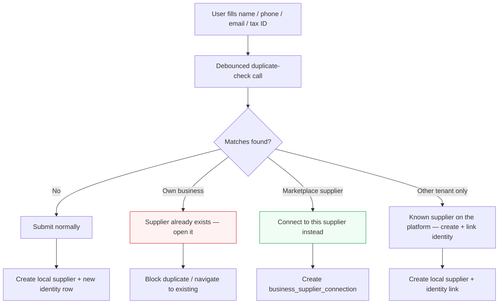
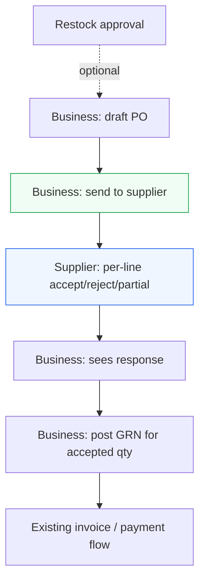

# Supplier Marketplace & Supplier Portal — Revised Scope

> **Goal:** Connect businesses and suppliers directly inside the POS — discover suppliers, compare prices, create purchase orders, and manage restocking from one place — while giving suppliers a dedicated portal to manage catalogues, orders, and deliveries.
>
> **Strategy:** Build as a long-term wholesale marketplace, released in phases to avoid overbuilding too early.

**Status:** Scoped (not started)  
**Last reviewed:** 2026-07-08  
**Related:** [Daily Audit Restock](../../frontend/app/(dashboard)/inventory/stock-take/README-RESTOCK.md) · [Global Products Catalog](./GLOBAL_PRODUCTS_CATALOG_PLAN.md) · `/suppliers` · Path A purchasing

---

## 1. Core Vision

The supplier flow should be built as a long-term wholesale marketplace inside the POS, but released in phases to avoid overbuilding too early.

**Businesses** should be able to:

- Discover suppliers
- Compare prices
- Create purchase orders
- Manage restocking from one place

**Suppliers** should be able to:

- Manage their own catalogues, pricing, orders, deliveries, and customer relationships through a dedicated Supplier Portal

**Platform** should eventually:

- Use inventory and sales data to recommend restocking
- Help suppliers understand demand
- Surface supplier performance across all businesses

---

## 2. What Already Exists (Reuse, Don't Rebuild)

| Scope item | Current state | Reuse path |
|---|---|---|
| Business supplier directory | `/suppliers` master-detail workspace | Extend, don't replace |
| Product ↔ supplier links | `supplier_products` with `packSize`, `minOrderQty`, `leadTimeDays`, cost | Foundation for catalogue + pricing |
| Purchase orders | Path A: `purchase_orders` → GRN → invoice | Extend with supplier workflow states |
| Restock suggestions | Daily audit → `stock_take_restock_items` → PDF → optional PO | Phase 2 builds on this directly |
| Purchasing intelligence | Spend, price competitiveness, single-source risk | Seed for supplier scoring (Phase 3) |
| Public cross-tenant search | `/barcode` platform page + `PublicBarcodeController` | **UI/API pattern** for supplier directory |
| Supplier payments | KopoKopo disbursements, AP aging | Invoice/payment tracking in Phase 1 |

### Key files (today)

| Area | Path |
|---|---|
| Supplier domain | `backend/src/main/java/zelisline/ub/suppliers/` |
| Supplier UI | `frontend/app/(dashboard)/suppliers/` |
| Path A purchasing | `backend/src/main/java/zelisline/ub/purchasing/` |
| Restock flow | `frontend/app/(dashboard)/inventory/stock-take/README-RESTOCK.md` |
| Public barcode search | `frontend/app/barcode/page.tsx`, `PublicBarcodeController` |
| Supplier schema | `backend/src/main/resources/db/migration/V14__suppliers_slice_1.sql` |
| PO schema | `backend/src/main/resources/db/migration/V16__path_a_po_grn_invoice.sql` |

### Critical gap

Suppliers today are **`business_id`-scoped records**. There is:

- No supplier login or portal
- No platform-level supplier entity
- No line-item supplier accept/reject on purchase orders
- No cross-tenant supplier discovery

---

## 3. Core Architectural Decision

Two supplier concepts are required, not one:

```text
┌─────────────────────────────────────────────────────────────┐
│  PLATFORM LAYER (new)                                       │
│  marketplace_suppliers  →  catalogue, pricing, delivery     │
│  supplier_users         →  portal auth                      │
└──────────────────────┬──────────────────────────────────────┘
                       │ connected via
                       ▼
┌─────────────────────────────────────────────────────────────┐
│  BUSINESS LAYER (exists)                                    │
│  suppliers              →  local vendor record + permissions│
│  supplier_products      →  linked items + negotiated prices │
│  purchase_orders        →  orders to that supplier          │
└─────────────────────────────────────────────────────────────┘
```

### Recommended model

| Entity | Purpose |
|---|---|
| `marketplace_suppliers` | Platform entity: legal name, coverage areas, trust score, public profile |
| `business_supplier_connections` | Join when a business "adds" a marketplace supplier; maps to local `suppliers` row; stores visibility permissions |
| `supplier_users` | New auth principal (like `super_admin` / shopper hub), scoped to one `marketplace_supplier_id` |
| `suppliers` (existing) | Business working copy: credit terms, payout phone, local notes; linked via nullable `marketplace_supplier_id` FK |

This allows:

- Onboarding a supplier once, serving many businesses
- Businesses keeping private suppliers (no portal) with `marketplace_supplier_id = null`
- No breaking changes to `/suppliers`, restock, Path A, or butcher flows

---

## 4. Global Supplier Identity & Deduplication

Suppliers have a **global aspect**: the same real-world supplier (e.g. a distributor serving many shops) will be entered independently by many tenants. Before letting someone submit a new supplier, the system searches existing suppliers **across the entire platform — including other tenants** — by fuzzy match on name + phone + email + tax ID, and shows possible matches.

### Why

- Prevents duplicate supplier records inside one business
- Bootstraps the marketplace: a supplier already used by N tenants is the strongest signal for who to onboard to the portal
- Enables platform-wide trust scores and analytics — performance events from all tenants roll up to one identity
- Lets "add supplier" become "connect to existing supplier" whenever possible, so the catalogue is maintained once

### Match keys (from existing schema)

| Key | Source column(s) | Match type | Signal strength |
|---|---|---|---|
| Tax ID | `suppliers.vat_pin` | Normalized exact (uppercase, strip spaces/dashes) | Strong — near-certain match |
| Phone | `suppliers.payout_phone`, `supplier_contacts.phone` | Normalized exact (E.164 / `254…` MSISDN) | Strong |
| Email | `supplier_contacts.email` | Normalized exact (lowercase, trim) | Strong |
| Name | `suppliers.name` | Fuzzy | Weak alone; medium combined with region/category |

### Identity index

A platform-level index table, populated by backfill migration and kept current by the supplier service on create/update:

```sql
supplier_identity_index (
  id                      varchar(36) primary key,
  source                  varchar(16) not null,   -- tenant | marketplace
  business_id             varchar(36) null,       -- when source = tenant
  supplier_id             varchar(36) null,       -- FK → suppliers
  marketplace_supplier_id varchar(36) null,       -- FK → marketplace_suppliers
  name_normalized         varchar(255) not null,  -- lowercase, punctuation and legal suffixes stripped (ltd, limited, co, enterprises)
  phone_normalized        varchar(32) null,       -- E.164
  email_normalized        varchar(255) null,
  tax_id_normalized       varchar(64) null,
  region_hint             varchar(64) null,
  created_at              timestamp(6) not null,
  updated_at              timestamp(6) not null,

  index (tax_id_normalized),
  index (phone_normalized),
  index (email_normalized),
  index (name_normalized)
)
```

### Matching algorithm (MySQL-friendly)

1. **Exact pass:** lookup normalized tax ID, phone, email — any hit is a strong match
2. **Fuzzy pass:** prefilter candidates by name prefix / FULLTEXT on `name_normalized`, then score in the app layer (Jaro-Winkler or token-set similarity); no trigram extension needed
3. **Confidence tiers:**
   - `strong` — tax ID match, or phone/email match + name similarity
   - `possible` — name similarity above threshold only
   - Below threshold — not shown

### UX flow — "add supplier" form



The user can always choose **"Create anyway"** (except for an exact duplicate inside their own business); the identity link is recorded silently so the platform can merge later.

### Privacy rules (cross-tenant matches)

Matching across tenants must not leak tenant data:

| Rule | Detail |
|---|---|
| Reveal only what the user already typed | If the user entered the phone number, confirming "a supplier with this phone exists" leaks nothing new. Never return contact details the user did not supply. |
| Name-only fuzzy matches are masked | Show supplier name + region + "used by N businesses on the platform"; mask phone/email/tax ID |
| Never expose commercial data | No prices, purchase history, credit terms, notes, or which specific businesses use the supplier |
| Marketplace suppliers are public | Full public profile may be shown — that is the point of the directory |

### Host-side payoff

The identity index gives the host a ranked list of **marketplace onboarding candidates**: suppliers linked to the most tenants who are not yet on the portal. Surfaced in the platform dashboard (Phase 2–3).

### Phasing

| Piece | Phase |
|---|---|
| Duplicate check within own business | 1 |
| Check against `marketplace_suppliers` + "connect instead" | 1 |
| Cross-tenant identity index (schema + backfill + silent linking) | 1 |
| Masked cross-tenant match hints in the add-supplier form | 2 |
| Host onboarding-candidates report + admin merge tooling | 2–3 |

---

## 5. Supplier Directory

Create a searchable supplier directory similar to the [Barcode List](../../frontend/app/barcode/page.tsx).

### Search dimensions

| Dimension | Source |
|---|---|
| Product name | `marketplace_supplier_products` |
| Category | taxonomy link |
| Barcode | `marketplace_supplier_products.barcode` |
| SKU | `marketplace_supplier_products.sku` |
| Location | `delivery_regions` on supplier |
| Supplier name | `marketplace_suppliers.name` |

### Result card

When a user searches for a product, show suppliers who stock that product:

- Price
- Package size
- MOQ
- Delivery area
- Availability

### UI pattern

Reuse:

- **Search UX** from `/barcode` — debounced search, camera scan option, loading/empty/error states, paginated public API
- **Master-detail layout** from `/suppliers` — virtualized list + detail panel

---

## 6. Supplier Portal

When a supplier is added to the marketplace, they receive access to a Supplier Portal.

### Supplier capabilities

| Feature | Phase |
|---|---|
| Manage business profile | 1 |
| Upload products | 1 |
| Set prices, package sizes, MOQ | 1 |
| Define delivery locations | 1 |
| Receive purchase orders | 1 |
| Accept, reject, or partially fulfill orders | 1 |
| Track deliveries | 1 |
| View invoices and payments | 1 (read-only) |
| View permitted inventory data | 2 |
| Suggest restocking | 2 |

### Auth

New route plane: `/supplier-portal/*` (or subdomain `supplier.kiosk.ke`).

| Piece | Detail |
|---|---|
| Principal | `SupplierPrincipal` JWT |
| Permissions | `supplier.catalog.write`, `supplier.orders.respond`, etc. |
| Pattern | Mirror `SecurityConfig` patterns from `SUPER_ADMIN` and shopper hub |

This prevents the platform owner or business users from becoming responsible for updating supplier catalogues manually.

---

## 7. Pricing Structure

Supplier pricing should not be treated as one simple product price.

### Pricing dimensions

| Dimension | Supported from day one |
|---|---|
| Supplier | Yes |
| Product | Yes |
| Package size | Yes |
| Quantity tier | Schema yes, UI simplified in v1 |
| Delivery region | Yes |
| Availability | Yes |
| Effective dates | Yes |

### Example

One supplier may sell rice at:

- One price for 1kg packs
- Another price for 25kg bags
- A different wholesale price when a business orders more than 10 bags

### Schema (design now, simplify UI)

```sql
marketplace_supplier_price_offers (
  id                      varchar(36) primary key,
  marketplace_supplier_id varchar(36) not null,
  product_id              varchar(36) not null,
  package_size            decimal(14,4) not null,
  package_unit            varchar(32) not null,
  region_code             varchar(32) null,       -- null = all regions
  min_qty                 decimal(14,4) not null default 1,  -- tier breakpoint
  unit_price              decimal(14,4) not null,
  currency                varchar(3) not null,
  available               boolean not null default true,
  effective_from          timestamp(6) not null,
  effective_to            timestamp(6) null,
  created_at              timestamp(6) not null,
  updated_at              timestamp(6) not null,
  version                 bigint not null default 0
)
```

**V1 UI:** one row per product/package. Backend enforces uniqueness; tiers are additional rows with different `min_qty`.

**Business override:** `supplier_products.default_cost_price` becomes the negotiated override when a connection exists.

---

## 8. Business-Level Supplier Access

When a business connects with a supplier, that supplier should only access data related to the products they supply.

Supplier visibility is not all-or-nothing. A business controls what each supplier can see.

### Permission flags

```sql
business_supplier_connections (
  id                      varchar(36) primary key,
  business_id             varchar(36) not null,
  marketplace_supplier_id   varchar(36) not null,
  local_supplier_id       varchar(36) not null,   -- FK → suppliers
  status                  varchar(16) not null,    -- pending | active | suspended
  can_view_stock_levels       boolean not null default false,
  can_view_low_stock_alerts   boolean not null default false,
  can_view_sales_velocity     boolean not null default false,
  can_view_demand_forecast    boolean not null default false,
  can_suggest_restock         boolean not null default false,
  can_create_draft_po         boolean not null default false,
  can_view_purchase_history   boolean not null default true,
  created_at              timestamp(6) not null,
  updated_at              timestamp(6) not null
)
```

### Safe default

- Suppliers only see products linked to them
- Only basic stock status (in stock / low / out) unless the business grants more visibility
- `can_view_purchase_history = true` is the only permission enabled by default

**Phase:** Schema in Phase 1; enforcement UI in Phase 2.

---

## 9. Purchase Order Flow

Purchase orders must support **line-item-level tracking**, not just one general order status.

A supplier may accept some items, reject others, or partially fulfill an order.

### Each purchase order supports

| Capability | v1 |
|---|---|
| Multiple products | Yes |
| One supplier per PO | Yes |
| Line-item statuses | Yes |
| Partial fulfillment | Yes |
| Delivery status | Yes |
| Invoice status | Yes (existing AP flow) |
| Payment status | Yes (existing AP flow) |

### Extend existing Path A (do not create a parallel PO system)

**New on `purchase_order_lines`:**

```sql
supplier_line_status   varchar(32) not null default 'pending'
                       -- pending | accepted | rejected | partially_accepted
qty_accepted           decimal(14,4) null
supplier_note          text null
```

**New on `purchase_orders`:**

```sql
source                 varchar(16) not null default 'manual'
                       -- manual | restock | marketplace
sent_to_supplier_at    timestamp(6) null
supplier_response_at   timestamp(6) null
delivery_status        varchar(16) not null default 'not_shipped'
                       -- not_shipped | in_transit | delivered
```

### Flow



Wire restock conversion (`stock_take_restock_items.purchase_order_id`) into this same send-to-supplier path.

### Future

A business builds one large restocking cart and the system automatically splits it into separate purchase orders per supplier (Phase 3).

---

## 10. Restocking Suggestions

Restocking automation should start simple.

### v1 formula (Phase 2)

```text
Reorder Point = Average Daily Sales × Supplier Lead Time + Safety Stock
```

Recommend restocking when available stock falls below the reorder point.

### Integration with existing restock flow

Today, restock is manual: Stock Manager flags items during daily audit → Admin reviews → generates supplier order PDF → optional Path A PO.

Phase 2 adds **system-generated suggestions** when `on_hand < reorder_point` for items with active `supplier_products` links, using the same `stock_take_restock_items` lifecycle.

| Source | `source` value |
|---|---|
| Manual audit flag | `audit` (existing) |
| Reorder point rule | `reorder_rule` |
| Supplier suggestion | `supplier` |

### Defer to Phase 3

- Seasonal forecasting
- Supplier scoring in recommendations
- Price optimization
- Demand prediction

---

## 11. Supplier Reliability & Trust Score

Supplier performance should be calculated mainly from platform activity, not just manual reviews.

### Metrics

| Metric | Source |
|---|---|
| Order acceptance rate | PO line `supplier_line_status` |
| Fulfillment rate | `qty_accepted / qty_ordered` |
| Late delivery rate | `expected_date` vs GRN `received_at` |
| Partial fulfillment rate | Lines with `partially_accepted` |
| Price consistency | Variance in `marketplace_supplier_prices` vs invoiced |
| Dispute rate | Invoice mismatch / 3-way match failures |
| Repeat orders | PO count per `(business, supplier)` pair |
| Business ratings | Optional manual 1–5 on connection |

Manual reviews can exist, but platform-generated performance data should carry more weight.

### Implementation

- **Phase 1:** Log raw events in `supplier_performance_events`
- **Phase 2:** Business-facing scorecard
- **Phase 3:** Platform-wide ranking and recommendations

---

## 12. Platform-Level Dashboard

At host level, the platform should see supplier performance across all businesses.

### Host can view

| Metric | Phase |
|---|---|
| Businesses served by each supplier | 3 |
| Products supplied | 3 |
| Order volume | 3 |
| Revenue processed | 3 |
| Fast-moving products | 3 |
| Delivery performance | 3 |
| Fulfillment rate | 3 |
| Supplier ratings | 3 |
| Geographic coverage | 3 |
| Product price trends | 3 |

Extends existing super-admin plane (`/super-admin/*`).

---

## 13. Recommended Rollout

### Phase 1 — MVP: Orders flowing through the system

**Goal:** A business can discover a supplier, place a PO, and the supplier can respond — without building the full marketplace.

#### 1A. Platform supplier registry (minimal)

| Deliverable | Detail |
|---|---|
| `marketplace_suppliers` table | Name, description, categories, delivery regions, status, contact email |
| `marketplace_supplier_products` | Platform catalogue: name, barcode, SKU, category, package options |
| `marketplace_supplier_price_offers` | Simple v1: one price per product/package/region |
| Supplier onboarding | Host invites supplier → creates portal account |

**Defer:** cross-supplier comparison UI, ranking, price trends.

#### 1B. Supplier directory (business-facing)

| Deliverable | Detail |
|---|---|
| Search UI | `/barcode` search UX + `/suppliers` master-detail |
| "Add supplier" action | Creates `business_supplier_connections` + local `suppliers` row + imports catalogue links into `supplier_products` |
| Duplicate check on entry | Fuzzy match name + phone + email + tax ID against own suppliers, marketplace suppliers, and cross-tenant identity index before submit (§4) |

#### 1C. Supplier portal (v1)

| Feature | Scope |
|---|---|
| Business profile | Edit description, delivery areas, contact |
| Catalogue | CRUD products, prices, pack sizes, MOQ |
| Orders inbox | List POs from connected businesses |
| Order actions | Accept / reject / partial fulfill per line |
| Delivery | Mark shipped, add tracking note |
| Invoices | View invoices created by business (read-only) |

#### 1D. Purchase order extensions

Extend Path A with send-to-supplier and line-level supplier response (see §9).

#### Phase 1 exit criteria

- [ ] Business searches directory, adds supplier, sees their catalogue
- [ ] Adding a supplier that already exists (own business or marketplace) surfaces the match before submit
- [ ] Business creates PO from catalogue or restock approval
- [ ] Supplier logs in, responds to PO at line level
- [ ] Business receives goods via existing GRN flow
- [ ] No manual catalogue maintenance by platform owner

---

### Phase 2 — Smarter Procurement

Build on daily audit restock (already live) rather than starting fresh.

| Feature | Implementation |
|---|---|
| Reorder point | `avg_daily_sales × lead_time_days + safety_stock` from sales/inventory data |
| Low-stock alerts | Extend daily audit or branch-level dashboard widget |
| Suggested reorder qty | `(reorder_point - on_hand) / pack_size`, rounded to MOQ |
| Supplier visibility permissions | Enforce `business_supplier_connections` flags |
| Supplier restocking suggestions | Supplier portal → creates restock item with `source = supplier` |
| Purchase history | Surface existing `SupplierPurchaseHistoryService` in portal (scoped) |
| Supplier performance (business view) | Acceptance rate, fulfillment rate, late delivery from PO data |

#### Phase 2 exit criteria

- [ ] System suggests restock items without manual audit flag
- [ ] Business controls per-supplier data visibility
- [ ] Supplier sees permitted inventory data for linked products only
- [ ] Basic supplier scorecard visible to business

---

### Phase 3 — Marketplace & Analytics

| Feature | Notes |
|---|---|
| Multi-supplier cart | `procurement_carts` → split into POs per supplier on checkout |
| Supplier comparison | Directory shows N suppliers per product, sorted by price/score/distance |
| Supplier ranking | Weighted score from Phase 2 metrics + business ratings |
| Demand forecasting | Seasonal/multi-week velocity — new analytics service |
| Platform dashboard | Super-admin extension: supplier GMV, coverage map, fast movers |
| Price trend analysis | Time-series on `marketplace_supplier_price_offers` |
| Recommended suppliers | Location + product availability + score |

Only build once Phase 1–2 generate real order and fulfillment data.

---

## 14. Best First Build (MVP)

The first version should not try to build the full marketplace immediately.

> **Supplier Directory + Supplier Portal + PO with supplier response**

### Concrete MVP slice

1. Host onboards 3–5 marketplace suppliers
2. Business searches by product name/barcode, adds supplier
3. Business creates PO (manual or from restock approval)
4. Supplier accepts/rejects/partially fulfills in portal
5. Business posts GRN for accepted quantities
6. Invoice/payment uses existing AP flow

Everything else — comparison, forecasting, platform dashboard, trust scores — waits until this loop has 30+ real orders.

---

## 15. What NOT to Build in Phase 1

| Temptation | Why defer |
|---|---|
| Full marketplace comparison | Needs multiple active suppliers + data |
| Multi-supplier cart / auto-split | Complex UX; single-supplier PO is enough to validate |
| Demand forecasting | No training data until orders flow |
| Platform analytics dashboard | Super-admin has no supplier dimension yet |
| Supplier payments through platform | KopoKopo exists business→supplier; marketplace escrow is separate |
| Replacing Path B (ad-hoc supplies) | Keep both; marketplace POs use Path A |
| Mobile supplier portal | Web-first; Expo apps are business-facing |

---

## 16. Suggested Build Sequence

```text
Sprint 1–2:  Data model (marketplace_supplier*, connections, price_offers)
             Supplier auth plane + portal shell

Sprint 3–4:  Portal catalogue CRUD
             Business "add supplier" + import links
             Duplicate-check endpoint + identity index backfill

Sprint 5–6:  Supplier directory search UI (barcode pattern)
             PO send-to-supplier + line-level supplier response

Sprint 7:    Wire restock → PO → supplier notification
             Phase 1 QA + pilot with 2–3 suppliers

--- Phase 2 ---

Sprint 8–9:  Reorder point engine + auto-suggestions
             Visibility permissions UI + enforcement

Sprint 10:   Supplier scorecard (business view)
             Supplier-suggested restock

--- Phase 3 ---

Sprint 11+:  Multi-supplier cart, comparison, platform dashboard
```

---

## 17. API Surface (Phase 1 sketch)

### Public / business directory

| Method | Endpoint | Auth | Purpose |
|---|---|---|---|
| `GET` | `/api/v1/public/marketplace/suppliers/search` | Public | Search suppliers by product, category, location |
| `GET` | `/api/v1/public/marketplace/products/search` | Public | Search products across suppliers |
| `GET` | `/api/v1/marketplace/suppliers/{id}` | Business | Supplier detail + catalogue preview |
| `POST` | `/api/v1/marketplace/suppliers/{id}/connect` | Business | Add supplier → create connection + local `suppliers` row |

### Supplier deduplication (see §4)

| Method | Endpoint | Auth | Purpose |
|---|---|---|---|
| `POST` | `/api/v1/suppliers/duplicate-check` | Business (`suppliers.write`) | Fuzzy match name + phone + email + tax ID against own suppliers, marketplace suppliers, and cross-tenant identity index; returns tiered matches with privacy masking |

### Supplier portal

| Method | Endpoint | Auth | Purpose |
|---|---|---|---|
| `GET` | `/api/v1/supplier-portal/profile` | Supplier | Business profile |
| `PATCH` | `/api/v1/supplier-portal/profile` | Supplier | Update profile, delivery areas |
| `GET/POST/PATCH/DELETE` | `/api/v1/supplier-portal/products` | Supplier | Catalogue CRUD |
| `GET` | `/api/v1/supplier-portal/orders` | Supplier | PO inbox |
| `POST` | `/api/v1/supplier-portal/orders/{id}/respond` | Supplier | Per-line accept/reject/partial |
| `POST` | `/api/v1/supplier-portal/orders/{id}/ship` | Supplier | Mark in transit / delivered |

### Purchase order extensions (business)

| Method | Endpoint | Auth | Purpose |
|---|---|---|---|
| `POST` | `/api/v1/purchasing/path-a/purchase-orders/{id}/send-to-supplier` | Business | Notify supplier portal |
| `GET` | `/api/v1/purchasing/path-a/purchase-orders/{id}/supplier-response` | Business | View supplier line responses |

---

## 18. Open Decisions

| # | Question | Options |
|---|---|---|
| 1 | Supplier onboarding | Invite-only (host creates) vs self-registration with approval |
| 2 | Catalogue import | Auto-import all products on connect vs pick-and-choose |
| 3 | Private suppliers | Confirm local-only suppliers (no portal) remain supported |
| 4 | Pricing precedence | Marketplace listed price vs negotiated `supplier_products.default_cost_price` at PO creation |
| 5 | Portal hosting | Path on main domain (`/supplier-portal`) vs subdomain (`supplier.kiosk.ke`) |
| 6 | Restock integration | Phase 1 send-to-supplier from restock approval vs Phase 2 only |
| 7 | Global catalog link | Tie `marketplace_supplier_products` to `global_products` for barcode dedup |
| 8 | Cross-tenant match hints | Show masked "known on the platform" hints to businesses in Phase 1, or link silently and surface hints only in Phase 2 |

---

## 19. Risk Register

| Risk | Mitigation |
|---|---|
| Breaking existing `/suppliers` and restock flows | Keep `suppliers` as business layer; marketplace is additive |
| Supplier adoption (chicken-and-egg) | Phase 1 invite-only; platform owner seeds initial suppliers |
| Pricing complexity paralysis | Schema supports tiers; UI shows flat price until needed |
| PO workflow confusion (Path A vs B vs restock PDF) | One "send to supplier" action; restock PDF remains fallback for non-portal suppliers |
| Data leakage across tenants | Supplier principal scoped to `marketplace_supplier_id`; connection permissions enforced server-side |
| Dedup check leaks tenant data | Only confirm attributes the user already typed; mask fuzzy name matches; never expose commercial data or which businesses use a supplier (§4 privacy rules) |
| False-positive merges (common names) | Name similarity alone never auto-links; strong keys (tax ID / phone / email) required; user can always "Create anyway" |
| Overbuilding portal before demand | Portal v1 is catalogue + inbox only; no analytics, no forecasting |

---

## 20. Data Model Summary

```text
marketplace_suppliers
  ├── marketplace_supplier_products
  │     └── marketplace_supplier_price_offers
  ├── supplier_users
  └── supplier_performance_events (instrument from Phase 1)

supplier_identity_index (platform-wide dedup, §4)
  ├── → suppliers (tenant records)
  └── → marketplace_suppliers

business_supplier_connections
  ├── → businesses
  ├── → marketplace_suppliers
  └── → suppliers (local copy)

suppliers (existing, extended)
  └── marketplace_supplier_id (nullable FK)
  └── supplier_products (existing)
  └── purchase_orders (existing, extended)
        └── purchase_order_lines (existing, extended)
              └── goods_receipts (existing)
```

---

## 21. Permissions (new)

| Permission key | Holder | Purpose |
|---|---|---|
| `marketplace.suppliers.read` | Business | Search directory, view supplier profiles |
| `marketplace.suppliers.connect` | Business | Add marketplace supplier to business |
| `supplier.catalog.read` | Supplier | View own catalogue |
| `supplier.catalog.write` | Supplier | Manage products and prices |
| `supplier.orders.read` | Supplier | View incoming POs |
| `supplier.orders.respond` | Supplier | Accept/reject/partial fulfill |
| `supplier.orders.ship` | Supplier | Update delivery status |
| `marketplace.admin.read` | Super admin | Platform supplier analytics (Phase 3) |
| `marketplace.admin.write` | Super admin | Onboard/manage marketplace suppliers |
